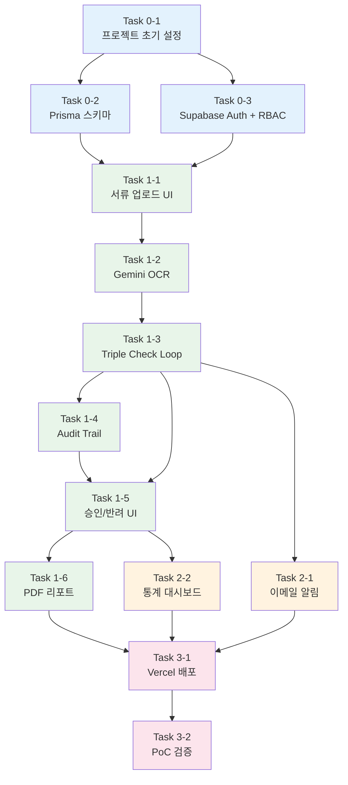

# AI 에이전트 작업 지시서 (Task Instructions)
## SRS-HR-AI-Verification v0.3 기반 상세 Task 추출

**작성일:** 2026-04-17  
**Source:** SRS-HR-AI-Verification-v0.3.md  
**대상:** AI 코딩 에이전트 (Claude, Cursor, Gemini 등)  
**목적:** SRS의 각 요구사항을 AI 에이전트가 직접 실행할 수 있는 구체적 작업 단위(프롬프트)로 분해

---

## 공통 제약 조건 (모든 Task에 선행 적용)

> 아래 제약 조건은 **모든 Task 프롬프트의 System Prompt 또는 첫 줄에 삽입**해야 한다.

```
[공통 제약]
- 프레임워크: Next.js App Router (풀스택 단일)
- 서버 로직: Server Actions ("use server") 또는 Route Handlers (app/api/)
- DB: Prisma ORM + SQLite(로컬) → Supabase PostgreSQL(배포). JSON 타입 → Text 대체
- UI: Tailwind CSS + shadcn/ui 컴포넌트만 사용. CSS 파일 직접 작성 금지
- AI 호출: Vercel AI SDK (ai 패키지). generateObject() 또는 streamText()
- LLM: Google Gemini API (GEMINI_API_KEY 환경변수)
- 배포: Vercel. git push 배포
- 인증: Supabase Auth (이메일/패스워드 or Google OAuth)
- 별도 Express/FastAPI/NestJS/Python 서버 금지
- Inngest, QStash, Browserless.io, Supabase Realtime 사용 금지
```

---

## Phase 0: 프로젝트 초기 설정

### Task 0-1. Next.js 프로젝트 생성 + 기본 의존성 설치

**SRS 근거:** C-TEC-001, C-TEC-004, C-TEC-007  
**예상 소요:** 0.5일 | **난이도:** ⭐

```
[Task 0-1 프롬프트]

Next.js App Router 기반 프로젝트를 생성하고 초기 설정을 완료해줘.

1. `npx create-next-app@latest ./ --typescript --tailwind --eslint --app --src-dir --import-alias "@/*"` 로 프로젝트 생성
2. shadcn/ui 초기화: `npx shadcn-ui@latest init`
   - 스타일: default, 색상: slate, CSS variables: yes
3. 필수 shadcn 컴포넌트 설치:
   - Button, Card, Table, Dialog, Input, Label, Badge, Tabs, DropdownMenu, Form, Textarea, Toast, Alert
4. 필수 패키지 설치:
   - `prisma`, `@prisma/client` — ORM
   - `ai`, `@ai-sdk/google` — Vercel AI SDK + Gemini
   - `@supabase/supabase-js`, `@supabase/ssr` — Supabase Auth
   - `pdf-lib` — PDF 생성
   - `resend` — 이메일 발송
   - `swr` — 데이터 패칭/polling
   - `zod` — 스키마 검증
5. `.env.local` 템플릿 생성:
   ```
   DATABASE_URL="file:./dev.db"
   DIRECT_URL=""
   NEXT_PUBLIC_SUPABASE_URL=""
   NEXT_PUBLIC_SUPABASE_ANON_KEY=""
   SUPABASE_SERVICE_ROLE_KEY=""
   GEMINI_API_KEY=""
   RESEND_API_KEY=""
   ```
6. 폴더 구조 생성:
   ```
   src/
   ├── app/
   │   ├── (auth)/login/page.tsx
   │   ├── (dashboard)/
   │   │   ├── page.tsx
   │   │   ├── upload/page.tsx
   │   │   ├── verifications/[jobId]/page.tsx
   │   │   └── reports/page.tsx
   │   ├── api/
   │   │   ├── verifications/route.ts
   │   │   ├── verifications/[jobId]/route.ts
   │   │   ├── reports/[batchId]/pdf/route.ts
   │   │   └── dashboard/stats/route.ts
   │   ├── layout.tsx
   │   └── middleware.ts
   ├── lib/
   │   ├── supabase/client.ts
   │   ├── supabase/server.ts
   │   ├── supabase/middleware.ts
   │   ├── gemini.ts
   │   ├── prisma.ts
   │   └── utils.ts
   ├── actions/
   │   ├── verification.ts
   │   ├── audit-trail.ts
   │   ├── approval.ts
   │   ├── notification.ts
   │   └── report.ts
   ├── components/
   │   └── (ui 컴포넌트는 shadcn이 자동 생성)
   └── types/
       └── index.ts
   ```

[완료 기준]
- `npm run dev`로 로컬 서버 정상 실행
- shadcn/ui 컴포넌트가 정상 임포트
- 환경변수 파일 생성 확인
```

---

### Task 0-2. Prisma 스키마 정의 + DB 마이그레이션

**SRS 근거:** C-TEC-003, 섹션 3.8 (ERD + Prisma Schema)  
**예상 소요:** 0.5일 | **난이도:** ⭐⭐

```
[Task 0-2 프롬프트]

SRS의 Prisma 스키마(섹션 3.8)를 `prisma/schema.prisma`에 정확히 작성하고 마이그레이션을 실행해줘.

## 스키마 요구사항:
1. 8개 모델: User, Batch, Applicant, Document, VerificationJob, AuditTrail, Notification, Report
2. 6개 enum: UserRole, UserStatus, BatchStatus, DocType, CheckLayer, JobStatus
3. datasource: 로컬은 sqlite, 배포는 postgresql. 환경변수 DATABASE_URL 사용
4. JSON 타입 컬럼은 모두 String(Text)으로 정의하여 SQLite 호환성 유지
5. 관계:
   - User 1:N Batch (creator)
   - Batch 1:N Applicant
   - Applicant 1:N Document
   - Document 1:N VerificationJob
   - VerificationJob 1:1 AuditTrail
   - VerificationJob N:1 User (reviewer)
   - Applicant 1:N Notification
   - VerificationJob 1:N Notification
   - Batch 1:N Report
   - Report N:1 User (generator)
6. 모든 필드에 @map으로 snake_case 매핑
7. 모든 모델에 @@map으로 테이블명 복수형 매핑

## 실행:
```bash
npx prisma generate
npx prisma db push  # SQLite용
```

## Prisma Client 싱글턴 (src/lib/prisma.ts):
```typescript
import { PrismaClient } from '@prisma/client'

const globalForPrisma = globalThis as unknown as { prisma: PrismaClient }

export const prisma = globalForPrisma.prisma ?? new PrismaClient()

if (process.env.NODE_ENV !== 'production') globalForPrisma.prisma = prisma
```

[완료 기준]
- `npx prisma studio`로 8개 테이블 확인
- 모든 관계가 정상 연결
- SQLite dev.db 파일 생성 확인
```

---

### Task 0-3. Supabase Auth + Middleware RBAC 설정

**SRS 근거:** C-TEC-003, REQ-NF-020~024, ADR-004  
**예상 소요:** 1일 | **난이도:** ⭐⭐

```
[Task 0-3 프롬프트]

Supabase Auth 기반 로그인 시스템과 RBAC Middleware를 구현해줘.

## 1. Supabase Client 설정
- `src/lib/supabase/client.ts` — 브라우저용 Supabase 클라이언트
- `src/lib/supabase/server.ts` — Server Component/Action용 Supabase 클라이언트
- `src/lib/supabase/middleware.ts` — Middleware용 세션 갱신 헬퍼

## 2. Middleware (src/middleware.ts)
- Supabase Auth 세션 확인
- 미로그인 시 `/login`으로 리다이렉트
- 로그인 후 사용자의 role(OPERATOR/ADMIN/AUDITOR)을 DB에서 조회
- RBAC 규칙:
  - OPERATOR: 서류 업로드, 대시보드 조회, 불일치 상세 확인
  - ADMIN: OPERATOR 권한 + 승인/반려 + PDF 리포트 다운로드 + 사용자 관리
  - AUDITOR: Audit Trail 읽기 전용 조회 + PDF 리포트 다운로드
- 권한 부족 시 HTTP 403 반환

## 3. 로그인 페이지 (src/app/(auth)/login/page.tsx)
- shadcn/ui Card, Input, Button, Label 사용
- 이메일/패스워드 로그인 폼
- Google OAuth 로그인 버튼 (선택)
- Supabase Auth `signInWithPassword()` 또는 `signInWithOAuth()` 사용

## 4. 개인정보 마스킹 유틸 (src/lib/utils.ts)
- `maskName(name: string)` → '홍○○' 형태
- `maskPhone(phone: string)` → '010-****-1234' 형태

[완료 기준]
- 이메일/패스워드로 로그인 성공
- 미로그인 시 /login 리다이렉트 확인
- RBAC: OPERATOR가 승인/반려 접근 시 403 반환
- AUDITOR가 업로드 접근 시 403 반환
```

---

## Phase 1: 핵심 기능 구현 (Must)

### Task 1-1. 서류 업로드 UI + Supabase Storage 연동

**SRS 근거:** REQ-FUNC-001, REQ-FUNC-005, Seq-01 (Step 1-2)  
**예상 소요:** 1일 | **난이도:** ⭐⭐

```
[Task 1-1 프롬프트]

서류 파일 업로드 페이지와 Supabase Storage 연동을 구현해줘.

## 1. 업로드 페이지 (src/app/(dashboard)/upload/page.tsx)
- shadcn/ui: Card, Button, Input(file), Label, Select
- 입력 필드:
  - 배치(Batch) 선택 드롭다운 (기존 OPEN 배치 or 신규 생성)
  - 지원자 이름, 이메일 입력
  - 서류 유형 선택: 학위증명서(DEGREE), 자격증(CERTIFICATE), 경력증명서(CAREER)
  - 파일 드래그&드롭 또는 클릭 업로드 (최대 20MB)
- 파일 형식 검증: PDF, JPG, PNG만 허용. 그 외 → 오류 메시지 표시
- 파일 크기 검증: 20MB 초과 시 오류 메시지

## 2. Server Action (src/actions/verification.ts)
```typescript
"use server"

export async function uploadAndVerify(formData: FormData) {
  // 1. 파일 형식·크기 검증 → 실패 시 { error: "지원하지 않는 형식" } 반환
  // 2. Supabase Storage에 원본 파일 업로드 → raw_file_path 획득
  // 3. Applicant 존재 여부 확인 → 없으면 생성 (name_masked, email)
  // 4. Document 레코드 생성 (status=PENDING, doc_type, raw_file_path, file_format)
  // 5. OCR + Triple Check 실행 (Task 1-2, 1-3에서 구현)
  // 6. 결과 반환: { jobId, status, confidenceScore, discrepancyDetail }
}
```

## 3. 파일 검증 로직
- 허용 MIME: application/pdf, image/jpeg, image/png
- 허용 확장자: .pdf, .jpg, .jpeg, .png
- 최대 크기: 20MB (20 * 1024 * 1024 bytes)
- 거부 시: HTTP 422 + "지원하지 않는 파일 형식입니다. PDF, JPG, PNG만 업로드 가능합니다." 또는 "파일 크기가 20MB를 초과합니다."

[완료 기준]
- 15MB JPG 파일 업로드 → Supabase Storage 저장 확인 + Document DB 레코드 확인
- .bmp 파일 업로드 → 오류 메시지 표시
- 25MB 파일 업로드 → 파일 크기 초과 오류 표시
```

---

### Task 1-2. Gemini Vision OCR Server Action 구현

**SRS 근거:** REQ-FUNC-001~005, C-TEC-005, C-TEC-006  
**예상 소요:** 1~2일 | **난이도:** ⭐⭐⭐

```
[Task 1-2 프롬프트]

Vercel AI SDK + Google Gemini Vision API를 사용하여 OCR 추출 Server Action을 구현해줘.

## 1. Gemini OCR 서비스 (src/lib/gemini.ts)
```typescript
import { google } from '@ai-sdk/google';
import { generateObject } from 'ai';
import { z } from 'zod';

// 서류 유형별 OCR 추출 스키마
const degreeSchema = z.object({
  holderName: z.string().describe("증명서 소지자 성명"),
  issueNumber: z.string().describe("문서확인번호 또는 발급번호"),
  issueDate: z.string().describe("발급일자 (YYYY-MM-DD 형식)"),
  issuerName: z.string().describe("발급기관명"),
  degreeName: z.string().optional().describe("학위명"),
  major: z.string().optional().describe("전공"),
  confidenceScore: z.number().min(0).max(100).describe("전체 OCR 신뢰도 점수 0~100"),
});

// 자격증, 경력증명서 스키마도 유사하게 정의

export async function extractFieldsFromImage(
  imageBuffer: Buffer,
  docType: 'DEGREE' | 'CERTIFICATE' | 'CAREER'
) {
  const schema = getSchemaByDocType(docType);
  
  const result = await generateObject({
    model: google('gemini-2.0-flash'),
    schema: schema,
    messages: [
      {
        role: 'user',
        content: [
          {
            type: 'image',
            image: imageBuffer,
          },
          {
            type: 'text',
            text: `이 ${docType} 이미지에서 다음 필드를 정확히 추출해줘. 
                   각 필드가 얼마나 명확히 읽히는지를 기반으로 전체 신뢰도 점수(0~100)를 산출해줘.
                   이미지가 흐리거나 글자가 불명확하면 신뢰도를 낮게 산출해줘.`,
          },
        ],
      },
    ],
  });

  return result.object;
}
```

## 2. OCR 실행 + DB 저장 로직 (src/actions/verification.ts 내)
- Supabase Storage에서 파일 다운로드 → Buffer 변환
- `extractFieldsFromImage()` 호출
- Document 테이블 업데이트: `ocr_extracted_json` (JSON.stringify), `ocr_confidence_score`
- 신뢰도 < 70 (PoC 임계치, ADR-005):
  - VerificationJob 생성: status = MANUAL_REVIEW
  - 즉시 반환: { status: "MANUAL_REVIEW", message: "이미지 품질 미달, 수동 확인 필요" }
- 신뢰도 ≥ 70: Triple Check 진행 (Task 1-3)

## 3. 처리 시간 제약
- Gemini Vision API 응답: p95 ≤ 15초 예상
- Vercel Serverless 함수 최대 실행 60초 (Pro 기준)
- OCR(15초) + API 조회(10초) + DB 저장(2초) = ~27초 안전 마진 내

[완료 기준]
- 실제 학위증명서 이미지 업로드 → JSON 반환 (성명, 발급번호, 발급일자, 발급기관명)
- OCR confidence_score가 DB에 저장
- 신뢰도 < 70 이미지 → MANUAL_REVIEW 상태 확인
```

---

### Task 1-3. Triple Check Loop 구현 + Mock 응답

**SRS 근거:** REQ-FUNC-010~014, Seq-01 (Step 7~17)  
**예상 소요:** 2일 | **난이도:** ⭐⭐⭐

```
[Task 1-3 프롬프트]

Triple Check Loop(3중 대조 검증) 로직과 Mock 응답 시스템을 구현해줘.

## 1. Triple Check 로직 (src/actions/verification.ts 내)

### Layer 1: 입력값 vs OCR 추출값 비교
```typescript
function compareInputVsOcr(
  applicantInput: { name: string; issueNumber?: string },
  ocrFields: { holderName: string; issueNumber: string }
): { match: boolean; discrepancies: Array<{ field: string; input: string; ocr: string }> }
```
- 성명 일치 여부 (공백/특문 정규화 후 비교)
- 발급번호 일치 여부 (존재 시)

### Layer 2: OCR 추출값 vs 공공 API 조회값 비교
```typescript
async function callAgencyApi(
  docType: DocType,
  fields: { issueNumber: string; issueDate: string; certNumber?: string; birthDate?: string }
): Promise<AgencyResult>
```
- **정부24 API** (DEGREE): Route Handler `app/api/verifications/route.ts`에서 외부 API 호출
  - 입력: 문서확인번호, 발급일자
  - 출력: { verified: boolean, issuerInfo: {...} }
  - 타임아웃: 10초 → 초과 시 Mock 대체
- **HRDK API** (CERTIFICATE): Mock으로 대체
- **경력증명서** (CAREER): Mock으로 대체

### Mock 응답 함수
```typescript
function mockAgencyResponse(docType: DocType): AgencyResult {
  // 향후 실제 연동 예정 — Mock Response
  return {
    verified: true,  // 고정값
    issuerInfo: { name: "Mock 발급기관", verifiedAt: new Date().toISOString() },
    isMock: true,
  };
}
```
- Mock 사용 시 VerificationJob.mock_used = true 기록

### Layer 3: 최종 판정
```typescript
function finalJudgment(
  layer1: CompareResult,
  layer2: AgencyResult
): { status: 'PASS' | 'FAIL'; confidenceScore: number; discrepancyDetail: object | null }
```
- 3단계 모두 일치 → status = PASS
- 1개 이상 불일치 → status = FAIL + discrepancy_detail JSON 저장
- confidence_score 산출: (일치 필드 수 / 전체 비교 필드 수) × 100

## 2. 불일치 포맷 변환 (REQ-FUNC-022 참고)
- 날짜 형식 정규화: "2024.03.15" / "2024-03-15" / "20240315" → "YYYY-MM-DD"
- 변환 실패 시 원문 병기

## 3. DB 저장
- VerificationJob 레코드 생성/업데이트:
  - status, discrepancy_detail (JSON as Text), confidence_score
  - mock_used, rpa_used=false, verified_at
  - check_layer: 마지막 실행 레이어

[완료 기준]
- 정상 서류: 3단계 모두 일치 → status=PASS 확인
- 의도적 불일치 데이터(이름 다르게 입력): status=FAIL + discrepancy_detail에 불일치 항목 저장
- API 타임아웃 시: Mock 응답으로 대체 + mock_used=true 확인
- 5개 의도적 불일치 데이터로 FAIL 판정 100% 확인
```

---

### Task 1-4. Audit Trail 자동 생성

**SRS 근거:** REQ-FUNC-020~023, ADR-006  
**예상 소요:** 1일 | **난이도:** ⭐⭐

```
[Task 1-4 프롬프트]

검증 완료 시 Audit Trail 레코드를 자동 생성하는 로직을 구현해줘.

## 1. Audit Trail 서비스 (src/actions/audit-trail.ts)
```typescript
"use server"

import { createHash } from 'crypto';

export async function createAuditTrail(jobId: string, filePath: string) {
  // 1. 타임스탬프 생성 (현재 시각)
  const captureTimestamp = new Date();
  
  // 2. timestamp_hash 생성 (SHA-256)
  const hashInput = `${jobId}:${filePath}:${captureTimestamp.toISOString()}`;
  const timestampHash = createHash('sha256').update(hashInput).digest('hex');
  
  // 3. retention_until 계산 (created_at + 5년)
  const retentionUntil = new Date(captureTimestamp);
  retentionUntil.setFullYear(retentionUntil.getFullYear() + 5);
  
  // 4. AuditTrail 레코드 생성
  const trail = await prisma.auditTrail.create({
    data: {
      jobId,
      captureFilePath: filePath, // 원본 파일 경로 (병렬 캡처는 Phase 2)
      timestampHash,
      captureTimestamp,
      viewerLog: '[]', // 빈 JSON 배열
      isImmutable: true,
      retentionUntil,
    },
  });
  
  return trail;
}

// Audit Trail 열람 시 접근 로그 추가
export async function logAuditAccess(trailId: string, userId: string) {
  const trail = await prisma.auditTrail.findUnique({ where: { trailId } });
  if (!trail) throw new Error('Audit Trail not found');
  
  const viewerLog = JSON.parse(trail.viewerLog);
  viewerLog.push({ userId, accessedAt: new Date().toISOString() });
  
  await prisma.auditTrail.update({
    where: { trailId },
    data: { viewerLog: JSON.stringify(viewerLog) },
  });
}

// 불변성 보장: 삭제/수정 시도 차단
export async function blockModification(trailId: string) {
  // 이 함수는 호출 시 항상 HTTP 403 반환
  // 실제로는 삭제 API 자체를 노출하지 않음 (논리적 불변성)
  throw new Error('FORBIDDEN: Audit Trail 수정/삭제 불가');
}
```

## 2. Triple Check 완료 후 자동 호출
- `uploadAndVerify()` 함수 내에서 VerificationJob 저장 직후 `createAuditTrail()` 호출
- capture_file_path = 원본 서류의 Supabase Storage 경로

## 3. API 보호
- Route Handler에서 DELETE/PUT 메서드 미노출
- AuditTrail 관련 API는 GET(조회)만 제공

[완료 기준]
- Triple Check 완료 후 AUDIT_TRAIL 레코드 자동 생성 확인
- timestamp_hash (SHA-256) 정상 생성
- retention_until = created_at + 5년 확인
- DELETE API 호출 시 HTTP 403 반환
- 열람 시 viewer_log에 {userId, accessedAt} 추가 확인
```

---

### Task 1-5. Human-in-the-loop 승인/반려 UI

**SRS 근거:** REQ-FUNC-030~033, Seq-02  
**예상 소요:** 1일 | **난이도:** ⭐⭐

```
[Task 1-5 프롬프트]

AI 검증 결과를 담당자가 최종 승인/반려하는 Human-in-the-loop UI를 구현해줘.

## 1. 대시보드 메인 (src/app/(dashboard)/page.tsx)
- SWR 5초 polling으로 검증 결과 목록 자동 갱신
- shadcn/ui Table 컴포넌트로 목록 표시:
  - 컬럼: 지원자명(마스킹), 서류유형, 상태(Badge), 신뢰도, Mock여부, 검증일시
  - 상태 Badge 색상: PASS=green, FAIL=red, MANUAL_REVIEW=yellow, APPROVED=blue, REJECTED=gray
- 필터: 상태별, 서류유형별
- 클릭 → 상세 화면 이동

## 2. 상세 화면 (src/app/(dashboard)/verifications/[jobId]/page.tsx)
- 2컬럼 레이아웃:
  - 좌측: OCR 추출값 (JSON → 읽기 쉬운 표)
  - 우측: 기관 DB 반환값 (또는 Mock 응답)
- **불일치 항목 하이라이트**: 값이 다른 필드에 빨간색 배경 + 아이콘 표시
- 상단: confidence_score 게이지 또는 숫자 표시
- mock_used=true 건: "(Mock 데이터)" 라벨 표시
- 화면 로드 p95 ≤ 2초

## 3. 승인/반려 Server Actions (src/actions/approval.ts)
```typescript
"use server"

export async function approveJob(jobId: string, reviewerId: string) {
  // 1. VerificationJob 업데이트: status=APPROVED, reviewer_id, reviewed_at
  // 2. AuditTrail.viewer_log에 승인 이력 추가: { action: 'APPROVED', userId, timestamp }
}

export async function rejectJob(jobId: string, reviewerId: string, reason: string) {
  // 1. reason이 빈 문자열이면 에러 반환: "반려 사유를 입력해주세요"
  // 2. VerificationJob 업데이트: status=REJECTED, reviewer_id, reviewed_at, decision_reason
  // 3. AuditTrail.viewer_log에 반려 이력 추가
}
```

## 4. MANUAL_REVIEW 큐 화면
- 별도 탭 또는 필터로 MANUAL_REVIEW 건만 표시
- 담당자가 수동 검토 후 승인/반려 가능

## 5. 권한 검사
- 승인/반려는 ADMIN 이상만 가능 (OPERATOR는 조회만)
- AUDITOR는 읽기 전용

[완료 기준]
- 대시보드에서 FAIL/MANUAL_REVIEW 건 목록 표시 (SWR 5초 갱신)
- 상세 화면에서 OCR vs 기관DB 비교 + 불일치 하이라이트
- '승인' 클릭 → APPROVED 상태 변경 + Audit Trail viewer_log 기록
- '반려' 시 사유 미입력 → 제출 불가 확인
- '반려' 사유 입력 후 → REJECTED + decision_reason DB 저장
```

---

### Task 1-6. PDF 리포트 자동 생성

**SRS 근거:** REQ-FUNC-040~042, Seq-03  
**예상 소요:** 1~2일 | **난이도:** ⭐⭐⭐

```
[Task 1-6 프롬프트]

pdf-lib를 사용하여 감사 리포트 PDF를 자동 생성하는 기능을 구현해줘.

## 1. PDF 생성 Server Action (src/actions/report.ts)
```typescript
"use server"

import { PDFDocument, rgb, StandardFonts } from 'pdf-lib';

export async function generateReport(batchId: string) {
  // 1. 배치 정보 조회 (batch_name, started_at 등)
  // 2. 배치 내 전체 VerificationJob + Document + AuditTrail 조회
  // 3. PDF 문서 생성
  // 4. Report 레코드 생성 (status=COMPLETED)
  // 5. PDF Buffer 반환
}
```

## 2. PDF 레이아웃 구성
- **표지 페이지**: 회차명(batch_name), 검증일시, 총 건수, PASS/FAIL/MANUAL_REVIEW 건수
- **건별 결과 페이지** (서류당 1행):
  - 지원자명(마스킹), 서류유형, 상태, 신뢰도, 검증일시
  - 불일치 건: discrepancy_detail 요약 표시
  - mock_used=true 건: "(Mock)" 라벨 별도 표기
- **요약 통계**: PASS 비율, FAIL 비율, Mock 사용 건수
- pdf-lib의 한글 폰트 처리: 기본 내장 폰트로 영문 표시 + 한글은 유니코드 임베드 또는 영문 키 사용

## 3. Route Handler (src/app/api/reports/[batchId]/pdf/route.ts)
```typescript
export async function GET(req: Request, { params }: { params: { batchId: string } }) {
  // 1. 세션 확인 (ADMIN 또는 AUDITOR만 접근)
  // 2. generateReport(batchId) 호출
  // 3. PDF Buffer를 Response로 반환
  //    Content-Type: application/pdf
  //    Content-Disposition: attachment; filename="audit-report-{batchId}.pdf"
}
```

## 4. 성능 제약
- PoC 기준 100건 이하 동기 처리
- p95 ≤ 10초

## 5. 대시보드 연동
- 리포트 페이지 (src/app/(dashboard)/reports/page.tsx)
- 배치 목록 + '감사 리포트 다운로드' 버튼
- 클릭 → 브라우저 PDF 다운로드

[완료 기준]
- 10건 배치 → PDF 생성 → 브라우저 다운로드 확인
- PDF 내용: 회차명, 검증일시, 건별 PASS/FAIL 결과 포함
- mock_used=true 건에 "(Mock)" 표기 확인
- 생성 시간 ≤ 10초
```

---

## Phase 2: 보조 기능 구현 (Should)

### Task 2-1. 불일치 이메일 알림 (Resend API)

**SRS 근거:** REQ-FUNC-050~051  
**예상 소요:** 0.5일 | **난이도:** ⭐

```
[Task 2-1 프롬프트]

Triple Check Loop 결과 FAIL 확정 시 Resend API로 담당자 이메일을 발송하는 기능을 구현해줘.

## 1. 알림 Server Action (src/actions/notification.ts)
```typescript
"use server"

import { Resend } from 'resend';

const resend = new Resend(process.env.RESEND_API_KEY);

export async function sendFailNotification(jobId: string) {
  // 1. VerificationJob + Document + Applicant 조회
  // 2. 이메일 내용 구성:
  //    - 지원자 이름(마스킹)
  //    - 서류 유형
  //    - 불일치 항목 요약
  //    - 대시보드 링크: `${NEXT_PUBLIC_URL}/verifications/${jobId}`
  // 3. Resend API로 이메일 발송
  //    - 수신자: 해당 배치 생성자(담당자) 이메일
  // 4. 발송 실패 시: console.log + 대시보드 알림 텍스트로 대체
  // 5. Notification 레코드 생성: channel='EMAIL', status='SENT' or 'FAILED'
}
```

## 2. 카카오 알림톡 대체 안내
- 코드 내 주석: `// TODO: Phase 2에서 카카오 알림톡 실제 발송 연동 예정`
- 현재는 Resend 이메일 + 대시보드 표시만 구현

[완료 기준]
- FAIL 확정 시 담당자 이메일 발송 확인 (Resend Dashboard에서 로그 확인)
- 이메일 내용: 마스킹된 지원자명, 서류유형, 불일치 요약, 대시보드 링크
- 발송 실패 시 대시보드에 알림 텍스트 표시
```

---

### Task 2-2. 대시보드 통계 (SWR Polling)

**SRS 근거:** REQ-FUNC-060~061, ADR-007  
**예상 소요:** 1일 | **난이도:** ⭐⭐

```
[Task 2-2 프롬프트]

대시보드에 검증 통계를 표시하고 SWR 5초 polling으로 자동 갱신하는 기능을 구현해줘.

## 1. 통계 API (src/app/api/dashboard/stats/route.ts)
```typescript
export async function GET(req: Request) {
  // 1. 세션 확인
  // 2. Prisma 집계 쿼리:
  //    - 총 검증 건수
  //    - 상태별 건수: PASS, FAIL, MANUAL_REVIEW, APPROVED, REJECTED, PENDING
  //    - Mock 사용 건수 (mock_used=true)
  //    - 오늘 처리 건수
  // 3. JSON 반환
}
```

## 2. 대시보드 통계 컴포넌트 (src/components/dashboard-stats.tsx)
- shadcn/ui Card 4~5개 가로 배치:
  - 총 검증 건수
  - PASS 건수 (녹색)
  - FAIL 건수 (빨간색)
  - MANUAL_REVIEW 건수 (노란색)
  - Mock 사용 건수 (회색)
- SWR 5초 polling:
  ```typescript
  const { data } = useSWR('/api/dashboard/stats', fetcher, {
    refreshInterval: 5000,
  });
  ```

## 3. 날짜 필터 (선택)
- date_from, date_to 파라미터로 기간별 통계 조회

[완료 기준]
- 대시보드 접속 시 5개 통계 카드 표시
- 새 검증 완료 → 5초 이내 통계 자동 갱신 확인
- Mock 사용 건수 정확히 표시
```

---

## Phase 3: 배포 및 검증

### Task 3-1. Vercel 배포 + Supabase PostgreSQL 전환

**SRS 근거:** C-TEC-003, C-TEC-007  
**예상 소요:** 0.5일 | **난이도:** ⭐⭐

```
[Task 3-1 프롬프트]

로컬 SQLite 기반 앱을 Vercel + Supabase PostgreSQL로 배포 전환해줘.

## 1. Prisma 데이터소스 변경
- `prisma/schema.prisma`:
  ```prisma
  datasource db {
    provider  = "postgresql"
    url       = env("DATABASE_URL")
    directUrl = env("DIRECT_URL")
  }
  ```

## 2. Vercel 환경변수 설정
- DATABASE_URL: Supabase Connection Pooling URL
- DIRECT_URL: Supabase Direct Connection URL
- NEXT_PUBLIC_SUPABASE_URL
- NEXT_PUBLIC_SUPABASE_ANON_KEY
- SUPABASE_SERVICE_ROLE_KEY
- GEMINI_API_KEY
- RESEND_API_KEY

## 3. DB 마이그레이션
```bash
npx prisma migrate dev --name init
npx prisma db push  # Supabase에 스키마 적용
```

## 4. Supabase RLS 정책 설정 (SQL Editor)
- users 테이블: 본인 데이터만 조회 가능
- verification_jobs: role에 따라 접근 제한
- audit_trails: 조회만 허용, 수정/삭제 차단

## 5. git push → Vercel 자동 배포

[완료 기준]
- Vercel 배포 URL에서 로그인 → 대시보드 접속 성공
- 서류 업로드 → OCR → Triple Check → Audit Trail 전체 E2E 정상 동작
- Supabase 대시보드에서 DB 레코드 확인
```

---

### Task 3-2. PoC 검증 실험 실행

**SRS 근거:** 섹션 3.17 (Validation Plan)  
**예상 소요:** 1일 | **난이도:** ⭐⭐

```
[Task 3-2 프롬프트]

SRS v0.3의 Validation Plan(섹션 3.17)에 정의된 5개 실험을 순서대로 실행하고 결과를 기록해줘.

## Exp-1: Gemini Vision OCR 정확도
- 실제 학위증명서 이미지 10건 준비 (수동 입력 정답값 필요)
- 각 건별 OCR 추출값 vs 정답값 비교
- 성공 기준: 핵심 필드(성명, 발급번호, 발급일자, 기관명) 정확도 ≥ 80%

## Exp-2: Triple Check FAIL 감지
- 의도적 불일치 데이터 5건 투입 (이름 변경, 발급번호 변경 등)
- 성공 기준: 5건 모두 FAIL + discrepancy_detail 정확

## Exp-3: Audit Trail 불변성
- 직접 DELETE API 호출 시도
- 성공 기준: HTTP 403 반환 + 레코드 유지

## Exp-4: PDF 리포트 완성도
- 10건 배치 PDF 생성 후 내용 수동 확인
- 성공 기준: 회차명, 검증일시, 건별 결과 포함. 필수 항목 누락 0건

## Exp-5: E2E 흐름 데모
- 서류 업로드 → OCR → Triple Check → 대시보드 확인 → 승인/반려 → PDF 다운로드
- 성공 기준: 전체 흐름 오류 없이 완료

[완료 기준]
- 5개 실험 모두 성공 기준 충족
- 실험 결과 스크린샷 또는 로그 캡처
```

---

## Task 의존 관계 (실행 순서)



---

## 총괄 요약

| Phase | Task 수 | 예상 소요 | 난이도 범위 |
|---|---|---|---|
| Phase 0: 초기 설정 | 3개 | 2일 | ⭐~⭐⭐ |
| Phase 1: 핵심 기능 | 6개 | 7~9일 | ⭐⭐~⭐⭐⭐ |
| Phase 2: 보조 기능 | 2개 | 1.5일 | ⭐~⭐⭐ |
| Phase 3: 배포·검증 | 2개 | 1.5일 | ⭐⭐ |
| **합계** | **13개 Task** | **12~15일 (2~3주)** | |

---

*— End of AI Agent Task Instructions —*
