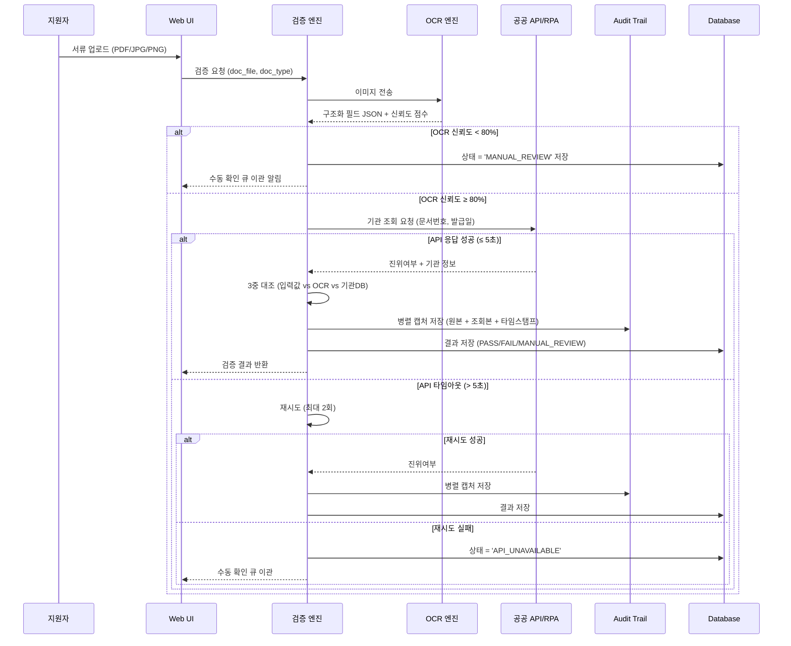
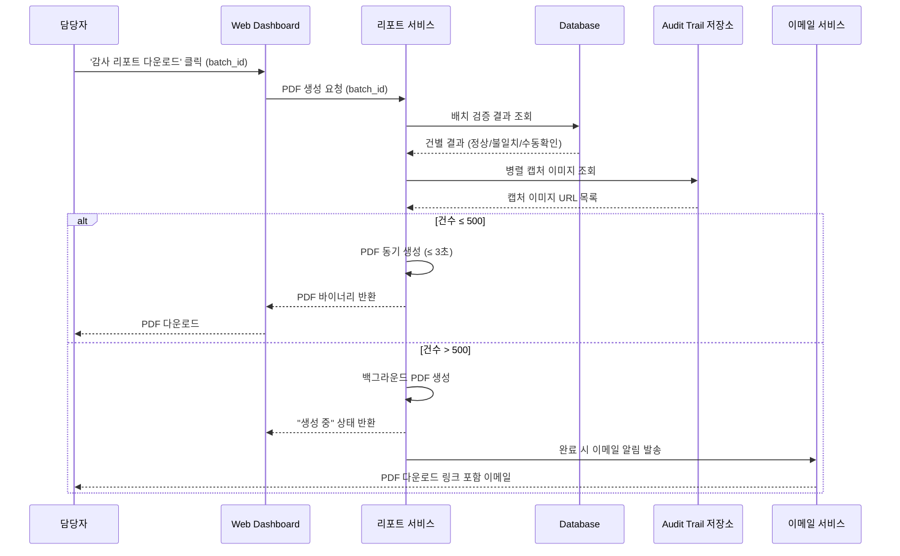
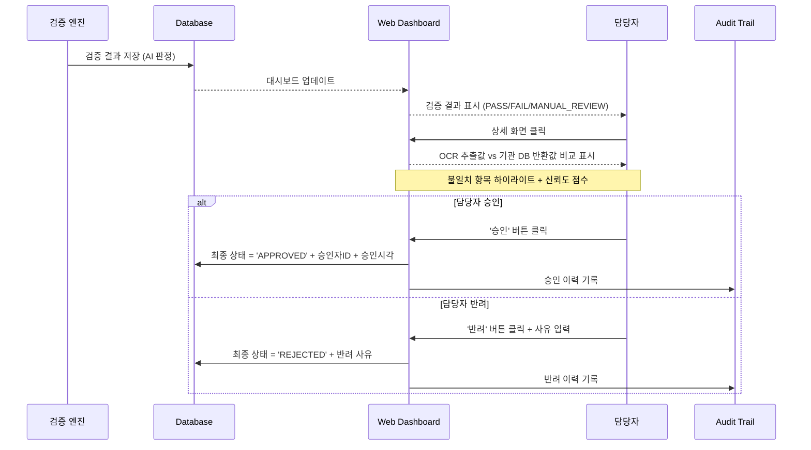
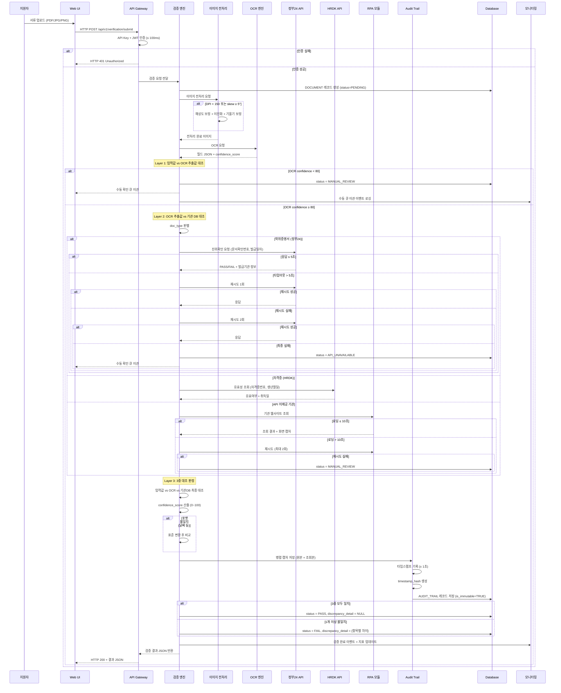
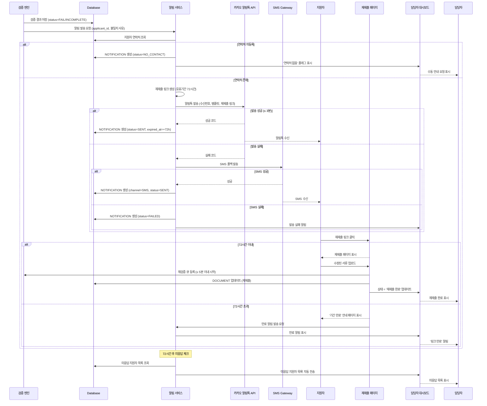
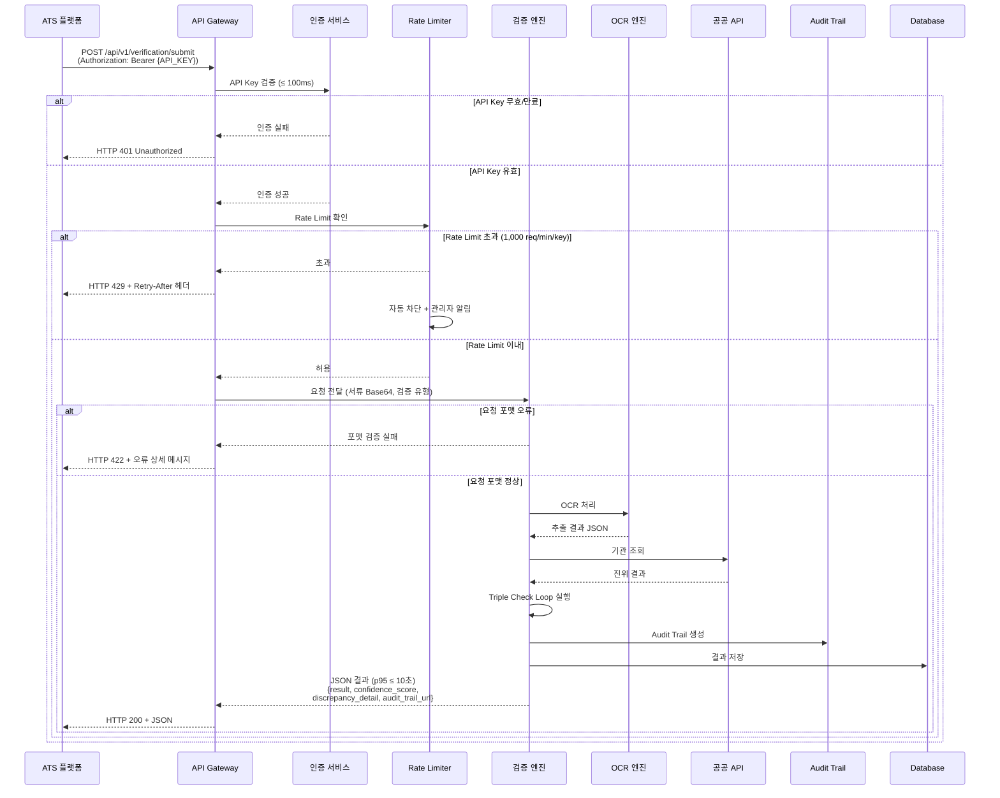
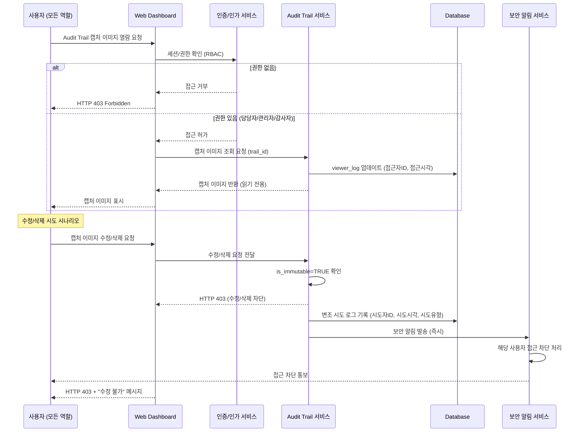

# Software Requirements Specification (SRS)

**Document ID:** SRS-001
**Revision:** 1.0
**Date:** 2026-04-15
**Standard:** ISO/IEC/IEEE 29148:2018

---

## 1. Introduction

### 1.1 Purpose

본 문서는 **HR AI 서류 진위확인 솔루션**의 소프트웨어 요구사항 명세서(SRS)이다. 본 시스템은 대한민국 채용 시장에서 수기 기반 서류 검증 구조의 구조적 한계를 해결하기 위해 설계된다.

현재 채용 서류 검증 프로세스는 다음과 같은 정량적 문제를 내포하고 있다:

| 문제 항목 | 실패 KPI (기준선) |
|---|---|
| 수기 검증 비용 과다 | 4,000건 공채 기준 인건비 900~1,000만원 / 운영 수익률 1% 이하 |
| 허위 기재 미검출 | 구직자 약 20%가 허위 사실 기재 / 연간 공공기관 채용 비위 적발 832건 |
| 감사 대응 증빙 부재 | 수기 확인 기반 감사 시 객관적 로그 제출 불가 / 34건 이상 징계·수사 |
| 민원 전화 폭주 | 서류 미비 대응 민원 전화가 담당자 업무의 70~90% 점유 |
| 저화질 OCR 실패 | 모바일 폰카 이미지 등 저품질 서류의 OCR 신뢰도 저하로 재수동 검증 발생 |

본 SRS는 OCR 추출, 공공 API/RPA 기관 조회, Triple Check Loop(3중 대조 검증), 병렬 캡처 Audit Trail, 감사 리포트 자동 생성 등을 포함하는 AI 기반 서류 진위확인 솔루션의 기능적·비기능적 요구사항을 정의한다.

본 문서의 대상 독자는 개발팀, QA팀, 프로젝트 관리자, 법무팀, 보안팀, 외부 감사자이다.

### 1.2 Scope (In-Scope / Out-of-Scope)

#### 1.2.1 System Name

**HR AI 서류 진위확인 솔루션** (HR AI Document Verification Solution)

#### 1.2.2 In-Scope (MVP — Phase 1)

| # | 범위 항목 |
|---|---|
| IS-01 | PDF/JPG/PNG 형식의 학위증명서, 자격증, 경력증명서 OCR 추출 |
| IS-02 | 정부24 / HRDK API 연동 기반 실시간 진위확인 |
| IS-03 | 원본-조회본 병렬 캡처 + 타임스탬프 기반 Audit Trail 생성 |
| IS-04 | 감사원 제출용 PDF 리포트 자동 생성 |
| IS-05 | Triple Check Loop (입력값 / OCR / 기관 DB 3중 대조) |
| IS-06 | Human-in-the-loop 최종 승인 UI |

#### 1.2.3 Out-of-Scope

| # | 제외 항목 | 비고 |
|---|---|---|
| OS-01 | 해외 학위 검증 | Phase 3 |
| OS-02 | 블록체인/DID 기반 증명 연동 | Phase 3 |
| OS-03 | 금융 대출 서류(소득금액증명원 등) 특화 모듈 | Adjacent 시장, Phase 2 |
| OS-04 | 모바일 앱 | Web 전용 MVP |
| OS-05 | 채용 플랫폼 독자 구축 | API First 전략 유지 |
| OS-06 | Self-Service 알림톡 루프 | Should 항목 → Phase 2 |
| OS-07 | 외부 ATS 플랫폼 API 연동 | Could 항목 → Phase 2 |

#### 1.2.4 Constraints (제약사항)

| ID | 제약사항 | 근거 |
|---|---|---|
| CON-01 | 정부24 오픈API 일일 무료 호출 한도 존재 | ADR-003 |
| CON-02 | HRDK API 연동 시 OAuth 2.0 인증 필수 | 외부 인터페이스 제약 |
| CON-03 | 카카오 알림톡 템플릿 심사 최대 3일 소요 | 카카오 정책 |
| CON-04 | RPA 기관 사이트 구조 변경 시 72시간 내 복구 SLA 적용 | ADR-001 |
| CON-05 | Human-in-the-loop 설계: AI는 '경고+증거' 제공자, 최종 승인은 인간 | ADR-002 |
| CON-06 | 개인정보 처리 시 최소 수집 원칙 적용, AES-256 암호화 필수 | ADR-004 |
| CON-07 | OCR 신뢰도 < 80% 건은 자동으로 수동 큐 이관 | ADR-005 |
| CON-08 | ISMS-P 인증은 Phase 2 출시 전까지 완료 목표, Phase 1은 내부 보안 정책으로 운영 | 가정 |
| CON-09 | MVP 출시 전 핵심 타겟 기관 API 연동 승인 완료 필요 | 가정 |
| CON-10 | 카카오 알림톡 템플릿 심사 2주 이내 승인 가정 | 가정 |

#### 1.2.5 Assumptions (가정)

| ID | 가정 내용 |
|---|---|
| ASM-01 | 핵심 타겟 기관(Q1 공공기관)의 API 연동 승인이 MVP 출시 전 완료된다 |
| ASM-02 | 카카오 알림톡 템플릿 심사는 2주 이내 승인된다 |
| ASM-03 | ISMS-P 인증은 Phase 2 출시 전까지 완료되며, 이전에는 내부 보안 정책으로 운영한다 |

#### 1.2.6 Dependencies (의존성)

| ID | 의존성 내용 |
|---|---|
| DEP-01 | 정부24 오픈API, HRDK API 연동 계약 및 테스트 환경 제공 |
| DEP-02 | 카카오 비즈니스 채널 등록 및 알림톡 발신번호 사전 등록 |
| DEP-03 | 채용 대행사 PoC 파트너 3곳 확보 (Phase 1 실험 기반) |

### 1.3 Definitions, Acronyms, Abbreviations

| 용어 | 정의 |
|---|---|
| **OCR** | Optical Character Recognition. 이미지 내 문자를 기계 판독 가능한 텍스트로 변환하는 기술 |
| **RPA** | Robotic Process Automation. 소프트웨어 로봇을 이용한 반복 업무 자동화 |
| **Triple Check Loop** | 지원자 입력값, OCR 추출값, 발급기관 API/RPA 조회값을 3중으로 대조 검증하는 로직 |
| **Audit Trail** | 검증 행위의 전 과정을 기록하는 불변 로그. 원본-조회본 병렬 캡처 + 타임스탬프 포함 |
| **Parallel Capture (병렬 캡처)** | 원본 서류 이미지와 기관 조회 결과 화면을 단일 프레임 내에 나란히 캡처하여 저장하는 기능 |
| **JTBD** | Jobs to be Done. 사용자가 완수하고자 하는 과업 |
| **AOS** | Adjusted Opportunity Score. 기회 점수를 조정 계수를 반영하여 보정한 값 |
| **DOS** | Discovered Opportunity Score. 탐색된 기회 점수 |
| **Persona** | 사용자의 특성·행동 패턴을 대표하는 가상의 인물 프로필 |
| **MoSCoW** | Must / Should / Could / Won't 우선순위 분류 기법 |
| **RBAC** | Role-Based Access Control. 역할 기반 접근 제어 |
| **SLA** | Service Level Agreement. 서비스 수준 합의 |
| **SLO** | Service Level Objective. 서비스 수준 목표 |
| **RPO** | Recovery Point Objective. 데이터 복구 목표 시점 |
| **RTO** | Recovery Time Objective. 서비스 복구 목표 시간 |
| **ISMS-P** | 정보보호 및 개인정보보호 관리체계 인증 |
| **CSAP** | 클라우드 보안 인증 (Cloud Security Assurance Program) |
| **ATS** | Applicant Tracking System. 지원자 추적 시스템 |
| **HRDK** | 한국산업인력공단 (Human Resources Development Service of Korea) |
| **ADR** | Architecture Decision Record. 아키텍처 결정 기록 |
| **Human-in-the-loop** | AI 결과를 인간이 최종 검토·승인하는 운영 방식 |
| **Self-Service 루프** | 서류 불일치/미비 감지 시 지원자에게 자동 알림 발송 후 스스로 재제출하도록 하는 자동화 흐름 |
| **Validator** | 요구사항의 정확성과 실현 가능성을 확인하는 검증 주체 |

### 1.4 References

| ID | 참조 문서 | 비고 |
|---|---|---|
| REF-01 | PRD-HR-AI-Verification-v0.1 | 본 SRS의 유일한 비즈니스/기능 요구 원천 |
| REF-02 | ISO/IEC/IEEE 29148:2018 | SRS 작성 표준 |
| REF-03 | VPS 원문: Claude-Value-ProPosition-Sheet.md | 가치 제안 시트 |
| REF-04 | 감사원 2024 공공기관 채용 실태 전수조사 보고서 | 연간 832건 채용 비위 근거 (예정) |
| REF-05 | 채용절차의 공정화에 관한 법률 | 감사 로그 보존 5년 기준 근거 |
| REF-06 | 국가인권위원회 채용 실태 조사 | 구직자 20% 허위 기재 근거 |
| REF-07 | JTBD 심층 인터뷰 결과 노션 정리 문서 (n=10) | 정성적 근거 (예정) |
| REF-08 | 채용 대행사 파트너 3곳 실사 자료 | 인건비 900~1,000만원/4,000건 근거 |
| REF-09 | PoC 파트너사 ROI 측정 결과 보고서 | Phase 1 완료 후 (예정) |

---

## 2. Stakeholders

| 역할 (Role) | 대표 페르소나 | 책임 (Responsibility) | 관심사 (Interest) |
|---|---|---|---|
| **공공기관 채용 PM** | 김철수 (38세) | 연간 5,000명 공채 관리, 감사 대응 | 감사원 감사 시 객관적 증거 즉시 제출, 징계 리스크 원천 차단 |
| **채용 대행사 팀장** | 박지민 (42세) | 수익률 관리, 다수 고객사 서류 검증 대행 | 인건비 50% 절감, 민원 전화 90% 제거, 오류율 0% |
| **핀테크 HRBP** | 이현우 (35세) | 수시 대규모 경력직 채용, 4대보험 이력 검증 | Triple Check Loop 기반 위조 서류 원천 차단, 부당해고 소송 리스크 제거 |
| **대기업 법무관** | 최유진 (40세) | 부당해고 소송 대응 | Audit Trail + 타임스탬프 캡처 기반 법원 증거력 확보 |
| **ATS 플랫폼 PO** | 정성훈 (33세) | B2B SaaS 차별화, 플랫폼 기능 확장 | API First 검증 엔진 탑재, 공공 API 연동 직접 개발 비용 제거 |
| **긴급 채용 PM** | 홍길동 (50세) | 3일 내 1,000명 검증 | 저화질 보정 OCR + 대량 배치 처리 |
| **시스템 관리자** | (내부) | 시스템 운영, 모니터링, 장애 대응 | 시스템 가용성 ≥ 99.5%, 오류율 ≤ 0.5%, 알림 체계 |
| **감사자** | (외부/내부) | 감사 시 검증 증빙 확인 | Audit Trail 불변성, 접근 로그 보존 ≥ 5년 |
| **API 파트너** | (외부 ATS 벤더) | 외부 시스템 연동 | API 가용성 ≥ 99.9%, 명확한 스펙 문서, SDK 제공 |

---

## 3. System Context and Interfaces

### 3.1 External Systems

| 시스템명 | 유형 | 방향 | 프로토콜 | 설명 |
|---|---|---|---|---|
| 정부24 진위확인 API | 공공 API | Outbound | REST/HTTPS | 문서확인번호·발급일자로 진위여부 조회 |
| HRDK(한국산업인력공단) API | 공공 API | Outbound | REST/HTTPS (OAuth 2.0) | 자격증번호·생년월일로 자격증 유효 여부 조회 |
| 카카오 알림톡 API | 메시징 API | Outbound | REST/HTTPS | 불일치/미비 감지 시 지원자에게 알림톡 발송 |
| 기관 웹사이트 (RPA 대상) | 공공 웹사이트 | Outbound | HTTP/HTTPS (RPA) | API 미제공 기관의 조회 화면 병렬 캡처 |

### 3.2 Client Applications

| 클라이언트 | 유형 | 설명 |
|---|---|---|
| 관리자 웹 대시보드 | Web Application | 담당자/관리자의 검증 결과 확인, 승인, 리포트 다운로드 |
| 지원자 재제출 웹페이지 | Web Application | 알림톡 링크를 통한 서류 재제출 (Phase 2) |
| 개발자 포털 | Web Application | API 문서, SDK, Sandbox 제공 (Phase 2) |

### 3.3 API Overview

| API 엔드포인트 | 방향 | 메서드 | 입력 | 출력 | 제약사항 |
|---|---|---|---|---|---|
| `POST /api/v1/verification/submit` | Inbound | POST | 서류 파일(Base64), 검증 유형 | job_id, status | 인증 필수 |
| `GET /api/v1/verification/{job_id}` | Inbound | GET | job_id | result, confidence_score, discrepancy_detail, audit_trail_url | 인증 필수 |
| `POST /api/v1/batch/submit` | Inbound | POST | 서류 파일 배열(Base64), batch_id | batch_id, status | Rate Limit 적용 |
| `GET /api/v1/batch/{batch_id}/status` | Inbound | GET | batch_id | 건별 상태 목록, 완료율 | 인증 필수 |
| `GET /api/v1/report/{batch_id}/pdf` | Inbound | GET | batch_id | PDF 바이너리 | 인증 필수, 500건 초과 시 비동기 |
| `POST /api/v1/notification/send` | Internal | POST | applicant_id, channel, template_code | noti_id, status | 카카오 템플릿 사전 등록 필수 |
| 정부24 진위확인 API | Outbound | POST | 문서확인번호, 발급일자 | 진위여부 (PASS/FAIL), 발급기관 정보 | 일일 무료 호출 한도 |
| HRDK API | Outbound | POST | 자격증번호, 생년월일 | 자격증 유효 여부, 취득일 | OAuth 2.0 인증 필요 |
| 카카오 알림톡 API | Outbound | POST | 수신번호, 템플릿코드, 변수값 | 발송 성공/실패 코드 | 발신번호 사전 등록 필요 |

### 3.4 Interaction Sequences (핵심 시퀀스 다이어그램)

#### 3.4.1 핵심 흐름: 단일 서류 Triple Check Loop 검증

#### 3.4.2 핵심 흐름: 감사 리포트 PDF 생성

#### 3.4.3 핵심 흐름: Human-in-the-loop 최종 승인

---

## 4. Specific Requirements

### 4.1 Functional Requirements

#### 4.1.1 F1 — OCR 추출 엔진 (M1)

| ID | 요구사항 | Source | Priority | Acceptance Criteria |
|---|---|---|---|---|
| REQ-FUNC-001 | 시스템은 PDF, JPG, PNG 형식의 서류 파일을 입력으로 수신하여 OCR 처리를 수행해야 한다. | Story-2, F1(M1) | Must | **Given** 지원자가 PDF/JPG/PNG 형식의 학위증명서, 자격증, 경력증명서를 업로드한 상태에서 **When** 시스템이 파일을 수신하면 **Then** OCR 엔진이 해당 파일을 처리 대상으로 등록하고 처리를 시작해야 한다. |
| REQ-FUNC-002 | OCR 엔진은 입력 이미지로부터 구조화된 필드(성명, 생년월일, 발급번호, 발급일자, 기관명 등)를 JSON 형식으로 추출해야 한다. | Story-2, F1(M1) | Must | **Given** OCR 엔진이 서류 이미지를 수신한 상태에서 **When** OCR 처리가 완료되면 **Then** 추출 결과가 JSON 형식(필드명, 필드값 쌍)으로 반환되어야 한다. |
| REQ-FUNC-003 | OCR 엔진은 각 추출 필드에 대해 0~100 범위의 신뢰도 점수(confidence_score)를 산출하여 반환해야 한다. | Story-2, F1(M1) | Must | **Given** OCR 추출이 완료된 상태에서 **When** 결과 JSON이 생성되면 **Then** 각 필드에 ocr_confidence_score (0~100)가 포함되어야 한다. |
| REQ-FUNC-004 | OCR 전체 신뢰도 점수가 80 미만인 건은 자동으로 수동 확인 큐(MANUAL_REVIEW)로 이관되어야 한다. | Story-2, F1(M1) | Must | **Given** OCR 처리 결과의 전체 신뢰도 점수가 80 미만인 상태에서 **When** 검증 엔진이 결과를 평가하면 **Then** 해당 건의 상태가 'MANUAL_REVIEW'로 설정되고 수동 확인 큐에 등록되어야 한다. |

#### 4.1.2 F2 — 공공 API/RPA 기관 실시간 조회 (M2)

| ID | 요구사항 | Source | Priority | Acceptance Criteria |
|---|---|---|---|---|
| REQ-FUNC-005 | 시스템은 정부24 진위확인 API에 문서확인번호와 발급일자를 전송하여 진위여부(PASS/FAIL)를 조회해야 한다. | Story-2, F2(M2) | Must | **Given** OCR 추출값에서 문서확인번호와 발급일자가 추출된 상태에서 **When** 검증 엔진이 정부24 API로 요청을 전송하면 **Then** 진위여부(PASS/FAIL)와 발급기관 정보가 반환되어야 한다. |
| REQ-FUNC-006 | 시스템은 HRDK API에 자격증번호와 생년월일을 전송하여 자격증 유효 여부를 조회해야 한다. | Story-2, F2(M2) | Must | **Given** OCR 추출값에서 자격증번호와 생년월일이 추출된 상태에서 **When** 검증 엔진이 HRDK API로 요청을 전송하면 **Then** 자격증 유효 여부와 취득일이 반환되어야 한다. |
| REQ-FUNC-007 | API 응답 타임아웃(> 5초) 발생 시 시스템은 자동으로 최대 2회 재시도를 수행해야 한다. | Story-2 AC-2, F2(M2) | Must | **Given** 공공 API 요청에 대한 응답이 5초 이내에 수신되지 않은 상태에서 **When** 타임아웃이 발생하면 **Then** 시스템이 동일 요청을 최대 2회 재시도해야 한다. |
| REQ-FUNC-008 | 재시도 2회 후에도 API 응답이 없는 경우, 해당 건의 상태를 'API_UNAVAILABLE'로 설정하고 수동 확인 큐로 이관해야 한다. | Story-2 AC-2, F2(M2) | Must | **Given** 재시도 2회가 모두 실패한 상태에서 **When** 최종 재시도가 타임아웃되면 **Then** 상태가 'API_UNAVAILABLE'로 저장되고 수동 확인 큐에 자동 등록되어야 한다. |
| REQ-FUNC-009 | API 미제공 기관의 경우, RPA를 통해 기관 웹사이트에 접속하여 조회를 수행해야 한다. | Story-1, F2(M2) | Must | **Given** 검증 대상 서류의 발급기관이 공공 API를 제공하지 않는 상태에서 **When** 검증 엔진이 해당 기관의 검증을 시도하면 **Then** RPA 모듈이 기관 웹사이트에 접속하여 조회 결과를 반환해야 한다. |
| REQ-FUNC-010 | 기관 사이트 로딩 지연(> 10초) 시 재시도 2회 후 '수동 확인 큐'로 자동 이관해야 한다. | Story-1 AC-1, F2(M2) | Must | **Given** RPA를 통한 기관 사이트 접속 시 로딩이 10초를 초과한 상태에서 **When** 재시도 2회가 모두 실패하면 **Then** 해당 건이 '수동 확인 큐'로 자동 이관되어야 한다. |
| REQ-FUNC-011 | 기관 사이트 구조 변경을 자동 감지하고, 감지 시 Slack 알림 및 온콜 트리거를 발동해야 한다. | R-01, F2(M2) | Must | **Given** RPA 스크립트 실행 중 기관 사이트 구조가 변경된 상태에서 **When** RPA가 연속 2회 접속에 실패하면 **Then** Slack 알림이 발송되고 온콜 엔지니어에게 트리거가 전달되어야 한다. |

#### 4.1.3 F3 — 원본-조회본 병렬 캡처 + Audit Trail (M3)

| ID | 요구사항 | Source | Priority | Acceptance Criteria |
|---|---|---|---|---|
| REQ-FUNC-012 | 검증 엔진이 기관 사이트를 조회할 때, 원본 서류 이미지와 기관 조회 결과 화면을 단일 프레임 내에 나란히 캡처하여 저장해야 한다. | Story-1 AC-1, F3(M3) | Must | **Given** 지원자가 서류를 업로드하고 검증이 진행 중인 상태에서 **When** 검증 엔진이 공공 API 또는 RPA를 통해 기관 사이트를 조회할 때 **Then** 원본 서류 이미지 + 기관 조회 결과 화면이 단일 프레임 내에 나란히 캡처되어 저장되어야 한다. |
| REQ-FUNC-013 | 병렬 캡처 시 ± 1초 이내 정밀도의 타임스탬프를 캡처 이미지에 포함하여 기록해야 한다. | Story-1 AC-1, F3(M3) | Must | **Given** 병렬 캡처가 실행되는 상태에서 **When** 캡처 이미지가 생성되면 **Then** 캡처 시점의 타임스탬프가 ± 1초 이내 정밀도로 이미지 및 메타데이터에 기록되어야 한다. |
| REQ-FUNC-014 | 병렬 캡처 이미지의 해시값(timestamp_hash)을 생성하여 Audit Trail에 저장해야 한다. | Story-1 AC-3, F3(M3) | Must | **Given** 병렬 캡처 이미지가 저장된 상태에서 **When** Audit Trail 레코드가 생성되면 **Then** 해당 캡처 이미지의 해시값(timestamp_hash)이 계산되어 AUDIT_TRAIL 테이블에 저장되어야 한다. |
| REQ-FUNC-015 | 저장된 캡처 이미지는 모든 사용자(관리자 포함)에 의한 수정·삭제가 불가능해야 한다(불변성 보장). | Story-1 AC-3, F3(M3) | Must | **Given** 검증 완료 후 캡처 이미지와 Audit Trail이 저장된 상태에서 **When** 관리자를 포함한 모든 사용자가 수정 또는 삭제를 시도하면 **Then** 시스템이 해당 시도를 차단하고 HTTP 403을 반환해야 한다. 변조 시도 차단율은 100%여야 한다. |
| REQ-FUNC-016 | Audit Trail 접근 시 접근자ID, 접근시각을 자동 기록하는 접근 로그를 생성해야 한다. | Story-1 AC-3, F3(M3) | Must | **Given** 캡처 이미지가 저장된 Audit Trail이 존재하는 상태에서 **When** 사용자가 해당 캡처 이미지를 열람하면 **Then** 접근자ID와 접근시각이 viewer_log에 자동 기록되어야 한다. |
| REQ-FUNC-017 | Unauthorized 수정 시도 발생 시 즉시 보안 알림을 발송하고 해당 사용자의 접근을 차단해야 한다. | Story-1 AC-3, F3(M3) | Must | **Given** 저장된 Audit Trail 캡처에 대한 미인가 수정 시도가 감지된 상태에서 **When** 시스템이 해당 시도를 탐지하면 **Then** 보안 팀에 즉시 알림이 발송되고 해당 사용자의 접근이 차단되어야 한다. |

#### 4.1.4 F4 — Triple Check Loop (M4)

| ID | 요구사항 | Source | Priority | Acceptance Criteria |
|---|---|---|---|---|
| REQ-FUNC-018 | 시스템은 지원자 입력값, OCR 추출값, 발급기관 API/RPA 조회값의 3중 대조(Triple Check Loop)를 순차 실행해야 한다. | Story-2 AC-1, F4(M4) | Must | **Given** 지원자가 서류를 업로드한 상태에서 **When** Triple Check Loop가 실행되면 **Then** 입력값 → OCR 추출값 → 발급기관 API/RPA 조회값 순으로 3개 레이어가 순차적으로 실행되어야 한다. |
| REQ-FUNC-019 | 3개 레이어 모두 일치 시 결과를 '정상(PASS)'으로, 1개 이상 불일치 시 '불일치(FAIL)' 플래그를 설정하고 상세 불일치 항목을 명시해야 한다. | Story-2 AC-1, F4(M4) | Must | **Given** Triple Check Loop의 3개 레이어가 모두 실행 완료된 상태에서 **When** 대조 결과를 산출하면 **Then** 모두 일치 시 status='PASS', 1개 이상 불일치 시 status='FAIL' + discrepancy_detail에 불일치 항목이 명시되어야 한다. |
| REQ-FUNC-020 | 불일치 건의 상세 화면에서 OCR 추출값과 기관 DB 반환값의 차이를 항목별 하이라이트로 시각화해야 한다. | Story-2 AC-3, F4(M4) | Must | **Given** 검증 결과 '불일치' 플래그가 발생한 상태에서 **When** 담당자가 해당 건의 상세 화면을 클릭하면 **Then** OCR 추출값과 기관 DB 반환값의 차이가 항목별로 색상 하이라이트되어 표시되어야 한다. |
| REQ-FUNC-021 | 불일치 건에 대해 0~100 범위의 불일치 신뢰도 점수(confidence_score)를 산출하여 표시해야 한다. | Story-2 AC-3, F4(M4) | Must | **Given** 검증 결과 '불일치'가 발생한 상태에서 **When** 상세 화면이 로드되면 **Then** 불일치 신뢰도 점수(0~100)가 1초 이내에 표시되어야 한다. |
| REQ-FUNC-022 | 기관 DB 항목의 포맷이 상이한 경우(예: 날짜 형식), 표준 변환을 수행한 후 비교해야 한다. 변환 실패 시 원문을 병기해야 한다. | Story-2 AC-3, F4(M4) | Must | **Given** 기관 DB 반환값의 포맷이 시스템 표준과 상이한 상태에서 **When** 대조를 수행하면 **Then** 표준 변환 후 비교하고, 변환 실패 시 원문과 변환 시도 결과를 병기해야 한다. |

#### 4.1.5 F5 — 감사원 제출용 PDF 리포트 자동 생성 (M5)

| ID | 요구사항 | Source | Priority | Acceptance Criteria |
|---|---|---|---|---|
| REQ-FUNC-023 | 담당자가 '감사 리포트 다운로드' 버튼을 클릭하면, 회차명·검증 일시·건별 결과(정상/불일치/수동확인)·병렬 캡처 이미지를 포함하는 PDF를 생성해야 한다. | Story-1 AC-2, F5(M5) | Must | **Given** 채용 회차 전체 검증이 완료된 상태에서 **When** 담당자가 '감사 리포트 다운로드' 버튼을 클릭하면 **Then** 회차명, 검증 일시, 건별 결과, 병렬 캡처 이미지를 포함하는 PDF가 생성되어야 한다. 리포트 포함 항목 누락률은 0%여야 한다. |
| REQ-FUNC-024 | 500건 이하 배치의 PDF 생성은 동기 방식으로 처리하여 3초 이내에 다운로드를 제공해야 한다. | Story-1 AC-2, F5(M5) | Must | **Given** PDF 생성 대상 배치가 500건 이하인 상태에서 **When** 생성 요청이 접수되면 **Then** PDF가 동기 방식으로 p95 ≤ 3초 이내에 생성·다운로드되어야 한다. |
| REQ-FUNC-025 | 500건 초과 배치의 PDF 생성은 백그라운드에서 처리하고, 완료 시 이메일 알림을 발송해야 한다. | Story-1 AC-2, F5(M5) | Must | **Given** PDF 생성 대상 배치가 500건을 초과하는 상태에서 **When** 생성 요청이 접수되면 **Then** 백그라운드에서 PDF가 생성되고, 완료 시 다운로드 링크가 포함된 이메일 알림이 담당자에게 발송되어야 한다. |

#### 4.1.6 F6 — Human-in-the-loop 최종 승인 UI (S2)

| ID | 요구사항 | Source | Priority | Acceptance Criteria |
|---|---|---|---|---|
| REQ-FUNC-026 | 관리자 웹 대시보드에 AI 검증 결과(PASS/FAIL/MANUAL_REVIEW)와 '승인'/'반려' 버튼을 포함한 최종 승인 UI를 제공해야 한다. | Story-2, F6(S2) | Should | **Given** 검증 엔진이 AI 판정 결과를 저장한 상태에서 **When** 담당자가 대시보드에 접속하면 **Then** 건별 AI 판정 결과와 함께 '승인' 및 '반려' 버튼이 표시되어야 한다. |
| REQ-FUNC-027 | 담당자 승인 시 최종 상태를 'APPROVED'로 변경하고, 승인자ID와 승인 시각을 Audit Trail에 기록해야 한다. | Story-2, F6(S2) | Should | **Given** 담당자가 검증 결과 상세 화면을 검토 중인 상태에서 **When** '승인' 버튼을 클릭하면 **Then** 최종 상태가 'APPROVED'로 변경되고, 승인자ID·승인시각이 DB 및 Audit Trail에 기록되어야 한다. |
| REQ-FUNC-028 | 담당자 반려 시 반려 사유를 필수 입력받고, 최종 상태를 'REJECTED'로 변경하여 Audit Trail에 기록해야 한다. | Story-2, F6(S2) | Should | **Given** 담당자가 검증 결과를 검토 후 반려를 결정한 상태에서 **When** '반려' 버튼을 클릭하면 **Then** 반려 사유 입력 필드가 표시되고, 사유 입력 후 최종 상태가 'REJECTED'로 변경되며 사유가 Audit Trail에 기록되어야 한다. |

#### 4.1.7 F7 — 카카오알림톡 Self-Service 루프 (S1)

| ID | 요구사항 | Source | Priority | Acceptance Criteria |
|---|---|---|---|---|
| REQ-FUNC-029 | Triple Check Loop 결과 '불일치' 또는 '서류 미비' 상태 확정 시, 해당 지원자의 등록 연락처로 카카오알림톡을 3분 이내에 자동 발송해야 한다. | Story-3 AC-1, F7(S1) | Should | **Given** Triple Check Loop 결과 '불일치' 또는 '서류 미비'가 확정된 상태에서 **When** 검증 엔진이 결과를 저장하면 **Then** 해당 지원자에게 카카오알림톡이 3분 이내에 자동 발송되어야 한다. 발송 성공률 ≥ 99%. |
| REQ-FUNC-030 | 알림톡 발송 실패 시 SMS 폴백을 1회 수행해야 한다. | Story-3 AC-1, F7(S1) | Should | **Given** 카카오알림톡 발송이 실패한 상태에서 **When** 발송 실패 코드가 반환되면 **Then** SMS를 1회 폴백 발송해야 한다. |
| REQ-FUNC-031 | 지원자 연락처 미등록 시 담당자 대시보드에 '연락처 없음' 플래그를 표시하고 수동 안내 요청을 표시해야 한다. | Story-3 AC-1, F7(S1) | Should | **Given** 알림톡 발송 대상 지원자의 연락처가 미등록 상태에서 **When** 발송 시도가 트리거되면 **Then** 담당자 대시보드에 '연락처 없음' 플래그와 수동 안내 요청이 표시되어야 한다. |
| REQ-FUNC-032 | 알림톡에 재제출 링크를 포함하고, 지원자가 해당 링크를 통해 수정된 서류를 업로드하면 자동으로 재검증 큐에 등록해야 한다. | Story-3 AC-2, F7(S1) | Should | **Given** 지원자가 알림톡 내 재제출 링크를 수신한 상태에서 **When** 지원자가 링크를 클릭하여 수정된 서류를 업로드하면 **Then** 재제출 서류가 자동으로 재검증 큐에 등록되고, 담당자 대시보드 상태가 '재제출 완료'로 업데이트되어야 한다. |
| REQ-FUNC-033 | 재제출 링크의 유효 기간은 72시간이며, 기간 만료 후 접속 시 '기간 만료' 안내 페이지를 표시하고 담당자에게 알림을 발송해야 한다. | Story-3 AC-2, F7(S1) | Should | **Given** 재제출 링크 발송 후 72시간이 경과한 상태에서 **When** 지원자가 해당 링크에 접속하면 **Then** '기간 만료' 안내 페이지가 표시되고, 담당자에게 만료 알림이 발송되어야 한다. |
| REQ-FUNC-034 | 재제출 완료 후 5분 이내에 재검증이 시작되어야 한다. | Story-3 AC-2, F7(S1) | Should | **Given** 지원자가 재제출 서류를 업로드 완료한 상태에서 **When** 재검증 큐에 등록되면 **Then** 재검증이 5분 이내에 시작되어야 한다. |
| REQ-FUNC-035 | 채용 회차 종료 시, 알림톡 발송 건수 / 재제출 완료 건수 / 담당자 수동 개입 건수를 회차별로 자동 집계하여 대시보드에 표시해야 한다. | Story-3 AC-3, F7(S1) | Should | **Given** Self-Service 루프가 활성화된 채용 회차가 종료된 상태에서 **When** 시스템이 회차 종료를 감지하면 **Then** 알림톡 발송 건수, 재제출 완료 건수, 담당자 수동 개입 건수가 자동 집계되어 대시보드에 10초 이내에 표시되어야 한다. |
| REQ-FUNC-036 | 알림톡 발송 후 72시간 내 미응답 시, 담당자에게 '미응답 지원자 목록'을 자동 전송해야 한다. | Story-3 AC-3, F7(S1) | Should | **Given** 알림톡 발송 후 72시간이 경과한 상태에서 **When** 지원자가 미응답(재제출 미완료)인 경우 **Then** 담당자에게 '미응답 지원자 목록'이 자동 전송되어야 한다. |

#### 4.1.8 F8 — 저화질/기울어진 이미지 전처리 (S3)

| ID | 요구사항 | Source | Priority | Acceptance Criteria |
|---|---|---|---|---|
| REQ-FUNC-037 | DPI < 150인 저화질 이미지에 대해 전처리(해상도 보정, 이진화, 노이즈 제거)를 자동 수행한 후 OCR 처리를 진행해야 한다. | F8(S3) | Should | **Given** 업로드된 서류 이미지의 DPI가 150 미만인 상태에서 **When** OCR 엔진이 해당 이미지를 수신하면 **Then** 해상도 보정, 이진화, 노이즈 제거 전처리를 수행한 후 OCR 처리를 진행해야 한다. |
| REQ-FUNC-038 | 기울어진 이미지에 대해 자동 기울기 보정(Deskew)을 수행해야 한다. | F8(S3) | Should | **Given** 업로드된 서류 이미지가 기울어진 상태(skew angle ≥ 5°)에서 **When** 전처리 모듈이 해당 이미지를 수신하면 **Then** 자동 기울기 보정(Deskew)을 수행하여 정방향으로 교정한 후 OCR 처리를 진행해야 한다. |

#### 4.1.9 F9 — REST API 외부 연동 (C1)

| ID | 요구사항 | Source | Priority | Acceptance Criteria |
|---|---|---|---|---|
| REQ-FUNC-039 | ATS 플랫폼이 검증 API 엔드포인트로 지원자 서류(Base64) 및 검증 유형을 POST 요청하면, JSON 형식의 검증 결과를 p95 ≤ 10초 이내에 반환해야 한다. | Story-4 AC-1, F9(C1) | Could | **Given** ATS 플랫폼이 검증 API에 서류(Base64)와 검증 유형을 POST로 요청한 상태에서 **When** 검증 엔진이 요청을 처리하면 **Then** JSON 형식(result: PASS/FAIL/MANUAL_REVIEW, confidence_score, discrepancy_detail, audit_trail_url)이 p95 ≤ 10초 이내에 반환되어야 한다. |
| REQ-FUNC-040 | API Key + JWT 이중 인증 체계를 적용하고, 유효/만료 Key에 따라 HTTP 401 또는 처리를 수행해야 한다. | Story-4 AC-2, F9(C1) | Could | **Given** 연동 파트너가 API Key를 Authorization 헤더에 포함하여 요청한 상태에서 **When** API Gateway가 요청을 수신하면 **Then** 유효한 Key에만 처리를 허용하고, 무효/만료 Key는 HTTP 401을 반환해야 한다. 인증 처리 시간 ≤ 100ms. |
| REQ-FUNC-041 | Rate Limit 초과 시 HTTP 429를 반환하고 Retry-After 헤더를 포함해야 한다. 동일 Key 1분 내 1,000건 초과 요청 시 자동 차단 + 관리자 알림을 발송해야 한다. | Story-4 AC-2, F9(C1) | Could | **Given** 동일 API Key로 1분 내 1,000건 초과 요청이 수신된 상태에서 **When** Rate Limit이 초과되면 **Then** HTTP 429 + Retry-After 헤더가 반환되고, 자동 차단 후 관리자에게 알림이 발송되어야 한다. |
| REQ-FUNC-042 | 요청 포맷 오류 시 HTTP 422와 상세 오류 메시지를 반환해야 한다. | Story-4 AC-1, F9(C1) | Could | **Given** ATS 플랫폼이 규격에 맞지 않는 요청을 전송한 상태에서 **When** API Gateway가 요청을 파싱하면 **Then** HTTP 422와 함께 상세 오류 메시지(필드명, 오류 유형, 기대 포맷)가 반환되어야 한다. |
| REQ-FUNC-043 | 개발자 포털에서 Python/Java/Node.js SDK, Swagger UI, 샘플 코드, Sandbox 환경을 제공해야 한다. | Story-4 AC-3, F9(C1) | Could | **Given** 신규 파트너가 API 연동을 시작하려는 상태에서 **When** 개발자 포털에 접속하면 **Then** Python/Java/Node.js SDK, Swagger UI, 샘플 코드, Sandbox 환경이 모두 제공되어야 한다. Sandbox 응답 시간 ≤ 3초. |
| REQ-FUNC-044 | API 스펙 변경 시 개발자 포털 문서를 7일 이내에 최신화해야 한다. SDK 버그 발견 시 48시간 이내에 패치 릴리즈를 배포해야 한다. | Story-4 AC-3, F9(C1) | Could | **Given** API 스펙이 변경되었거나 SDK 버그가 보고된 상태에서 **When** 변경/버그가 확인되면 **Then** 문서는 7일 이내에 최신화되고, SDK 패치는 48시간 이내에 릴리즈되어야 한다. |

#### 4.1.10 F10 — 배치 처리 스케줄러 (C2)

| ID | 요구사항 | Source | Priority | Acceptance Criteria |
|---|---|---|---|---|
| REQ-FUNC-045 | 시스템은 대량 서류(≥ 100건)를 배치 단위로 병렬 처리하는 스케줄러를 제공해야 한다. | F10(C2) | Could | **Given** 담당자가 100건 이상의 서류를 배치 등록한 상태에서 **When** 배치 처리가 시작되면 **Then** 서류들이 병렬로 처리되어야 한다. 처리 속도 ≥ 4,000건/시간. |
| REQ-FUNC-046 | 배치 처리 진행 상태(건별 진행률, 완료율, 예상 소요 시간)를 실시간으로 대시보드에 표시해야 한다. | F10(C2) | Could | **Given** 배치 처리가 진행 중인 상태에서 **When** 담당자가 대시보드에 접속하면 **Then** 건별 진행률, 전체 완료율, 예상 소요 시간이 실시간으로 표시되어야 한다. |

#### 4.1.11 F11 — 불일치 신뢰도 점수 시각화 대시보드 (C3)

| ID | 요구사항 | Source | Priority | Acceptance Criteria |
|---|---|---|---|---|
| REQ-FUNC-047 | 검증 결과를 신뢰도 점수(0~100) 기반으로 시각화(차트/히트맵)하는 대시보드를 제공해야 한다. | F11(C3) | Could | **Given** 검증 완료 건들이 존재하는 상태에서 **When** 담당자가 시각화 대시보드에 접속하면 **Then** 신뢰도 점수 분포 차트, 불일치 유형별 히트맵이 표시되어야 한다. |

---

### 4.2 Non-Functional Requirements

#### 4.2.1 성능 (Performance)

| ID | 요구사항 | 측정 지표 | 목표값 | 측정 방법 | Source |
|---|---|---|---|---|---|
| REQ-NF-001 | 단일 서류 검증 E2E 응답 시간 (공공 API 포함) | p95 latency | ≤ 5초 | API 응답 시간 모니터링 (Grafana/CloudWatch) | PRD §5, Story-2 AC-2 |
| REQ-NF-002 | 감사 PDF 생성 시간 (500건 이하 배치) | p95 latency | ≤ 3초 | PDF 생성 요청~다운로드 완료 시간 측정 | PRD §5, Story-1 AC-2 |
| REQ-NF-003 | 알림톡 발송 소요 시간 (불일치 감지 후) | max latency | ≤ 3분 | 불일치 확정 시각~알림톡 발송 시각 차이 측정 | PRD §5, Story-3 AC-1 |
| REQ-NF-004 | 외부 연동 API 응답 시간 (SDK 기준) | p95 latency | ≤ 10초 | API 엔드포인트 응답 시간 측정 | PRD §5, Story-4 AC-1 |
| REQ-NF-005 | 대량 배치 처리 속도 (병렬 처리) | throughput | ≥ 4,000건/시간 | 배치 완료 로그 기반 시간당 처리 건수 집계 | PRD §5, KPI-1 |
| REQ-NF-006 | 4,000건 기준 서류 검증 총 처리 시간 | E2E duration | ≤ 60분 | 배치 시작~완료 시간 측정 | PRD §1 목표, Exp-3 |
| REQ-NF-007 | 불일치 신뢰도 점수 표시 응답 시간 | latency | ≤ 1초 | 상세 화면 로드 시간 측정 | Story-2 AC-3 |
| REQ-NF-008 | 인증 처리 시간 | latency | ≤ 100ms | API Gateway 인증 단계 시간 측정 | Story-4 AC-2 |
| REQ-NF-009 | Self-Service 처리율 요약 리포트 생성 시간 | latency | ≤ 10초 | 회차 종료 후 리포트 생성 시간 측정 | Story-3 AC-3 |

#### 4.2.2 가용성 및 신뢰성 (Availability & Reliability)

| ID | 요구사항 | 측정 지표 | 목표값 | 측정 방법 | Source |
|---|---|---|---|---|---|
| REQ-NF-010 | 서비스 월간 가용성 (SLA) | uptime % | ≥ 99.5% (≤ 3.6시간/월 다운타임) | Uptime 모니터링 (Pingdom/CloudWatch) | PRD §5 |
| REQ-NF-011 | 외부 연동 API 월간 가용성 | uptime % | ≥ 99.9% | API 엔드포인트 uptime 모니터링 | Story-4 AC-1 |
| REQ-NF-012 | 전체 검증 요청 대비 오류율 | HTTP 5xx 비율 | ≤ 0.5% | HTTP 5xx 응답 비율 집계 | PRD §5 |
| REQ-NF-013 | 병렬 캡처 성공률 | 배치당 캡처 성공 건수/전체 건수 | ≥ 99.5% (배치당 n ≥ 100건 기준) | 배치별 캡처 실패 건수 카운트 | Story-1 AC-1 |
| REQ-NF-014 | RPA 스크립트 복구 SLA | 복구 소요 시간 | 기관 사이트 변경 감지 후 ≤ 72시간 내 복구 | 자동 감지 알림 → 수동 패치 배포 시간 측정 | PRD §5, ADR-001 |
| REQ-NF-015 | 알림톡 발송 성공률 | 발송 성공 건수/전체 건수 | ≥ 99% | 카카오 API 응답 코드 집계 | Story-3 AC-1 |
| REQ-NF-016 | API 응답 성공률 (공공 API) | 성공 건수/전체 건수 | ≥ 99% | API 응답 코드 집계 | Story-2 AC-2 |
| REQ-NF-017 | RPO (Recovery Point Objective) | 데이터 손실 허용 범위 | ≤ 1시간 | 백업 주기 확인 | 시스템 설계 기준 |
| REQ-NF-018 | RTO (Recovery Time Objective) | 서비스 복구 시간 | ≤ 4시간 | 장애 발생~서비스 복구 시간 측정 | 시스템 설계 기준 |

#### 4.2.3 정확도 (Accuracy)

| ID | 요구사항 | 측정 지표 | 목표값 | 측정 방법 | Source |
|---|---|---|---|---|---|
| REQ-NF-019 | Triple Check Loop 검증 정확도 (Precision) | 정확도 | ≥ 95% | 위조 샘플 100건 블라인드 테스트 | PRD §1 목표, Story-2 AC-1, KPI-4 |
| REQ-NF-020 | False Negative 율 (위조 서류 미검출) | False Negative Rate | < 1% | 위조 샘플 검출 결과 vs 실제 정답 비교 | Story-2 AC-1 |
| REQ-NF-021 | 불일치 항목 시각화 정확도 | 시각화 정확도 | 100% | 불일치 항목 vs 하이라이트 표시 항목 일치율 | Story-2 AC-3 |
| REQ-NF-022 | Audit Trail 자동 생성 완료율 (북극성 KPI) | 자동 생성 완료율 | ≥ 99% | 검증 완료 건당 Audit Trail 존재 여부 집계 (주 1회) | PRD §1 KPI 북극성 |
| REQ-NF-023 | 감사 리포트 자동 생성률 | 자동 생성 완료율 | 100% | 검증 완료 건 대비 리포트 자동 생성 건수 | KPI-5 |
| REQ-NF-024 | 리포트 포함 항목 누락률 | 누락률 | 0% | PDF 리포트 내 필수 포함 항목 체크 | Story-1 AC-2 |
| REQ-NF-025 | 변조 시도 차단율 | 차단율 | 100% | 변조 시도 건수 대비 차단 건수 | Story-1 AC-3 |

#### 4.2.4 보안 및 개인정보 (Security & Privacy)

| ID | 요구사항 | 기준 | Source |
|---|---|---|---|
| REQ-NF-026 | 인증 체계: API Key + JWT 이중 인증, 세션 만료 ≤ 8시간 | 모든 API 요청에 적용 | PRD §5, ADR-004 |
| REQ-NF-027 | 데이터 저장 시 AES-256 암호화 적용 | 모든 개인정보 포함 데이터 | PRD §5 |
| REQ-NF-028 | 데이터 전송 시 TLS 1.3 이상 적용 | 모든 네트워크 통신 | PRD §5 |
| REQ-NF-029 | 개인정보 마스킹: 이름·주민번호는 화면 표시 시 일부 마스킹 (예: 홍○○, 9**-*****) | 모든 UI 화면 | PRD §5 |
| REQ-NF-030 | RBAC 접근 제어: 담당자 / 관리자 / 감사자 / API 파트너 4단계 분리 | 전체 시스템 | PRD §5 |
| REQ-NF-031 | 감사 로그 보존 기간 ≥ 5년 (채용절차법 준수) | Audit Trail + 접근 로그 | PRD §5, Story-1 AC-3, REF-05 |
| REQ-NF-032 | ISMS-P 인증 목표 (Phase 2) | 보안 관리 체계 | PRD §5 |
| REQ-NF-033 | CSAP 인증 목표 (Phase 3, B2G) | 클라우드 보안 인증 | PRD §5 |

#### 4.2.5 비용 (Cost)

| ID | 요구사항 | 측정 지표 | 목표값 | 측정 방법 | Source |
|---|---|---|---|---|---|
| REQ-NF-034 | 4,000건 기준 전체 검증 비용 | 총 비용 | ≤ 500만원 (기존 1,000만원 대비 50% 절감) | PoC 비용 구조 비교 분석 | PRD §1 목표, KPI-2 |
| REQ-NF-035 | 건당 검증 비용 | 단가 | ≤ 1,250원 (기존 약 2,500원 대비 50% 절감) | 비용 구조 분석 | PRD §8 벤치마크 |

#### 4.2.6 운영 및 모니터링 (Operations & Monitoring)

| ID | 요구사항 | 알림 기준 | 도구 | Source |
|---|---|---|---|---|
| REQ-NF-036 | API 응답 시간 모니터링: p95 > 5초 연속 3회 시 알림 | p95 > 5초 × 3회 | Grafana / CloudWatch | PRD §5 |
| REQ-NF-037 | 오류율 모니터링: 5xx 에러율 > 0.5% (5분 window) 시 PagerDuty 알림 | > 0.5% (5분) | Sentry + PagerDuty | PRD §5 |
| REQ-NF-038 | 병렬 캡처 실패율 모니터링: > 0.5% (배치 단위) 시 알림 | > 0.5% | 자체 배치 모니터링 로그 | PRD §5 |
| REQ-NF-039 | RPA 기관 접속 실패 모니터링: 연속 2회 실패 시 알림 | 연속 2회 실패 | Slack 알림 + 온콜 트리거 | PRD §5 |
| REQ-NF-040 | 알림톡 발송 실패율 모니터링: > 1% (30분 window) 시 알림 | > 1% (30분) | 카카오 API 응답 코드 집계 | PRD §5 |
| REQ-NF-041 | 공공 API 쿼터 사용량 모니터링: 일일 쿼터 80% 도달 시 알림 | 쿼터 80% 도달 | API 호출량 카운터 | ADR-003, R-03 |

#### 4.2.7 확장성 (Scalability)

| ID | 요구사항 | 기준 | Source |
|---|---|---|---|
| REQ-NF-042 | 시스템은 배치당 4,000건 이상의 서류를 병렬 처리할 수 있어야 한다. | 4,000건/시간 처리 보장 | KPI-1 |
| REQ-NF-043 | 동시 API 요청 수가 증가할 때 수평 확장(horizontal scaling)이 가능해야 한다. | 자동 확장 정책 적용 | 시스템 설계 기준 |
| REQ-NF-044 | Phase 3에서 공공기관 931곳 동시 운영을 지원할 수 있는 아키텍처여야 한다. | 다중 테넌트 지원 | PRD §8 롤아웃 |

#### 4.2.8 유지보수성 (Maintainability)

| ID | 요구사항 | 기준 | Source |
|---|---|---|---|
| REQ-NF-045 | RPA 스크립트는 기관 사이트 변경 감지 후 72시간 이내에 복구·배포 가능해야 한다. | 복구 SLA ≤ 72시간 | ADR-001 |
| REQ-NF-046 | API 스펙 변경 시 개발자 포털 문서를 7일 이내에 최신화해야 한다. | 문서 최신화 ≤ 7일 | Story-4 AC-3 |
| REQ-NF-047 | SDK 버그 발견 시 48시간 이내에 패치 릴리즈를 배포해야 한다. | 패치 SLA ≤ 48시간 | Story-4 AC-3 |

#### 4.2.9 민원 감소 (Operational Efficiency)

| ID | 요구사항 | 측정 지표 | 목표값 | 측정 방법 | Source |
|---|---|---|---|---|---|
| REQ-NF-048 | Self-Service 루프 도입 후 담당자 민원 전화 감소율 | 민원 전화 감소율 | ≥ 90% 감소 | 채용 회차별 Before-After 비교 | PRD §1 목표, KPI-3 |
| REQ-NF-049 | Self-Service 처리율 (수동 개입 건 ≤ 10%) | Self-Service 처리율 | ≥ 90% | 알림톡 발송 건수 대비 Self-Service 완료 건수 | Story-3 AC-3 |

---

## 5. Traceability Matrix

### 5.1 Story → Requirement ID → Test Case ID

| Story ID | Story 제목 | Requirement IDs | Test Case IDs |
|---|---|---|---|
| Story-1 | Audit Trail 기반 법적 면책권 확보 | REQ-FUNC-012, REQ-FUNC-013, REQ-FUNC-014, REQ-FUNC-015, REQ-FUNC-016, REQ-FUNC-017, REQ-FUNC-023, REQ-FUNC-024, REQ-FUNC-025 | TC-012, TC-013, TC-014, TC-015, TC-016, TC-017, TC-023, TC-024, TC-025 |
| Story-2 | Triple Check Loop 기반 무오성 검증 | REQ-FUNC-001~004, REQ-FUNC-005~011, REQ-FUNC-018~022, REQ-FUNC-026~028 | TC-001~004, TC-005~011, TC-018~022, TC-026~028 |
| Story-3 | Self-Service 알림톡 루프 | REQ-FUNC-029~036 | TC-029~036 |
| Story-4 | API First 플랫폼 연동 | REQ-FUNC-039~044 | TC-039~044 |

### 5.2 Feature → Requirement ID Mapping

| Feature ID | Feature 제목 | Priority | Requirement IDs |
|---|---|---|---|
| M1 | OCR 추출 엔진 | Must | REQ-FUNC-001, REQ-FUNC-002, REQ-FUNC-003, REQ-FUNC-004 |
| M2 | 공공 API/RPA 기관 실시간 조회 | Must | REQ-FUNC-005, REQ-FUNC-006, REQ-FUNC-007, REQ-FUNC-008, REQ-FUNC-009, REQ-FUNC-010, REQ-FUNC-011 |
| M3 | 원본-조회본 병렬 캡처 + Audit Trail | Must | REQ-FUNC-012, REQ-FUNC-013, REQ-FUNC-014, REQ-FUNC-015, REQ-FUNC-016, REQ-FUNC-017 |
| M4 | Triple Check Loop | Must | REQ-FUNC-018, REQ-FUNC-019, REQ-FUNC-020, REQ-FUNC-021, REQ-FUNC-022 |
| M5 | 감사원 제출용 PDF 리포트 자동 생성 | Must | REQ-FUNC-023, REQ-FUNC-024, REQ-FUNC-025 |
| S1 | 카카오알림톡 Self-Service 루프 | Should | REQ-FUNC-029, REQ-FUNC-030, REQ-FUNC-031, REQ-FUNC-032, REQ-FUNC-033, REQ-FUNC-034, REQ-FUNC-035, REQ-FUNC-036 |
| S2 | Human-in-the-loop 최종 승인 UI | Should | REQ-FUNC-026, REQ-FUNC-027, REQ-FUNC-028 |
| S3 | 저화질/기울어진 이미지 전처리 | Should | REQ-FUNC-037, REQ-FUNC-038 |
| C1 | REST API 외부 연동 | Could | REQ-FUNC-039, REQ-FUNC-040, REQ-FUNC-041, REQ-FUNC-042, REQ-FUNC-043, REQ-FUNC-044 |
| C2 | 배치 처리 스케줄러 | Could | REQ-FUNC-045, REQ-FUNC-046 |
| C3 | 불일치 신뢰도 점수 시각화 대시보드 | Could | REQ-FUNC-047 |

### 5.3 KPI → Non-Functional Requirement Mapping

| KPI ID | KPI 내용 | NFR IDs |
|---|---|---|
| 북극성 KPI | 검증 완료 건당 Audit Trail 자동 생성 완료율 ≥ 99% | REQ-NF-022 |
| KPI-1 | 서류 처리 속도 ≥ 4,000건/시간 | REQ-NF-005, REQ-NF-006, REQ-NF-042 |
| KPI-2 | 인건비 절감률 ≤ 500만원 | REQ-NF-034, REQ-NF-035 |
| KPI-3 | 민원 전화 감소율 ≥ 90% | REQ-NF-048, REQ-NF-049 |
| KPI-4 | 허위 서류 검출 정확도 ≥ 95% | REQ-NF-019, REQ-NF-020 |
| KPI-5 | 감사 리포트 자동 생성률 100% | REQ-NF-023 |

### 5.4 Risk → Constraint/NFR Mapping

| Risk ID | 리스크 | 관련 Constraint/NFR |
|---|---|---|
| R-01 | 기관 사이트 구조 변경으로 RPA 중단 | CON-04, REQ-NF-014, REQ-NF-045, REQ-FUNC-011 |
| R-02 | AI 오판 시 법적 배상 책임 | CON-05, REQ-FUNC-026~028 |
| R-03 | 공공 API 쿼터 초과 및 비용 급증 | CON-01, REQ-NF-041 |
| R-04 | 개인정보 유출 시 개인정보보호법 위반 | CON-06, REQ-NF-026~033 |
| R-05 | OCR 신뢰도 부족으로 인한 수동 처리 증가 | CON-07, REQ-FUNC-004, REQ-FUNC-037, REQ-FUNC-038 |

---

## 6. Appendix

### 6.1 API Endpoint List

| # | 엔드포인트 | 방향 | 메서드 | 인증 | 설명 | Rate Limit |
|---|---|---|---|---|---|---|
| A-01 | `POST /api/v1/verification/submit` | Inbound | POST | API Key + JWT | 단일 서류 검증 요청 제출 | 1,000 req/min/key |
| A-02 | `GET /api/v1/verification/{job_id}` | Inbound | GET | API Key + JWT | 검증 결과 조회 | 1,000 req/min/key |
| A-03 | `POST /api/v1/batch/submit` | Inbound | POST | API Key + JWT | 배치 서류 검증 요청 제출 | 100 req/min/key |
| A-04 | `GET /api/v1/batch/{batch_id}/status` | Inbound | GET | API Key + JWT | 배치 처리 상태 조회 | 1,000 req/min/key |
| A-05 | `GET /api/v1/report/{batch_id}/pdf` | Inbound | GET | API Key + JWT | 감사 리포트 PDF 다운로드 | 10 req/min/key |
| A-06 | `POST /api/v1/notification/send` | Internal | POST | Internal Auth | 알림톡/SMS 발송 요청 | N/A |
| A-07 | `GET /api/v1/dashboard/stats` | Inbound | GET | API Key + JWT | 대시보드 통계 데이터 조회 | 100 req/min/key |
| A-08 | 정부24 진위확인 API | Outbound | POST | API Key | 문서 진위 조회 | 일일 무료 호출 한도 |
| A-09 | HRDK API | Outbound | POST | OAuth 2.0 | 자격증 유효성 조회 | N/A |
| A-10 | 카카오 알림톡 API | Outbound | POST | API Key | 알림톡 발송 | 카카오 정책 적용 |

### 6.2 Entity & Data Model

#### 6.2.1 APPLICANT (지원자)

| 필드명 | 데이터 타입 | 제약조건 | 설명 |
|---|---|---|---|
| applicant_id | STRING | PK, NOT NULL, UNIQUE | 지원자 고유 식별자 |
| name_masked | STRING | NOT NULL | 마스킹 처리된 이름 (예: 홍○○) |
| phone_masked | STRING | NOT NULL | 마스킹 처리된 전화번호 |
| email | STRING | NULLABLE | 이메일 주소 |
| created_at | DATETIME | NOT NULL, DEFAULT NOW() | 생성 일시 |

#### 6.2.2 DOCUMENT (서류)

| 필드명 | 데이터 타입 | 제약조건 | 설명 |
|---|---|---|---|
| doc_id | STRING | PK, NOT NULL, UNIQUE | 서류 고유 식별자 |
| applicant_id | STRING | FK → APPLICANT.applicant_id, NOT NULL | 지원자 FK |
| doc_type | STRING | NOT NULL | 서류 유형 (학위증명서/자격증/경력증명서) |
| raw_file_path | STRING | NOT NULL | 원본 파일 저장 경로 |
| ocr_extracted_json | JSON | NULLABLE | OCR 추출 결과 (구조화 JSON) |
| ocr_confidence_score | FLOAT | NULLABLE, 0~100 | OCR 전체 신뢰도 점수 |
| uploaded_at | DATETIME | NOT NULL, DEFAULT NOW() | 업로드 일시 |

#### 6.2.3 VERIFICATION_JOB (검증 작업)

| 필드명 | 데이터 타입 | 제약조건 | 설명 |
|---|---|---|---|
| job_id | STRING | PK, NOT NULL, UNIQUE | 검증 작업 고유 식별자 |
| doc_id | STRING | FK → DOCUMENT.doc_id, NOT NULL | 서류 FK |
| check_layer | STRING | NOT NULL | 검증 레이어 (INPUT/OCR/AGENCY_DB) |
| status | STRING | NOT NULL | 상태 (PENDING/PASS/FAIL/MANUAL_REVIEW/API_UNAVAILABLE/APPROVED/REJECTED) |
| agency_api_response | JSON | NULLABLE | 기관 API 원본 응답 데이터 |
| discrepancy_detail | JSON | NULLABLE | 불일치 상세 내역 (항목별 차이) |
| confidence_score | FLOAT | NULLABLE, 0~100 | 불일치 신뢰도 점수 |
| verified_at | DATETIME | NULLABLE | 검증 완료 일시 |
| approver_id | STRING | NULLABLE | 최종 승인자 ID (Human-in-the-loop) |
| approved_at | DATETIME | NULLABLE | 최종 승인 일시 |
| rejection_reason | STRING | NULLABLE | 반려 사유 |

#### 6.2.4 AUDIT_TRAIL (감사 추적)

| 필드명 | 데이터 타입 | 제약조건 | 설명 |
|---|---|---|---|
| trail_id | STRING | PK, NOT NULL, UNIQUE | 감사 추적 고유 식별자 |
| job_id | STRING | FK → VERIFICATION_JOB.job_id, NOT NULL | 검증 작업 FK |
| parallel_capture_path | STRING | NOT NULL | 병렬 캡처 이미지 저장 경로 |
| timestamp_hash | STRING | NOT NULL | 캡처 이미지 해시값 (무결성 검증용) |
| viewer_log | JSON | NOT NULL, DEFAULT '[]' | 열람자 로그 [{접근자ID, 접근시각}, ...] |
| created_at | DATETIME | NOT NULL, DEFAULT NOW() | 생성 일시 |
| is_immutable | BOOLEAN | NOT NULL, DEFAULT TRUE | 불변성 플래그 (항상 TRUE) |

#### 6.2.5 NOTIFICATION (알림)

| 필드명 | 데이터 타입 | 제약조건 | 설명 |
|---|---|---|---|
| noti_id | STRING | PK, NOT NULL, UNIQUE | 알림 고유 식별자 |
| applicant_id | STRING | FK → APPLICANT.applicant_id, NOT NULL | 지원자 FK |
| channel | STRING | NOT NULL | 발송 채널 (KAKAO_ALIMTALK/SMS) |
| status | STRING | NOT NULL | 발송 상태 (PENDING/SENT/FAILED/EXPIRED) |
| resubmit_link | STRING | NULLABLE | 재제출 링크 URL |
| sent_at | DATETIME | NULLABLE | 발송 일시 |
| expired_at | DATETIME | NULLABLE | 링크 만료 일시 (sent_at + 72시간) |

#### 6.2.6 REPORT (리포트)

| 필드명 | 데이터 타입 | 제약조건 | 설명 |
|---|---|---|---|
| report_id | STRING | PK, NOT NULL, UNIQUE | 리포트 고유 식별자 |
| batch_id | STRING | FK, NOT NULL | 배치 식별자 |
| pdf_path | STRING | NOT NULL | 생성된 PDF 파일 저장 경로 |
| generated_by | STRING | NOT NULL | 생성 주체 (SYSTEM/USER_ID) |
| generated_at | DATETIME | NOT NULL, DEFAULT NOW() | 생성 일시 |

#### 6.2.7 Entity Relationship Summary

| 관계 | 카디널리티 | 설명 |
|---|---|---|
| APPLICANT → DOCUMENT | 1:N | 지원자 1명이 다수의 서류를 제출 |
| DOCUMENT → VERIFICATION_JOB | 1:N | 서류 1건에 대해 다수의 검증 작업(레이어별) 실행 |
| VERIFICATION_JOB → AUDIT_TRAIL | 1:1 | 검증 작업 1건마다 1개의 Audit Trail 생성 |
| APPLICANT → NOTIFICATION | 1:N | 지원자 1명에게 다수의 알림 발송 |
| VERIFICATION_JOB → REPORT | N:1 | 다수의 검증 작업이 1개의 배치 리포트에 포함 |

### 6.3 Detailed Interaction Models (상세 시퀀스 다이어그램)

#### 6.3.1 상세 시퀀스: 서류 업로드 → OCR → Triple Check Loop → Audit Trail 전체 흐름

#### 6.3.2 상세 시퀀스: Self-Service 알림톡 루프

#### 6.3.3 상세 시퀀스: 외부 ATS 플랫폼 API 연동

#### 6.3.4 상세 시퀀스: Audit Trail 불변성 보장 및 접근 로그

### 6.4 Validation Plan (검증 계획)

#### 6.4.1 Experiment-1: 병렬 캡처 기반 면책권 체감도 검증

| 항목 | 내용 |
|---|---|
| 가설 | 병렬 캡처 리포트를 제공받은 담당자는 수기 스크린샷 방식 대비 감사 대응 자신감이 유의미하게 높다 |
| 설계 | A/B 테스트: A그룹(병렬 캡처 리포트) vs B그룹(기존 수기 스크린샷), n = 각 50명 |
| 측정 지표 | 감사 대응 자신감 점수 (5점 척도), 리포트 활용 빈도 |
| 성공 기준 | A그룹 평균 점수 ≥ B그룹 + 1.0점 (95% 신뢰구간) |
| 측정 도구 | 인앱 Likert 5점 설문 + 다운로드 로그 |
| 관련 NFR | REQ-NF-022, REQ-NF-023 |

#### 6.4.2 Experiment-2: Self-Service 루프 민원 감소 검증

| 항목 | 내용 |
|---|---|
| 가설 | 알림톡 Self-Service 루프 도입 시 담당자 수동 개입 건수가 90% 이상 감소한다 |
| 설계 | Before-After 비교: 도입 전 vs 도입 후 채용 회차 (동일 기관, 동일 규모) |
| 측정 지표 | 회차당 담당자 수동 전화 건수, Self-Service 처리율(%), 재제출 완료 소요 시간(시간) |
| 성공 기준 | 수동 개입 건수 ≥ 90% 감소 / 재제출 완료율 ≥ 85% |
| 측정 도구 | 시스템 이벤트 로그 (알림 발송 → 재제출 완료 펀넬) |
| 관련 NFR | REQ-NF-048, REQ-NF-049 |

#### 6.4.3 Experiment-3: 처리 속도 및 비용 절감 PoC

| 항목 | 내용 |
|---|---|
| 가설 | 4,000건 공채 서류 처리 시 수기 방식(2주/1,000만원) 대비 ≥ 80% 시간 단축, ≥ 50% 비용 절감 |
| 설계 | PoC: 채용 대행사 3곳, 각 1,000~2,000건 실제 서류 배치 처리 |
| 측정 지표 | 전체 처리 시간(분), 건당 비용(원), 불일치 건 자동 감지율(%) |
| 성공 기준 | 처리 시간 ≤ 60분 / 비용 ≤ 500만원 / 자동 감지율 ≥ 95% |
| 측정 도구 | 배치 완료 로그 + 파트너사 인건비 실사 비교 |
| 관련 NFR | REQ-NF-005, REQ-NF-006, REQ-NF-034, REQ-NF-035 |

---

**— End of SRS-001 —**
