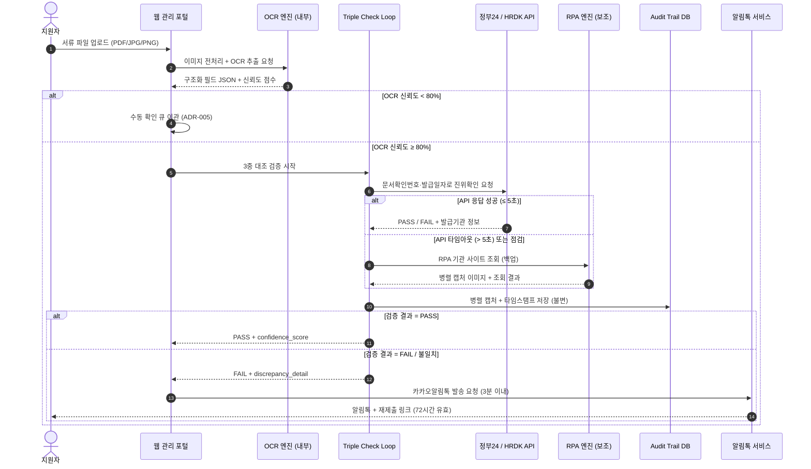
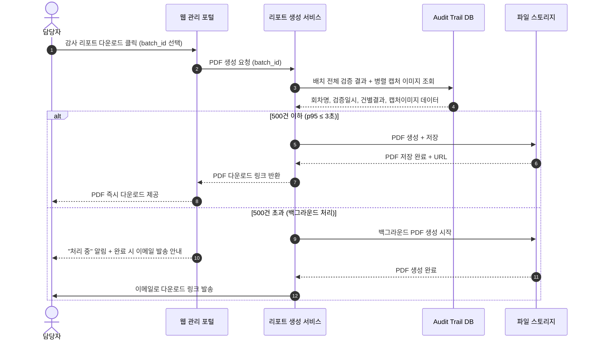
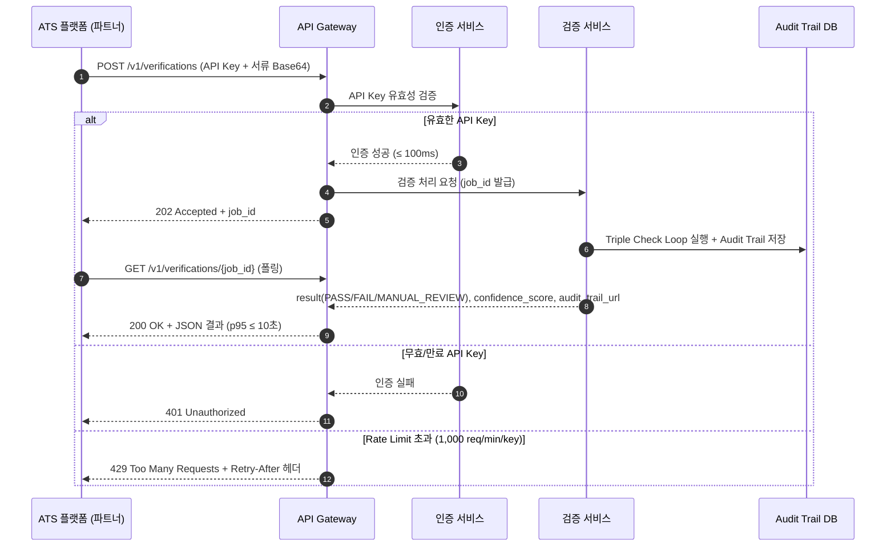
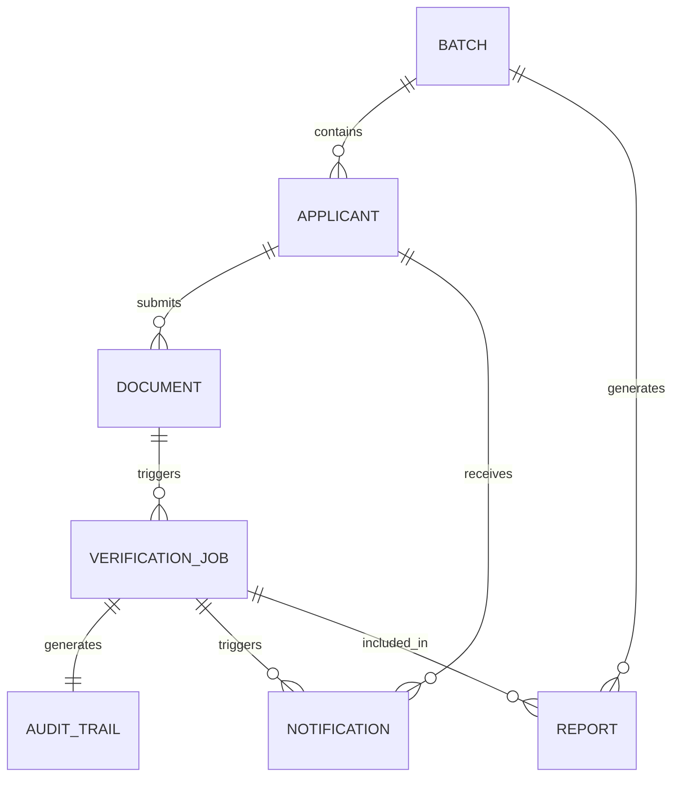
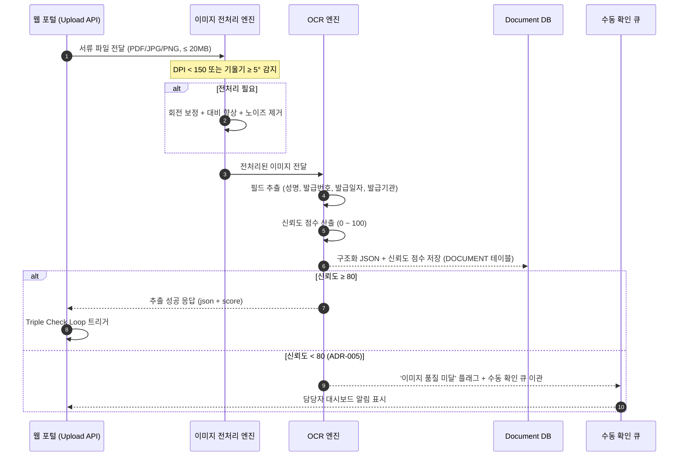
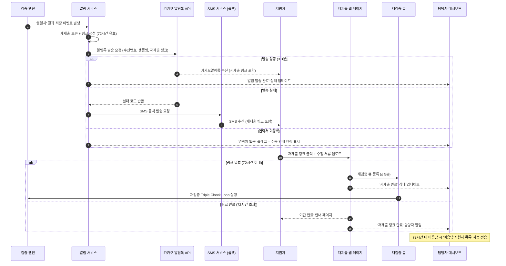
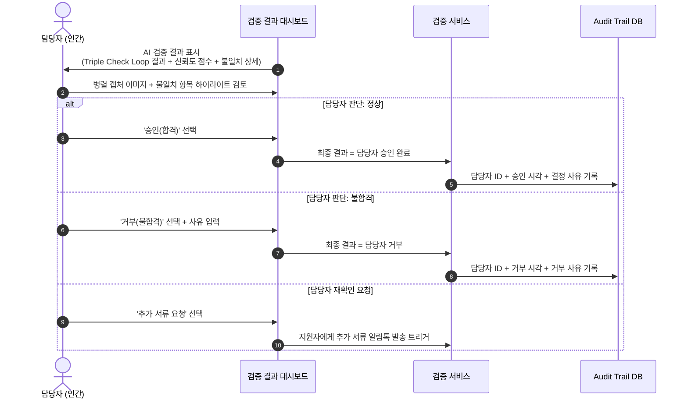
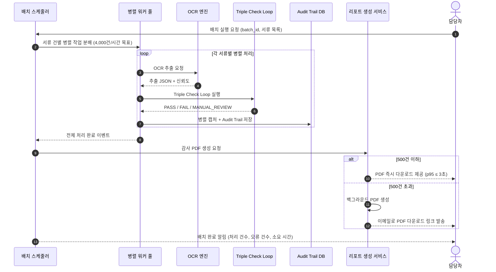
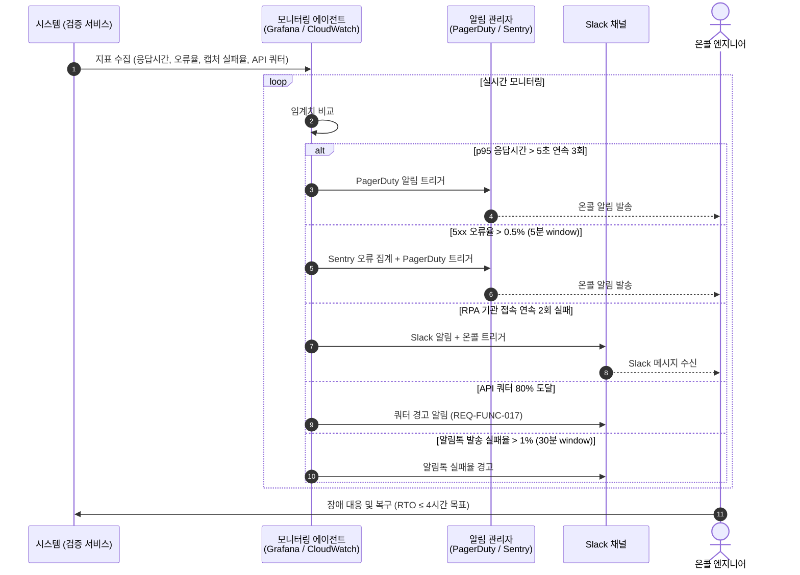

# Software Requirements Specification (SRS)

**Document ID:** SRS-001  
**Revision:** 1.0  
**Date:** 2026-04-15  
**Standard:** ISO/IEC/IEEE 29148:2018  
**Project:** HR AI 서류 진위확인 솔루션 (HR AI Document Verification Solution)  
**Status:** 초안 (Draft) — 내부 검토 전  
**Prepared by:** Senior Requirements Engineering Team  

---

## 변경 이력 (Revision History)

| 버전 | 날짜 | 작성자 | 변경 내용 |
|---|---|---|---|
| 1.0 | 2026-04-15 | Requirements Team | 최초 작성 — PRD v0.1 기반 SRS 초안 |

---

# 1. Introduction

## 1.1 Purpose (목적)

본 SRS(Software Requirements Specification)는 **HR AI 서류 진위확인 솔루션**의 개발을 위한 공식 요구사항 기준 문서이다. 대한민국 채용 시장에서 구조적으로 고착화된 수기 기반 서류 검증의 근본 한계를 해결하기 위해, OCR 기반 텍스트 추출, 공공 API/RPA 연동 기관 실시간 조회, 병렬 캡처 기반 Audit Trail 자동 생성, 그리고 카카오알림톡 Self-Service 루프를 통한 민원 자동화를 핵심 기능으로 정의한다.

본 문서의 목적은 다음과 같다:
1. 제품 개발팀이 구현해야 할 기능·비기능 요구사항의 완전하고 명확하며 검증 가능한 기준을 제공한다.
2. 이해관계자(고객·법무·개발·QA·운영) 간 기준 문서(Source of Truth)로서 모든 검토 및 승인의 기반을 제공한다.
3. ISO/IEC/IEEE 29148:2018 표준에 완전히 준수하는 추적 가능한 요구사항 체계를 수립한다.

> **현황 Pain 기준선 (PRD §1 기반)**
> - 수기 검증: 4,000건 공채 기준 인건비 900 ~ 1,000만원, 처리 기간 2주
> - 허위 기재 미검출률: 약 20% (구직자 5명 중 1명)
> - 감사 대응 증빙: 수기 기반으로 객관적 로그 제출 불가 (피해 사례 34건 이상 징계·수사)
> - 담당자 민원 전화 비중: 업무의 70 ~ 90% 점유

---

## 1.2 Scope (범위)

### In-Scope (MVP 포함 범위)

| # | 항목 | 설명 |
|---|---|---|
| IS-01 | OCR 추출 엔진 | PDF/JPG/PNG 형식의 학위증명서·자격증·경력증명서 텍스트 추출 |
| IS-02 | 공공 API/RPA 기관 조회 | 정부24 / HRDK API 연동 기반 실시간 진위확인 |
| IS-03 | 병렬 캡처 + Audit Trail | 원본-조회본 병렬 캡처 + 타임스탬프 기반 불변 Audit Trail 생성 |
| IS-04 | 감사 PDF 리포트 자동 생성 | 감사원 제출용 PDF 리포트 자동 생성 |
| IS-05 | Triple Check Loop | 입력값 / OCR 추출값 / 기관 DB 3중 대조 검증 |
| IS-06 | Human-in-the-loop UI | AI 결과 + 담당자 최종 승인 UI (Sprint 2 ~ 3) |
| IS-07 | 카카오알림톡 Self-Service 루프 | 불일치 감지 → 자동 발송 → 지원자 재제출 (Sprint 2 ~ 3) |
| IS-08 | 이미지 전처리 엔진 | 저화질/기울어진 이미지 보정 알고리즘 (Sprint 2 ~ 3) |
| IS-09 | 외부 ATS REST API 연동 | 플랫폼 파트너 플러그인 연동 (Phase 2) |
| IS-10 | 배치 처리 스케줄러 | 대량 서류 자동 병렬 처리 (Phase 2) |
| IS-11 | 불일치 신뢰도 점수 대시보드 | 시각화 대시보드 (Phase 2) |

### Out-of-Scope (현재 미포함)

| # | 항목 | 이유/계획 |
|---|---|---|
| OS-01 | 해외 학위 검증 모듈 | Phase 3 대상 |
| OS-02 | 블록체인/DID 기반 증명 연동 | Phase 3 대상 |
| OS-03 | 금융 대출 서류(소득금액증명원 등) 특화 모듈 | Adjacent 시장, Phase 2 검토 |
| OS-04 | 모바일 앱 | Web 전용 MVP, 추후 검토 |
| OS-05 | 채용 플랫폼 독자 구축 | API First 전략 유지 |

---

## 1.3 Definitions, Acronyms, Abbreviations (정의, 약어, 약칭)

| 용어 / 약어 | 정의 |
|---|---|
| **SRS** | Software Requirements Specification — 소프트웨어 요구사항 명세서 |
| **PRD** | Product Requirements Document — 제품 요구사항 문서 |
| **OCR** | Optical Character Recognition — 광학 문자 인식 |
| **RPA** | Robotic Process Automation — 로봇 프로세스 자동화. 웹 브라우저 조작을 통해 공공기관 사이트를 자동으로 조회·캡처함 |
| **Audit Trail** | 서류 검증 시점의 모든 처리 이력(캡처 이미지, 타임스탬프, 조회 결과)을 불변 상태로 기록하는 감사 추적 로그 |
| **Triple Check Loop** | 지원자 입력값 → OCR 추출값 → 발급기관 API/RPA 조회값의 3단계 교차 검증 프로세스 |
| **Parallel Capture** | 원본 서류 이미지와 기관 조회 결과 화면을 단일 프레임에 나란히 캡처하는 기능 |
| **Human-in-the-loop** | AI 검증 결과를 최종 확정하기 전에 담당자가 개입·승인하는 설계 원칙 |
| **Self-Service Loop** | 서류 불일치 감지 시 지원자에게 카카오알림톡을 자동 발송하고, 지원자가 직접 재제출하는 자동화 루프 |
| **ATS** | Applicant Tracking System — 채용 관리 시스템 |
| **HRBP** | Human Resources Business Partner — 인사 전략 파트너 |
| **HRDK** | 한국산업인력공단 (Human Resources Development Service of Korea) |
| **AOS** | Adjusted Opportunity Score — 기회 중요도와 현재 충족도를 결합한 우선순위 점수 (높을수록 고우선) |
| **DOS** | Discovered Opportunity Score — 실제 인터뷰·조사를 통해 발굴된 기회 점수 |
| **JTBD** | Jobs to be Done — 사용자가 솔루션을 통해 달성하고자 하는 핵심 목표 프레임워크 |
| **MoSCoW** | Must / Should / Could / Won't — 기능 우선순위 분류 체계 |
| **SLO** | Service Level Objective — 서비스 수준 목표 |
| **SLA** | Service Level Agreement — 서비스 수준 계약 |
| **RBAC** | Role-Based Access Control — 역할 기반 접근 제어 |
| **p95** | 95번째 백분위수 응답 시간 — 전체 요청의 95%가 해당 시간 이내에 완료됨을 의미 |
| **RPO** | Recovery Point Objective — 복구 목표 시점 (허용 가능한 최대 데이터 손실 시간) |
| **RTO** | Recovery Time Objective — 복구 목표 시간 (허용 가능한 최대 서비스 중단 시간) |
| **ISMS-P** | 개인정보보호 관리체계 인증 (Information Security Management System — Personal information) |
| **CSAP** | 클라우드 보안 인증 (Cloud Security Assurance Program) |
| **False Negative (FN)** | 실제 위조 서류를 시스템이 정상으로 판정하는 오류 (미검출) |
| **ADR** | Architecture Decision Record — 아키텍처 결정 기록 |
| **VPS** | Value Proposition Sheet — 가치 제안 시트 (내부 리서치 자료) |
| **B2G** | Business to Government — 기업 대 정부 거래 모델 |
| **Base64** | 바이너리 데이터를 ASCII 문자열로 인코딩하는 방식 (API 파일 전송 시 사용) |
| **JWT** | JSON Web Token — API 인증에 사용되는 토큰 기반 표준 |

---

## 1.4 References (참고 문헌)

| REF-ID | 문서명 / 출처 | 비고 |
|---|---|---|
| **REF-01** | PRD-HR-AI-Verification-v0.1.md | 본 SRS의 유일한 비즈니스/기능 요구 원천 (Source of Truth) |
| **REF-02** | ISO/IEC/IEEE 29148:2018 — Systems and software engineering: Life cycle processes — Requirements engineering | 본 SRS 준수 표준 |
| **REF-03** | 감사원 2024 공공기관 채용 실태 전수조사 보고서 | 채용 비위 832건 근거 [예정 확보] |
| **REF-04** | 채용절차의 공정화에 관한 법률 (채용절차법) | 감사 로그 5년 보존 법적 근거 |
| **REF-05** | 국가인권위원회 채용 실태 조사 | 구직자 20% 허위 기재 근거 |
| **REF-06** | Claude-Value-ProPosition-Sheet.md (VPS 원문) | VPS 5-1, 5-2, 6-4, 9-1, 9-2 데이터 인용 |
| **REF-07** | JTBD 심층 인터뷰 결과 (n=30, 공공기관 PM + HR팀장 + 노무사) | [예정] PoC 완료 후 확보 |
| **REF-08** | 정부24 오픈API 연동 가이드 | 공공 API 연동 기술 규격 |
| **REF-09** | 한국산업인력공단(HRDK) API 가이드 | 자격증 검증 API 규격 |
| **REF-10** | 카카오 알림톡 API 가이드 (Kakao Business) | 알림톡 연동 기술 규격 |
| **REF-11** | ISMS-P 인증 기준 (개인정보보호위원회 / KISA) | 보안 컴플라이언스 기준 |

---

## 1.5 Constraints and Assumptions (제약사항 및 가정)

### 아키텍처 제약 (ADR 기반)

| ADR-ID | 결정 사항 | 근거 / 제약 내용 |
|---|---|---|
| ADR-001 | **API 우선 연동 원칙** — RPA는 API 부재 기관에만 보조 적용 | 기관 사이트 구조 변경(분기 1회 이상) 시 RPA 중단 리스크. API 연동 우선, 기관 사이트 변경 감지 자동 알림 + 72시간 내 복구 SLA 의무화 |
| ADR-002 | **Human-in-the-loop 설계 의무화** — AI 결과는 경고+증거 제공자로 역할 한정 | AI 오판 시 법적 배상 책임 리스크. 최종 승인권은 반드시 인간(담당자)에게 위임 |
| ADR-003 | **API 쿼터 모니터링 및 폴백 설계** | 공공 API 일일 무료 호출 한도 존재. 쿼터 80% 도달 시 알림, 상용 대안 API 계약 검토 |
| ADR-004 | **개인정보 최소 수집 원칙 + AES-256/TLS 1.3 의무화** | 개인정보 유출 시 개인정보보호법 위반 최고 리스크. ISMS-P 인증 Phase 2 추진 |
| ADR-005 | **OCR 신뢰도 임계치 기반 자동 큐 이관** | OCR 신뢰도 < 80% 건 자동 수동 큐 이관, 이미지 전처리 엔진 내재화 |

### 가정 (Assumptions)

| 유형 | 내용 |
|---|---|
| 가정-01 | 핵심 타겟 기관(공공기관)의 정부24/HRDK API 연동 승인이 MVP 출시(2026-06) 전 완료된다 |
| 가정-02 | 카카오 알림톡 템플릿 심사는 개발 착수 후 2주 이내 승인된다 |
| 가정-03 | ISMS-P 인증은 Phase 2 출시(2026-07) 전까지 완료되며, 이전에는 내부 보안 정책으로 운영한다 |
| 가정-04 | PoC 파트너 채용 대행사 3곳이 Phase 1 실험(2026-05 ~ 06) 착수 전에 확보된다 |

### 의존성 (Dependencies)

| 의존성-ID | 내용 | 책임 주체 |
|---|---|---|
| DEP-01 | 정부24 오픈API 연동 계약 및 테스트 환경 제공 | GTM / Legal-Tech 팀 |
| DEP-02 | HRDK API 연동 계약 및 테스트 환경 제공 | GTM / Legal-Tech 팀 |
| DEP-03 | 카카오 비즈니스 채널 등록 및 알림톡 발신번호 사전 등록 | 운영 팀 |
| DEP-04 | PoC 파트너사 3곳 계약 체결 (Phase 1 실험 기반) | GTM 팀 |

---

# 2. Stakeholders (이해관계자)

| 역할 (Role) | 대표 페르소나 | 책임 (Responsibility) | 관심사 (Interest) | Story 연계 |
|---|---|---|---|---|
| **공공기관 채용 PM** | 김철수 (38세, 연간 5,000명 공채 관리) | 서류 검증 전 과정 총괄, 감사 대응 책임자 | 병렬 캡처 기반 면책권 리포트 자동 생성; 감사원 제출 즉시 활용 가능한 증거 체계 | Story-1 |
| **채용 대행사 팀장** | 박지민 (42세, 수익률 1% 저마진 운영) | 서류 수집·검증·결과 납품 PL 역할, 고객사 클레임 대응 | 인건비 50% 절감; 오류율 제로; 민원 전화 업무 90% 자동화 | Story-2, Story-3 |
| **핀테크 HRBP** | 이현우 (35세, 수시 대규모 경력직 채용) | 채용 의사결정 지원, 4대보험 이력 위조 리스크 관리 | Triple Check Loop로 위조 원천 차단; 담당자 공수 제로 UX | Story-2 |
| **대기업 법무관** | 최유진 (40세, 부당해고 소송 대응) | 채용 서류 법적 증거력 확보 | Audit Trail + 타임스탬프 캡처가 법원 제출 가능한 증거로 인정받는 것 | Story-1 |
| **ATS 플랫폼 PO** | 정성훈 (33세, B2B SaaS 차별화) | 외부 검증 엔진 API 연동 기획 및 배포 | API First 검증 엔진 탑재; 공공 API RPA 직접 개발 비용 零 | Story-4 |
| **긴급 채용 PM** | 홍길동 (50세, 3일 내 1,000명 검증) | 단기간 대량 서류 처리 | 저화질 이미지 보정 OCR; 병렬 배치 처리 4,000건/시간 | Story-2 |
| **시스템 관리자** | — | 시스템 운영, 접근 권한 관리, 감사 로그 관리 | RBAC 기반 접근 제어; PagerDuty 알림 수신; SLA 모니터링 | — |
| **감사자 (Auditor)** | — | 감사 로그 열람, 이의 제기 검토 | 불변 Audit Trail 즉시 조회; 접근 로그 5년 보존 | Story-1 |
| **API 연동 파트너** | ATS 플랫폼 개발팀 | SDK 활용 API 연동 개발 | REST API 안정성 ≥ 99.9%; 명확한 문서·Sandbox 제공 | Story-4 |

---

# 3. System Context and Interfaces

## 3.1 External Systems (외부 시스템)

| 시스템 명 | 연동 유형 | 역할 | 제약사항 |
|---|---|---|---|
| **정부24 오픈API** | Outbound REST API | 학위증명서·행정서류 진위확인 | 1일 무료 호출 한도; 기관 서비스 점검 시간대 단절 가능 |
| **HRDK(한국산업인력공단) API** | Outbound REST API | 자격증 유효 여부·취득일 확인 | OAuth 2.0 인증 필요; 점검 시간 존재 |
| **카카오 알림톡 API** | Outbound REST API | 불일치 감지 시 지원자 자동 알림 발송 | 발신번호 사전 등록 필수; 템플릿 심사 최대 3일 소요 |
| **기관 사이트 (RPA 대상)** | Outbound RPA (브라우저 자동화) | API 미제공 기관의 진위확인 대체 수단 | 사이트 구조 변경 시 72시간 내 복구 SLA 의무화 (ADR-001) |
| **이메일 시스템 (SMTP/API)** | Outbound | 대용량 배치 리포트 완료 알림, 비상 알림 발송 | 내부 SMTP 또는 SaaS 이메일 서비스 |
| **SMS 발송 서비스** | Outbound | 알림톡 실패 시 SMS 폴백 발송 | 카카오 알림톡 실패 시 자동 대체 |

## 3.2 Client Applications (클라이언트 애플리케이션)

| 클라이언트 | 유형 | 주요 사용자 | 설명 |
|---|---|---|---|
| **웹 관리 포털** | Web Browser (SPA) | 담당자, 관리자, 감사자 | 서류 업로드, 검증 결과 조회, 감사 리포트 다운로드, RBAC 사용자 관리 |
| **지원자 재제출 웹 페이지** | Web (Mobile-Responsive) | 지원자 (구직자) | 알림톡 링크를 통해 접속하여 수정 서류 재제출 |
| **개발자 포털 (Developer Portal)** | Web Browser | API 파트너 개발자 | SDK, Swagger UI, Sandbox 환경, 샘플 코드 제공 |
| **외부 ATS 플랫폼** | REST API 클라이언트 | 플랫폼 PO 및 개발자 | API를 통해 검증 엔진을 플러그인 형태로 연동 |

## 3.3 API Overview (API 개요)

| API ID | API 명칭 | 방향 | 주요 엔드포인트 (예시) | 입력 | 출력 | 인증 |
|---|---|---|---|---|---|---|
| **API-01** | 검증 요청 API (Inbound) | Inbound | `POST /v1/verifications` | 서류 파일(Base64), 검증 유형, applicant_id | job_id, status, estimated_time | API Key + JWT |
| **API-02** | 검증 결과 조회 API (Inbound) | Inbound | `GET /v1/verifications/{job_id}` | job_id | result(PASS/FAIL/MANUAL_REVIEW), confidence_score, discrepancy_detail, audit_trail_url | API Key + JWT |
| **API-03** | 감사 리포트 다운로드 API (Inbound) | Inbound | `GET /v1/reports/{batch_id}/pdf` | batch_id | PDF 바이너리 스트림 | JWT |
| **API-04** | 정부24 API (Outbound) | Outbound | 정부24 진위확인 엔드포인트 | 문서확인번호, 발급일자 | 진위여부(PASS/FAIL), 발급기관 정보 | 정부24 API 키 |
| **API-05** | HRDK API (Outbound) | Outbound | HRDK 자격증 확인 엔드포인트 | 자격증번호, 생년월일 | 자격증 유효 여부, 취득일 | OAuth 2.0 |
| **API-06** | 카카오 알림톡 API (Outbound) | Outbound | 카카오 비즈메시지 발송 엔드포인트 | 수신번호, 템플릿코드, 변수값 | 발송 성공/실패 코드 | 카카오 Access Token |
| **API-07** | 재제출 웹훅 API (Inbound) | Inbound | `POST /v1/resubmissions` | doc_id, applicant_id, 재제출 파일(Base64) | 재검증 job_id, queue_position | 링크 토큰 (일회용) |

> 상세 엔드포인트·파라미터·응답 코드는 **Appendix 6.1** 참조.

## 3.4 Interaction Sequences — 핵심 시퀀스 다이어그램 (Core Sequence Diagrams)

### Seq-01 | Triple Check Loop 핵심 검증 흐름

### Seq-02 | 감사 PDF 리포트 자동 생성 흐름

### Seq-03 | API First 외부 ATS 연동 흐름

---

# 4. Specific Requirements

## 4.1 Functional Requirements (기능 요구사항)

> **표기 규칙:**
> - **ID:** REQ-FUNC-xxx
> - **Priority:** Must(M) / Should(S) / Could(C) / Won't(W)
> - **Source:** 연계 User Story 및 PRD 기능 항목
> - **AC:** Acceptance Criteria (Given / When / Then 형식)

---

### F1. OCR 추출 엔진 (MoSCoW: Must)

| ID | 요구사항 명칭 | 상세 설명 | Priority | Source |
|---|---|---|---|---|
| REQ-FUNC-001 | 서류 파일 업로드 수신 | 시스템은 PDF, JPG, PNG 형식의 서류 파일을 웹 포털 및 API를 통해 수신해야 한다. 단일 파일의 최대 크기는 20MB 이하이어야 한다. | Must | PRD §4-M1, Story-2 |
| REQ-FUNC-002 | 이미지 전처리 | 시스템은 DPI < 150이거나 기울기 ≥ 5°인 이미지에 대해 자동 보정(회전 보정, 대비 향상, 노이즈 제거)을 적용해야 한다. | Should | PRD §4-S3, Story-3(홍길동) |
| REQ-FUNC-003 | OCR 텍스트 추출 | 시스템은 전처리된 서류 이미지에서 학위·자격증·경력의 핵심 필드(성명, 발급번호, 발급일자, 발급기관명)를 구조화 JSON으로 추출해야 한다. | Must | PRD §4-M1 |
| REQ-FUNC-004 | OCR 신뢰도 점수 산출 | 시스템은 OCR 추출 결과에 대해 0 ~ 100의 신뢰도 점수를 산출하고 추출 결과 JSON에 포함하여 반환해야 한다. | Must | PRD §4-M1, ADR-005 |
| REQ-FUNC-005 | OCR 신뢰도 미달 건 큐 이관 | OCR 신뢰도 점수가 80 미만인 서류는 자동으로 '수동 확인 큐'에 이관되고, 담당자 대시보드에 '이미지 품질 미달' 플래그와 함께 표시되어야 한다. | Must | PRD §7-R05, ADR-005 |

#### REQ-FUNC-003 Acceptance Criteria (AC)

**AC-FUNC-003-01:**
- **Given** 지원자가 학위증명서 JPG 파일을 시스템에 업로드한 상태에서
- **When** OCR 엔진이 이미지를 처리하면
- **Then** 추출된 필드(성명, 발급번호, 발급일자, 발급기관명)가 하나 이상 포함된 구조화 JSON이 반환되어야 하며, 처리 시간은 단일 파일 기준 p95 ≤ 3초이어야 한다.

#### REQ-FUNC-005 Acceptance Criteria (AC)

**AC-FUNC-005-01:**
- **Given** OCR 엔진이 이미지를 처리하여 신뢰도 점수 72를 산출한 상태에서
- **When** 시스템이 신뢰도 임계치(80)와 비교하면
- **Then** 해당 서류는 수동 확인 큐에 이관되고, 담당자 대시보드에 '이미지 품질 미달(신뢰도: 72)' 플래그가 표시되어야 한다.

---

### F2. Triple Check Loop — 3중 대조 검증 (MoSCoW: Must)

| ID | 요구사항 명칭 | 상세 설명 | Priority | Source |
|---|---|---|---|---|
| REQ-FUNC-010 | Triple Check Loop 실행 | 시스템은 서류 검증을 위해 (1) 지원자 입력값, (2) OCR 추출값, (3) 발급기관 API/RPA 조회값의 3단계를 순차 실행하고 각 단계의 일치 여부를 개별적으로 기록해야 한다. | Must | PRD §4-M4, Story-2 |
| REQ-FUNC-011 | 정부24 API 진위확인 연동 | 시스템은 문서확인번호 및 발급일자를 정부24 오픈API에 전송하여 진위 여부(PASS/FAIL)와 발급기관 정보를 수신해야 한다. | Must | PRD §4-M2, §6 |
| REQ-FUNC-012 | HRDK API 자격증 검증 연동 | 시스템은 자격증번호 및 생년월일을 HRDK API에 전송하여 자격증 유효 여부 및 취득일을 수신해야 한다. OAuth 2.0 인증을 사용해야 한다. | Must | PRD §4-M2, §6 |
| REQ-FUNC-013 | API 타임아웃/실패 시 RPA 폴백 | 공공 API 응답 시간이 5초를 초과하거나 응답 실패 2회 연속 발생 시, 시스템은 자동으로 RPA 엔진을 통한 기관 사이트 조회로 전환해야 한다. | Must | PRD §3-Story-2-AC-2, §7-R01 |
| REQ-FUNC-014 | 검증 결과 판정 및 플래그 생성 | Triple Check Loop 3단계 모두 일치 시 '정상(PASS)', 1개 이상 불일치 시 '불일치(FAIL)' 플래그와 함께 불일치 항목 상세를 기록해야 한다. | Must | PRD §3-Story-2-AC-1 |
| REQ-FUNC-015 | 불일치 항목 시각화 | 검증 결과가 '불일치'인 건에 대해 담당자가 상세 화면 조회 시, OCR 추출값과 기관 DB 반환값의 차이를 항목별 하이라이트로 표시하고 불일치 신뢰도 점수(0 ~ 100)를 제공해야 한다. | Must | PRD §3-Story-2-AC-3 |
| REQ-FUNC-016 | 날짜 형식 표준화 | 기관 DB와 OCR 추출값 간 날짜/코드 형식이 상이한 경우(예: YYYYMMDD vs YYYY-MM-DD), 시스템은 자동 표준 변환 후 비교해야 한다. 변환 실패 시 원문을 병기하여 표시해야 한다. | Must | PRD §3-Story-2-AC-3 실패 케이스 |
| REQ-FUNC-017 | API 쿼터 모니터링 | 시스템은 정부24 API의 일일 호출량을 실시간 집계하고, 가용 쿼터의 80% 도달 시 관리자에게 알림(Slack/이메일)을 발송해야 한다. | Must | PRD §7-R03, ADR-003 |

#### REQ-FUNC-014 Acceptance Criteria (AC)

**AC-FUNC-014-01:**
- **Given** 지원자가 자격증 서류를 업로드하고 Triple Check Loop가 실행된 상태에서
- **When** 입력값·OCR 추출값·HRDK API 반환값의 자격증번호가 불일치하면
- **Then** 검증 상태가 'FAIL'로 기록되고, 불일치 항목(자격증번호, OCR값 vs DB값)이 discrepancy_detail에 명시되어야 한다.

**AC-FUNC-014-02:**
- **Given** Triple Check Loop가 실행된 상태에서
- **When** 3단계 모두 일치하면
- **Then** 검증 상태가 'PASS'로 기록되고, confidence_score ≥ 90이 반환되어야 한다.

#### REQ-FUNC-015 Acceptance Criteria (AC)

**AC-FUNC-015-01:**
- **Given** 검증 결과가 'FAIL'인 건이 존재하는 상태에서
- **When** 담당자가 해당 건의 상세 화면을 클릭하면
- **Then** OCR 추출값과 기관 DB 반환값의 차이가 항목별 하이라이트로 표시되고, 불일치 신뢰도 점수(0 ~ 100)가 1초 이내에 화면에 표시되어야 한다.

---

### F3. 병렬 캡처 + Audit Trail 생성 (MoSCoW: Must)

| ID | 요구사항 명칭 | 상세 설명 | Priority | Source |
|---|---|---|---|---|
| REQ-FUNC-020 | 병렬 캡처 실행 | 시스템은 공공 API/RPA를 통한 기관 조회 시 원본 서류 이미지와 기관 조회 결과 화면을 단일 프레임 내에 나란히 캡처하여 저장해야 한다. | Must | PRD §4-M3, Story-1-AC-1 |
| REQ-FUNC-021 | 타임스탬프 기록 | 병렬 캡처 이미지에는 ±1초 이내 정밀도의 UTC 타임스탬프가 메타데이터로 첨부되어야 한다. | Must | PRD §3-Story-1-AC-1 |
| REQ-FUNC-022 | Audit Trail 불변성 보장 | 저장된 Audit Trail(캡처 이미지, 타임스탬프, 조회 결과)은 저장 완료 이후 수정·삭제가 불가능해야 하며, WORM(Write Once Read Many) 스토리지에 저장되어야 한다. | Must | PRD §3-Story-1-AC-3 |
| REQ-FUNC-023 | 접근 로그 자동 기록 | Audit Trail에 대한 모든 열람 접근(접근자 ID, 접근시각, 접근 IP)은 자동으로 기록되어야 한다. | Must | PRD §3-Story-1-AC-3 |
| REQ-FUNC-024 | 무단 수정 시도 차단 및 알림 | Audit Trail에 대한 무단 수정/삭제 시도가 감지되면 즉시 차단되고, 보안 관리자에게 실시간 보안 알림이 발송되어야 한다. | Must | PRD §3-Story-1-AC-3 실패 케이스 |
| REQ-FUNC-025 | 캡처 실패 시 수동 큐 이관 | 기관 사이트 로딩 지연(10초 초과) 등으로 캡처에 실패한 경우, 재시도 2회 후 자동으로 '수동 확인 큐'에 이관되어야 한다. | Must | PRD §3-Story-1-AC-1 실패 케이스 |

#### REQ-FUNC-020 Acceptance Criteria (AC)

**AC-FUNC-020-01:**
- **Given** 시스템이 정부24 API를 통해 기관 조회를 실행하는 상태에서
- **When** 조회 응답이 수신되면
- **Then** 원본 서류 이미지와 기관 조회 결과 화면이 단일 프레임에 나란히 합성된 캡처 이미지가 생성되고 Audit Trail DB에 저장되어야 한다.

**AC-FUNC-022-01:**
- **Given** Audit Trail이 저장 완료된 상태에서
- **When** 관리자 계정으로 저장된 파일에 수정 API를 호출하면
- **Then** HTTP 403 Forbidden이 반환되고 접근 시도 로그가 기록되어야 한다.

---

### F4. 감사 PDF 리포트 자동 생성 (MoSCoW: Must)

| ID | 요구사항 명칭 | 상세 설명 | Priority | Source |
|---|---|---|---|---|
| REQ-FUNC-030 | 감사 리포트 PDF 생성 | 시스템은 채용 회차 전체 검증 완료 후 담당자의 요청에 따라 회차명·검증 일시·건별 결과(PASS/FAIL/MANUAL_REVIEW)·병렬 캡처 이미지를 포함하는 PDF를 자동 생성해야 한다. | Must | PRD §4-M5, Story-1-AC-2 |
| REQ-FUNC-031 | 리포트 항목 완전성 보장 | 생성된 감사 PDF에는 회차명, 검증 일시, 건별 결과, 병렬 캡처 이미지가 누락 없이 포함되어야 하며, 항목 누락률은 0%이어야 한다. | Must | PRD §3-Story-1-AC-2 |
| REQ-FUNC-032 | 대용량 배치 백그라운드 처리 | 500건을 초과하는 배치의 PDF 생성 시, 시스템은 백그라운드에서 비동기 생성 후 담당자에게 이메일로 다운로드 링크를 발송해야 한다. | Must | PRD §3-Story-1-AC-2 실패 케이스 |
| REQ-FUNC-033 | 리포트 다운로드 권한 관리 | 감사 리포트 PDF는 담당자, 관리자, 감사자 역할에만 다운로드 권한이 부여되어야 하며, API 파트너는 audit_trail_url을 통해 개별 건만 접근 가능해야 한다. | Must | PRD §5-RBAC |

#### REQ-FUNC-030 Acceptance Criteria (AC)

**AC-FUNC-030-01:**
- **Given** 채용 회차 전체 검증이 완료된 상태에서
- **When** 담당자가 웹 포털에서 '감사 리포트 다운로드' 버튼을 클릭하면
- **Then** 회차명·검증일시·건별 결과·병렬 캡처 이미지를 포함하는 PDF가 p95 ≤ 3초(500건 이하) 이내에 생성되어 다운로드되어야 한다.

---

### F5. Human-in-the-loop 최종 승인 UI (MoSCoW: Should)

| ID | 요구사항 명칭 | 상세 설명 | Priority | Source |
|---|---|---|---|---|
| REQ-FUNC-040 | 검증 결과 검토 화면 | 시스템은 AI가 산출한 검증 결과(Triple Check Loop 결과, 신뢰도 점수, 불일치 상세)를 담당자가 검토하는 화면을 제공해야 한다. | Should | PRD §4-S2, ADR-002 |
| REQ-FUNC-041 | 담당자 최종 승인/거부 기능 | 담당자는 AI 검증 결과를 검토한 후 '승인(합격)' 또는 '거부(불합격)'를 선택할 수 있어야 한다. 담당자의 결정은 최종 처리 결과로 기록된다. | Should | PRD §4-S2, ADR-002 |
| REQ-FUNC-042 | 담당자 결정 Audit Trail 기록 | 담당자의 승인/거부 결정(담당자 ID, 결정 시각, 결정 사유)은 Audit Trail에 별도로 기록되어야 한다. | Should | PRD §4-S2 |
| REQ-FUNC-043 | MANUAL_REVIEW 큐 관리 | OCR 신뢰도 미달, API 조회 실패, 캡처 실패 건은 MANUAL_REVIEW 큐에 자동 집적되며, 담당자는 큐 조회·처리·완료 상태 변경이 가능해야 한다. | Should | PRD §4-S2, §3 |

#### REQ-FUNC-041 Acceptance Criteria (AC)

**AC-FUNC-041-01:**
- **Given** 담당자가 AI 검증 결과 'FAIL' 건의 상세 화면을 조회한 상태에서
- **When** 담당자가 실제 서류를 검토 후 '승인' 버튼을 클릭하면
- **Then** 해당 건의 최종 결과가 '담당자 승인 완료'로 업데이트되고, 담당자 ID·승인 시각이 Audit Trail에 기록되어야 한다.

---

### F6. Self-Service 알림톡 루프 (MoSCoW: Should)

| ID | 요구사항 명칭 | 상세 설명 | Priority | Source |
|---|---|---|---|---|
| REQ-FUNC-050 | 불일치 감지 후 알림톡 자동 발송 | 시스템은 Triple Check Loop 결과 '불일치' 또는 '서류 미비' 확정 후 3분 이내에 해당 지원자의 등록 연락처로 카카오알림톡을 자동 발송해야 한다. | Should | PRD §3-Story-3-AC-1 |
| REQ-FUNC-051 | SMS 폴백 발송 | 카카오알림톡 발송 실패 시, 시스템은 즉시 SMS 폴백을 통해 동일 내용을 발송해야 한다. | Should | PRD §3-Story-3-AC-1 |
| REQ-FUNC-052 | 연락처 누락 처리 | 지원자의 연락처가 시스템에 등록되지 않은 경우, 담당자 대시보드에 '연락처 없음' 플래그와 수동 안내 요청이 표시되어야 한다. | Should | PRD §3-Story-3-AC-1 실패 케이스 |
| REQ-FUNC-053 | 재제출 링크 생성 및 유효성 관리 | 알림톡에는 72시간 유효한 재제출 링크가 포함되어야 하며, 링크 만료 시 '기간 만료' 안내 페이지가 표시되고 담당자에게 알림이 발송되어야 한다. | Should | PRD §3-Story-3-AC-2 |
| REQ-FUNC-054 | 재제출 서류 자동 재검증 큐 등록 | 지원자가 재제출 링크를 통해 수정 서류를 업로드하면, 해당 서류는 자동으로 재검증 큐에 등록되고 담당자 대시보드에 '재제출 완료' 상태로 업데이트되어야 한다. | Should | PRD §3-Story-3-AC-2 |
| REQ-FUNC-055 | 72시간 내 미응답 지원자 목록 발송 | 알림톡 발송 후 72시간 내에 재제출이 완료되지 않은 지원자 목록이 담당자에게 자동 전송되어야 한다. | Should | PRD §3-Story-3-AC-3 실패 케이스 |
| REQ-FUNC-056 | Self-Service 처리 통계 집계 | 시스템은 채용 회차 종료 후 알림톡 발송 건수·재제출 완료 건수·담당자 수동 개입 건수를 회차별로 자동 집계하여 대시보드에 표시해야 한다. | Should | PRD §3-Story-3-AC-3 |

#### REQ-FUNC-050 Acceptance Criteria (AC)

**AC-FUNC-050-01:**
- **Given** Triple Check Loop 결과 '불일치'가 확정된 상태에서
- **When** 검증 엔진이 결과를 DB에 저장하면
- **Then** 3분 이내에 해당 지원자의 등록 연락처로 카카오알림톡이 발송되어야 하며, 발송 성공/실패 코드가 NOTIFICATION 테이블에 기록되어야 한다.

#### REQ-FUNC-054 Acceptance Criteria (AC)

**AC-FUNC-054-01:**
- **Given** 지원자가 72시간 유효 재제출 링크를 통해 수정된 서류를 업로드한 상태에서
- **When** 업로드가 완료되면
- **Then** 재제출 서류가 5분 이내에 재검증 큐에 등록되고, 담당자 대시보드의 해당 건 상태가 '재제출 완료'로 업데이트되어야 한다.

---

### F7. REST API 외부 연동 (MoSCoW: Could)

| ID | 요구사항 명칭 | 상세 설명 | Priority | Source |
|---|---|---|---|---|
| REQ-FUNC-060 | 검증 요청 API 제공 | 시스템은 외부 ATS 플랫폼이 서류(Base64 인코딩)와 검증 유형을 POST 요청으로 제출할 수 있는 REST API를 제공해야 한다. | Could | PRD §4-C1, Story-4-AC-1 |
| REQ-FUNC-061 | 검증 결과 JSON 반환 | API 응답은 JSON 형식으로 result(PASS/FAIL/MANUAL_REVIEW), confidence_score, discrepancy_detail, audit_trail_url을 포함해야 한다. | Could | PRD §3-Story-4-AC-1 |
| REQ-FUNC-062 | API Key 인증 처리 | API Gateway는 Authorization 헤더의 API Key를 검증하여 유효한 Key에만 처리를 허용하고, 무효/만료 Key는 HTTP 401을 반환해야 한다. | Could | PRD §3-Story-4-AC-2 |
| REQ-FUNC-063 | Rate Limit 적용 | 동일 API Key의 분당 1,000건 초과 요청은 HTTP 429(Too Many Requests)와 Retry-After 헤더를 반환해야 한다. 동시에 관리자에게 자동 알림이 발송되어야 한다. | Could | PRD §3-Story-4-AC-2 |
| REQ-FUNC-064 | SDK 및 개발자 포털 제공 | 시스템은 Python, Java, Node.js SDK, Swagger UI, 샘플 코드, Sandbox 환경을 개발자 포털에서 제공해야 한다. | Could | PRD §3-Story-4-AC-3 |
| REQ-FUNC-065 | API 문서 최신화 | API 스펙 변경 시 개발자 포털 문서는 7일 이내에 최신화되어야 한다. SDK 버그 발견 시 48시간 이내에 패치 릴리즈가 이루어져야 한다. | Could | PRD §3-Story-4-AC-3 |

#### REQ-FUNC-061 Acceptance Criteria (AC)

**AC-FUNC-061-01:**
- **Given** ATS 플랫폼이 유효한 API Key와 서류(Base64) 및 검증 유형을 POST `/v1/verifications`로 요청한 상태에서
- **When** 검증 엔진이 처리를 완료하면
- **Then** `{"result": "PASS|FAIL|MANUAL_REVIEW", "confidence_score": 0-100, "discrepancy_detail": {...}, "audit_trail_url": "https://..."}` 형식의 JSON이 p95 ≤ 10초 이내에 반환되어야 한다.

---

### F8. 배치 처리 및 대량 검증 (MoSCoW: Could)

| ID | 요구사항 명칭 | 상세 설명 | Priority | Source |
|---|---|---|---|---|
| REQ-FUNC-070 | 대량 배치 처리 실행 | 시스템은 채용 회차 단위로 대량 서류(최대 4,000건)를 병렬 처리하는 배치 스케줄러를 제공해야 한다. | Could | PRD §4-C2, §5-성능 |
| REQ-FUNC-071 | 배치 처리 진행 현황 제공 | 배치 처리 중 담당자는 웹 포털에서 전체 건수·완료 건수·처리 중 건수·오류 건수를 실시간으로 조회할 수 있어야 한다. | Could | PRD §4-C2 |
| REQ-FUNC-072 | 배치 완료 알림 | 배치 처리 완료 시 담당자에게 이메일 및 시스템 알림이 자동 발송되어야 한다. | Could | PRD §4-C2 |

---

## 4.2 Non-Functional Requirements (비기능 요구사항)

> **표기 규칙:** ID: REQ-NF-xxx

---

### 성능 (Performance)

| ID | 요구사항 명칭 | 측정 기준 (SLO) | 측정 방법 | Source |
|---|---|---|---|---|
| REQ-NF-001 | 단일 서류 검증 E2E 응답 시간 | 공공 API 포함 E2E 기준 p95 ≤ 5초 | APM 응답 시간 백분위 집계 | PRD §5-성능, Story-2-AC-2, KPI-1 |
| REQ-NF-002 | OCR 추출 처리 시간 | 단일 파일 기준 p95 ≤ 3초 | OCR 엔진 처리 시간 로그 | PRD §4-M1 |
| REQ-NF-003 | 감사 PDF 생성 시간 (소량) | 500건 이하 기준 p95 ≤ 3초 | 리포트 생성 시작 ~ 완료 타임스탬프 차이 | PRD §5-성능, Story-1-AC-2 |
| REQ-NF-004 | 카카오알림톡 발송 지연 | 불일치 감지 후 ≤ 3분 | 검증 결과 저장 시각 vs 발송 완료 시각 차이 | PRD §5-성능, Story-3-AC-1 |
| REQ-NF-005 | 외부 API (ATS 연동) 응답 시간 | p95 ≤ 10초 | API Gateway 응답 시간 백분위 집계 | PRD §5-성능, Story-4-AC-1 |
| REQ-NF-006 | 대량 배치 처리 처리량 | ≥ 4,000건/시간 (병렬 처리 기준) | 배치 완료 로그 (시작 ~ 종료 시각, 총 처리 건수) | PRD §5-성능, KPI-1 |
| REQ-NF-007 | API Key 인증 처리 시간 | ≤ 100ms | API Gateway 인증 처리 시간 로그 | PRD §3-Story-4-AC-2 |
| REQ-NF-008 | Sandbox 환경 응답 시간 | ≤ 3초 | Sandbox 환경 API 응답 시간 측정 | PRD §3-Story-4-AC-3 |
| REQ-NF-009 | 불일치 항목 시각화 응답 | ≤ 1초 | 상세 화면 로드 완료 시간 측정 | PRD §3-Story-2-AC-3 |
| REQ-NF-010 | Self-Service 통계 리포트 생성 | ≤ 10초 | 회차 종료 후 통계 집계 완료 시간 측정 | PRD §3-Story-3-AC-3 |

---

### 신뢰성 / 가용성 (Reliability / Availability)

| ID | 요구사항 명칭 | 측정 기준 (SLO) | 측정 방법 | Source |
|---|---|---|---|---|
| REQ-NF-020 | 서비스 가용성 (SLA) | ≥ 99.5% (월간 기준, ≤ 3.6시간/월 다운타임) | Uptime 모니터링 (Pingdom / CloudWatch) | PRD §5-신뢰성 |
| REQ-NF-021 | 외부 API (ATS 연동) 가용성 | ≥ 99.9% (월간 기준) | API Gateway 가용성 모니터링 | PRD §3-Story-4-AC-1 |
| REQ-NF-022 | 전체 검증 오류율 | ≤ 0.5% (전체 검증 요청 대비 HTTP 5xx) | HTTP 5xx 응답 비율 집계 (Sentry) | PRD §5-신뢰성 |
| REQ-NF-023 | 병렬 캡처 성공률 | ≥ 99.5% (배치당 n ≥ 100건 기준) | 배치별 캡처 실패 건수 카운트 | PRD §5-신뢰성, Story-1-AC-1 |
| REQ-NF-024 | 공공 API 응답 성공률 | ≥ 99% | API 호출 성공/실패 로그 집계 | PRD §3-Story-2-AC-2 |
| REQ-NF-025 | 알림톡 발송 성공률 | ≥ 99% | 카카오 API 응답 코드 집계 | PRD §3-Story-3-AC-1, §5-모니터링 |
| REQ-NF-026 | RPA 스크립트 복구 SLA | 기관 사이트 변경 감지 후 ≤ 72시간 내 복구 | 변경 감지 알림 수신 시각 vs 복구 완료 배포 시각 | PRD §5-신뢰성, ADR-001 |
| REQ-NF-027 | RPO (복구 목표 시점) | ≤ 1시간 (마지막 백업 이후 허용 데이터 손실) | 백업 주기 설정 및 검증 | 운영 요구사항 |
| REQ-NF-028 | RTO (복구 목표 시간) | ≤ 4시간 (장애 발생 후 서비스 복구) | 장애 발생 시각 vs 서비스 복구 완료 시각 | 운영 요구사항 |

---

### 정확도 / 품질 (Accuracy / Quality)

| ID | 요구사항 명칭 | 측정 기준 (SLO) | 측정 방법 | Source |
|---|---|---|---|---|
| REQ-NF-030 | Triple Check Loop 검증 정확도 | Precision ≥ 95% | 위조 샘플 100건 블라인드 테스트 (분기별) | PRD §5-성능, KPI-4, Story-2-AC-1 |
| REQ-NF-031 | False Negative (위조 미검출) 율 | < 1% | 위조 샘플 블라인드 테스트 결과 집계 | PRD §3-Story-2-AC-1 |
| REQ-NF-032 | Audit Trail 자동 생성 완료율 | ≥ 99% (북극성 KPI) | 검증 완료 건 중 Audit Trail 정상 저장 건 비율 | PRD §1-북극성 KPI |
| REQ-NF-033 | 병렬 캡처 타임스탬프 정밀도 | ± 1초 이내 | 캡처 메타데이터 타임스탬프 vs NTP 서버 시각 비교 | PRD §3-Story-1-AC-1 |
| REQ-NF-034 | 감사 PDF 항목 누락률 | 0% | PDF 생성 후 항목 검증 자동화 테스트 | PRD §3-Story-1-AC-2 |
| REQ-NF-035 | Audit Trail 변조 시도 차단율 | 100% | 침투 테스트 (분기별) | PRD §3-Story-1-AC-3 |
| REQ-NF-036 | API 응답 포맷 스펙 준수율 | 100% | 자동화 API 계약 테스트 (Contract Testing) | PRD §3-Story-4-AC-1 |

---

### 보안 / 개인정보 (Security / Privacy)

| ID | 요구사항 명칭 | 측정 기준 | Source |
|---|---|---|---|
| REQ-NF-040 | API 인증 체계 | API Key + JWT 이중 인증 의무화; JWT 세션 만료 ≤ 8시간 | PRD §5-보안 |
| REQ-NF-041 | 저장 데이터 암호화 | 모든 서류 파일, Audit Trail, 개인정보는 AES-256으로 암호화하여 저장 | PRD §5-보안, ADR-004 |
| REQ-NF-042 | 전송 데이터 암호화 | 모든 API 통신은 TLS 1.3 이상을 적용 | PRD §5-보안 |
| REQ-NF-043 | 개인정보 마스킹 | 성명은 '홍○○' 형식, 주민번호는 '9**-*****' 형식으로 화면에 표시 | PRD §5-보안 |
| REQ-NF-044 | RBAC 접근 제어 | 담당자 / 관리자 / 감사자 / API 파트너 4단계 역할 분리 적용; 각 역할별 접근 가능 리소스 명시 | PRD §5-보안 |
| REQ-NF-045 | 감사 로그 보존 기간 | ≥ 5년 (채용절차법 준수) | PRD §5-보안, REF-04 |
| REQ-NF-046 | ISMS-P 인증 | Phase 2 출시(2026-07) 전 인증 취득 목표 | PRD §5-보안 |
| REQ-NF-047 | CSAP 인증 | Phase 3 (B2G 시장 진입, 2026-10) 전 인증 취득 목표 | PRD §5-보안 |
| REQ-NF-048 | Unauthorized 접근 실시간 알림 | Audit Trail 무단 수정/삭제 시도 감지 시 보안 관리자에게 즉시 알림 | PRD §3-Story-1-AC-3 |

---

### 운영 / 모니터링 (Operations / Monitoring)

| ID | 요구사항 명칭 | 알림 기준 | 모니터링 도구 | Source |
|---|---|---|---|---|
| REQ-NF-050 | API 응답 시간 알림 | p95 > 5초 연속 3회 발생 시 온콜 알림 | Grafana / CloudWatch + PagerDuty | PRD §5-모니터링 |
| REQ-NF-051 | 오류율 알림 | 5xx 에러율 > 0.5% (5분 window) 시 PagerDuty 트리거 | Sentry + PagerDuty | PRD §5-모니터링 |
| REQ-NF-052 | 병렬 캡처 실패율 알림 | 배치 단위 캡처 실패율 > 0.5% 시 알림 | 자체 배치 모니터링 로그 | PRD §5-모니터링 |
| REQ-NF-053 | RPA 기관 접속 실패 알림 | 연속 2회 실패 시 Slack 알림 + 온콜 트리거 | 자체 RPA 모니터링 | PRD §5-모니터링 |
| REQ-NF-054 | 알림톡 발송 실패율 알림 | > 1% (30분 window) 시 알림 | 카카오 API 응답 코드 집계 | PRD §5-모니터링 |
| REQ-NF-055 | 공공 API 쿼터 경고 알림 | 일일 가용 쿼터 80% 도달 시 Slack/이메일 알림 | API 호출량 집계 대시보드 | PRD §7-R03, ADR-003, REQ-FUNC-017 |
| REQ-NF-056 | Audit Trail 북극성 KPI 주간 집계 | Audit Trail 자동 생성 완료율이 99% 미달 시 알림 | 배치 완료 후 자동 집계 (주 1회) | PRD §1-북극성 KPI |

---

### 확장성 / 유지보수성 (Scalability / Maintainability)

| ID | 요구사항 명칭 | 기준 | Source |
|---|---|---|---|
| REQ-NF-060 | 수평 확장 설계 | 검증 서비스 및 OCR 엔진은 컨테이너 기반 수평 확장(Scale-Out)을 지원해야 하며, 배치 처리량 ≥ 4,000건/시간을 유지해야 한다. | PRD §5-성능, §4-C2 |
| REQ-NF-061 | 기관별 RPA 스크립트 분리 | 각 공공기관의 RPA 스크립트는 독립 모듈로 관리되어, 단일 기관 사이트 변경이 다른 기관 검증에 영향을 미치지 않아야 한다. | PRD §7-R01, ADR-001 |
| REQ-NF-062 | API 버전 관리 | 외부 연동 API는 버전 관리(URI 버전: `/v1/`, `/v2/`)를 적용하여 하위 호환성을 최소 2개 버전 동안 유지해야 한다. | PRD §4-C1 |
| REQ-NF-063 | 코드 테스트 커버리지 | 단위 테스트 커버리지 ≥ 80%, Triple Check Loop 로직은 ≥ 95% | 개발 품질 기준 |
| REQ-NF-064 | OCR 모델 갱신 주기 | OCR 모델 재학습 및 갱신은 분기별 수행, 신뢰도 임계치(80) 재조정은 반기별 검토 | PRD §7-R05, ADR-005 |

---

### 비용 (Cost Efficiency)

| ID | 요구사항 명칭 | 기준 | Source |
|---|---|---|---|
| REQ-NF-070 | 건당 검증 비용 | ≤ 1,250원/건 (4,000건 기준 총 비용 ≤ 500만원) — 목표 50% 절감 | PRD §1-목표, KPI-2, §8-Exp-3 |
| REQ-NF-071 | 북극성 KPI 비용 추적 | 배치 처리 완료 후 총 비용(API 호출비 + 인프라비 + 인건비 환산)을 자동 산출하여 대시보드에 표시해야 한다. | PRD §1-KPI-2 |

---

# 5. Traceability Matrix (추적성 매트릭스)

> **범례:** ✅ 직접 매핑 | 〇 간접 관련

| Story / PRD 기능 | REQ-FUNC ID | REQ-NF ID | Test Case ID (예시) |
|---|---|---|---|
| **Story-1** (Audit Trail 기반 법적 면책권) | REQ-FUNC-020, 021, 022, 023, 024, 025, 030, 031, 032, 033 | REQ-NF-032, 033, 034, 035, 045 | TC-S1-001 ~ 010 |
| **Story-2** (Triple Check Loop 기반 무오성 검증) | REQ-FUNC-010, 011, 012, 013, 014, 015, 016, 017 | REQ-NF-001, 030, 031 | TC-S2-001 ~ 010 |
| **Story-3** (Self-Service 알림톡 루프) | REQ-FUNC-050, 051, 052, 053, 054, 055, 056 | REQ-NF-004, 025, 010 | TC-S3-001 ~ 008 |
| **Story-4** (API First 플랫폼 연동) | REQ-FUNC-060, 061, 062, 063, 064, 065 | REQ-NF-005, 021, 007, 036 | TC-S4-001 ~ 008 |
| **PRD F1** (OCR 추출 엔진 — Must) | REQ-FUNC-001, 002, 003, 004, 005 | REQ-NF-002 | TC-F1-001 ~ 006 |
| **PRD F2** (공공 API/RPA 조회 — Must) | REQ-FUNC-011, 012, 013, 017 | REQ-NF-001, 024, 026 | TC-F2-001 ~ 006 |
| **PRD F3** (병렬 캡처 + Audit Trail — Must) | REQ-FUNC-020, 021, 022, 023, 024, 025 | REQ-NF-023, 033, 035 | TC-F3-001 ~ 006 |
| **PRD F4** (Triple Check Loop — Must) | REQ-FUNC-010, 014, 015, 016 | REQ-NF-030, 031 | TC-F4-001 ~ 005 |
| **PRD F5** (감사 PDF 리포트 — Must) | REQ-FUNC-030, 031, 032, 033 | REQ-NF-003, 034 | TC-F5-001 ~ 004 |
| **PRD S2** (Human-in-the-loop UI — Should) | REQ-FUNC-040, 041, 042, 043 | REQ-NF-044 | TC-S2UI-001 ~ 004 |
| **PRD S3** (이미지 전처리 — Should) | REQ-FUNC-002 | REQ-NF-002 | TC-S3IMG-001 ~ 003 |
| **PRD C1** (REST API 외부 연동 — Could) | REQ-FUNC-060 ~ 065 | REQ-NF-005, 021, 036, 062 | TC-C1-001 ~ 008 |
| **PRD C2** (배치 처리 스케줄러 — Could) | REQ-FUNC-070, 071, 072 | REQ-NF-006, 060 | TC-C2-001 ~ 004 |
| **KPI-1** (서류 처리 속도 ≥ 4,000건/시간) | REQ-FUNC-070 | REQ-NF-006 | TC-KPI1-001 |
| **KPI-2** (인건비 절감 ≤ 500만원) | — | REQ-NF-070, 071 | TC-KPI2-001 |
| **KPI-3** (민원 전화 감소 ≤ 10%) | REQ-FUNC-050 ~ 056 | REQ-NF-004, 025 | TC-KPI3-001 |
| **KPI-4** (허위 서류 검출 ≥ 95%) | REQ-FUNC-010, 014 | REQ-NF-030, 031 | TC-KPI4-001 |
| **KPI-5** (감사 리포트 자동 생성 100%) | REQ-FUNC-030, 031 | REQ-NF-032, 034 | TC-KPI5-001 |
| **북극성 KPI** (Audit Trail 완료율 ≥ 99%) | REQ-FUNC-020, 021, 022 | REQ-NF-032, 056 | TC-NS-001 |

---

# 6. Appendix

## 6.1 API Endpoint List (API 엔드포인트 목록)

### Inbound API (외부 → 시스템)

| Method | Endpoint | 설명 | 인증 | 주요 요청 파라미터 | 주요 응답 필드 | HTTP 상태코드 |
|---|---|---|---|---|---|---|
| POST | `/v1/verifications` | 단일 서류 검증 요청 | API Key + JWT | `applicant_id`, `doc_type`, `file_base64`, `verification_type` | `job_id`, `status`, `estimated_time_sec` | 202, 400, 401, 422, 429 |
| GET | `/v1/verifications/{job_id}` | 검증 결과 조회 | API Key + JWT | — | `result`, `confidence_score`, `discrepancy_detail`, `audit_trail_url`, `verified_at` | 200, 202(처리중), 401, 404 |
| POST | `/v1/verifications/batch` | 배치 검증 요청 | API Key + JWT | `batch_id`, `items[]` (applicant_id + file_base64 배열) | `batch_id`, `total_count`, `queued_at` | 202, 400, 401, 422 |
| GET | `/v1/verifications/batch/{batch_id}` | 배치 진행 현황 조회 | JWT | — | `total`, `completed`, `failed`, `in_progress`, `estimated_completion` | 200, 401, 404 |
| GET | `/v1/reports/{batch_id}/pdf` | 감사 리포트 PDF 다운로드 | JWT (담당자 이상) | — | PDF 바이너리 스트림 | 200, 202(생성중), 401, 403, 404 |
| POST | `/v1/resubmissions` | 지원자 재제출 서류 업로드 | 링크 토큰 (일회용) | `doc_id`, `applicant_id`, `file_base64` | `new_job_id`, `queue_position` | 200, 400, 401(만료), 422 |
| GET | `/v1/audit-trails/{trail_id}` | 개별 Audit Trail 조회 | JWT | — | `trail_id`, `parallel_capture_url`, `timestamp`, `viewer_log` | 200, 401, 403, 404 |
| GET | `/v1/notifications/stats` | Self-Service 통계 조회 | JWT | `batch_id` | `sent_count`, `resubmit_count`, `manual_count`, `self_service_rate` | 200, 401 |

### 오류 응답 코드 표준

| HTTP 코드 | 의미 | 발생 조건 |
|---|---|---|
| 400 | Bad Request | 필수 파라미터 누락 |
| 401 | Unauthorized | 유효하지 않거나 만료된 API Key/JWT |
| 403 | Forbidden | 권한 부족 (RBAC 위반) |
| 404 | Not Found | 존재하지 않는 job_id / batch_id |
| 422 | Unprocessable Entity | 요청 포맷 오류 (파일 형식 불일치 등) |
| 429 | Too Many Requests | Rate Limit 초과 (Retry-After 헤더 포함) |
| 500 | Internal Server Error | 시스템 내부 오류 |
| 503 | Service Unavailable | 외부 API 점검/장애 |

---

## 6.2 Entity & Data Model (엔터티 및 데이터 모델)

### 테이블 정의

#### APPLICANT (지원자)

| 컬럼명 | 데이터 타입 | 제약조건 | 설명 |
|---|---|---|---|
| `applicant_id` | VARCHAR(36) | PK, NOT NULL | UUID 형식 고유 식별자 |
| `name_masked` | VARCHAR(50) | NOT NULL | 마스킹된 성명 (예: 홍○○) |
| `phone_masked` | VARCHAR(20) | NOT NULL | 마스킹된 연락처 (예: 010-****-1234) |
| `email` | VARCHAR(100) | UNIQUE | 이메일 주소 |
| `batch_id` | VARCHAR(36) | FK → BATCH | 소속 채용 회차 ID |
| `created_at` | DATETIME | NOT NULL | 지원자 등록 일시 (UTC) |

#### DOCUMENT (서류)

| 컬럼명 | 데이터 타입 | 제약조건 | 설명 |
|---|---|---|---|
| `doc_id` | VARCHAR(36) | PK, NOT NULL | UUID 형식 고유 식별자 |
| `applicant_id` | VARCHAR(36) | FK → APPLICANT | 지원자 ID |
| `doc_type` | VARCHAR(50) | NOT NULL | 서류 유형 (DEGREE / CERTIFICATE / CAREER) |
| `raw_file_path` | VARCHAR(500) | NOT NULL | 원본 파일 암호화 저장 경로 (AES-256) |
| `ocr_extracted_json` | TEXT | | OCR 추출 구조화 필드 JSON |
| `ocr_confidence_score` | FLOAT(5,2) | CHECK(0 ~ 100) | OCR 신뢰도 점수 (0 ~ 100) |
| `file_format` | VARCHAR(10) | NOT NULL | 파일 형식 (PDF / JPG / PNG) |
| `uploaded_at` | DATETIME | NOT NULL | 업로드 일시 (UTC) |

#### VERIFICATION_JOB (검증 작업)

| 컬럼명 | 데이터 타입 | 제약조건 | 설명 |
|---|---|---|---|
| `job_id` | VARCHAR(36) | PK, NOT NULL | UUID 형식 고유 식별자 |
| `doc_id` | VARCHAR(36) | FK → DOCUMENT | 대상 서류 ID |
| `check_layer` | VARCHAR(20) | NOT NULL | 검증 레이어 (INPUT / OCR / AGENCY) |
| `status` | VARCHAR(30) | NOT NULL | 검증 상태 (PASS / FAIL / MANUAL_REVIEW / IN_PROGRESS) |
| `agency_api_response` | TEXT | | 기관 API 원문 응답 JSON |
| `discrepancy_detail` | TEXT | | 불일치 항목 상세 JSON |
| `confidence_score` | FLOAT(5,2) | CHECK(0 ~ 100) | 최종 검증 신뢰도 점수 |
| `rpa_used` | BOOLEAN | DEFAULT false | RPA 폴백 사용 여부 |
| `verified_at` | DATETIME | NOT NULL | 검증 완료 일시 (UTC) |
| `reviewer_id` | VARCHAR(36) | FK → USER | 담당자 최종 승인자 ID (Human-in-the-loop) |
| `reviewed_at` | DATETIME | | 담당자 검토 완료 일시 |

#### AUDIT_TRAIL (감사 추적)

| 컬럼명 | 데이터 타입 | 제약조건 | 설명 |
|---|---|---|---|
| `trail_id` | VARCHAR(36) | PK, NOT NULL | UUID 형식 고유 식별자 |
| `job_id` | VARCHAR(36) | FK → VERIFICATION_JOB | 연계 검증 작업 ID |
| `parallel_capture_path` | VARCHAR(500) | NOT NULL | 병렬 캡처 이미지 저장 경로 (WORM 스토리지) |
| `timestamp_hash` | VARCHAR(256) | NOT NULL | 타임스탬프 무결성 해시 (SHA-256) |
| `capture_timestamp` | DATETIME(3) | NOT NULL | 캡처 시각 (UTC, 밀리초 정밀도) |
| `viewer_log` | TEXT | | 접근 로그 JSON 배열 (접근자 ID, 접근 시각, IP) |
| `is_immutable` | BOOLEAN | NOT NULL, DEFAULT true | 불변성 플래그 (항상 true, 수정 불가) |
| `created_at` | DATETIME | NOT NULL | Audit Trail 생성 일시 (UTC) |
| `retention_until` | DATE | NOT NULL | 보존 만료일 (created_at + 5년) |

#### NOTIFICATION (알림)

| 컬럼명 | 데이터 타입 | 제약조건 | 설명 |
|---|---|---|---|
| `noti_id` | VARCHAR(36) | PK, NOT NULL | UUID 형식 고유 식별자 |
| `applicant_id` | VARCHAR(36) | FK → APPLICANT | 수신자 지원자 ID |
| `job_id` | VARCHAR(36) | FK → VERIFICATION_JOB | 연계 검증 작업 ID |
| `channel` | VARCHAR(20) | NOT NULL | 발송 채널 (KAKAO_TALK / SMS / EMAIL) |
| `status` | VARCHAR(20) | NOT NULL | 발송 상태 (SENT / FAILED / PENDING) |
| `resubmit_link` | VARCHAR(500) | | 재제출 링크 URL |
| `resubmit_token` | VARCHAR(256) | UNIQUE | 일회용 재제출 링크 토큰 |
| `sent_at` | DATETIME | | 실제 발송 완료 일시 (UTC) |
| `expired_at` | DATETIME | NOT NULL | 재제출 링크 만료 일시 (sent_at + 72시간) |
| `created_at` | DATETIME | NOT NULL | 알림 생성 일시 (UTC) |

#### REPORT (리포트)

| 컬럼명 | 데이터 타입 | 제약조건 | 설명 |
|---|---|---|---|
| `report_id` | VARCHAR(36) | PK, NOT NULL | UUID 형식 고유 식별자 |
| `batch_id` | VARCHAR(36) | FK → BATCH | 채용 회차 배치 ID |
| `pdf_path` | VARCHAR(500) | | PDF 파일 저장 경로 |
| `status` | VARCHAR(20) | NOT NULL | 생성 상태 (GENERATING / COMPLETED / FAILED) |
| `generated_by` | VARCHAR(36) | FK → USER | 생성 요청 담당자 ID |
| `generated_at` | DATETIME | | PDF 생성 완료 일시 (UTC) |
| `total_count` | INTEGER | | 포함된 검증 건수 |
| `is_background` | BOOLEAN | DEFAULT false | 백그라운드 처리 여부 (500건 초과 시 true) |

#### BATCH (채용 회차)

| 컬럼명 | 데이터 타입 | 제약조건 | 설명 |
|---|---|---|---|
| `batch_id` | VARCHAR(36) | PK, NOT NULL | UUID 형식 고유 식별자 |
| `batch_name` | VARCHAR(200) | NOT NULL | 채용 회차명 (예: 2026년 상반기 공채) |
| `organization_id` | VARCHAR(36) | FK → ORGANIZATION | 발주 기관/기업 ID |
| `total_applicants` | INTEGER | | 총 지원자 수 |
| `status` | VARCHAR(20) | NOT NULL | 회차 상태 (OPEN / IN_PROGRESS / COMPLETED) |
| `started_at` | DATETIME | | 검증 시작 일시 |
| `completed_at` | DATETIME | | 검증 완료 일시 |

### 엔터티 관계도 (ERD 요약)

---

## 6.3 Detailed Interaction Models (상세 상호작용 모델)

### Seq-D01 | OCR 추출 상세 흐름 (이미지 전처리 포함)

### Seq-D02 | Self-Service 알림톡 루프 상세 흐름

### Seq-D03 | Human-in-the-loop 최종 승인 상세 흐름

### Seq-D04 | 배치 대량 처리 상세 흐름

### Seq-D05 | 모니터링 및 알림 처리 흐름

---

## 6.4 Validation Plan (검증 계획)

### PRD §8 실험 계획 → SRS 검증 계획 매핑

| 실험 ID | 검증 항목 | 설계 방법 | 측정 지표 | 성공 기준 | 연계 REQ-NF |
|---|---|---|---|---|---|
| **Exp-1** | 병렬 캡처 기반 면책권 체감도 | A/B 테스트 n=각 50명 (공공기관 담당자) | 감사 대응 자신감 점수 (Likert 5점), 리포트 다운로드 횟수 | A그룹 평균 ≥ B그룹 + 1.0점 (95% 신뢰구간) | REQ-NF-032, 034 |
| **Exp-2** | Self-Service 루프 민원 감소 효과 | Before-After 비교 (동일 기관, 동일 규모) | 담당자 수동 전화 건수, Self-Service 처리율(%), 재제출 완료 소요시간(시간) | 수동 개입 ≥ 90% 감소, 재제출 완료율 ≥ 85% | REQ-NF-004, 025 |
| **Exp-3** | 처리 속도 및 비용 절감 PoC | PoC n=3 기관, 1,000 ~ 2,000건 실제 배치 | 전체 처리 시간(분), 건당 비용(원), 불일치 자동 감지율(%) | 시간 ≤ 60분/4,000건, 비용 ≤ 500만원, 감지율 ≥ 95% | REQ-NF-006, 070 |
| **Exp-4** | Triple Check Loop 정확도 | 위조 샘플 100건 블라인드 테스트 | 검출 결과 vs 실제 정답 비교 | 검출률 ≥ 95%, False Negative < 1% | REQ-NF-030, 031 |

### 경쟁 대안 대비 벤치마크 목표

| 비교 항목 | 단순 OCR 솔루션 (기준) | 본 솔루션 SRS 목표 | 연계 REQ-NF |
|---|---|---|---|
| 허위 서류 검출률 | ≤ 70% | ≥ 95% | REQ-NF-030 |
| 처리 속도 (4,000건) | 5 ~ 7일 | ≤ 1시간 (배치) | REQ-NF-006 |
| 건당 비용 | 약 2,500원 | ≤ 1,250원 | REQ-NF-070 |
| 감사 리포트 생성 | 수동 2 ~ 4시간 | 자동 ≤ 3초 (500건 이하) | REQ-NF-003 |
| 법적 증빙력 | 텍스트 데이터 | 병렬 캡처 이미지 (Audit Trail) | REQ-NF-032, 035 |

---

*문서 끝 (End of Document)*

---
**Document ID:** SRS-001 | **Revision:** 1.0 | **Date:** 2026-04-15 | **Standard:** ISO/IEC/IEEE 29148:2018
