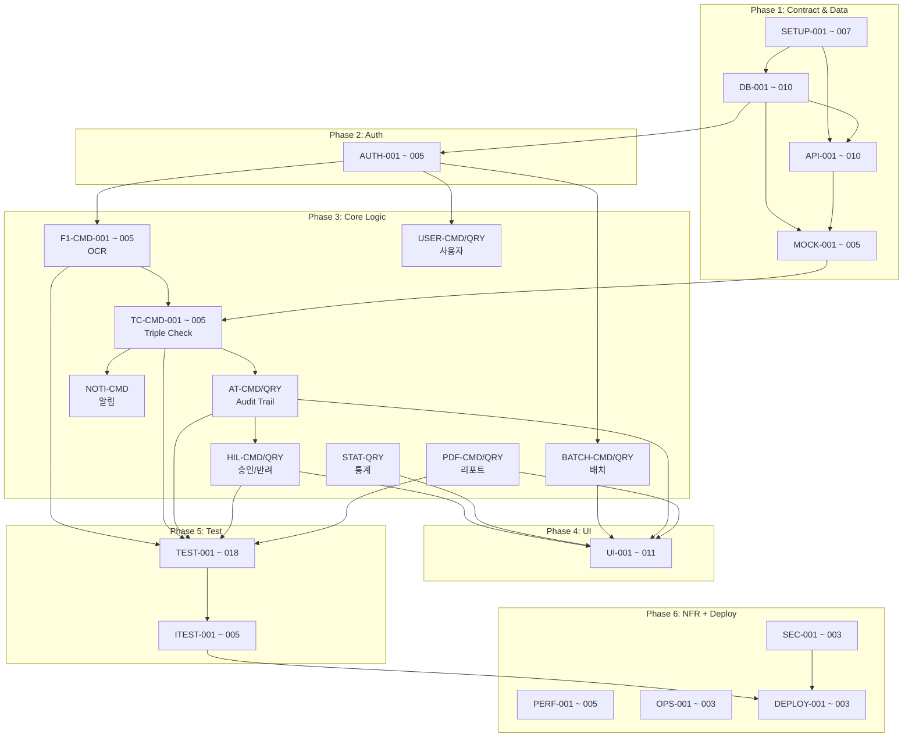

# HR AI 서류 진위확인 솔루션 — 개발 태스크 명세서 v1.0

**Source:** SRS-HR-AI-Verification-v1.0.md (v0.3)  
**Generated:** 2026-04-18  
**Tech Stack:** Next.js App Router · Supabase · Prisma · Gemini API (Vercel AI SDK) · Tailwind CSS · shadcn/ui · pdf-lib · Resend · Vercel  
**방법론:** Contract-First → CQRS Split → AC-to-Test → NFR Mapping

---

## 목차

1. [Step 1. 계약·데이터 명세 (Contract & Data)](#step-1-계약데이터-명세)
2. [Step 2. 로직·상태 변경 (Logic & Mutation — CQRS)](#step-2-로직상태-변경)
3. [Step 3. 테스트 (AC → Test Code)](#step-3-테스트)
4. [Step 4. 비기능·인프라 (NFR & Infra)](#step-4-비기능인프라)
5. [전체 태스크 요약 테이블](#전체-태스크-요약-테이블)
6. [의존성 그래프](#의존성-그래프)
7. [SRS 역추적 매트릭스](#srs-역추적-매트릭스)

---

## Step 1. 계약·데이터 명세

> **목적:** 단일 진실 공급원(SSOT)을 먼저 확립. DB 스키마·API DTO·Mock 데이터를 최우선 도출.

### Epic-01: 프로젝트 초기 세팅 (Project Bootstrap)

| Task ID | Feature (기능명) | 관련 SRS 섹션 | 선행 태스크 | 복잡도 |
|---|---|---|---|---|
| SETUP-001 | Next.js App Router 프로젝트 생성 + TypeScript 설정 | §2.1 C-TEC-001 | None | L |
| SETUP-002 | shadcn/ui + Tailwind CSS 설치 및 디자인 시스템 구성 | §2.1 C-TEC-004 | SETUP-001 | L |
| SETUP-003 | Prisma 설치 + SQLite(로컬 개발) datasource 설정 | §2.1 C-TEC-003 | SETUP-001 | L |
| SETUP-004 | Supabase 프로젝트 생성 + 환경변수 설정 | §2.1 ~ 2.2 C-TEC-003, 007 | SETUP-001 | L |
| SETUP-005 | Vercel AI SDK + Google Gemini API 패키지 설치 | §2.2 C-TEC-005, 006 | SETUP-001 | L |
| SETUP-006 | Resend 패키지 설치 + 환경변수 설정 | §3.6 컴포넌트 정의 | SETUP-001 | L |
| SETUP-007 | pdf-lib 패키지 설치 | §2.3 스택 선택 이유 | SETUP-001 | L |

---

### Epic-02: 데이터베이스 스키마 (Database Schema — SSOT)

| Task ID | Feature (기능명) | 관련 SRS 섹션 | 선행 태스크 | 복잡도 |
|---|---|---|---|---|
| DB-001 | Enum 타입 6종 일괄 정의 (UserRole, UserStatus, BatchStatus, DocType, CheckLayer, JobStatus) | §3.8 L583-597 | SETUP-003 | L |
| DB-002 | User 모델 정의 (8필드 + 3관계) | §3.8 ERD+Prisma L446-461 | DB-001 | M |
| DB-003 | Batch 모델 정의 (7필드 + 3관계) | §3.8 L463-477 | DB-002 | M |
| DB-004 | Applicant 모델 정의 (5필드 + 3관계) | §3.8 L479-492 | DB-003 | M |
| DB-005 | Document 모델 정의 (7필드 + 2관계, JSON→Text 호환) | §3.8 L494-509 | DB-004 | M |
| DB-006 | VerificationJob 모델 정의 (13필드 + 4관계, 8상태 Enum) | §3.8 L511-532 | DB-005, DB-002 | H |
| DB-007 | AuditTrail 모델 정의 (8필드 + 1:1관계, SHA-256 해시) | §3.8 L534-548 | DB-006 | M |
| DB-008 | Notification 모델 정의 (10필드 + 2관계) | §3.8 L550-566 | DB-004, DB-006 | M |
| DB-009 | Report 모델 정의 (6필드 + 2관계) | §3.8 L568-581 | DB-003, DB-002 | M |
| DB-010 | Prisma 마이그레이션 실행 (SQLite 로컬) + 검증 | §2.1 C-TEC-003 | DB-001 ~ 009 | M |

---

### Epic-03: API 통신 계약 (API Contract — DTO & Error Code)

| Task ID | Feature (기능명) | 관련 SRS 섹션 | 선행 태스크 | 복잡도 |
|---|---|---|---|---|
| API-001 | 공통 에러 응답 인터페이스 + HTTP 상태 코드 상수 정의 (400/401/403/404/422/500) | §3.7 오류 응답 표준 | None | M |
| API-002 | `POST /api/verifications` Request/Response DTO 타입 정의 | §3.7 Inbound API, Seq-01 | DB-006, DB-005 | M |
| API-003 | `GET /api/verifications/[job_id]` Response DTO 타입 정의 | §3.7 Inbound API | DB-006, DB-007 | M |
| API-004 | `POST /api/verifications/[job_id]/approve` Request/Response DTO 정의 | §3.7 Inbound API | DB-006 | L |
| API-005 | `GET /api/reports/[batch_id]/pdf` Response 타입 정의 | §3.7 Inbound API | DB-009 | L |
| API-006 | `GET /api/dashboard/stats` Request/Response DTO 정의 | §3.7 Inbound API | DB-006 | L |
| API-007 | Gemini Vision OCR 요청/응답 Zod 스키마 정의 (성명·발급번호·발급일자·발급기관명·confidence) | §3.13 F1 REQ-FUNC-002, §3.12 | DB-005 | M |
| API-008 | 정부24 API 요청/응답 인터페이스 정의 (문서확인번호·발급일자 → verified·issuer_info) | §3.13 F2 REQ-FUNC-011, §3.12 | None | M |
| API-009 | HRDK API Mock 응답 인터페이스 정의 (certNum·birthDate → valid·cert_info) | §3.13 F2 REQ-FUNC-012 | None | L |
| API-010 | Resend 이메일 페이로드 인터페이스 정의 (마스킹 이름·서류유형·불일치항목·대시보드링크) | §3.13 F6 REQ-FUNC-051 | None | L |

---

### Epic-04: Mock 데이터 및 Seed (Mock & Seed Data)

| Task ID | Feature (기능명) | 관련 SRS 섹션 | 선행 태스크 | 복잡도 |
|---|---|---|---|---|
| MOCK-001 | `mockAgencyResponse(docType)` — 정부24 Mock 함수 (성공/실패 고정값 + "향후 실제 연동" 주석) | §1.2, REQ-FUNC-011 | API-008 | L |
| MOCK-002 | `mockHrdkResponse(certNum)` — HRDK Mock 함수 (유효/무효 고정값 + mock_used=true) | §1.2, REQ-FUNC-012 | API-009 | L |
| MOCK-003 | Mock RPA 캡처 응답 함수 (placeholder 이미지 URL 반환) | §1.2 | None | L |
| MOCK-004 | Mock 카카오 알림톡 함수 (console.log + 대시보드 텍스트) | §1.2 | None | L |
| MOCK-005 | Prisma Seed 스크립트 (User 3역할 + Batch 1건 + Applicant 5명 + Document 5건) | §3.8 ERD 전체 | DB-010 | M |

---

## Step 2. 로직·상태 변경

> **목적:** Read(Query) / Write(Command) 분리. 에이전트가 하나의 목적에만 집중하도록 격리.

### Epic-05: 인증·인가 (Auth & RBAC)

| Task ID | Feature (기능명) | 관련 SRS 섹션 | 선행 태스크 | 복잡도 |
|---|---|---|---|---|
| AUTH-001 | [Command] Supabase Auth 이메일/패스워드 회원가입 Server Action | §3.14 REQ-NF-020 | DB-002, SETUP-004 | M |
| AUTH-002 | [Command] Supabase Auth 로그인 Server Action (JWT 세션) | §3.14 REQ-NF-020 | AUTH-001 | M |
| AUTH-003 | [Command] Google OAuth 로그인 플로우 (Supabase Auth Provider) | §3.14 REQ-NF-020 | AUTH-001 | M |
| AUTH-004 | [Infra] Next.js Middleware — 세션 검증 + RBAC 역할 검사 (OPERATOR/ADMIN/AUDITOR) | §3.10, §3.14 REQ-NF-024 | AUTH-002, DB-001 | H |
| AUTH-005 | [Infra] Supabase RLS 정책 설정 — 테이블별 Row-Level Security | §3.14 REQ-NF-024 | DB-010, AUTH-001 | H |

---

### Epic-06: 서류 업로드 및 OCR (F1)

| Task ID | Feature (기능명) | 관련 SRS 섹션 | 선행 태스크 | 복잡도 |
|---|---|---|---|---|
| F1-CMD-001 | [Command] 파일 형식·크기 유효성 검증 (PDF/JPG/PNG만, 20MB 제한, 위반 시 422) | REQ-FUNC-005, §3.7 오류 422 | API-001 | L |
| F1-CMD-002 | [Command] 서류 파일 업로드 Server Action — Supabase Storage 저장 + DOCUMENT 레코드 생성 | REQ-FUNC-001, Seq-01 Step 1 ~ 2 | DB-005, SETUP-004, AUTH-004 | M |
| F1-CMD-003 | [Command] Gemini Vision OCR Server Action — `generateObject()` 호출, 구조화 JSON 추출 | REQ-FUNC-002, Seq-01 Step 3 ~ 5 | SETUP-005, API-007, F1-CMD-002 | H |
| F1-CMD-004 | [Command] OCR 결과 DB 저장 — ocr_extracted_json + ocr_confidence_score 업데이트 | REQ-FUNC-003, Seq-01 Step 6 | F1-CMD-003 | L |
| F1-CMD-005 | [Command] OCR 신뢰도 임계치 분기 — <70 시 MANUAL_REVIEW 생성 + 대시보드 플래그 | REQ-FUNC-004, ADR-005 | F1-CMD-004, DB-006 | M |

---

### Epic-07: Triple Check Loop (F2/F4)

| Task ID | Feature (기능명) | 관련 SRS 섹션 | 선행 태스크 | 복잡도 |
|---|---|---|---|---|
| TC-CMD-001 | [Command] Layer 1 — 지원자 입력값 vs OCR 추출값 비교 (compareInputVsOcr) | REQ-FUNC-010, Seq-01 Layer 1 | F1-CMD-004, DB-006 | M |
| TC-CMD-002 | [Command] Layer 2 — OCR vs 정부24 API 조회 (10초 타임아웃 → Mock 자동 대체 + mock_used) | REQ-FUNC-011, Seq-01 Layer 2 | MOCK-001, API-008, TC-CMD-001 | H |
| TC-CMD-003 | [Command] Layer 2 (HRDK) — 자격증 Mock 검증 + mock_used=true | REQ-FUNC-012 | MOCK-002, API-009, TC-CMD-001 | M |
| TC-CMD-004 | [Command] Layer 3 — 최종 판정 (모두 일치→PASS, 1개+ 불일치→FAIL + discrepancy_detail JSON) | REQ-FUNC-013, Seq-01 Layer 3 | TC-CMD-001, TC-CMD-002 | H |
| TC-CMD-005 | [Command] Triple Check 오케스트레이터 — `executeTripleCheck(docId)` 순차 실행 + 상태 업데이트 | REQ-FUNC-010, §3.12 VerificationService | TC-CMD-001 ~ 004, F1-CMD-005 | H |

---

### Epic-08: Audit Trail (F3)

| Task ID | Feature (기능명) | 관련 SRS 섹션 | 선행 태스크 | 복잡도 |
|---|---|---|---|---|
| AT-CMD-001 | [Command] Audit Trail 자동 생성 — SHA-256 hash + is_immutable + retention_until(+5년) | REQ-FUNC-020, 023, Seq-01 Step 16 | TC-CMD-005, DB-007 | M |
| AT-CMD-002 | [Command] 논리적 불변성 — 삭제/수정 API 미노출, 시도 시 HTTP 403 반환 | REQ-FUNC-021, ADR-006, REQ-NF-026 | AT-CMD-001 | M |
| AT-QRY-001 | [Query] Audit Trail 열람 + viewer_log 자동 갱신 ({userId, timestamp} append) | REQ-FUNC-022 | AT-CMD-001 | M |
| AT-QRY-002 | [Query] 감사자(AUDITOR) 전용 Audit Trail 목록 조회 (읽기 전용) | §3.11 UC08, REQ-NF-024 | AT-CMD-001, AUTH-004 | L |

---

### Epic-09: Human-in-the-loop 승인/반려 (F5)

| Task ID | Feature (기능명) | 관련 SRS 섹션 | 선행 태스크 | 복잡도 |
|---|---|---|---|---|
| HIL-CMD-001 | [Command] 승인 Server Action — APPROVED + reviewer_id + reviewed_at + viewer_log 기록 | REQ-FUNC-031, Seq-02 승인 | DB-006, AT-CMD-001, AUTH-004 | M |
| HIL-CMD-002 | [Command] 반려 Server Action — 사유 필수 검증, REJECTED + decision_reason 저장 | REQ-FUNC-032, Seq-02 반려 | DB-006, AUTH-004 | M |
| HIL-QRY-001 | [Query] FAIL/MANUAL_REVIEW 건 목록 조회 (대시보드 SWR polling용) | REQ-FUNC-030, Seq-02 Step 1 | DB-006, TC-CMD-005 | M |
| HIL-QRY-002 | [Query] 불일치 상세 조회 — OCR vs 기관 DB 항목별 비교 데이터 (2초 이내 로드) | REQ-FUNC-014, Seq-02 Step 3 | DB-006, DB-005 | M |
| HIL-QRY-003 | [Query] MANUAL_REVIEW 큐 목록 조회 — 수동 처리 대기 건 필터링 | REQ-FUNC-033 | DB-006 | L |

---

### Epic-10: PDF 리포트 (F6)

| Task ID | Feature (기능명) | 관련 SRS 섹션 | 선행 태스크 | 복잡도 |
|---|---|---|---|---|
| PDF-CMD-001 | [Command] PDF 생성 Server Action — pdf-lib 동기 처리 (100건 이하) | REQ-FUNC-040, Seq-03 | SETUP-007, DB-009, DB-006 | H |
| PDF-CMD-002 | [Command] PDF 레이아웃 구성 — 회차명·검증일시·건별 결과·mock_used '(Mock)' 표기 | REQ-FUNC-042 | PDF-CMD-001 | H |
| PDF-CMD-003 | [Command] REPORT 레코드 생성 — status=COMPLETED, pdf_path, total_count | §3.8 Report | PDF-CMD-001, DB-009 | L |
| PDF-QRY-001 | [Query] PDF 다운로드 Route Handler — PDF Buffer 스트림 반환 | §3.7, Seq-03 Step 8 ~ 9 | PDF-CMD-001, AUTH-004 | M |

---

### Epic-11: 이메일 알림 (F7)

| Task ID | Feature (기능명) | 관련 SRS 섹션 | 선행 태스크 | 복잡도 |
|---|---|---|---|---|
| NOTI-CMD-001 | [Command] FAIL 시 Resend 이메일 발송 (마스킹 이름·서류유형·불일치항목·대시보드링크) | REQ-FUNC-050, 051, Seq-01 FAIL 분기 | SETUP-006, API-010, TC-CMD-004 | M |
| NOTI-CMD-002 | [Command] 이메일 실패 시 대시보드 알림 텍스트 대체 + NOTIFICATION 레코드 생성 | REQ-FUNC-050 | NOTI-CMD-001, DB-008 | L |

---

### Epic-12: 대시보드 통계 (F9)

| Task ID | Feature (기능명) | 관련 SRS 섹션 | 선행 태스크 | 복잡도 |
|---|---|---|---|---|
| STAT-QRY-001 | [Query] 통계 Route Handler — 총 건수·PASS·FAIL·MANUAL_REVIEW·Mock 사용 건수 집계 | REQ-FUNC-060 | DB-006, AUTH-004 | M |
| STAT-QRY-002 | [Query] SWR 5초 polling 구성 — useSWR + refreshInterval:5000 | REQ-FUNC-061, ADR-007 | STAT-QRY-001 | L |

---

### Epic-13: 배치·지원자 관리

| Task ID | Feature (기능명) | 관련 SRS 섹션 | 선행 태스크 | 복잡도 |
|---|---|---|---|---|
| BATCH-CMD-001 | [Command] 채용 배치 생성 (batch_name, status=OPEN, created_by) | §3.8 Batch | DB-003, AUTH-004 | L |
| BATCH-CMD-002 | [Command] 지원자 등록 (name_masked, phone_masked, email, batch_id) | §3.8 Applicant | DB-004, BATCH-CMD-001 | L |
| BATCH-CMD-003 | [Command] 배치 상태 변경 (OPEN→IN_PROGRESS→COMPLETED) | §3.8 BatchStatus | BATCH-CMD-001 | L |
| BATCH-QRY-001 | [Query] 배치 목록·상세 조회 (지원자 수, 검증 진행률) | §3.8 Batch-Applicant | DB-003, DB-004 | M |

---

### Epic-14: 사용자 관리

| Task ID | Feature (기능명) | 관련 SRS 섹션 | 선행 태스크 | 복잡도 |
|---|---|---|---|---|
| USER-CMD-001 | [Command] 사용자 역할 변경 (ADMIN 전용, UserRole 변경) | §3.11 UC09 | DB-002, AUTH-004 | M |
| USER-QRY-001 | [Query] 사용자 목록 조회 (ADMIN 전용, 역할·상태 필터) | §3.11 UC09 | DB-002, AUTH-004 | L |

---

### Epic-15: UI 화면 (Frontend Pages)

| Task ID | Feature (기능명) | 관련 SRS 섹션 | 선행 태스크 | 복잡도 |
|---|---|---|---|---|
| UI-001 | 로그인/회원가입 페이지 (이메일/패스워드 + Google OAuth) | §3.6, REQ-NF-020 | AUTH-001 ~ 003 | M |
| UI-002 | 서류 업로드 페이지 (드래그앤드롭 + 지원자·서류유형 선택) | §3.6, REQ-FUNC-001 | F1-CMD-002, SETUP-002 | M |
| UI-003 | 검증 결과 대시보드 (status 색상·confidence 바·SWR polling·플래그) | §3.6, REQ-FUNC-030, 060 | HIL-QRY-001, STAT-QRY-001 ~ 002 | H |
| UI-004 | 불일치 상세 비교 화면 (OCR vs 기관 DB 항목별 하이라이트 Table) | REQ-FUNC-014 | HIL-QRY-002 | M |
| UI-005 | 승인/반려 UI (승인 버튼·반려 Dialog 사유 필수·결과 Toast) | REQ-FUNC-030 ~ 032 | HIL-CMD-001 ~ 002, SETUP-002 | M |
| UI-006 | MANUAL_REVIEW 큐 화면 (수동 처리 대기 목록·상태 변경) | REQ-FUNC-033 | HIL-QRY-003 | M |
| UI-007 | PDF 리포트 다운로드 버튼 (배치 상세에서 클릭 → 브라우저 다운로드) | REQ-FUNC-040 | PDF-QRY-001 | L |
| UI-008 | Audit Trail 열람 화면 (AUDITOR 전용 읽기 전용·viewer_log 표시) | §3.11 UC08, REQ-FUNC-022 | AT-QRY-001 ~ 002 | M |
| UI-009 | 사용자 관리 화면 (ADMIN 전용, 역할 변경 드롭다운) | §3.11 UC09 | USER-CMD-001, USER-QRY-001 | M |
| UI-010 | 개인정보 마스킹 UI 유틸 함수 ('홍○○', '010-****-1234') | REQ-NF-023 | None | L |
| UI-011 | 배치 관리 화면 (생성·지원자 등록·목록·상태 변경) | §3.8 Batch/Applicant | BATCH-CMD-001 ~ 003, BATCH-QRY-001 | M |

---

## Step 3. 테스트

> **목적:** SRS의 AC를 자동화된 테스트 코드 작성 태스크로 변환. "이 테스트가 통과할 때까지 로직을 수정하라."

### Epic-16: 단위 테스트

| Task ID | Feature (기능명) | 관련 AC 근거 | 선행 태스크 | 복잡도 |
|---|---|---|---|---|
| TEST-001 | 파일 업로드 유효성 — .bmp→422, 25MB→422, 15MB JPG→성공 | REQ-FUNC-001, 005 | F1-CMD-001 ~ 002 | M |
| TEST-002 | OCR 결과 구조 검증 — 4개 필드(성명·발급번호·발급일자·발급기관명) JSON 포함 | REQ-FUNC-002 | F1-CMD-003 | M |
| TEST-003 | OCR confidence_score 0 ~ 100 범위 DB 저장 | REQ-FUNC-003 | F1-CMD-004 | L |
| TEST-004 | 신뢰도 <70 → MANUAL_REVIEW 저장 | REQ-FUNC-004 | F1-CMD-005 | M |
| TEST-005 | Triple Check 3단계 순차 실행 + 각 결과 DB 저장 | REQ-FUNC-010 | TC-CMD-005 | H |
| TEST-006 | 정부24 API 10초 타임아웃 → Mock 대체 + mock_used=true | REQ-FUNC-011 | TC-CMD-002 | M |
| TEST-007 | HRDK Mock 응답 + mock_used=true | REQ-FUNC-012 | TC-CMD-003 | L |
| TEST-008 | 최종 판정 — 모두 일치→PASS, 1개 불일치→FAIL+discrepancy JSON | REQ-FUNC-013 | TC-CMD-004 | H |
| TEST-009 | Audit Trail 자동 생성 — capture_file_path·timestamp_hash·is_immutable 3필드 | REQ-FUNC-020 | AT-CMD-001 | M |
| TEST-010 | Audit Trail 삭제 시도 → HTTP 403 + 레코드 유지 | REQ-FUNC-021 | AT-CMD-002 | M |
| TEST-011 | viewer_log 열람 시 {userId, timestamp} 자동 추가 | REQ-FUNC-022 | AT-QRY-001 | M |
| TEST-012 | retention_until = created_at + 1825일 자동 계산 | REQ-FUNC-023 | AT-CMD-001 | L |
| TEST-013 | 승인 → APPROVED + reviewer_id + reviewed_at + viewer_log 기록 | REQ-FUNC-031 | HIL-CMD-001 | M |
| TEST-014 | 반려 사유 빈 값 → 제출 불가; 입력 후 REJECTED + decision_reason | REQ-FUNC-032 | HIL-CMD-002 | M |
| TEST-015 | PDF 내용 — 회차명·검증일시·건별 결과·mock_used '(Mock)' 4항목 포함 | REQ-FUNC-042 | PDF-CMD-002 | M |
| TEST-016 | 이메일 내용 — 마스킹 이름·서류유형·불일치항목·대시보드링크 4항목 | REQ-FUNC-051 | NOTI-CMD-001 | L |
| TEST-017 | 대시보드 통계 5개 지표 (총건수·PASS·FAIL·MANUAL_REVIEW·Mock건수) | REQ-FUNC-060 | STAT-QRY-001 | L |
| TEST-018 | 개인정보 마스킹 — '홍길동'→'홍○○', '010-1234-5678'→'010-****-5678' | REQ-NF-023 | UI-010 | L |

---

### Epic-17: 통합 테스트

| Task ID | Feature (기능명) | 관련 SRS 섹션 | 선행 태스크 | 복잡도 |
|---|---|---|---|---|
| ITEST-001 | E2E: 업로드→OCR→Triple Check→Audit Trail (의도적 불일치→FAIL 확인) | §3.17 Exp-2, Exp-5 | TC-CMD-005, AT-CMD-001 | H |
| ITEST-002 | E2E: 승인/반려→DB 상태 변경→SWR 갱신 | §3.17 Exp-5 | HIL-CMD-001 ~ 002, STAT-QRY-002 | M |
| ITEST-003 | E2E: PDF 생성→다운로드 (10건 배치, Exp-4) | §3.17 Exp-4 | PDF-CMD-001, PDF-QRY-001 | M |
| ITEST-004 | E2E: Audit Trail 불변성 — DELETE API 호출→403 (Exp-3) | §3.17 Exp-3 | AT-CMD-002 | M |
| ITEST-005 | RBAC 접근 제어 통합 — OPERATOR/ADMIN/AUDITOR별 라우트 접근·차단 | REQ-NF-024 | AUTH-004, AUTH-005 | M |

---

## Step 4. 비기능·인프라

> **목적:** 보안·성능·운영 요구사항을 인프라 태스크로 추출 + 전체 의존성 매핑.

### Epic-18: 보안

| Task ID | Feature (기능명) | 관련 SRS 섹션 | 선행 태스크 | 복잡도 |
|---|---|---|---|---|
| SEC-001 | Supabase Storage AES-256 암호화 설정 확인 | REQ-NF-021 | SETUP-004 | L |
| SEC-002 | Vercel HTTPS TLS 1.3 자동 적용 확인 | REQ-NF-022 | SETUP-001 | L |
| SEC-003 | 개인정보 마스킹 파이프라인 — DB 저장 시 name_masked, phone_masked 자동 처리 | REQ-NF-023 | DB-002, DB-004 | M |

---

### Epic-19: 성능 로깅

| Task ID | Feature (기능명) | 관련 SRS 섹션 | 선행 태스크 | 복잡도 |
|---|---|---|---|---|
| PERF-001 | OCR 응답 시간 로깅 (p95 ≤ 20초 기준) | REQ-NF-001 | F1-CMD-003 | L |
| PERF-002 | Triple Check 처리 시간 로깅 (p95 ≤ 30초 기준) | REQ-NF-002 | TC-CMD-005 | L |
| PERF-003 | PDF 생성 시간 로깅 (p95 ≤ 10초, 100건 이하) | REQ-NF-003 | PDF-CMD-001 | L |
| PERF-004 | 대시보드 로드 시간 확인 (p95 ≤ 3초) | REQ-NF-004 | UI-003 | L |
| PERF-005 | 승인/반려 응답 시간 측정 (p95 ≤ 2초) | REQ-NF-005 | HIL-CMD-001 ~ 002 | L |

---

### Epic-20: 운영·모니터링

| Task ID | Feature (기능명) | 관련 SRS 섹션 | 선행 태스크 | 복잡도 |
|---|---|---|---|---|
| OPS-001 | Vercel 오류 로그 모니터링 설정 (5xx ≤ 2%) | REQ-NF-030, 011 | SETUP-001 | L |
| OPS-002 | OCR 실패 시 console.error + 대시보드 에러 표시 | REQ-NF-031 | F1-CMD-003 | L |
| OPS-003 | Mock 사용 현황 대시보드 표시 (mock_used=true 건수) | REQ-NF-032, 012 | STAT-QRY-001 | L |

---

### Epic-21: 배포

| Task ID | Feature (기능명) | 관련 SRS 섹션 | 선행 태스크 | 복잡도 |
|---|---|---|---|---|
| DEPLOY-001 | Vercel 프로젝트 연결 + 환경변수 설정 | §2.2 C-TEC-007 | 전체 개발 완료 | M |
| DEPLOY-002 | Prisma SQLite→Supabase PostgreSQL 전환 마이그레이션 | §2.1 C-TEC-003, ASM-05 | DEPLOY-001, DB-010 | M |
| DEPLOY-003 | Vercel 배포 검증 — git push→자동 배포 + E2E 정상 동작 | §2.2, §3.17 Exp-5 | DEPLOY-002 | M |

---

## 전체 태스크 요약 테이블

| Task ID | Epic (도메인) | Feature (기능명) | 관련 SRS 섹션 | 선행 태스크 (Dependencies) | 복잡도 |
|---|---|---|---|---|---|
| SETUP-001 | Project Bootstrap | Next.js App Router 프로젝트 생성 | §2.1 C-TEC-001 | None | L |
| SETUP-002 | Project Bootstrap | shadcn/ui + Tailwind CSS 설치 | §2.1 C-TEC-004 | SETUP-001 | L |
| SETUP-003 | Project Bootstrap | Prisma + SQLite 설정 | §2.1 C-TEC-003 | SETUP-001 | L |
| SETUP-004 | Project Bootstrap | Supabase 프로젝트 + 환경변수 | §2.1 ~ 2.2 | SETUP-001 | L |
| SETUP-005 | Project Bootstrap | Vercel AI SDK + Gemini API | §2.2 C-TEC-005, 006 | SETUP-001 | L |
| SETUP-006 | Project Bootstrap | Resend 패키지 설치 | §3.6 | SETUP-001 | L |
| SETUP-007 | Project Bootstrap | pdf-lib 패키지 설치 | §2.3 | SETUP-001 | L |
| DB-001 | Database Schema | Enum 타입 6종 정의 | §3.8 L583-597 | SETUP-003 | L |
| DB-002 | Database Schema | User 모델 정의 | §3.8 L446-461 | DB-001 | M |
| DB-003 | Database Schema | Batch 모델 정의 | §3.8 L463-477 | DB-002 | M |
| DB-004 | Database Schema | Applicant 모델 정의 | §3.8 L479-492 | DB-003 | M |
| DB-005 | Database Schema | Document 모델 정의 | §3.8 L494-509 | DB-004 | M |
| DB-006 | Database Schema | VerificationJob 모델 정의 | §3.8 L511-532 | DB-005, DB-002 | H |
| DB-007 | Database Schema | AuditTrail 모델 정의 | §3.8 L534-548 | DB-006 | M |
| DB-008 | Database Schema | Notification 모델 정의 | §3.8 L550-566 | DB-004, DB-006 | M |
| DB-009 | Database Schema | Report 모델 정의 | §3.8 L568-581 | DB-003, DB-002 | M |
| DB-010 | Database Schema | Prisma 마이그레이션 (SQLite) | §2.1 C-TEC-003 | DB-001 ~ 009 | M |
| API-001 | API Contract | 공통 에러 응답 + HTTP 코드 상수 | §3.7 오류 응답 | None | M |
| API-002 | API Contract | POST /api/verifications DTO | §3.7, Seq-01 | DB-006, DB-005 | M |
| API-003 | API Contract | GET /api/verifications/[job_id] DTO | §3.7 | DB-006, DB-007 | M |
| API-004 | API Contract | POST /approve DTO | §3.7 | DB-006 | L |
| API-005 | API Contract | GET /reports/[batch_id]/pdf DTO | §3.7 | DB-009 | L |
| API-006 | API Contract | GET /dashboard/stats DTO | §3.7 | DB-006 | L |
| API-007 | API Contract | Gemini OCR Zod 스키마 | §3.13 F1, §3.12 | DB-005 | M |
| API-008 | API Contract | 정부24 API 인터페이스 | §3.13 F2, §3.12 | None | M |
| API-009 | API Contract | HRDK Mock 인터페이스 | §3.13 F2 | None | L |
| API-010 | API Contract | Resend 이메일 페이로드 | §3.13 F6 | None | L |
| MOCK-001 | Mock & Seed | 정부24 Mock 함수 | §1.2, REQ-FUNC-011 | API-008 | L |
| MOCK-002 | Mock & Seed | HRDK Mock 함수 | §1.2, REQ-FUNC-012 | API-009 | L |
| MOCK-003 | Mock & Seed | RPA 캡처 Mock 함수 | §1.2 | None | L |
| MOCK-004 | Mock & Seed | 카카오 알림톡 Mock 함수 | §1.2 | None | L |
| MOCK-005 | Mock & Seed | Prisma Seed 스크립트 | §3.8 전체 | DB-010 | M |
| AUTH-001 | Auth & RBAC | 이메일/패스워드 회원가입 | REQ-NF-020 | DB-002, SETUP-004 | M |
| AUTH-002 | Auth & RBAC | 로그인 (JWT 세션) | REQ-NF-020 | AUTH-001 | M |
| AUTH-003 | Auth & RBAC | Google OAuth 로그인 | REQ-NF-020 | AUTH-001 | M |
| AUTH-004 | Auth & RBAC | Middleware RBAC 세션 검증 | §3.10, REQ-NF-024 | AUTH-002, DB-001 | H |
| AUTH-005 | Auth & RBAC | Supabase RLS 정책 | REQ-NF-024 | DB-010, AUTH-001 | H |
| F1-CMD-001 | OCR Engine | 파일 형식·크기 유효성 검증 (422) | REQ-FUNC-005 | API-001 | L |
| F1-CMD-002 | OCR Engine | 서류 업로드 + Storage + DOCUMENT 생성 | REQ-FUNC-001 | DB-005, SETUP-004, AUTH-004 | M |
| F1-CMD-003 | OCR Engine | Gemini Vision OCR Server Action | REQ-FUNC-002 | SETUP-005, API-007, F1-CMD-002 | H |
| F1-CMD-004 | OCR Engine | OCR 결과 DB 저장 | REQ-FUNC-003 | F1-CMD-003 | L |
| F1-CMD-005 | OCR Engine | 신뢰도 <70 → MANUAL_REVIEW | REQ-FUNC-004 | F1-CMD-004, DB-006 | M |
| TC-CMD-001 | Triple Check | Layer 1 — 입력값 vs OCR | REQ-FUNC-010 | F1-CMD-004, DB-006 | M |
| TC-CMD-002 | Triple Check | Layer 2 — OCR vs 정부24 (타임아웃→Mock) | REQ-FUNC-011 | MOCK-001, TC-CMD-001 | H |
| TC-CMD-003 | Triple Check | Layer 2 (HRDK) — Mock 검증 | REQ-FUNC-012 | MOCK-002, TC-CMD-001 | M |
| TC-CMD-004 | Triple Check | Layer 3 — 최종 판정 (PASS/FAIL) | REQ-FUNC-013 | TC-CMD-001 ~ 002 | H |
| TC-CMD-005 | Triple Check | 오케스트레이터 executeTripleCheck() | REQ-FUNC-010 | TC-CMD-001 ~ 004, F1-CMD-005 | H |
| AT-CMD-001 | Audit Trail | 자동 생성 (SHA-256 + immutable + retention) | REQ-FUNC-020, 023 | TC-CMD-005, DB-007 | M |
| AT-CMD-002 | Audit Trail | 논리적 불변성 (삭제→403) | REQ-FUNC-021 | AT-CMD-001 | M |
| AT-QRY-001 | Audit Trail | 열람 + viewer_log 갱신 | REQ-FUNC-022 | AT-CMD-001 | M |
| AT-QRY-002 | Audit Trail | AUDITOR 전용 목록 (읽기 전용) | §3.11 UC08 | AT-CMD-001, AUTH-004 | L |
| HIL-CMD-001 | Human-in-the-loop | 승인 (APPROVED + viewer_log) | REQ-FUNC-031 | DB-006, AT-CMD-001, AUTH-004 | M |
| HIL-CMD-002 | Human-in-the-loop | 반려 (사유 필수 + REJECTED) | REQ-FUNC-032 | DB-006, AUTH-004 | M |
| HIL-QRY-001 | Human-in-the-loop | FAIL/MANUAL_REVIEW 목록 조회 | REQ-FUNC-030 | DB-006, TC-CMD-005 | M |
| HIL-QRY-002 | Human-in-the-loop | 불일치 상세 조회 (항목별 비교) | REQ-FUNC-014 | DB-006, DB-005 | M |
| HIL-QRY-003 | Human-in-the-loop | MANUAL_REVIEW 큐 조회 | REQ-FUNC-033 | DB-006 | L |
| PDF-CMD-001 | PDF Report | PDF 생성 (pdf-lib 동기) | REQ-FUNC-040 | SETUP-007, DB-009, DB-006 | H |
| PDF-CMD-002 | PDF Report | PDF 레이아웃 (회차명·결과·mock 표기) | REQ-FUNC-042 | PDF-CMD-001 | H |
| PDF-CMD-003 | PDF Report | REPORT 레코드 생성 | §3.8 Report | PDF-CMD-001, DB-009 | L |
| PDF-QRY-001 | PDF Report | PDF 다운로드 Route Handler | §3.7, Seq-03 | PDF-CMD-001, AUTH-004 | M |
| NOTI-CMD-001 | Email Notification | FAIL→Resend 이메일 발송 | REQ-FUNC-050, 051 | SETUP-006, API-010, TC-CMD-004 | M |
| NOTI-CMD-002 | Email Notification | 이메일 실패→대시보드 알림 대체 | REQ-FUNC-050 | NOTI-CMD-001, DB-008 | L |
| STAT-QRY-001 | Dashboard Stats | 통계 집계 Route Handler | REQ-FUNC-060 | DB-006, AUTH-004 | M |
| STAT-QRY-002 | Dashboard Stats | SWR 5초 polling | REQ-FUNC-061 | STAT-QRY-001 | L |
| BATCH-CMD-001 | Batch Mgmt | 배치 생성 | §3.8 Batch | DB-003, AUTH-004 | L |
| BATCH-CMD-002 | Batch Mgmt | 지원자 등록 | §3.8 Applicant | DB-004, BATCH-CMD-001 | L |
| BATCH-CMD-003 | Batch Mgmt | 배치 상태 변경 | §3.8 BatchStatus | BATCH-CMD-001 | L |
| BATCH-QRY-001 | Batch Mgmt | 배치 목록·상세 조회 | §3.8 | DB-003, DB-004 | M |
| USER-CMD-001 | User Mgmt | 역할 변경 (ADMIN 전용) | §3.11 UC09 | DB-002, AUTH-004 | M |
| USER-QRY-001 | User Mgmt | 사용자 목록 (ADMIN 전용) | §3.11 UC09 | DB-002, AUTH-004 | L |
| UI-001 | Frontend | 로그인/회원가입 페이지 | REQ-NF-020 | AUTH-001 ~ 003 | M |
| UI-002 | Frontend | 서류 업로드 페이지 | REQ-FUNC-001 | F1-CMD-002, SETUP-002 | M |
| UI-003 | Frontend | 검증 결과 대시보드 (SWR polling) | REQ-FUNC-030, 060 | HIL-QRY-001, STAT-QRY-001 ~ 002 | H |
| UI-004 | Frontend | 불일치 상세 비교 (하이라이트) | REQ-FUNC-014 | HIL-QRY-002 | M |
| UI-005 | Frontend | 승인/반려 UI (Dialog + Toast) | REQ-FUNC-030 ~ 032 | HIL-CMD-001 ~ 002 | M |
| UI-006 | Frontend | MANUAL_REVIEW 큐 화면 | REQ-FUNC-033 | HIL-QRY-003 | M |
| UI-007 | Frontend | PDF 다운로드 버튼 | REQ-FUNC-040 | PDF-QRY-001 | L |
| UI-008 | Frontend | Audit Trail 열람 (AUDITOR 전용) | REQ-FUNC-022 | AT-QRY-001 ~ 002 | M |
| UI-009 | Frontend | 사용자 관리 (ADMIN 전용) | §3.11 UC09 | USER-CMD-001, USER-QRY-001 | M |
| UI-010 | Frontend | 개인정보 마스킹 유틸 | REQ-NF-023 | None | L |
| UI-011 | Frontend | 배치 관리 화면 | §3.8 | BATCH-CMD-001 ~ 003, BATCH-QRY-001 | M |
| TEST-001 | Unit Test | 파일 업로드 유효성 (422) | REQ-FUNC-001, 005 | F1-CMD-001 ~ 002 | M |
| TEST-002 | Unit Test | OCR 결과 4필드 JSON 구조 | REQ-FUNC-002 | F1-CMD-003 | M |
| TEST-003 | Unit Test | confidence_score DB 저장 | REQ-FUNC-003 | F1-CMD-004 | L |
| TEST-004 | Unit Test | 신뢰도 <70 → MANUAL_REVIEW | REQ-FUNC-004 | F1-CMD-005 | M |
| TEST-005 | Unit Test | Triple Check 순차 실행 | REQ-FUNC-010 | TC-CMD-005 | H |
| TEST-006 | Unit Test | API 타임아웃→Mock 대체 | REQ-FUNC-011 | TC-CMD-002 | M |
| TEST-007 | Unit Test | HRDK Mock 응답 | REQ-FUNC-012 | TC-CMD-003 | L |
| TEST-008 | Unit Test | 최종 판정 PASS/FAIL | REQ-FUNC-013 | TC-CMD-004 | H |
| TEST-009 | Unit Test | Audit Trail 3필드 생성 | REQ-FUNC-020 | AT-CMD-001 | M |
| TEST-010 | Unit Test | Audit Trail 삭제→403 | REQ-FUNC-021 | AT-CMD-002 | M |
| TEST-011 | Unit Test | viewer_log 자동 갱신 | REQ-FUNC-022 | AT-QRY-001 | M |
| TEST-012 | Unit Test | retention_until +5년 | REQ-FUNC-023 | AT-CMD-001 | L |
| TEST-013 | Unit Test | 승인 APPROVED+viewer_log | REQ-FUNC-031 | HIL-CMD-001 | M |
| TEST-014 | Unit Test | 반려 사유 필수+REJECTED | REQ-FUNC-032 | HIL-CMD-002 | M |
| TEST-015 | Unit Test | PDF 4항목 포함 | REQ-FUNC-042 | PDF-CMD-002 | M |
| TEST-016 | Unit Test | 이메일 4항목 | REQ-FUNC-051 | NOTI-CMD-001 | L |
| TEST-017 | Unit Test | 대시보드 5개 지표 | REQ-FUNC-060 | STAT-QRY-001 | L |
| TEST-018 | Unit Test | 개인정보 마스킹 | REQ-NF-023 | UI-010 | L |
| ITEST-001 | Integration Test | E2E: 업로드→검증→Audit Trail | §3.17 Exp-2, 5 | TC-CMD-005, AT-CMD-001 | H |
| ITEST-002 | Integration Test | E2E: 승인/반려→SWR 갱신 | §3.17 Exp-5 | HIL-CMD-001 ~ 002 | M |
| ITEST-003 | Integration Test | E2E: PDF 생성→다운로드 | §3.17 Exp-4 | PDF-CMD-001, PDF-QRY-001 | M |
| ITEST-004 | Integration Test | E2E: Audit Trail 불변성 | §3.17 Exp-3 | AT-CMD-002 | M |
| ITEST-005 | Integration Test | RBAC 접근 제어 통합 | REQ-NF-024 | AUTH-004, AUTH-005 | M |
| SEC-001 | Security | Storage AES-256 암호화 확인 | REQ-NF-021 | SETUP-004 | L |
| SEC-002 | Security | Vercel HTTPS TLS 1.3 확인 | REQ-NF-022 | SETUP-001 | L |
| SEC-003 | Security | 개인정보 마스킹 파이프라인 | REQ-NF-023 | DB-002, DB-004 | M |
| PERF-001 | Performance | OCR 응답 시간 로깅 (p95≤20초) | REQ-NF-001 | F1-CMD-003 | L |
| PERF-002 | Performance | Triple Check 시간 (p95≤30초) | REQ-NF-002 | TC-CMD-005 | L |
| PERF-003 | Performance | PDF 생성 시간 (p95≤10초) | REQ-NF-003 | PDF-CMD-001 | L |
| PERF-004 | Performance | 대시보드 로드 (p95≤3초) | REQ-NF-004 | UI-003 | L |
| PERF-005 | Performance | 승인/반려 응답 (p95≤2초) | REQ-NF-005 | HIL-CMD-001 ~ 002 | L |
| OPS-001 | Operations | Vercel 오류 모니터링 (5xx≤2%) | REQ-NF-030, 011 | SETUP-001 | L |
| OPS-002 | Operations | OCR 실패→에러 표시 | REQ-NF-031 | F1-CMD-003 | L |
| OPS-003 | Operations | Mock 사용 현황 표시 | REQ-NF-032 | STAT-QRY-001 | L |
| DEPLOY-001 | Deployment | Vercel 프로젝트+환경변수 | §2.2 C-TEC-007 | 전체 개발 완료 | M |
| DEPLOY-002 | Deployment | SQLite→PostgreSQL 마이그레이션 | §2.1, ASM-05 | DEPLOY-001, DB-010 | M |
| DEPLOY-003 | Deployment | 배포 검증 (E2E) | §2.2, §3.17 Exp-5 | DEPLOY-002 | M |

---

## 의존성 그래프

---

## SRS 역추적 매트릭스

| SRS 요구사항 ID | 매핑 태스크 ID |
|---|---|
| REQ-FUNC-001 | F1-CMD-002, TEST-001 |
| REQ-FUNC-002 | F1-CMD-003, API-007, TEST-002 |
| REQ-FUNC-003 | F1-CMD-004, TEST-003 |
| REQ-FUNC-004 | F1-CMD-005, TEST-004 |
| REQ-FUNC-005 | F1-CMD-001, TEST-001 |
| REQ-FUNC-010 | TC-CMD-001, TC-CMD-005, TEST-005 |
| REQ-FUNC-011 | TC-CMD-002, MOCK-001, TEST-006 |
| REQ-FUNC-012 | TC-CMD-003, MOCK-002, TEST-007 |
| REQ-FUNC-013 | TC-CMD-004, TEST-008 |
| REQ-FUNC-014 | HIL-QRY-002, UI-004 |
| REQ-FUNC-020 | AT-CMD-001, TEST-009 |
| REQ-FUNC-021 | AT-CMD-002, TEST-010 |
| REQ-FUNC-022 | AT-QRY-001, TEST-011 |
| REQ-FUNC-023 | AT-CMD-001, TEST-012 |
| REQ-FUNC-030 | HIL-QRY-001, UI-003, UI-005 |
| REQ-FUNC-031 | HIL-CMD-001, TEST-013 |
| REQ-FUNC-032 | HIL-CMD-002, TEST-014 |
| REQ-FUNC-033 | HIL-QRY-003, UI-006 |
| REQ-FUNC-040 | PDF-CMD-001, UI-007 |
| REQ-FUNC-041 | PDF-CMD-001, PERF-003 |
| REQ-FUNC-042 | PDF-CMD-002, TEST-015 |
| REQ-FUNC-050 | NOTI-CMD-001, NOTI-CMD-002 |
| REQ-FUNC-051 | NOTI-CMD-001, API-010, TEST-016 |
| REQ-FUNC-060 | STAT-QRY-001, TEST-017 |
| REQ-FUNC-061 | STAT-QRY-002 |
| REQ-NF-001 | PERF-001 |
| REQ-NF-002 | PERF-002 |
| REQ-NF-003 | PERF-003 |
| REQ-NF-004 | PERF-004 |
| REQ-NF-005 | PERF-005 |
| REQ-NF-010 ~ 011 | OPS-001 |
| REQ-NF-012 | OPS-003 |
| REQ-NF-020 | AUTH-001 ~ 003, UI-001 |
| REQ-NF-021 | SEC-001 |
| REQ-NF-022 | SEC-002 |
| REQ-NF-023 | SEC-003, UI-010, TEST-018 |
| REQ-NF-024 | AUTH-004, AUTH-005, ITEST-005 |
| REQ-NF-025 | AT-CMD-001 |
| REQ-NF-026 | AT-CMD-002 |
| REQ-NF-030 | OPS-001 |
| REQ-NF-031 | OPS-002 |
| REQ-NF-032 | OPS-003 |

---

## 통계 요약

| 구분 | 태스크 수 |
|---|---|
| Step 1 — Contract & Data (SETUP, DB, API, MOCK) | 32 |
| Step 2 — Logic & Mutation (AUTH ~ UI) | 48 |
| Step 3 — Test (TEST, ITEST) | 23 |
| Step 4 — NFR & Deploy (SEC, PERF, OPS, DEPLOY) | 14 |
| **총계** | **117** |

| 복잡도 | 건수 |
|---|---|
| High (H) | 17 |
| Medium (M) | 60 |
| Low (L) | 40 |

---

*— End of Task List Specification v1.0 —*
