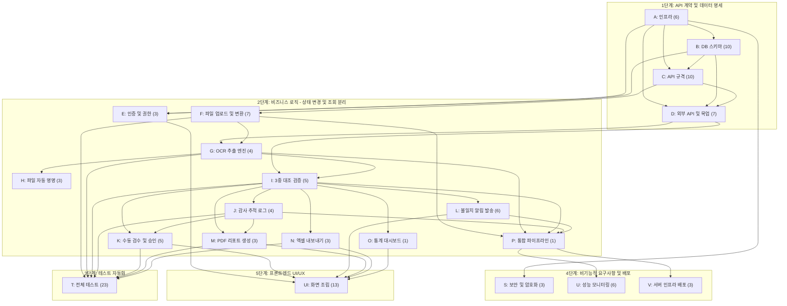

# 📋 개발 태스크 목록 명세서 (Task Breakdown Specification)

**Document ID:** TASK-001  
**Revision:** 1.1  
**Date:** 2026-04-18  
**기반 문서:** SRS-HR-AI-Verification-v1.1 (SRS-001 rev 1.1, 2026-04-18)  
**작성 관점:** Technical Project Manager / System Architect  
**Tech Stack:** Next.js (App Router) · Supabase · Prisma · Gemini API · shadcn/ui · pdf-lib · exceljs · sharp · Resend  
**추출 방법론:** Contract → Logic (CQRS) → Test → NFR → UI 5단계  
**FR 상세 문서:** `FR-TASK-FILES-ALL-v0_1/` (FR-001  ~  FR-125, 총 125건)

---

## 목차

1. [태스크 추출 원칙](#1-태스크-추출-원칙)
2. [Epic/도메인 분류 체계](#2-epic도메인-분류-체계)
3. [Step 1 — 계약·데이터 명세 태스크](#3-step-1--계약데이터-명세-태스크)
4. [Step 2 — 로직·상태 변경 태스크 (CQRS)](#4-step-2--로직상태-변경-태스크-cqrs)
5. [Step 3 — 테스트 태스크 (AC → 자동화)](#5-step-3--테스트-태스크-ac--자동화)
6. [Step 4 — 비기능·인프라·보안 태스크](#6-step-4--비기능인프라보안-태스크)
7. [Step 5 — UI/UX 프론트엔드 태스크](#7-step-5--uiux-프론트엔드-태스크)
8. [전체 태스크 요약 테이블](#8-전체-태스크-요약-테이블)
9. [의존성 다이어그램](#9-의존성-다이어그램)
10. [구현 우선순위 (권장 스프린트 배치)](#10-구현-우선순위-권장-스프린트-배치)
11. [REQ-FUNC → Task ID 역추적 매핑](#11-req-func--task-id-역추적-매핑)
12. [부록 — Phase 2 태스크 (Should/Could)](#12-부록--phase-2-태스크-shouldcould)

---

## 1. 태스크 추출 원칙

| # | 원칙 | 설명 |
|---|---|---|
| P1 | **데이터·계약 우선 (SSOT)** | DB 스키마, API DTO, Mock 데이터를 최우선 도출. AI 에이전트가 참조할 단일 진실 공급원 확보 |
| P2 | **CQRS 분리** | 상태 변경(Write/Command)과 조회(Read/Query)를 별개 태스크로 격리 |
| P3 | **AC → 테스트 코드** | 인수 조건(AC)을 체크리스트가 아닌 자동화된 테스트 태스크로 변환 (GWT 시나리오) |
| P4 | **닫힌 문맥 (Closed Context)** | 태스크 1건 = 단일 목적. 기존 코드 훼손 최소화 |
| P5 | **UI/백엔드 분리** | 프론트엔드 UI 조립과 백엔드 로직 구현을 별도 태스크로 추출 |

---

## 2. Epic/도메인 분류 체계

| Epic ID | Epic 이름 | 대응 SRS 범위 | 설명 |
|---|---|---|---|
| **E-INFRA** | 프로젝트 인프라·초기 설정 | §2.1 ~ 2.4 C-TEC, §3.5 ADR | Next.js 프로젝트 초기화, Prisma, Supabase, 디렉토리 구조, 패키지 |
| **E-DATA** | 데이터 모델·스키마 | §3.8 ERD & Prisma Schema | Prisma Enum/모델 정의, 마이그레이션, Seed 데이터 |
| **E-API** | API 계약·DTO 정의 | §3.7 API Overview, §3.12 Class Diagram | 내부 API Request/Response DTO, 에러 코드 정의 |
| **E-MOCK** | Mock 데이터·외부 API 클라이언트 | §1.2 Mock 대체, §3.12 AgencyApiClient | 정부24/HRDK Mock, Gemini OCR 프롬프트, Resend 클라이언트 |
| **E-AUTH** | 인증 & 권한 (RBAC) | §3.14 REQ-NF-020 ~ 024 | Supabase Auth, Middleware RBAC, RLS 정책 |
| **E-FILE** | 파일 업로드 & 변환 | §3.13 REQ-FUNC-001, 080 ~ 084 | 형식/크기 검증, sharp 이미지 변환, DOCX→PDF, Storage 업로드 |
| **E-OCR** | OCR 추출 엔진 | §3.13 REQ-FUNC-001 ~ 006 | Gemini Vision OCR, doc_category 분류, 신뢰도 판정 |
| **E-NAME** | 파일 자동 명명 | §3.13 REQ-FUNC-090 ~ 092 | 수험번호/이름 기반 명명, 순번 접미사 |
| **E-VERIFY** | Triple Check Loop (3중 대조) | §3.13 REQ-FUNC-010 ~ 015 | Layer 1/2/3 비교, 다중 검증 완료 기준 판정 |
| **E-AUDIT** | Audit Trail (감사 추적) | §3.13 REQ-FUNC-020 ~ 024 | 스냅샷 저장, 불변성, viewer_log |
| **E-HITL** | Human-in-the-loop 승인/반려 | §3.13 REQ-FUNC-030 ~ 033 | 승인/반려 Server Action, MANUAL_REVIEW 큐 |
| **E-NOTI** | 선택적 불일치 알림 | §3.13 REQ-FUNC-100 ~ 105 | DRAFT 생성, 미리보기, 선택 발송, 이메일 콘텐츠 |
| **E-PDF** | PDF 리포트 생성 | §3.13 REQ-FUNC-040 ~ 042 | pdf-lib 렌더링, REPORT 레코드 |
| **E-EXCEL** | 엑셀(.xlsx) 결과 내보내기 | §3.13 REQ-FUNC-070 ~ 073 | exceljs 워크북 생성, 8칼럼, 다중 검증 기준 |
| **E-STATS** | 대시보드 통계 | §3.13 REQ-FUNC-060 ~ 061 | 통계 Route Handler, SWR polling |
| **E-PIPE** | 통합 파이프라인 | §3.9 Seq-01 전체 | uploadAndVerify 오케스트레이션 |
| **E-TEST** | 테스트 자동화 | §3.17 Validation Plan | AC 기반 단위/통합/E2E 테스트 |
| **E-NFR** | 비기능·보안·모니터링 | §3.14 Non-Functional Requirements | 마스킹, 암호화, 성능 로깅, 배포 |
| **E-UI** | 프론트엔드 UI 조립 | §3.11 Use Case Diagram | 페이지·컴포넌트 단위 UI 조립 (백엔드 분리) |

---

## 3. Step 1 — 계약·데이터 명세 태스크

> **목적:** 백엔드와 프론트엔드의 기준점이 될 SSOT(Single Source of Truth)를 확보한다.  
> **SRS 근거:** §2 Tech Stack Constraints, §3.7 API Overview, §3.8 ERD & Prisma Schema, §1.2 Mock 대체

### 3.1 프로젝트 인프라 초기 설정 (E-INFRA / Epic A)

| Task ID | FR# | Epic | Feature (기능명) | 관련 SRS 섹션 | 선행 태스크 (Dependencies) | 복잡도 |
|---|---|---|---|---|---|---|
| **A-001** | FR-001 | E-INFRA | Next.js (App Router) 프로젝트 생성 + TypeScript 엄격 모드 설정 | §2.1 C-TEC-001 | None | L |
| **A-002** | FR-002 | E-INFRA | shadcn/ui 초기화 + Tailwind CSS 설정 + 핵심 14개 컴포넌트 사전 설치 | §2.1 C-TEC-004 | A-001 | L |
| **A-003** | FR-003 | E-INFRA | Prisma 초기 설정 (SQLite 로컬) + Client 싱글턴 + JSON 호환성 가이드 | §2.1 C-TEC-003 | A-001 | L |
| **A-004** | FR-004 | E-INFRA | Supabase 프로젝트 생성 + Auth/Storage/DB 환경변수 설정 | §2.1 C-TEC-003, §2.2 C-TEC-007 | A-001 | L |
| **A-005** | FR-005 | E-INFRA | 프로젝트 디렉토리 구조 정의 (app/, actions/, lib/, types/, components/, hooks/) | §3.10 Component Diagram, §3.12 Class Diagram | A-001 | L |
| **A-006** | FR-006 | E-INFRA | npm 패키지 일괄 설치 (ai, @ai-sdk/google, pdf-lib, exceljs, sharp, resend, swr, uuid) | §2.2 ~ 2.3 C-TEC-005 ~ 010 | A-001 | L |

---

### 3.2 데이터베이스 스키마 & 마이그레이션 (E-DATA / Epic B)

| Task ID | FR# | Epic | Feature (기능명) | 관련 SRS 섹션 | 선행 태스크 (Dependencies) | 복잡도 |
|---|---|---|---|---|---|---|
| **B-001** | FR-007 | E-DATA | Prisma Enum 정의: UserRole, UserStatus, BatchStatus, DocType, CheckLayer, ReportType, JobStatus | §3.8 Prisma Schema (L673 ~ 688) | A-003 | L |
| **B-002** | FR-008 | E-DATA | User 모델 정의 (user_id, email, name_masked, role, password_hash, mfa_enabled, status, created_at) | §3.8 (L518 ~ 533) | B-001 | L |
| **B-003** | FR-009 | E-DATA | Batch 모델 정의 (batch_id, batch_name, total_applicants, status, started_at, completed_at, created_by FK) | §3.8 (L535 ~ 548) | B-002 | L |
| **B-004** | FR-010 | E-DATA | Applicant 모델 정의 (applicant_id, batch_id FK, exam_number, name_masked, phone_masked, email, created_at) | §3.8 (L551 ~ 565) | B-003 | L |
| **B-005** | FR-011 | E-DATA | Document 모델 정의 (15개 필드, v1.1 신규: doc_category, normalized_filename, original_file_format, converted_file_path, rotation_applied, rotation_degrees) | §3.8 (L567 ~ 589) | B-004 | M |
| **B-006** | FR-012 | E-DATA | VerificationJob 모델 정의 (16개 필드, v1.1 신규: verification_method, final_result, rpa_used, mock_used, decision_reason) | §3.8 (L591 ~ 614) | B-005 | M |
| **B-007** | FR-013 | E-DATA | AuditTrail 모델 정의 (11개 필드, v1.1 신규: agency_response_snapshot, agency_response_captured_at) | §3.8 (L616 ~ 632) | B-006 | M |
| **B-008** | FR-014 | E-DATA | Notification 모델 정의 (14개 필드, v1.1 신규: discrepancy_items, required_documents, custom_message, is_selected) | §3.8 (L634 ~ 654) | B-004, B-006 | M |
| **B-009** | FR-015 | E-DATA | Report 모델 정의 (9개 필드, v1.1 신규: excel_path) | §3.8 (L656 ~ 671) | B-003, B-002 | L |
| **B-010** | FR-016 | E-DATA | Prisma ERD 전체 관계 검증 + 통합 마이그레이션 실행 (`prisma migrate dev`) | §2.1 C-TEC-003, §3.5 ASM-05 | B-001 ~ B-009 | M |

---

### 3.3 API 계약·DTO 정의 (E-API / Epic C)

| Task ID | FR# | Epic | Feature (기능명) | 관련 SRS 섹션 | 선행 태스크 (Dependencies) | 복잡도 |
|---|---|---|---|---|---|---|
| **C-001** | FR-017 | E-API | TypeScript 공통 타입 정의: OcrResult, StructuredFields, CompareResult, AgencyResult, VerificationResult, JobResult 인터페이스 | §3.12 Class Diagram | B-001 | M |
| **C-002** | FR-018 | E-API | `POST /api/verifications` Request DTO (applicant_id, doc_type, file) + Response DTO (job_id, status, confidence_score, discrepancy_detail, final_result) 정의 | §3.7 API Overview (L346) | C-001 | M |
| **C-003** | FR-019 | E-API | `GET /api/verifications/[job_id]` Response DTO 정의 (검증 결과 상세 + OCR vs Agency 비교 데이터) | §3.7 (L347) | C-001 | L |
| **C-004** | FR-020 | E-API | `POST /api/verifications/[job_id]/approve` Request DTO (decision, reason) + Response DTO 정의 | §3.7 (L348) | C-001 | L |
| **C-005** | FR-021 | E-API | `GET /api/reports/[batch_id]/pdf` Response (PDF Buffer stream) 정의 | §3.7 (L349) | C-001 | L |
| **C-006** | FR-022 | E-API | `GET /api/reports/[batch_id]/excel` Response (xlsx Buffer stream) 정의 | §3.7 (L350) | C-001 | L |
| **C-007** | FR-023 | E-API | `POST /api/notifications/send` Request DTO (job_ids[], custom_message?) + Response (SendResult) 정의 | §3.7 (L351) | C-001 | L |
| **C-008** | FR-024 | E-API | `GET /api/notifications/preview/[job_id]` Response DTO (NotificationPreview: discrepancy_items, required_documents, custom_message) 정의 | §3.7 (L352) | C-001 | L |
| **C-009** | FR-025 | E-API | `GET /api/dashboard/stats` Request (date_from, date_to) + Response (Stats: total, pass, fail, manual_review, mock_count, complete_count, needs_review_count) 정의 | §3.7 (L353) | C-001 | L |
| **C-010** | FR-026 | E-API | HTTP 오류 응답 표준 유틸리티 함수: 400/401/403/404/422/500 + 에러 메시지 규격 | §3.7 오류 응답 표준 (L359 ~ 366) | A-001 | L |

---

### 3.4 Mock 데이터·외부 API 클라이언트 계약 (E-MOCK / Epic D)

| Task ID | FR# | Epic | Feature (기능명) | 관련 SRS 섹션 | 선행 태스크 (Dependencies) | 복잡도 |
|---|---|---|---|---|---|---|
| **D-001** | FR-027 | E-MOCK | 정부24 API 실제 호출 클라이언트 인터페이스 정의 (callGov24Api: docNum, issueDate → verified, issuer_info) | §3.12 AgencyApiClient, §3.7 | C-001 | M |
| **D-002** | FR-028 | E-MOCK | HRDK API Mock 응답 함수 `mockHrdkResponse(certNum)` 구현 (자격증 유효 여부 고정값 반환, mock_used=true 기록) | §1.2 Mock 대체, REQ-FUNC-012 | D-001 | L |
| **D-003** | FR-029 | E-MOCK | 정부24 API 타임아웃(10초) 시 Mock 폴백 함수 `mockGov24Response()` 구현 + mock_used=true 기록 | §1.2, REQ-FUNC-011 | D-001 | L |
| **D-004** | FR-030 | E-MOCK | API 응답 스냅샷 캡처 유틸리티 `captureResponseSnapshot(response)` → JSON 원문 + 타임스탬프 반환 | §3.12 AgencyApiClient, REQ-FUNC-024 | D-001 | L |
| **D-005** | FR-031 | E-MOCK | Seed 데이터 생성 스크립트: User(OPERATOR/ADMIN/AUDITOR 각 1건), Batch(1건), Applicant(수험번호 유/무 각 3건) | §3.8 ERD | B-010 | M |
| **D-006** | FR-032 | E-MOCK | Gemini Vision OCR 프롬프트 템플릿 정의 (doc_type별 추출 필드 + doc_category 분류 지시) | §3.12 GeminiOcrService, REQ-FUNC-002, 006 | A-006 | M |
| **D-007** | FR-033 | E-MOCK | Resend API 이메일 발송 클라이언트 인터페이스 정의 (sendEmail: to, subject, html → success/failure) | §3.10 Component Diagram, REQ-FUNC-105 | A-006 | L |

---

## 4. Step 2 — 로직·상태 변경 태스크 (CQRS)

> **목적:** 데이터 조회(Query)와 상태 변경(Command)을 엄격히 분리하여 에이전트가 단일 목적에 집중하도록 격리한다.  
> **SRS 근거:** §3.9 Sequence Diagrams, §3.13 Functional Requirements, §3.12 Class Diagram

### 4.1 E-AUTH: 인증 & 권한 (Epic E)

| Task ID | FR# | Epic | Feature (기능명) | 관련 SRS 섹션 | 선행 태스크 (Dependencies) | 복잡도 |
|---|---|---|---|---|---|---|
| **E-001** | FR-034 | E-AUTH | [Command] Supabase Auth 설정: 이메일/패스워드 회원가입 + 로그인 (Google OAuth 선택) | §3.5 ADR, REQ-NF-020 | A-004, B-010 | M |
| **E-002** | FR-035 | E-AUTH | [Command] Next.js Middleware: Supabase 세션 확인 + RBAC 역할 검사 (OPERATOR/ADMIN/AUDITOR) | §3.10 Middleware, REQ-NF-024 | E-001 | H |
| **E-003** | FR-036 | E-AUTH | [Command] Supabase RLS 정책 설정: User, Batch, Applicant, Document, VerificationJob, AuditTrail, Notification, Report 테이블별 역할 기반 접근 제어 | REQ-NF-024 | E-001, B-010 | H |

---

### 4.2 E-FILE: 파일 업로드 & 변환 (Epic F)

| Task ID | FR# | Epic | Feature (기능명) | 관련 SRS 섹션 | 선행 태스크 (Dependencies) | 복잡도 |
|---|---|---|---|---|---|---|
| **F-001** | FR-038 | E-FILE | [Command] 파일 형식 검증 유틸리티: 지원 형식(PDF/JPG/PNG/DOCX/HEIC/BMP/TIFF) 판별 + HWP 등 미지원 시 HTTP 422 반환 | REQ-FUNC-005, REQ-FUNC-083 | C-010 | L |
| **F-002** | FR-039 | E-FILE | [Command] 파일 크기 검증: 20MB 초과 시 HTTP 422 반환 | REQ-FUNC-005, §3.7 오류 응답 | C-010 | L |
| **F-003** | FR-040 | E-FILE | [Command] 이미지 형식 변환 (sharp): HEIC/BMP/TIFF → JPG 변환 + original_file_format 기록 | REQ-FUNC-081, §2.3 C-TEC-009 | A-006 | M |
| **F-004** | FR-041 | E-FILE | [Command] DOCX → PDF 변환 (libreoffice-convert 또는 대안) + 변환 실패 시 HTTP 422 + 재제출 안내 | REQ-FUNC-080, §2.3 C-TEC-010 | A-006 | H |
| **F-005** | FR-042 | E-FILE | [Command] 이미지 자동 회전 보정 (sharp autoOrient): EXIF 기반 감지 + rotation_applied, rotation_degrees 기록 | REQ-FUNC-082 | F-003 | M |
| **F-006** | FR-043 | E-FILE | [Command] 원본 파일 + 변환 파일을 Supabase Storage 업로드 → raw_file_path, converted_file_path 반환 | REQ-FUNC-001, §3.10 Supabase Storage | A-004, F-003 | M |
| **F-007** | FR-044 | E-FILE | [Command] DOCUMENT 레코드 생성 (DB Write): applicant_id, doc_type, raw_file_path, original_filename, original_file_format, converted_file_path, rotation_applied, rotation_degrees, file_format 저장 | §3.9 Seq-01 (L728) | B-005, F-006 | M |

---

### 4.3 E-OCR: OCR 추출 엔진 (Epic G)

| Task ID | FR# | Epic | Feature (기능명) | 관련 SRS 섹션 | 선행 태스크 (Dependencies) | 복잡도 |
|---|---|---|---|---|---|---|
| **G-001** | FR-047 | E-OCR | [Command] Gemini Vision API 호출 Server Action: generateObject()로 구조화 JSON 추출 (성명, 발급번호, 발급일자, 발급기관명, confidenceScore, docCategory) | REQ-FUNC-002, §3.12 GeminiOcrService | D-006, F-007 | H |
| **G-002** | FR-048 | E-OCR | [Command] doc_category 자동 분류: OCR 결과에서 서류 종류(졸업증명서, 자격증, 경력증명서 등) 판별 | REQ-FUNC-006 | G-001 | M |
| **G-003** | FR-049 | E-OCR | [Command] DOCUMENT.ocr_extracted_json, ocr_confidence_score, doc_category DB 업데이트 | REQ-FUNC-003, §3.9 Seq-01 (L738) | G-001, G-002 | L |
| **G-004** | FR-050 | E-OCR | [Command] OCR 신뢰도 < 70 판별 → VERIFICATION_JOB status=MANUAL_REVIEW, final_result="확인필요" 저장 | REQ-FUNC-004, §3.5 ADR-005 | G-003, B-006 | M |

---

### 4.4 E-NAME: 파일 자동 명명 (Epic H)

| Task ID | FR# | Epic | Feature (기능명) | 관련 SRS 섹션 | 선행 태스크 (Dependencies) | 복잡도 |
|---|---|---|---|---|---|---|
| **H-001** | FR-051 | E-NAME | [Command] 파일 자동 명명 유틸리티 `generateFilename()`: 수험번호 있으면 `{수험번호}_{서류종류}.{ext}`, 없으면 `{지원자명}_{서류종류}.{ext}` | REQ-FUNC-090, §3.12 FileNamingService | G-002 | L |
| **H-002** | FR-052 | E-NAME | [Command] 동일 지원자 동일 서류종류 복수 제출 시 순번 접미사 처리 (예: `_2`, `_3`) | REQ-FUNC-092 | H-001 | L |
| **H-003** | FR-053 | E-NAME | [Command] original_filename 보존 + normalized_filename DB 저장 (DOCUMENT 업데이트) | REQ-FUNC-091 | H-001, G-003 | L |

---

### 4.5 E-VERIFY: Triple Check Loop — 3중 대조 검증 (Epic I)

| Task ID | FR# | Epic | Feature (기능명) | 관련 SRS 섹션 | 선행 태스크 (Dependencies) | 복잡도 |
|---|---|---|---|---|---|---|
| **I-001** | FR-054 | E-VERIFY | [Command] Layer 1 — 입력값 vs OCR 추출값 비교 로직 `compareInputVsOcr()`: 필드별 일치/불일치 판정 | REQ-FUNC-010, §3.9 Seq-01 (L744 ~ 745) | G-003 | H |
| **I-002** | FR-055 | E-VERIFY | [Command] Layer 2 — OCR 추출값 vs 공공 API 조회값 비교: 정부24 API 호출 → 10초 타임아웃 시 Mock 폴백 → mock_used 기록 | REQ-FUNC-010 ~ 012, §3.9 Seq-01 (L747 ~ 755) | D-001, D-002, D-003, G-003 | H |
| **I-003** | FR-056 | E-VERIFY | [Command] Layer 3 — 최종 판정 `finalJudgment()`: 3단계 모두 일치→PASS, 1개↑ 불일치→FAIL + discrepancy_detail JSON 생성 | REQ-FUNC-013 | I-001, I-002 | H |
| **I-004** | FR-057 | E-VERIFY | [Command] 다중 검증 완료 기준 판정: verification_method(문서확인번호/자격번호/내용일치) + final_result(완료/확인필요) 결정 → DB 저장 | REQ-FUNC-015, §3.9 Seq-01 (L757 ~ 761) | I-003 | M |
| **I-005** | FR-058 | E-VERIFY | [Command] VERIFICATION_JOB 레코드 생성/업데이트 (전체 Triple Check 결과 DB Write) | REQ-FUNC-010, §3.9 Seq-01 (L761) | I-004 | M |

---

### 4.6 E-AUDIT: Audit Trail — 감사 추적 (Epic J)

| Task ID | FR# | Epic | Feature (기능명) | 관련 SRS 섹션 | 선행 태스크 (Dependencies) | 복잡도 |
|---|---|---|---|---|---|---|
| **J-001** | FR-059 | E-AUDIT | [Command] Audit Trail 자동 생성: capture_file_path + agency_response_snapshot + agency_response_captured_at + timestamp_hash(SHA-256) + is_immutable=true + retention_until(created_at+5년) | REQ-FUNC-020, 023, 024, §3.9 Seq-01 (L763 ~ 764) | I-005, D-004 | M |
| **J-002** | FR-060 | E-AUDIT | [Command] 논리적 불변성 보장: is_immutable=true 레코드에 대한 수정/삭제 API 미노출 + 시도 시 HTTP 403 반환 | REQ-FUNC-021, §3.5 ADR-006 | J-001 | M |
| **J-003** | FR-061 | E-AUDIT | [Command] viewer_log 자동 추가: Audit Trail 열람 시 접근자 ID + 접근 시각을 JSON Array에 append | REQ-FUNC-022 | J-001 | L |
| **J-004** | FR-062 | E-AUDIT | [Query] Audit Trail 읽기 전용 조회 API (AUDITOR 역할) | §3.11 UC08 | J-001, E-003 | L |

---

### 4.7 E-HITL: Human-in-the-loop 승인/반려 (Epic K)

| Task ID | FR# | Epic | Feature (기능명) | 관련 SRS 섹션 | 선행 태스크 (Dependencies) | 복잡도 |
|---|---|---|---|---|---|---|
| **K-001** | FR-063 | E-HITL | [Query] 검증 결과 대시보드 목록 조회: VERIFICATION_JOB 목록 (status, confidence_score, final_result) + SWR 5초 polling | REQ-FUNC-030, §3.5 ADR-007 | I-005, B-006 | M |
| **K-002** | FR-064 | E-HITL | [Query] 검증 결과 상세 조회: OCR 추출값 vs 기관 DB 반환값 항목별 비교 + 불일치 하이라이트 데이터 + API 응답 스냅샷 | REQ-FUNC-014, §3.9 Seq-02 (L789) | K-001 | M |
| **K-003** | FR-065 | E-HITL | [Command] 승인 Server Action `approveJob()`: status→APPROVED, reviewer_id, reviewed_at DB 저장 + viewer_log 업데이트 | REQ-FUNC-031, §3.9 Seq-02 (L793 ~ 796) | K-002, J-003 | M |
| **K-004** | FR-066 | E-HITL | [Command] 반려 Server Action `rejectJob()`: 사유(decision_reason) 필수 검증 + status→REJECTED DB 저장 | REQ-FUNC-032, §3.9 Seq-02 (L799 ~ 801) | K-002 | M |
| **K-005** | FR-067 | E-HITL | [Query] MANUAL_REVIEW 큐 조회: MANUAL_REVIEW 상태 건 별도 목록 표시 | REQ-FUNC-033 | K-001 | L |

---

### 4.8 E-NOTI: 불일치 알림 DRAFT 생성 & 선택 발송 (Epic L)

| Task ID | FR# | Epic | Feature (기능명) | 관련 SRS 섹션 | 선행 태스크 (Dependencies) | 복잡도 |
|---|---|---|---|---|---|---|
| **L-001** | FR-072 | E-NOTI | [Command] FAIL 확정 시 NOTIFICATION DRAFT 자동 생성: status=DRAFT, is_selected=false, discrepancy_items JSON, required_documents JSON 자동 포함 | REQ-FUNC-100 ~ 102, §3.9 Seq-01 (L766 ~ 769) | I-005 | M |
| **L-002** | FR-073 | E-NOTI | [Query] 알림 미리보기 조회 `previewNotification(job_id)`: NOTIFICATION + VERIFICATION_JOB JOIN → 불일치 사유 + 보완 안내 + 재제출 링크 미리보기 | REQ-FUNC-103, §3.9 Seq-03 (L823 ~ 826) | L-001 | M |
| **L-003** | FR-074 | E-NOTI | [Command] 알림 내용 수정 `updateNotificationMessage(noti_id, custom_message)`: custom_message DB 업데이트 | REQ-FUNC-103, §3.9 Seq-03 (L830 ~ 831) | L-002 | L |
| **L-004** | FR-075 | E-NOTI | [Command] 선택 발송 `sendSelectedNotifications(noti_ids[])`: 선택 건 is_selected=true → Resend API 이메일 발송 → status=SENT/FAILED + sent_at 기록 | REQ-FUNC-104, §3.9 Seq-03 (L835 ~ 849) | L-003, D-007 | H |
| **L-005** | FR-076 | E-NOTI | [Command] 이메일 콘텐츠 빌드: 지원자명(마스킹), 서류 유형, 불일치 항목, 보완서류 안내, 재제출 링크, 대시보드 링크 포함 HTML 템플릿 | REQ-FUNC-105 | L-004 | M |
| **L-006** | FR-077 | E-NOTI | [Query] DRAFT 상태 알림 목록 조회 (FAIL 건 대상) | §3.9 Seq-03 (L818) | L-001 | L |

---

### 4.9 E-PDF: PDF 리포트 생성 (Epic M)

| Task ID | FR# | Epic | Feature (기능명) | 관련 SRS 섹션 | 선행 태스크 (Dependencies) | 복잡도 |
|---|---|---|---|---|---|---|
| **M-001** | FR-080 | E-PDF | [Query] 배치 전체 검증 결과 데이터 조회 (APPLICANT ← DOCUMENT ← VERIFICATION_JOB ← AUDIT_TRAIL JOIN) | §3.9 Seq-05 (L899 ~ 900) | I-005, J-001 | M |
| **M-002** | FR-081 | E-PDF | [Command] pdf-lib PDF 렌더링: 회차명, 검증일시, 건별 PASS/FAIL 결과, mock_used 별도 표기, API 응답 스냅샷 요약 포함 | REQ-FUNC-040 ~ 042 | M-001 | H |
| **M-003** | FR-082 | E-PDF | [Command] REPORT 레코드 생성 (report_type=PDF, status=COMPLETED, pdf_path, total_count, generated_at) | §3.9 Seq-05 (L906) | M-002, B-009 | L |

---

### 4.10 E-EXCEL: 엑셀(.xlsx) 결과 내보내기 (Epic N)

| Task ID | FR# | Epic | Feature (기능명) | 관련 SRS 섹션 | 선행 태스크 (Dependencies) | 복잡도 |
|---|---|---|---|---|---|---|
| **N-001** | FR-084 | E-EXCEL | [Query] 배치 전체 검증 결과 데이터 조회 (엑셀용: 수험번호, 성명, normalized_filename, doc_category, final_result, verification_method, discrepancy_detail, mock_used) | §3.9 Seq-04 (L867 ~ 869) | I-005 | M |
| **N-002** | FR-085 | E-EXCEL | [Command] exceljs 워크북 생성: 8개 칼럼 (수험번호/성명/제출서류 파일명/서류 유형/진위확인 결과/확인 방법/불일치 상세/비고) + 다중 검증 완료 기준 적용 | REQ-FUNC-070 ~ 072 | N-001 | H |
| **N-003** | FR-086 | E-EXCEL | [Command] REPORT 레코드 생성 (report_type=EXCEL, status=COMPLETED, excel_path, total_count, generated_at) | §3.9 Seq-04 (L880) | N-002, B-009 | L |

---

### 4.11 E-STATS: 대시보드 통계 (Epic O)

| Task ID | FR# | Epic | Feature (기능명) | 관련 SRS 섹션 | 선행 태스크 (Dependencies) | 복잡도 |
|---|---|---|---|---|---|---|
| **O-001** | FR-088 | E-STATS | [Query] 통계 집계 Route Handler: 총 검증 건수, PASS/FAIL/MANUAL_REVIEW, Mock 사용 건수, 완료/확인필요 건수 — Prisma groupBy/count | REQ-FUNC-060 | I-005, B-006 | M |

---

### 4.12 E-PIPE: 통합 파이프라인 오케스트레이션 (Epic P)

| Task ID | FR# | Epic | Feature (기능명) | 관련 SRS 섹션 | 선행 태스크 (Dependencies) | 복잡도 |
|---|---|---|---|---|---|---|
| **P-001** | FR-090 | E-PIPE | [Command] `uploadAndVerify()` 통합 Server Action: 파일 검증 → 변환/보정 → Storage 업로드 → OCR → 파일 명명 → Triple Check → Audit Trail → DRAFT 알림 생성 (전체 Seq-01 오케스트레이션) | §3.9 Seq-01 전체, §3.12 VerificationService | F-001 ~ F-007, G-001 ~ G-004, H-001 ~ H-003, I-001 ~ I-005, J-001, L-001 | H |

---

## 5. Step 3 — 테스트 태스크 (AC → 자동화)

> **목적:** SRS의 Acceptance Criteria를 에이전트가 실행 가능한 테스트 코드로 변환한다 (GWT 시나리오).  
> **SRS 근거:** §3.13 각 REQ-FUNC의 AC (GWT 형식), §3.17 Validation Plan

### 5.1 파일 & OCR 테스트

| Task ID | FR# | Epic | Feature (기능명) | 관련 SRS 섹션 | 선행 태스크 (Dependencies) | 복잡도 |
|---|---|---|---|---|---|---|
| **T-001** | FR-091 | E-TEST | [Unit Test] 파일 형식 검증: ①PDF/JPG/PNG→통과 ②DOCX/HEIC/BMP/TIFF→변환 분기 ③HWP→422 반환 ④20MB 초과→422 반환 | REQ-FUNC-005, 080 ~ 083 | F-001, F-002, F-003, F-004 | M |
| **T-002** | FR-092 | E-TEST | [Unit Test] 이미지 회전 보정: 90도 회전 JPG 입력 → rotation_applied=true, rotation_degrees=90 확인 | REQ-FUNC-082 | F-005 | L |
| **T-003** | FR-093 | E-TEST | [Unit Test] Gemini Vision OCR 필드 추출: 학위증명서 이미지 → 4개 필드(성명, 발급번호, 발급일자, 발급기관명) + confidence_score 포함 JSON 반환 확인 | REQ-FUNC-002 | G-001 | M |
| **T-004** | FR-094 | E-TEST | [Unit Test] doc_category 분류: ①졸업증명서 → "졸업증명서" ②자격증 → "자격증" ③경력증명서 → "경력증명서" 정확 분류 확인 | REQ-FUNC-006 | G-002 | M |
| **T-005** | FR-095 | E-TEST | [Unit Test] OCR 신뢰도 임계치: ①신뢰도 65 → MANUAL_REVIEW + final_result="확인필요" ②신뢰도 75 → Triple Check 진행 | REQ-FUNC-004 | G-004 | L |
| **T-006** | FR-096 | E-TEST | [Unit Test] 파일 자동 명명: ①수험번호 있음(2026-0001, 졸업증명서) → "2026-0001_졸업증명서.pdf" ②수험번호 없음(홍길동, 자격증) → "홍길동_자격증.pdf" ③동일 서류 2건 → "_2" 접미사 | REQ-FUNC-090 ~ 092 | H-001, H-002 | L |

### 5.2 Triple Check & Audit Trail 테스트

| Task ID | FR# | Epic | Feature (기능명) | 관련 SRS 섹션 | 선행 태스크 (Dependencies) | 복잡도 |
|---|---|---|---|---|---|---|
| **T-007** | FR-097 | E-TEST | [Unit Test] Triple Check Layer 1: 입력값 vs OCR값 ①모두 일치→PASS ②발급일자 불일치→FAIL + discrepancy_detail 포함 | REQ-FUNC-010 | I-001 | M |
| **T-008** | FR-098 | E-TEST | [Unit Test] Triple Check Layer 2: ①정부24 API 성공 응답 → verified 결과 반환 ②10초 타임아웃 → Mock 폴백 + mock_used=true ③HRDK 미연동 → mockHrdkResponse() 호출 | REQ-FUNC-011 ~ 012 | I-002 | M |
| **T-009** | FR-099 | E-TEST | [Unit Test] Triple Check 최종 판정: ①3단계 모두 PASS → status=PASS ②1개↑ 불일치 → status=FAIL + discrepancy_detail JSON 정확성 | REQ-FUNC-013 | I-003 | M |
| **T-010** | FR-100 | E-TEST | [Unit Test] 다중 검증 완료 기준: ①내용일치 + 문서확인번호 API 확인 → final_result="완료", verification_method="문서확인번호" ②내용일치 but API 미연동(Mock) → final_result="확인필요" | REQ-FUNC-015 | I-004 | M |
| **T-011** | FR-101 | E-TEST | [Unit Test] Audit Trail 생성: ①capture_file_path + agency_response_snapshot + timestamp_hash 동시 저장 확인 ②retention_until = created_at + 1825일 확인 | REQ-FUNC-020, 023, 024 | J-001 | M |
| **T-012** | FR-102 | E-TEST | [Unit Test] Audit Trail 불변성: ①DELETE 요청 → HTTP 403 반환 ②UPDATE 요청 → HTTP 403 반환 ③레코드 유지 확인 | REQ-FUNC-021 | J-002 | M |
| **T-013** | FR-103 | E-TEST | [Unit Test] Audit Trail viewer_log: 열람 시 {userId, timestamp} 자동 추가 확인 | REQ-FUNC-022 | J-003 | L |

### 5.3 승인/반려 & 알림 테스트

| Task ID | FR# | Epic | Feature (기능명) | 관련 SRS 섹션 | 선행 태스크 (Dependencies) | 복잡도 |
|---|---|---|---|---|---|---|
| **T-014** | FR-104 | E-TEST | [Unit Test] 승인 로직: '승인' → status=APPROVED + reviewer_id + reviewed_at 저장 + viewer_log 업데이트 확인 | REQ-FUNC-031 | K-003 | M |
| **T-015** | FR-105 | E-TEST | [Unit Test] 반려 로직: ①사유 빈 채 반려 → 제출 불가(400) ②사유 입력 후 반려 → status=REJECTED + decision_reason 저장 | REQ-FUNC-032 | K-004 | M |
| **T-016** | FR-106 | E-TEST | [Unit Test] NOTIFICATION DRAFT 생성: FAIL 확정 시 ①status=DRAFT ②is_selected=false ③discrepancy_items JSON 포함 ④required_documents 포함 | REQ-FUNC-100 ~ 102 | L-001 | M |
| **T-017** | FR-107 | E-TEST | [Integration Test] 선택 발송: 5건 DRAFT 중 3건 선택 → ①3건만 is_selected=true + 이메일 발송 시도 ②2건 DRAFT 유지 ③발송 성공 건 status=SENT ④발송 실패 건 status=FAILED | REQ-FUNC-104 | L-004 | H |
| **T-018** | FR-108 | E-TEST | [Unit Test] 이메일 콘텐츠: 발송된 이메일에 6개 항목(지원자명 마스킹, 서류유형, 불일치 항목, 보완안내, 재제출 링크, 대시보드 링크) 포함 확인 | REQ-FUNC-105 | L-005 | M |

### 5.4 리포트 & 통합 테스트

| Task ID | FR# | Epic | Feature (기능명) | 관련 SRS 섹션 | 선행 태스크 (Dependencies) | 복잡도 |
|---|---|---|---|---|---|---|
| **T-019** | FR-109 | E-TEST | [Integration Test] PDF 리포트 생성: 10건 배치 → ①필수 항목(회차명, 검증일시, 건별 결과, mock 표기, API 스냅샷 요약) 누락 0건 ②10초 이내 생성 | REQ-FUNC-040 ~ 042 | M-002 | M |
| **T-020** | FR-110 | E-TEST | [Integration Test] 엑셀 생성: 10건 배치 → ①8개 칼럼 존재 ②다중 검증 완료 기준 정확("완료"/"확인필요") ③mock_used=true 건 비고 표시 ④5초 이내 생성 | REQ-FUNC-070 ~ 073 | N-002 | M |
| **T-021** | FR-111 | E-TEST | [Integration Test] RBAC 권한: ①OPERATOR→업로드,조회 가능 / 승인 불가 ②ADMIN→승인,반려,PDF,엑셀 가능 ③AUDITOR→Audit Trail 열람만 가능 | REQ-NF-024 | E-002, E-003 | H |
| **T-022** | FR-112 | E-TEST | [Integration Test] Mock 투명성: mock_used=true 건이 ①대시보드 ②PDF 리포트 ③엑셀 리포트 모두에서 표시되는지 확인 | REQ-NF-012 | UI-020, M-002, N-002 | M |
| **T-023** | FR-113 | E-TEST | [E2E Test] 전체 흐름: 서류 업로드 → 파일 변환 → OCR → Triple Check → Audit Trail 생성 → 승인 → PDF/엑셀 다운로드 전체 흐름 | §3.17 Exp-5 | P-001, M-002, N-002 | H |

---

## 6. Step 4 — 비기능·인프라·보안 태스크

> **목적:** SRS §3.14 비기능적 요구사항을 인프라, 보안, 모니터링, 배포 태스크로 변환한다.  
> **SRS 근거:** §3.14 Non-Functional Requirements, §3.16 구현 가이드

### 6.1 보안 & 개인정보 (Epic S)

| Task ID | FR# | Epic | Feature (기능명) | 관련 SRS 섹션 | 선행 태스크 (Dependencies) | 복잡도 |
|---|---|---|---|---|---|---|
| **S-001** | FR-114 | E-NFR | [Infra] 개인정보 마스킹 유틸리티 함수: 성명 → '홍○○', 전화번호 → '010-****-1234' (UI 표시 전처리) | REQ-NF-023 | A-001 | L |
| **S-002** | FR-115 | E-NFR | [Infra] Supabase Storage AES-256 암호화 설정 확인 + 버킷 정책 설정 (private) | REQ-NF-021 | A-004 | L |
| **S-003** | FR-116 | E-NFR | [Infra] Vercel HTTPS(TLS 1.3) 기본 적용 확인 + 환경변수 시크릿 관리 검증 | REQ-NF-022, §2.2 C-TEC-007 | A-004 | L |

---

### 6.2 성능 & 모니터링 (Epic U)

| Task ID | FR# | Epic | Feature (기능명) | 관련 SRS 섹션 | 선행 태스크 (Dependencies) | 복잡도 |
|---|---|---|---|---|---|---|
| **U-001** | FR-117 | E-NFR | [Infra] Server Action 실행 시간 로깅: 업로드→OCR(p95 ≤ 20초), Triple Check(p95 ≤ 30초), 승인(p95 ≤ 2초) 타임스탬프 기록 | REQ-NF-001 ~ 002, 005 | P-001 | M |
| **U-002** | FR-118 | E-NFR | [Infra] 파일 변환 시간 로깅: 단일 파일 변환 p95 ≤ 10초, 전체 처리(변환+OCR+Triple Check) p95 ≤ 40초 검증 | REQ-NF-007 ~ 008 | F-003, F-004 | M |
| **U-003** | FR-119 | E-NFR | [Infra] PDF 생성 시간 로깅: p95 ≤ 10초 (100건 이하) | REQ-NF-003 | M-002 | L |
| **U-004** | FR-120 | E-NFR | [Infra] 엑셀 생성 시간 로깅: p95 ≤ 5초 (100건 이하) | REQ-NF-006 | N-002 | L |
| **U-005** | FR-121 | E-NFR | [Infra] 오류 모니터링: console.error 로깅 + OCR 실패 시 대시보드 표시 + 파일 변환 실패 추적 | REQ-NF-030 ~ 033 | P-001 | M |
| **U-006** | FR-122 | E-NFR | [Infra] Mock 사용 현황 추적: 대시보드 통계에 Mock 사용 건수 표시 | REQ-NF-032 | O-001 | L |

---

### 6.3 배포 & 인프라 (Epic V)

| Task ID | FR# | Epic | Feature (기능명) | 관련 SRS 섹션 | 선행 태스크 (Dependencies) | 복잡도 |
|---|---|---|---|---|---|---|
| **V-001** | FR-123 | E-NFR | [Infra] Prisma datasource 전환: SQLite(로컬) → Supabase PostgreSQL(배포) — DATABASE_URL 환경변수 전환 + 마이그레이션 | §2.1 C-TEC-003, §3.5 ASM-05 | B-010, 전체 개발 완료 | M |
| **V-002** | FR-124 | E-NFR | [Infra] Vercel 배포 설정: git push 기반 자동 배포 + 환경변수(GEMINI_API_KEY, DATABASE_URL, DIRECT_URL, SUPABASE_URL, SUPABASE_ANON_KEY, RESEND_API_KEY) 패널 등록 | §2.2 C-TEC-007 | V-001 | M |
| **V-003** | FR-125 | E-NFR | [Infra] Vercel Serverless 함수 타임아웃 검증: Pro 기준 60초 제한 내 전체 파이프라인(37초 예상) 안전 마진 확인 | §3.14 PoC 주의 (L1238) | V-002 | M |

---

## 7. Step 5 — UI/UX 프론트엔드 태스크

> **목적:** 백엔드 로직과 분리된 프론트엔드 UI 컴포넌트·페이지 조립 태스크를 추출한다.  
> Step 2에서 `[UI]` 태그로 혼합되어 있던 태스크를 별도로 정리.

### 7.1 공통 UI 인프라

| Task ID | FR# | Epic | Feature (기능명) | 관련 SRS 섹션 | 선행 태스크 (Dependencies) | 복잡도 |
|---|---|---|---|---|---|---|
| **UI-001** | FR-002 | E-UI | shadcn/ui + Tailwind 디자인 시스템 기초 설정 (= A-002와 동일, 기반 확보) | C-TEC-004 | A-001 | L |
| **UI-002** | FR-037 | E-UI | [UI] 로그인 페이지 (shadcn/ui: Card, Input, Button) | REQ-NF-020 | E-001, UI-001 | L |

### 7.2 도메인별 페이지·컴포넌트

| Task ID | FR# | Epic | Feature (기능명) | 관련 SRS 섹션 | 선행 태스크 (Dependencies) | 복잡도 |
|---|---|---|---|---|---|---|
| **UI-010** | FR-045 | E-UI | [UI] 서류 업로드 페이지: 파일 선택 (drag & drop), applicant 선택, doc_type 선택, 업로드 버튼 (shadcn/ui) | §3.11 UC01, §3.6 시스템 흐름 | UI-002, UI-001 | M |
| **UI-011** | FR-046 | E-UI | [UI] 다중 페이지 서류 순서 확인·변경 UI (드래그앤드롭) | REQ-FUNC-084 | UI-010 | M |
| **UI-020** | FR-068 | E-UI | [UI] 대시보드 페이지: 검증 결과 목록 테이블 (shadcn/ui Table) + SWR polling 연동 | §3.11 UC04 | K-001, UI-001 | M |
| **UI-021** | FR-069 | E-UI | [UI] 검증 결과 상세 모달/페이지: OCR vs Agency 비교 레이아웃 + 불일치 하이라이트 UI + API 스냅샷 패널 | REQ-FUNC-014 | K-002, UI-001 | H |
| **UI-022** | FR-070 | E-UI | [UI] 승인/반려 버튼 + 반려 사유 입력 Dialog (shadcn/ui Dialog, Textarea) | REQ-FUNC-030 ~ 032 | K-003, K-004, UI-021 | M |
| **UI-023** | FR-071 | E-UI | [UI] MANUAL_REVIEW 큐 페이지 (별도 탭 또는 필터) | REQ-FUNC-033 | K-005, UI-020 | L |
| **UI-030** | FR-078 | E-UI | [UI] 알림 관리 페이지: DRAFT 목록 + 체크박스(개별/일괄 선택) + '미리보기' 버튼 + '선택 안내 발송' 버튼 | §3.11 UC11, UC12 | L-006, L-002, UI-001 | H |
| **UI-031** | FR-079 | E-UI | [UI] 알림 미리보기 모달 (Dialog): 불일치 사유 + 보완 안내 + custom_message 수정 영역 | REQ-FUNC-103 | UI-030 | M |
| **UI-040** | FR-083 | E-UI | [UI] '감사 리포트 다운로드' 버튼 (대시보드 내) → PDF Buffer 브라우저 다운로드 | §3.11 UC07 | M-002, UI-020 | L |
| **UI-041** | FR-087 | E-UI | [UI] '결과 엑셀 다운로드' 버튼 (대시보드 내) → xlsx Buffer 브라우저 다운로드 | §3.11 UC10 | N-002, UI-020 | L |
| **UI-050** | FR-089 | E-UI | [UI] 통계 카드 컴포넌트 (shadcn/ui Card): 7개 지표 시각 표시 + SWR 5초 polling 자동 갱신 | REQ-FUNC-060 ~ 061 | O-001, UI-020 | M |

---

## 8. 전체 태스크 요약 테이블

**범례:** 복잡도 — **H**(High), **M**(Medium), **L**(Low)

| Task ID | FR# | Epic (도메인) | Feature (기능명) | 관련 SRS 섹션 | 선행 태스크 (Dependencies) | 복잡도 |
|---|---|---|---|---|---|---|
| A-001 | FR-001 | E-INFRA | Next.js + TypeScript 프로젝트 생성 | C-TEC-001 | None | L |
| A-002 | FR-002 | E-INFRA | shadcn/ui + Tailwind CSS 초기 설정 | C-TEC-004 | A-001 | L |
| A-003 | FR-003 | E-INFRA | Prisma 초기 설정 (SQLite ↔ PostgreSQL) | C-TEC-003 | A-001 | L |
| A-004 | FR-004 | E-INFRA | Supabase 프로젝트 + 환경변수 설정 | C-TEC-003, C-TEC-007 | A-001 | L |
| A-005 | FR-005 | E-INFRA | 프로젝트 디렉토리 구조 정의 | §3.10, §3.12 | A-001 | L |
| A-006 | FR-006 | E-INFRA | npm 패키지 일괄 설치 | C-TEC-005 ~ 010 | A-001 | L |
| B-001 | FR-007 | E-DATA | Prisma Enum 정의 (7개) | §3.8 | A-003 | L |
| B-002 | FR-008 | E-DATA | User 모델 | §3.8 | B-001 | L |
| B-003 | FR-009 | E-DATA | Batch 모델 | §3.8 | B-002 | L |
| B-004 | FR-010 | E-DATA | Applicant 모델 | §3.8 | B-003 | L |
| B-005 | FR-011 | E-DATA | Document 모델 (15필드, v1.1) | §3.8 | B-004 | M |
| B-006 | FR-012 | E-DATA | VerificationJob 모델 (16필드, v1.1) | §3.8 | B-005 | M |
| B-007 | FR-013 | E-DATA | AuditTrail 모델 (v1.1 스냅샷) | §3.8 | B-006 | M |
| B-008 | FR-014 | E-DATA | Notification 모델 (v1.1 선택발송) | §3.8 | B-004, B-006 | M |
| B-009 | FR-015 | E-DATA | Report 모델 | §3.8 | B-003, B-002 | L |
| B-010 | FR-016 | E-DATA | 통합 마이그레이션 실행 | C-TEC-003, ASM-05 | B-001 ~ 009 | M |
| C-001 | FR-017 | E-API | 공통 TypeScript 타입 정의 | §3.12 | B-001 | M |
| C-002 | FR-018 | E-API | POST /api/verifications DTO | §3.7 | C-001 | M |
| C-003 | FR-019 | E-API | GET /api/verifications/[jobId] DTO | §3.7 | C-001 | L |
| C-004 | FR-020 | E-API | POST /approve DTO | §3.7 | C-001 | L |
| C-005 | FR-021 | E-API | GET /reports/pdf DTO | §3.7 | C-001 | L |
| C-006 | FR-022 | E-API | GET /reports/excel DTO | §3.7 | C-001 | L |
| C-007 | FR-023 | E-API | POST /notifications/send DTO | §3.7 | C-001 | L |
| C-008 | FR-024 | E-API | GET /notifications/preview DTO | §3.7 | C-001 | L |
| C-009 | FR-025 | E-API | GET /dashboard/stats DTO | §3.7 | C-001 | L |
| C-010 | FR-026 | E-API | HTTP 오류 응답 유틸리티 | §3.7 | A-001 | L |
| D-001 | FR-027 | E-MOCK | 정부24 API 클라이언트 인터페이스 | §3.12 | C-001 | M |
| D-002 | FR-028 | E-MOCK | HRDK Mock 응답 | REQ-FUNC-012 | D-001 | L |
| D-003 | FR-029 | E-MOCK | 정부24 Mock 폴백 | REQ-FUNC-011 | D-001 | L |
| D-004 | FR-030 | E-MOCK | API 응답 스냅샷 캡처 | REQ-FUNC-024 | D-001 | L |
| D-005 | FR-031 | E-MOCK | Seed 데이터 스크립트 | §3.8 | B-010 | M |
| D-006 | FR-032 | E-MOCK | Gemini OCR 프롬프트 템플릿 | REQ-FUNC-002, 006 | A-006 | M |
| D-007 | FR-033 | E-MOCK | Resend 이메일 클라이언트 | REQ-FUNC-105 | A-006 | L |
| E-001 | FR-034 | E-AUTH | Supabase Auth 설정 | REQ-NF-020 | A-004, B-010 | M |
| E-002 | FR-035 | E-AUTH | Middleware RBAC | REQ-NF-024 | E-001 | H |
| E-003 | FR-036 | E-AUTH | Supabase RLS 정책 | REQ-NF-024 | E-001, B-010 | H |
| F-001 | FR-038 | E-FILE | 파일 형식 검증 | REQ-FUNC-005, 083 | C-010 | L |
| F-002 | FR-039 | E-FILE | 파일 크기 검증 | REQ-FUNC-005 | C-010 | L |
| F-003 | FR-040 | E-FILE | sharp 이미지 변환 | REQ-FUNC-081, C-TEC-009 | A-006 | M |
| F-004 | FR-041 | E-FILE | DOCX→PDF 변환 | REQ-FUNC-080, C-TEC-010 | A-006 | H |
| F-005 | FR-042 | E-FILE | 이미지 자동 회전 보정 | REQ-FUNC-082 | F-003 | M |
| F-006 | FR-043 | E-FILE | Supabase Storage 업로드 | REQ-FUNC-001 | A-004, F-003 | M |
| F-007 | FR-044 | E-FILE | DOCUMENT 레코드 생성 | §3.9 Seq-01 | B-005, F-006 | M |
| G-001 | FR-047 | E-OCR | Gemini Vision OCR Server Action | REQ-FUNC-002 | D-006, F-007 | H |
| G-002 | FR-048 | E-OCR | doc_category 자동 분류 | REQ-FUNC-006 | G-001 | M |
| G-003 | FR-049 | E-OCR | OCR 결과 DB 업데이트 | REQ-FUNC-003 | G-001, G-002 | L |
| G-004 | FR-050 | E-OCR | 신뢰도 < 70 → MANUAL_REVIEW | REQ-FUNC-004, ADR-005 | G-003, B-006 | M |
| H-001 | FR-051 | E-NAME | 파일 자동 명명 generateFilename() | REQ-FUNC-090 | G-002 | L |
| H-002 | FR-052 | E-NAME | 순번 접미사 처리 | REQ-FUNC-092 | H-001 | L |
| H-003 | FR-053 | E-NAME | normalized_filename DB 저장 | REQ-FUNC-091 | H-001, G-003 | L |
| I-001 | FR-054 | E-VERIFY | Layer 1: 입력 vs OCR 비교 | REQ-FUNC-010 | G-003 | H |
| I-002 | FR-055 | E-VERIFY | Layer 2: OCR vs API (+Mock 폴백) | REQ-FUNC-010 ~ 012 | D-001 ~ 003, G-003 | H |
| I-003 | FR-056 | E-VERIFY | Layer 3: 최종 판정 PASS/FAIL | REQ-FUNC-013 | I-001, I-002 | H |
| I-004 | FR-057 | E-VERIFY | 다중 검증 완료 기준 판정 | REQ-FUNC-015 | I-003 | M |
| I-005 | FR-058 | E-VERIFY | VERIFICATION_JOB DB Write | REQ-FUNC-010 | I-004 | M |
| J-001 | FR-059 | E-AUDIT | Audit Trail 자동 생성 | REQ-FUNC-020, 023, 024 | I-005, D-004 | M |
| J-002 | FR-060 | E-AUDIT | 불변성 보장 (HTTP 403) | REQ-FUNC-021, ADR-006 | J-001 | M |
| J-003 | FR-061 | E-AUDIT | viewer_log 자동 추가 | REQ-FUNC-022 | J-001 | L |
| J-004 | FR-062 | E-AUDIT | Audit Trail 조회 API (AUDITOR) | §3.11 UC08 | J-001, E-003 | L |
| K-001 | FR-063 | E-HITL | 대시보드 목록 조회 + SWR | REQ-FUNC-030, ADR-007 | I-005, B-006 | M |
| K-002 | FR-064 | E-HITL | 상세 조회 (OCR vs Agency 비교) | REQ-FUNC-014 | K-001 | M |
| K-003 | FR-065 | E-HITL | 승인 approveJob() | REQ-FUNC-031 | K-002, J-003 | M |
| K-004 | FR-066 | E-HITL | 반려 rejectJob() | REQ-FUNC-032 | K-002 | M |
| K-005 | FR-067 | E-HITL | MANUAL_REVIEW 큐 조회 | REQ-FUNC-033 | K-001 | L |
| L-001 | FR-072 | E-NOTI | DRAFT 자동 생성 | REQ-FUNC-100 ~ 102 | I-005 | M |
| L-002 | FR-073 | E-NOTI | 알림 미리보기 | REQ-FUNC-103 | L-001 | M |
| L-003 | FR-074 | E-NOTI | 알림 내용 수정 | REQ-FUNC-103 | L-002 | L |
| L-004 | FR-075 | E-NOTI | 선택 발송 + Resend | REQ-FUNC-104 | L-003, D-007 | H |
| L-005 | FR-076 | E-NOTI | 이메일 콘텐츠 빌드 | REQ-FUNC-105 | L-004 | M |
| L-006 | FR-077 | E-NOTI | DRAFT 목록 조회 | §3.9 Seq-03 | L-001 | L |
| M-001 | FR-080 | E-PDF | 배치 결과 데이터 조회 (PDF용) | §3.9 Seq-05 | I-005, J-001 | M |
| M-002 | FR-081 | E-PDF | pdf-lib PDF 렌더링 | REQ-FUNC-040 ~ 042 | M-001 | H |
| M-003 | FR-082 | E-PDF | REPORT 레코드 생성 (PDF) | §3.9 Seq-05 | M-002, B-009 | L |
| N-001 | FR-084 | E-EXCEL | 배치 결과 데이터 조회 (엑셀용) | §3.9 Seq-04 | I-005 | M |
| N-002 | FR-085 | E-EXCEL | exceljs 워크북 생성 (8칼럼) | REQ-FUNC-070 ~ 072 | N-001 | H |
| N-003 | FR-086 | E-EXCEL | REPORT 레코드 생성 (EXCEL) | §3.9 Seq-04 | N-002, B-009 | L |
| O-001 | FR-088 | E-STATS | 통계 집계 Route Handler | REQ-FUNC-060 | I-005, B-006 | M |
| P-001 | FR-090 | E-PIPE | uploadAndVerify() 통합 파이프라인 | §3.9 Seq-01 | F ~ J, L-001 전체 | H |
| T-001 | FR-091 | E-TEST | 파일 형식 검증 테스트 | REQ-FUNC-005, 080 ~ 083 | F-001 ~ 004 | M |
| T-002 | FR-092 | E-TEST | 이미지 회전 보정 테스트 | REQ-FUNC-082 | F-005 | L |
| T-003 | FR-093 | E-TEST | OCR 필드 추출 테스트 | REQ-FUNC-002 | G-001 | M |
| T-004 | FR-094 | E-TEST | doc_category 분류 테스트 | REQ-FUNC-006 | G-002 | M |
| T-005 | FR-095 | E-TEST | OCR 신뢰도 임계치 테스트 | REQ-FUNC-004 | G-004 | L |
| T-006 | FR-096 | E-TEST | 파일 명명 테스트 | REQ-FUNC-090 ~ 092 | H-001, H-002 | L |
| T-007 | FR-097 | E-TEST | Triple Check Layer 1 테스트 | REQ-FUNC-010 | I-001 | M |
| T-008 | FR-098 | E-TEST | Triple Check Layer 2 테스트 | REQ-FUNC-011 ~ 012 | I-002 | M |
| T-009 | FR-099 | E-TEST | 최종 판정 테스트 | REQ-FUNC-013 | I-003 | M |
| T-010 | FR-100 | E-TEST | 다중 검증 완료 기준 테스트 | REQ-FUNC-015 | I-004 | M |
| T-011 | FR-101 | E-TEST | Audit Trail 생성 테스트 | REQ-FUNC-020, 023, 024 | J-001 | M |
| T-012 | FR-102 | E-TEST | Audit Trail 불변성 테스트 | REQ-FUNC-021 | J-002 | M |
| T-013 | FR-103 | E-TEST | viewer_log 테스트 | REQ-FUNC-022 | J-003 | L |
| T-014 | FR-104 | E-TEST | 승인 로직 테스트 | REQ-FUNC-031 | K-003 | M |
| T-015 | FR-105 | E-TEST | 반려 로직 테스트 | REQ-FUNC-032 | K-004 | M |
| T-016 | FR-106 | E-TEST | DRAFT 생성 테스트 | REQ-FUNC-100 ~ 102 | L-001 | M |
| T-017 | FR-107 | E-TEST | 선택 발송 테스트 | REQ-FUNC-104 | L-004 | H |
| T-018 | FR-108 | E-TEST | 이메일 콘텐츠 테스트 | REQ-FUNC-105 | L-005 | M |
| T-019 | FR-109 | E-TEST | PDF 생성 테스트 | REQ-FUNC-040 ~ 042 | M-002 | M |
| T-020 | FR-110 | E-TEST | 엑셀 생성 테스트 | REQ-FUNC-070 ~ 073 | N-002 | M |
| T-021 | FR-111 | E-TEST | RBAC 권한 테스트 | REQ-NF-024 | E-002, E-003 | H |
| T-022 | FR-112 | E-TEST | Mock 투명성 테스트 | REQ-NF-012 | UI-020, M-002, N-002 | M |
| T-023 | FR-113 | E-TEST | E2E 통합 테스트 | §3.17 Exp-5 | P-001, M-002, N-002 | H |
| S-001 | FR-114 | E-NFR | 개인정보 마스킹 유틸리티 | REQ-NF-023 | A-001 | L |
| S-002 | FR-115 | E-NFR | Storage 암호화 확인 | REQ-NF-021 | A-004 | L |
| S-003 | FR-116 | E-NFR | HTTPS/TLS 검증 | REQ-NF-022, C-TEC-007 | A-004 | L |
| U-001 | FR-117 | E-NFR | Server Action 타이밍 로그 | REQ-NF-001 ~ 002, 005 | P-001 | M |
| U-002 | FR-118 | E-NFR | 파일 변환 타이밍 로그 | REQ-NF-007 ~ 008 | F-003, F-004 | M |
| U-003 | FR-119 | E-NFR | PDF 생성 타이밍 로그 | REQ-NF-003 | M-002 | L |
| U-004 | FR-120 | E-NFR | 엑셀 생성 타이밍 로그 | REQ-NF-006 | N-002 | L |
| U-005 | FR-121 | E-NFR | 오류 모니터링 | REQ-NF-030 ~ 033 | P-001 | M |
| U-006 | FR-122 | E-NFR | Mock 사용 현황 추적 | REQ-NF-032 | O-001 | L |
| V-001 | FR-123 | E-NFR | Prisma SQLite→PostgreSQL 전환 | C-TEC-003, ASM-05 | B-010 | M |
| V-002 | FR-124 | E-NFR | Vercel 배포 설정 | C-TEC-007 | V-001 | M |
| V-003 | FR-125 | E-NFR | Serverless 타임아웃 검증 | §3.14 | V-002 | M |
| UI-001 | FR-002 | E-UI | 디자인 시스템 (= A-002) | C-TEC-004 | A-001 | L |
| UI-002 | FR-037 | E-UI | 로그인 페이지 | REQ-NF-020 | E-001, UI-001 | L |
| UI-010 | FR-045 | E-UI | 서류 업로드 페이지 | §3.11 UC01 | UI-002, UI-001 | M |
| UI-011 | FR-046 | E-UI | 다중 페이지 순서 변경 UI | REQ-FUNC-084 | UI-010 | M |
| UI-020 | FR-068 | E-UI | 대시보드 페이지 | §3.11 UC04 | K-001, UI-001 | M |
| UI-021 | FR-069 | E-UI | 검증 결과 상세 모달 | REQ-FUNC-014 | K-002, UI-001 | H |
| UI-022 | FR-070 | E-UI | 승인/반려 버튼 + Dialog | REQ-FUNC-030 ~ 032 | K-003 ~ 004, UI-021 | M |
| UI-023 | FR-071 | E-UI | MANUAL_REVIEW 큐 페이지 | REQ-FUNC-033 | K-005, UI-020 | L |
| UI-030 | FR-078 | E-UI | 알림 관리 페이지 | §3.11 UC11, UC12 | L-006, L-002, UI-001 | H |
| UI-031 | FR-079 | E-UI | 알림 미리보기 모달 | REQ-FUNC-103 | UI-030 | M |
| UI-040 | FR-083 | E-UI | PDF 다운로드 버튼 | §3.11 UC07 | M-002, UI-020 | L |
| UI-041 | FR-087 | E-UI | 엑셀 다운로드 버튼 | §3.11 UC10 | N-002, UI-020 | L |
| UI-050 | FR-089 | E-UI | 통계 카드 컴포넌트 | REQ-FUNC-060 ~ 061 | O-001, UI-020 | M |

---

## 태스크 통계 요약

| 카테고리 | Epic 수 | Task 수 | 복잡도 분포 (H/M/L) |
|---|---|---|---|
| **Step 1. Contract & Data** | 4 (A ~ D) | 33 | 2H / 14M / 17L |
| **Step 2. Logic (CQRS)** | 12 (E ~ P) | 47 | 10H / 26M / 11L |
| **Step 3. Test** | 1 (T) | 23 | 3H / 15M / 5L |
| **Step 4. NFR & Infra** | 3 (S, U, V) | 12 | 0H / 6M / 6L |
| **Step 5. UI/UX** | 1 (UI) | 13 | 2H / 7M / 4L |
| **합계** | **21** | **128** | **17H / 68M / 43L** |

---

## 9. 의존성 다이어그램

> **범례:** 각 노드는 Epic 단위이며, 괄호 안 숫자는 해당 Epic의 태스크 수입니다.  
> 개별 태스크 간 상세 의존성은 §3 ~ 7 각 테이블의 **"선행 태스크"** 칼럼을 참조하십시오.

---

## 10. 구현 우선순위 (권장 스프린트 배치)

| 스프린트 | 주차 | 주요 태스크 | 목표 |
|---|---|---|---|
| **Sprint 0** | 1주차 전반 | A-001 ~ 006, B-001 ~ 010 | 프로젝트 셋업 + DB 스키마 완성 |
| **Sprint 1** | 1주차 후반 | C-001 ~ 010, D-001 ~ 007, E-001 ~ 003 | API 계약 + Mock + 인증 |
| **Sprint 2** | 2주차 | F-001 ~ 007, G-001 ~ 004, H-001 ~ 003, UI-002, UI-010 ~ 011 | 파일 업로드/변환/OCR/명명 + 업로드 UI |
| **Sprint 3** | 3주차 | I-001 ~ 005, J-001 ~ 004, K-001 ~ 005, P-001, UI-020 ~ 023 | Triple Check + Audit Trail + 대시보드 + 파이프라인 통합 |
| **Sprint 4** | 4주차 전반 | L-001 ~ 006, M-001 ~ 003, N-001 ~ 003, O-001, UI-030 ~ 031, UI-040 ~ 041, UI-050 | 알림 + PDF + 엑셀 + 통계 + UI |
| **Sprint 5** | 4주차 후반 | T-001 ~ 023, S-001 ~ 003, U-001 ~ 006, V-001 ~ 003 | 테스트 + 보안 + 성능 + 배포 |

---

## 11. REQ-FUNC → Task ID 역추적 매핑

> SRS 요구사항 ID로부터 어떤 Task에서 구현·검증되는지 역추적 확인.

| REQ-FUNC ID | 구현 Task | 테스트 Task |
|---|---|---|
| REQ-FUNC-001 | F-006, F-007 | T-001 |
| REQ-FUNC-002 | G-001 | T-003 |
| REQ-FUNC-003 | G-003 | T-003 |
| REQ-FUNC-004 | G-004 | T-005 |
| REQ-FUNC-005 | F-001, F-002 | T-001 |
| REQ-FUNC-006 | G-002 | T-004 |
| REQ-FUNC-010 | I-001, I-002, I-005 | T-007 |
| REQ-FUNC-011 | I-002, D-003 | T-008 |
| REQ-FUNC-012 | D-002 | T-008 |
| REQ-FUNC-013 | I-003 | T-009 |
| REQ-FUNC-014 | K-002, UI-021 | — (UI 목시 확인) |
| REQ-FUNC-015 | I-004 | T-010 |
| REQ-FUNC-020 | J-001 | T-011 |
| REQ-FUNC-021 | J-002 | T-012 |
| REQ-FUNC-022 | J-003 | T-013 |
| REQ-FUNC-023 | J-001 | T-011 |
| REQ-FUNC-024 | J-001, D-004 | T-011 |
| REQ-FUNC-030 | K-001, UI-020 | — (UI 확인) |
| REQ-FUNC-031 | K-003 | T-014 |
| REQ-FUNC-032 | K-004 | T-015 |
| REQ-FUNC-033 | K-005, UI-023 | — (UI 확인) |
| REQ-FUNC-040 | M-002 | T-019 |
| REQ-FUNC-041 | M-002 | T-019 |
| REQ-FUNC-042 | M-002 | T-019 |
| REQ-FUNC-060 | O-001 | T-022 |
| REQ-FUNC-061 | UI-050 | — (SWR 동작 확인) |
| REQ-FUNC-070 | N-002 | T-020 |
| REQ-FUNC-071 | N-002 | T-020 |
| REQ-FUNC-072 | N-002 | T-020 |
| REQ-FUNC-073 | N-002 | T-020 |
| REQ-FUNC-080 | F-004 | T-001 |
| REQ-FUNC-081 | F-003 | T-001 |
| REQ-FUNC-082 | F-005 | T-002 |
| REQ-FUNC-083 | F-001 | T-001 |
| REQ-FUNC-084 | UI-011 | — (UI 확인) |
| REQ-FUNC-090 | H-001 | T-006 |
| REQ-FUNC-091 | H-003 | T-006 |
| REQ-FUNC-092 | H-002 | T-006 |
| REQ-FUNC-100 | L-001 | T-016 |
| REQ-FUNC-101 | L-001 | T-016 |
| REQ-FUNC-102 | L-001 | T-016 |
| REQ-FUNC-103 | L-002, L-003 | — (UI 확인) |
| REQ-FUNC-104 | L-004 | T-017 |
| REQ-FUNC-105 | L-005 | T-018 |

---

## 12. 부록 — Phase 2 태스크 (Should/Could)

> SRS §3.13에서 `Should` / `Could` 우선순위로 지정된 기능 중, MVP 이후 도입 검토 항목.

| Task ID | Epic | Feature (기능명) | 관련 SRS 섹션 | 선행 태스크 | 복잡도 | Priority |
|---|---|---|---|---|---|---|
| P2-001 | E-FILE | Browserless.io 기반 브라우저 캡처 (병렬 캡처 원안) | §3.13 Phase 2 | J-001 | H | Should |
| P2-002 | E-NOTI | 카카오 알림톡 채널 추가 (현재: Resend 이메일만) | §3.10 | L-004 | M | Should |
| P2-003 | E-PIPE | 500건 초과 대용량 배치 비동기 처리 (Inngest/Redis Queue) | REQ-FUNC-073 | P-001 | H | Should |
| P2-004 | E-EXCEL | 엑셀 백그라운드 생성 + 다운로드 링크 이메일 발송 | REQ-FUNC-073 | N-002, D-007 | M | Should |
| P2-005 | E-STATS | WebSocket 기반 실시간 대시보드 업데이트 (SWR polling 대체) | REQ-FUNC-061 Phase 2 | O-001 | H | Could |
| P2-006 | E-AUTH | MFA(다중 인증) 활성화 | REQ-NF-020 | E-001 | M | Could |
| P2-007 | E-NFR | 자동 DB 백업 체계 (Supabase Pro) | REQ-NF-025 | V-001 | M | Should |

---

*— End of TASK-001 v1.1 —*

**Document ID:** TASK-001 | **Revision:** 1.1 | **Date:** 2026-04-18  
**기반 문서:** SRS-001 v1.1 | **총 태스크:** 128건 (MVP) + 7건 (Phase 2) = **135건**  
**표준:** ISO/IEC/IEEE 29148:2018 기반  
**FR 상세 명세서:** FR-001  ~  FR-125 (125건, `FR-TASK-FILES-ALL-v0_1/`)
