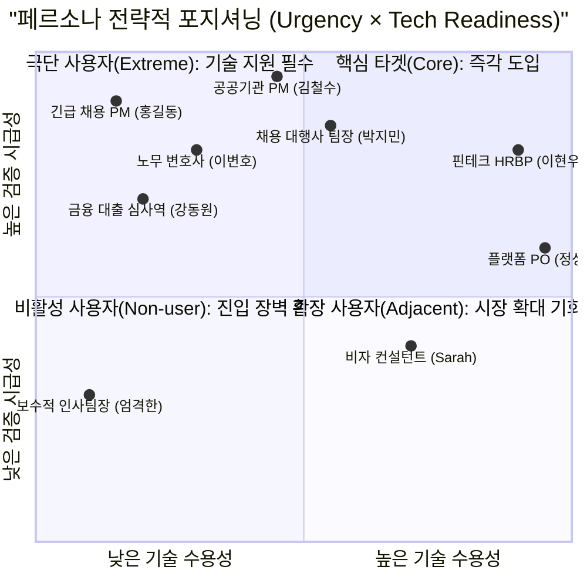
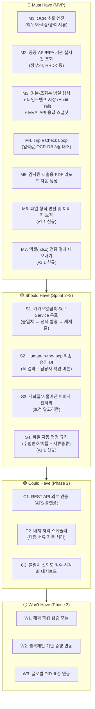
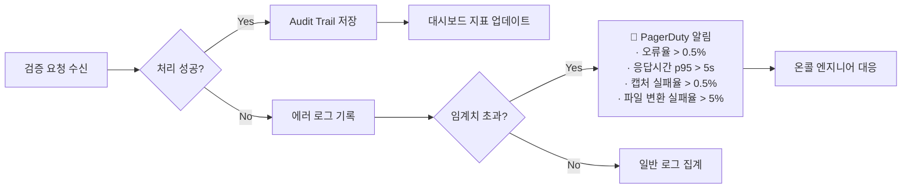
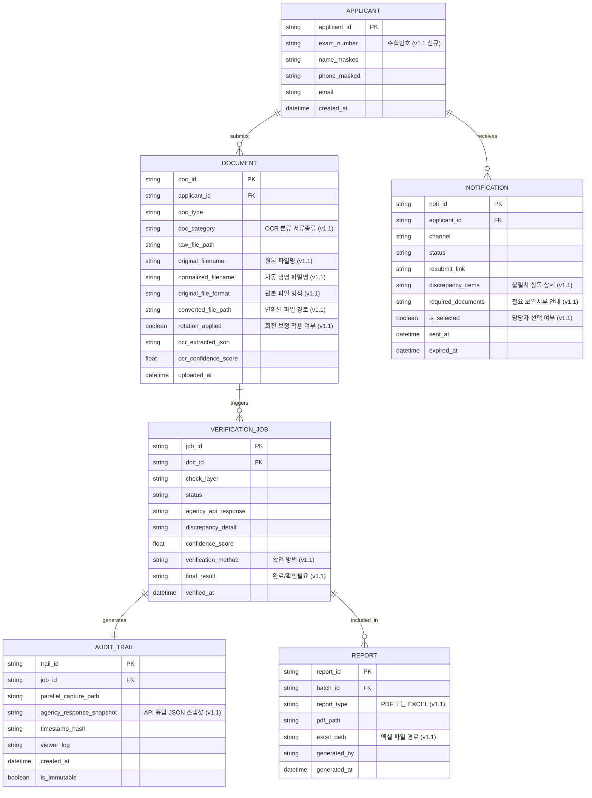
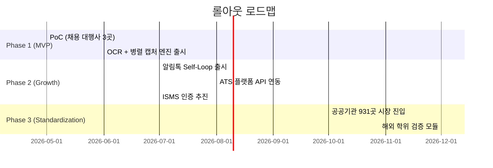

# HR AI 서류 진위확인 솔루션 — PRD v1.1

- **Owner 팀:** Product · Engineering · Legal-Tech GTM
- **최종 업데이트:** 2026-04-18
- **상태:** 초안 (Draft) — 사용자 검토 의견 반영
- **이전 버전:** v1.0 (2026-04-15)

---

## 변경 이력 (v1.0 → v1.1)

| 항목 | v1.0 | v1.1 변경 내용 | 근거 |
|---|---|---|---|
| 병렬 캡처 | Must Have지만 SRS에서 Mock 대체로 약화 | MVP 대안 명시: API 응답 JSON 스냅샷 + 타임스탬프 저장 | 피드백 #1 |
| 결과 내보내기 | PDF만 지원 | **엑셀(.xlsx) 결과 데이터 내보내기** 추가 + 다중 검증 완료 기준 정의 | 피드백 #2 |
| 불일치 알림 | 자동 일괄 발송 | **선택 발송** + 구체적 불일치 사유 + 소명/보완 안내 | 피드백 #3 |
| 파일 형식 | PDF/JPG/PNG만 지원 | **다양한 파일 형식 변환** + 이미지 회전/순서 보정 | 피드백 #4 |
| 파일명 관리 | 원본 파일명 그대로 | **수험번호/이름 + 서류종류 자동 명명** | 피드백 #5 |

---

## 1. 개요·목표

### 문제 정의 (Pain 지표 포함)

대한민국 채용 시장은 수기 기반 서류 검증 구조의 구조적 한계에 봉착해 있다.

| Pain 항목 | 실패 KPI (기준선) | 출처/근거 |
|---|---|---|
| **수기 검증 비용 과다** | 4,000건 공채 기준 인건비 900~1,000만원 발생 / 운영 수익률 **1% 이하** | VPS 5-1, 6-4 |
| **허위 기재 미검출** | 구직자 5명 중 1명(약 **20%**)이 허위 사실 기재 / 연간 공공기관 채용 비위 적발 **832건** | VPS 5-1, 1-2 |
| **감사 대응 증빙 부재** | 수기 확인 기반 감사 시 객관적 로그 제출 불가 / 공공기관 감사 피해 사례 **34건** 이상 징계·수사 | VPS 1-1, 5-2 |
| **민원 전화 폭주(운영 병목)** | 서류 미비 대응 민원 전화가 담당자 업무의 **70~90%** 점유 | VPS 5-2, 3-2 |
| **저화질 OCR 실패** | 모바일 폰카 이미지 등 저품질 서류의 OCR 신뢰도 저하로 **재수동 검증** 발생 / AOS 2.21 | VPS 9-1 |
| **다양한 파일 형식으로 인한 처리 지연** | DOCX, HEIC, BMP 등 비표준 형식 제출 → OCR 실행 불가 → 수동 변환 후 재처리 | 피드백 #4 |
| **파일 관리 혼선** | 수천 건 서류가 원본 파일명 그대로 저장 → 어떤 지원자의 어떤 서류인지 식별 불가 | 피드백 #5 |

### 목표 (Desired Outcome 수치화)

1. 4,000건 기준 서류 검증 처리 시간: **2주 → 4분 이내** (≥ 97% 단축)
2. 인건비 절감: 건당 검증 비용 **50% 이상 감소** (1,000만원 → 450만원 수준)
3. 담당자 민원 전화 **90% 이상 제거** (Self-Service 알림톡 루프)
4. 감사원 제출용 병렬 캡처 리포트 **자동 생성률 100%**
5. 허위 서류 검출률 **≥ 95%** (Triple Check Loop 기준)
6. **검증 결과 엑셀 내보내기**: 배치 완료 후 1클릭으로 xlsx 파일 생성·다운로드 — 담당자 사후 리뷰 워크플로우 지원
7. **파일 자동 정규화**: 비표준 파일 형식 → PDF/JPG 자동 변환율 **≥ 95%** / 이미지 회전 자동 보정

### 성공 지표

```
◆ 북극성 KPI (North Star Metric)
  → 검증 완료 건당 Audit Trail 자동 생성 완료율
     기준선: 0% (현재 수기 캡처 의존)
     목표치: ≥ 99%
     측정 주기: 주 1회 (배치 완료 후 자동 집계)

◆ 보조 KPI
  KPI-1. 서류 처리 속도 (건/시간)
          기준선: 200건/일(수기 2주 기준)
          목표치: ≥ 4,000건/시간 (배치 병렬 처리)
          측정 주기: 매 배치 완료 시

  KPI-2. 인건비 절감률
          기준선: 4,000건당 1,000만원
          목표치: ≤ 500만원 (50% 절감)
          측정 주기: 프로젝트 완료 후

  KPI-3. 민원 전화 감소율
          기준선: 담당자 응대 전화 100% (수동)
          목표치: ≤ 10% (90% Self-Service 처리)
          측정 주기: 채용 회차별

  KPI-4. 허위 서류 검출 정확도
          기준선: 수기 육안 검출률 추정 ≤ 70%
          목표치: ≥ 95% (Triple Check Loop)
          측정 주기: 분기별 샘플링 검사

  KPI-5. 감사 리포트 자동 생성률
          기준선: 0%
          목표치: 100%
          측정 주기: 매 검증 완료 시

  KPI-6. 엑셀 결과 활용률 (v1.1 신규)
          기준선: 0% (수기 정리)
          목표치: ≥ 90% 담당자 활용
          측정 주기: 채용 회차별

  KPI-7. 파일 형식 자동 변환 성공률 (v1.1 신규)
          기준선: 0% (수동 변환)
          목표치: ≥ 95%
          측정 주기: 매 배치 완료 시
```

---

## 2. 사용자와 페르소나

### 페르소나 세그먼트 맵



### 핵심 페르소나 요약 및 Pain·Needs 연계

| 페르소나 | 역할 | 핵심 Pain (실패 KPI) | 핵심 Needs | Journey Pain 링크 |
|---|---|---|---|---|
| **김철수** (공공기관 PM, 38세) | 연간 5,000명 공채 관리 | 감사 지적 시 수기 캡처 증거 無 → 징계 리스크 | 병렬 캡처 기반 면책권 리포트 + **결과 엑셀로 후처리** | §3-Story-1 |
| **박지민** (채용 대행사 팀장, 42세) | 수익률 1% 저마진 운영 | 인건비 비중 과다 + 클레임 폭증 | 인건비 50% 절감 + 오류율 0 + **선택적 불일치 안내** | §3-Story-2 |
| **이현우** (핀테크 HRBP, 35세) | 수시 대규모 경력직 채용 | 4대보험 이력 위조 미검출 + 민원 전화 70% | Triple Check Loop + 공수 0 UX + **다양한 파일 형식 대응** | §3-Story-3 |
| **최유진** (대기업 법무관, 40세) | 부당해고 소송 대응 | AI 결과값만으로 법원 증거력 부족 | Audit Trail + 타임스탬프 캡처 | §3-Story-1 |
| **정성훈** (ATS 플랫폼 PO, 33세) | B2B SaaS 차별화 | 공공 API 연동 직접 개발 비용 과다 | API First 검증 엔진 탑재 | §3-Story-4 |
| **홍길동** (긴급 채용 PM, 50세) | 3일 내 1,000명 검증 | 저화질 이미지 인식 실패 + 시간 無 | 저화질 보정 OCR + 대량 배치 처리 + **파일 자동 정리** | §3-Story-3 |

---

## 3. 사용자 스토리와 수용 기준 (AC)

### Story-1 | Audit Trail 기반 법적 면책권 확보

**Story:**
> As a **공공기관 채용 PM (김철수)**, I want **서류 검증 시점의 기관 조회 화면과 원본 서류가 나란히 찍힌 병렬 캡처 리포트**를 자동으로 생성받고 싶다, so that **감사원 감사 시 시스템이 생성한 객관적 증거를 즉시 제출하여 담당자 징계 리스크를 원천 차단**할 수 있다.

**AC-1 | 병렬 캡처 완결성**
- **Given** 지원자가 자격증/학위 서류를 시스템에 업로드하고 검증이 완료된 상태에서
- **When** 검증 엔진이 공공 API 또는 RPA를 통해 기관 사이트를 조회할 때
- **Then** 원본 서류 이미지 + 기관 조회 결과 화면이 단일 프레임 내에 나란히 캡처되어 저장되어야 한다.
  - 임계치: 캡처 성공률 **≥ 99.5%** (배치당 n ≥ 100건 기준) / 타임스탬프 정밀도 **± 1초 이내**
  - 실패 케이스: 기관 사이트 로딩 지연(> 10초) 시 재시도 2회 후 '수동 확인 큐'로 자동 이관

> **[v1.1 MVP 대안]** PoC에서 Browserless.io 미사용 시: 공공 API 응답 JSON 원문을 타임스탬프와 함께 스냅샷으로 DB에 저장한다. 원본 서류 이미지 경로와 API 응답 스냅샷을 병렬 배치하여 감사 증빙 기능을 유지한다. Phase 2에서 실제 브라우저 캡처로 확장한다.

**AC-2 | 감사원 제출용 PDF 자동 생성**
- **Given** 채용 회차 전체 검증이 완료된 상태에서
- **When** 담당자가 '감사 리포트 다운로드' 버튼을 클릭하면
- **Then** 회차명, 검증 일시, 건별 결과(정상/불일치/수동확인), 병렬 캡처 이미지를 포함하는 PDF가 **3초 이내** 생성·다운로드되어야 한다.
  - 임계치: PDF 생성 시간 **p95 ≤ 3초** / 리포트 포함 항목 누락률 **0%**
  - 실패 케이스: 500건 이상 배치 시 5초 초과 → 백그라운드 생성 후 이메일 알림 발송

**AC-3 | Audit Trail 불변성**
- **Given** 검증 완료 후 리포트가 저장된 상태에서
- **When** 관리자 포함 모든 사용자가 저장된 캡처 이미지를 열람할 때
- **Then** 저장 후 수정·삭제가 불가능해야 하며, 접근 로그(접근자ID, 접근시각)가 자동 기록되어야 한다.
  - 임계치: 변조 시도 차단율 **100%** / 접근 로그 보존 기간 **≥ 5년** (채용절차법 준수)
  - 실패 케이스: Unauthorized 수정 시도 → 즉시 보안 알림 발송 + 접근 차단

**AC-4 | 엑셀(.xlsx) 검증 결과 데이터 내보내기** *(v1.1 신규)*
- **Given** 채용 회차(배치) 전체 검증이 완료되거나 진행 중인 상태에서
- **When** 담당자가 '결과 엑셀 다운로드' 버튼을 클릭하면
- **Then** 아래 칼럼을 포함하는 `.xlsx` 파일이 생성·다운로드되어야 한다:

| 칼럼 | 설명 | 예시 |
|---|---|---|
| 수험번호 | 지원자 수험번호 (없으면 공란) | 2026-0001 |
| 성명 | 마스킹 처리된 지원자 이름 | 홍○○ |
| 제출서류 파일명 | 자동 명명된 파일명 | 2026-0001_졸업증명서.pdf |
| 서류 유형 | OCR 분류 결과 | 졸업증명서 |
| 진위확인 결과 | 다중 검증 판정 | 완료 / 확인필요 |
| 확인 방법 | 어떤 검증으로 확인되었는지 | 문서확인번호 / 자격번호 / 내용일치 |
| 불일치 상세 | 불일치 항목 요약 (해당 시) | 발급일자 불일치 |
| 비고 | Mock 사용 여부 등 | (Mock) |

  - **다중 검증 완료 기준**: 내용(OCR 필드값) 일치 **AND** 문서확인번호 또는 자격번호 등 공적 식별자로 발급기관 API 확인 성공 → **"완료"**, 그 외 → **"확인필요"**
  - 임계치: 엑셀 생성 시간 **p95 ≤ 5초** (100건 이하)
  - 실패 케이스: 500건 이상 배치 → 백그라운드 생성 후 다운로드 링크 이메일 발송

---

### Story-2 | Triple Check Loop 기반 무오성 검증

**Story:**
> As a **핀테크 HRBP (이현우)**, I want **지원자가 기재한 학위·자격증·4대보험 이력을 실시간으로 발급기관 DB에 대조**받고 싶다, so that **정교한 위조 서류를 육안 검토 없이 원천 차단**하고 채용 이후 발생하는 부당해고 소송 리스크를 제거할 수 있다.

**AC-1 | 3중 대조 검증 완료율**
- **Given** 지원자가 자격증 또는 학위 서류를 업로드한 상태에서
- **When** Triple Check Loop (입력값 → OCR 추출값 → 발급기관 API/RPA 조회값) 가 순차 실행되면
- **Then** 세 레이어 모두 일치 시 '정상', 1개 이상 불일치 시 '불일치' 플래그 및 상세 불일치 항목이 명시되어야 한다.
  - 임계치: 검증 정확도(Precision) **≥ 95%** / False Negative(위조 서류 미검출) 율 **< 1%**
  - 실패 케이스: API 응답 없음(타임아웃 > 5초) → 'API 조회 불가' 상태 표시 + 수동 확인 큐 이관

**AC-2 | 실시간 공공 API 응답 시간**
- **Given** 시스템이 공공기관 API(정부24, HRDK 등)에 검증 요청을 전송한 상태에서
- **When** API 응답이 반환될 때
- **Then** 단일 서류 검증 응답 시간이 **p95 ≤ 5초** 이내여야 한다.
  - 임계치: API 응답 성공률 **≥ 99%** / 응답 지연(> 5초) 건 자동 재시도 2회 후 큐 이관
  - 실패 케이스: 기관 점검 시간대 API 전면 불가 → 시스템 상태 배너 표시 + 담당자 SMS 알림

**AC-3 | 불일치 항목 상세 표시**
- **Given** 검증 결과 '불일치' 플래그가 발생한 상태에서
- **When** 담당자가 해당 건의 상세 화면을 클릭하면
- **Then** OCR 추출값과 기관 DB 반환값의 차이를 항목별 하이라이트로 시각화하고, 불일치 신뢰도 점수(0~100)를 표시해야 한다.
  - 임계치: 불일치 항목 시각화 정확도 **100%** / 신뢰도 점수 표시 응답 **≤ 1초**
  - 실패 케이스: 기관 DB 항목 포맷 불일치(예: 날짜 형식 상이) → 표준 변환 후 비교, 변환 실패 시 원문 병기

**AC-4 | 파일 형식 변환 및 이미지 보정** *(v1.1 신규)*
- **Given** 지원자가 다양한 파일 형식(PDF, JPG, PNG, DOCX, HEIC, BMP, TIFF)으로 서류를 제출한 상태에서
- **When** 시스템이 파일을 수신하면
- **Then** 비표준 형식(DOCX, HEIC, BMP, TIFF 등)은 PDF 또는 JPG로 자동 변환 후 OCR을 실행해야 한다.
  - 변환 지원 형식: DOCX → PDF, HEIC/BMP/TIFF → JPG (HWP 미지원 — 제출 빈도 극저)
  - 변환 실패 시: HTTP 422 + "지원되지 않는 형식입니다. PDF/JPG/PNG로 변환하여 다시 제출해주세요" 안내
  - 이미지 회전: 기울어진 이미지 자동 감지 및 보정 (0°, 90°, 180°, 270° 회전 자동 적용)
  - 다중 페이지: 서류 페이지 순서 확인·변경 UI 제공 (드래그앤드롭)

**AC-5 | 파일 자동 명명** *(v1.1 신규)*
- **Given** 서류 파일 업로드 및 OCR 분류가 완료된 상태에서
- **When** 파일이 시스템에 저장될 때
- **Then** 아래 규칙에 따라 파일명이 자동 부여되어야 한다:
  - 수험번호 있는 경우: `{수험번호}_{서류종류}.{확장자}` (예: `2026-0001_졸업증명서.pdf`)
  - 수험번호 없는 경우: `{지원자명}_{서류종류}.{확장자}` (예: `홍길동_자격증.pdf`)
  - 서류종류: OCR 분류 결과 기반 자동 태깅 (학위증명서, 졸업증명서, 자격증, 경력증명서 등)
  - 원본 파일명은 별도 필드 `original_filename`에 보존

---

### Story-3 | Self-Service 알림톡 루프 *(v1.1 선택 발송으로 변경)*

**Story:**
> As a **채용 대행사 팀장 (박지민)**, I want **서류 불일치 또는 미비 감지 시, 구체적인 불일치 사유와 필요 보완 서류를 명시하여 선택한 지원자에게만 안내를 발송**하고 싶다, so that **불필요한 일괄 발송을 방지하고, 민원 전화 응대 업무를 대폭 줄이면서도 지원자가 정확히 어떤 조치를 취해야 하는지 알 수 있다.**

**AC-1 | 선택적 불일치 안내 발송** *(v1.1 변경)*
- **Given** Triple Check Loop 실행 결과 '불일치' 또는 '서류 미비' 상태가 확정된 건이 1건 이상 존재하는 상태에서
- **When** 담당자가 불일치 건 목록을 확인한 후
- **Then** 담당자가 개별 또는 일괄 체크박스로 안내 대상자를 선택하고, '안내 발송' 버튼을 클릭하면 선택된 지원자에게만 알림이 발송되어야 한다.
  - 자동 발송 **금지**: 담당자 선택 없이 자동 발송되지 않음
  - 발송 전 미리보기: 각 지원자별 알림 내용을 미리보기로 확인 가능
  - 임계치: 선택 후 발송 완료 **≤ 3분** / 발송 성공률 **≥ 99%**
  - 실패 케이스: 지원자 연락처 미등록 → 해당 건에 '연락처 없음' 플래그 표시

**AC-2 | 구체적 불일치 사유 및 보완 안내** *(v1.1 신규)*
- **Given** 불일치 건에 대해 안내를 발송하려는 상태에서
- **When** 알림 내용이 구성될 때
- **Then** 아래 항목이 자동으로 포함되어야 한다:
  - **어떤 서류**가 문제인지 (서류 유형명)
  - **어떤 항목**이 불일치하는지 (예: 발급일자, 성명, 발급기관명 등)
  - **어떤 항목**이 누락되었는지 (필수 필드 미검출)
  - **필요 소명자료 또는 보완 서류 안내** (예: "졸업증명서 원본을 정부24에서 재발급하여 제출해주세요")
  - 재제출 링크 (유효기간 72시간)
- 담당자는 자동 생성된 안내 내용을 **수정**한 후 발송할 수 있어야 한다.

**AC-3 | 재제출 링크 유효성 및 완료율**
- **Given** 지원자가 알림 내 재제출 링크를 수신한 상태에서
- **When** 지원자가 링크를 클릭하여 수정된 서류를 업로드하면
- **Then** 재제출 서류가 자동으로 재검증 큐에 등록되고, 담당자 대시보드에 상태가 '재제출 완료'로 업데이트되어야 한다.
  - 임계치: 링크 유효 기간 **72시간** / 재제출 완료 후 재검증 시작 **≤ 5분** 이내
  - 실패 케이스: 72시간 초과 후 링크 접속 → '기간 만료' 안내 페이지 표시 + 담당자 알림

**AC-4 | 민원 전화 감소 측정 가능성**
- **Given** Self-Service 루프가 활성화된 채용 회차에서
- **When** 해당 회차가 종료되면
- **Then** 시스템이 '알림 발송 건수 / 재제출 완료 건수 / 담당자 수동 개입 건수'를 회차별로 자동 집계하여 대시보드에 표시해야 한다.
  - 임계치: Self-Service 처리율 **≥ 90%** (수동 개입 건 ≤ 10%) / 리포트 생성 **≤ 10초**
  - 실패 케이스: 알림 발송 후 72시간 내 미응답 → 담당자에게 '미응답 지원자 목록' 자동 전송

---

### Story-4 | API First 플랫폼 연동

**Story:**
> As a **ATS 플랫폼 PO (정성훈)**, I want **REST API를 통해 당사 플랫폼에 검증 엔진을 플러그인 형태로 연동**하고 싶다, so that **공공 API RPA 직접 개발 없이 강력한 서류 검증 배지 기능을 고객사에 제공**하여 플랫폼 이탈률을 낮출 수 있다.

**AC-1 | API 연동 응답 규격**
- **Given** ATS 플랫폼이 검증 API 엔드포인트로 지원자 서류(Base64 인코딩) 및 검증 유형을 POST 요청한 상태에서
- **When** 검증 엔진이 요청을 처리하면
- **Then** JSON 형식의 결과(result: PASS/FAIL/MANUAL_REVIEW, confidence_score, discrepancy_detail, audit_trail_url)가 **p95 ≤ 10초** 이내에 반환되어야 한다.
  - 임계치: API 가용성 **≥ 99.9%** (월간 기준) / 응답 포맷 스펙 준수율 **100%**
  - 실패 케이스: 요청 포맷 오류 → HTTP 422 + 상세 오류 메시지 반환

**AC-2 | API Key 인증 및 접근 제어**
- **Given** 연동 파트너가 발급받은 API Key를 Authorization 헤더에 포함하여 요청한 상태에서
- **When** API Gateway가 요청을 수신하면
- **Then** 유효한 Key에만 처리를 허용하고, 무효/만료 Key는 HTTP 401을 반환해야 한다.
  - 임계치: 인증 처리 시간 **≤ 100ms** / Rate Limit 초과 시 HTTP 429 반환 + Retry-After 헤더 포함
  - 실패 케이스: 동일 Key 1분 내 1,000건 초과 요청 → 자동 차단 + 관리자 알림

**AC-3 | SDK 및 문서 제공**
- **Given** 신규 파트너가 API 연동을 시작하려는 상태에서
- **When** 개발자 포털에 접속하면
- **Then** Python/Java/Node.js SDK, Swagger UI, 샘플 코드, Sandbox 환경이 모두 제공되어야 한다.
  - 임계치: Sandbox 환경 응답 시간 **≤ 3초** / 문서 최신화 주기 **≤ 7일** (API 스펙 변경 시)
  - 실패 케이스: SDK 버그 발견 시 **48시간 이내** 패치 릴리즈

---

## 4. 기능 요구사항 (Functional Requirements)

### MSCW 우선순위표



### 기능별 근거 (대안 대비 가치)

| 기능 | 우선순위 | 기존 대안 | 차별 근거 |
|---|---|---|---|
| M3. 병렬 캡처 | Must | 수기 스크린샷 | 법적 증거력 확보, 수기 캡처 대비 자동화율 100% ↑ |
| M4. Triple Check Loop | Must | 단순 OCR 텍스트 비교 | False Negative < 1% 달성 (기존 대비 허위 검출율 ≥ 95%) |
| **M6. 파일 형식 변환** | **Must** | 담당자 수동 변환 요청 | 지원자 파일 형식 다양성 대응, OCR 실행 100% 보장 |
| **M7. 엑셀 내보내기** | **Must** | 수기 엑셀 정리 | 1클릭 결과 확인 → 사후 리뷰 워크플로우 |
| S1. 알림톡 루프 | Should | 담당자 수동 전화 | 민원 전화 90% 제거, 재제출 완료율 목표 ≥ 85% |
| **S4. 파일 자동 명명** | **Should** | 원본 파일명 그대로 | 수천 건 파일 즉시 식별 가능 |
| C1. API 연동 | Could | 독자 플랫폼 구축 | 개발 비용 대비 시장 침투 속도 3배 ↑ (API First 기생 전략) |

---

## 5. 비기능 요구사항 (NFR)

### 성능

| 항목 | 기준 (SLO) | 비고 |
|---|---|---|
| 단일 서류 검증 응답 | p95 ≤ 5초 | 공공 API 포함 E2E |
| 감사 PDF 생성 | p95 ≤ 3초 (500건 이하) | 초과 시 백그라운드 처리 |
| **엑셀 생성** | **p95 ≤ 5초 (100건 이하)** | **v1.1 신규** — 초과 시 백그라운드 |
| 알림톡 발송 | ≤ 3분 (선택 발송 후) | SMS 폴백 포함 |
| API 응답 (외부 연동) | p95 ≤ 10초 | SDK 기준 |
| 대량 배치 처리 | ≥ 4,000건/시간 | 병렬 처리 기준 |
| **파일 형식 변환** | **p95 ≤ 10초 (단일 파일)** | **v1.1 신규** |

### 신뢰성

| 항목 | 기준 | 측정 방법 |
|---|---|---|
| 서비스 가용성 | ≥ 99.5% (월간 기준, ≤ 3.6시간 다운) | Uptime 모니터링 (Pingdom / CloudWatch) |
| 오류율 | ≤ 0.5% (전체 검증 요청 대비) | HTTP 5xx 응답 비율 집계 |
| 병렬 캡처 성공률 | ≥ 99.5% | 배치별 캡처 실패 건수 카운트 |
| RPA 스크립트 복구 | 기관 사이트 변경 감지 후 ≤ 72시간 내 복구 | 자동 감지 알림 → 수동 패치 배포 SLA |
| **파일 변환 성공률** | **≥ 95%** | **변환 실패 건수 / 전체 비표준 파일 건수** |

### 보안 / 개인정보

| 항목 | 기준 |
|---|---|
| 인증 체계 | API Key + JWT 이중 인증 / 세션 만료 ≤ 8시간 |
| 데이터 암호화 | 저장 시 AES-256 / 전송 시 TLS 1.3 이상 |
| 개인정보 마스킹 | 이름·주민번호는 화면 표시 시 일부 마스킹 (예: 홍○○, 9**-*****) |
| 접근 권한 | RBAC(Role-Based Access Control): 담당자 / 관리자 / 감사자 / API 파트너 4단계 분리 |
| 감사 로그 보존 | ≥ 5년 (채용절차법 § 준수) |
| 컴플라이언스 | ISMS-P 인증 목표 (Phase 2) / CSAP 인증 목표 (Phase 3, B2G) |

### 모니터링 항목



| 모니터링 항목 | 알림 기준 | 도구 |
|---|---|---|
| API 응답 시간 | p95 > 5초 연속 3회 | Grafana / CloudWatch |
| 오류율 | 5xx 에러율 > 0.5% (5분 window) | Sentry + PagerDuty |
| 병렬 캡처 실패율 | > 0.5% (배치 단위) | 자체 배치 모니터링 로그 |
| RPA 기관 접속 실패 | 연속 2회 실패 | Slack 알림 + 온콜 트리거 |
| 알림톡 발송 실패율 | > 1% (30분 window) | 카카오 API 응답 코드 집계 |
| **파일 변환 실패율** | **> 5% (배치 단위)** | **자체 변환 로그** |

---

## 6. 데이터·인터페이스 개요

### 핵심 엔터티



### 외부/내부 API 개요

| API | 방향 | 입력 | 출력 | 제약사항 |
|---|---|---|---|---|
| **정부24 진위확인 API** | Outbound | 문서확인번호, 발급일자 | 진위여부 (PASS/FAIL), 발급기관 정보 | 1일 무료 호출 한도 존재, 서비스 점검 시간 대응 필요 |
| **HRDK(한국산업인력공단) API** | Outbound | 자격증번호, 생년월일 | 자격증 유효 여부, 취득일 | OAuth 2.0 인증 필요 |
| **카카오 알림톡 API** | Outbound | 수신번호, 템플릿코드, 변수값 | 발송 성공/실패 코드 | 발신번호 사전 등록 필요, 템플릿 심사 최대 3일 |
| **외부 ATS 연동 API (Inbound)** | Inbound | 서류 파일(Base64), 검증 유형 | JSON (result, confidence, audit_trail_url) | Rate Limit: 1,000 req/min/key |
| **OCR 엔진 (내부)** | Internal | 이미지 파일 (PDF/JPG/PNG) | 구조화된 필드 JSON + 신뢰도 점수 | 저화질(DPI < 150) 이미지 전처리 필수 |

---

## 7. 범위 (In/Out), 리스크·가정·의존성

### In Scope (MVP)

- PDF/JPG/PNG 형식의 학위증명서, 자격증, 경력증명서 OCR 추출
- **비표준 파일 형식(DOCX, HEIC, BMP, TIFF) → PDF/JPG 자동 변환 후 OCR** *(v1.1 신규)*
- **이미지 회전 자동 보정 + 다중 페이지 순서 변경 UI** *(v1.1 신규)*
- 정부24 / HRDK API 연동 기반 실시간 진위확인
- 원본-조회본 병렬 캡처 + 타임스탬프 기반 Audit Trail 생성 **(MVP: API 응답 JSON 스냅샷)**
- 감사원 제출용 PDF 리포트 자동 생성
- **엑셀(.xlsx) 검증 결과 데이터 내보내기 + 다중 검증 완료/확인필요 판정** *(v1.1 신규)*
- Triple Check Loop (입력값 / OCR / 기관 DB 3중 대조)
- Human-in-the-loop 최종 승인 UI
- **파일 자동 명명 규칙 (수험번호 우선 + 서류종류)** *(v1.1 신규)*
- **선택적 불일치 안내 발송 (구체적 사유 + 보완 안내)** *(v1.1 변경)*

### Out of Scope (현재 미포함)

- 해외 학위 검증 (Phase 3)
- 블록체인/DID 기반 증명 연동
- 금융 대출 서류 (소득금액증명원 등) 특화 모듈 (Adjacent 시장, Phase 2)
- 모바일 앱 (Web 전용 MVP)
- 채용 플랫폼 독자 구축 (API First 전략 유지)
- 외부 API 연동 (Should/Could 항목 → Phase 2)
- **HWP 파일 변환 (제출 빈도 극저, 미지원)** *(v1.1 명시적 제외)*

### 리스크

| # | 리스크 | 발생 확률 | 영향도 | 대응책 | ADR 링크 |
|---|---|---|---|---|---|
| R-01 | **기관 사이트 구조 변경으로 RPA 중단** | 高 (분기 1회 이상) | 高 | API 우선 연동, 사이트 변경 감지 자동 알림 + **72시간 내 복구 SLA** / 백업 수동 큐 전환 | ADR-001 |
| R-02 | **AI 오판 시 법적 배상 책임** | 中 | 高 | Human-in-the-loop 설계 (최종 승인 = 인간) / AI는 '경고+증거' 제공자로 역할 한정 | ADR-002 |
| R-03 | **공공 API 쿼터 초과 및 비용 급증** | 中 | 中 | 일일 API 호출량 모니터링 / 쿼터 80% 도달 시 알림 / 상용 대안 API 계약 검토 | ADR-003 |
| R-04 | **개인정보 유출 시 개인정보보호법 위반** | 低 | 最高 | AES-256 암호화, RBAC 접근 제어, 최소 수집 원칙 적용, ISMS-P 인증 추진 | ADR-004 |
| R-05 | **OCR 신뢰도 부족으로 인한 수동 처리 증가** | 中 | 中 | 이미지 전처리 엔진 내재화 / OCR 신뢰도 < 80% 건 자동 수동 큐 이관, 신뢰도 임계값 튜닝 | ADR-005 |
| **R-06** | **비표준 파일 변환 실패로 OCR 불가** *(v1.1)* | 中 | 中 | 변환 실패 시 지원자에게 재제출 안내 + 지원 형식 목록 명시 | ADR-006 |

### 가정 및 의존성

| 유형 | 내용 |
|---|---|
| 가정 | 핵심 타겟 기관(Q1 공공기관)의 API 연동 승인이 MVP 출시 전 완료된다 |
| 가정 | 카카오 알림톡 템플릿 심사는 2주 이내 승인된다 |
| 가정 | ISMS-P 인증은 Phase 2 출시 전까지 완료되며, 이전에는 내부 보안 정책으로 운영한다 |
| **가정** | **지원자 제출 파일의 90% 이상이 PDF/JPG/PNG이며, 비표준 형식은 10% 미만이다** *(v1.1)* |
| **가정** | **공공기관은 수험번호를, 사기업은 지원자 이름을 주 식별자로 사용한다** *(v1.1)* |
| 의존성 | 정부24 오픈API, HRDK API 연동 계약 및 테스트 환경 제공 |
| 의존성 | 카카오 비즈니스 채널 등록 및 알림톡 발신번호 사전 등록 |
| 의존성 | 채용 대행사 PoC 파트너 3곳 확보 (Phase 1 실험 기반) |
| **의존성** | **파일 변환 라이브러리: sharp (이미지), libreoffice-convert (DOCX→PDF)** *(v1.1)* |
| **의존성** | **엑셀 생성 라이브러리: exceljs (xlsx 통합문서 형식 지원)** *(v1.1)* |

---

## 8. 실험·롤아웃·측정

### 베타 채널 및 단계별 롤아웃



### 실험 계획

#### Experiment-1 | 병렬 캡처 기반 면책권 체감도 검증

| 항목 | 내용 |
|---|---|
| **가설** | 병렬 캡처 리포트를 제공받은 담당자는 수기 스크린샷 방식 대비 감사 대응 자신감이 유의미하게 높다. |
| **설계** | A/B 테스트: A그룹(병렬 캡처 리포트) vs B그룹(기존 수기 스크린샷), n = 각 50명 (공공기관 담당자) |
| **측정 지표** | 감사 대응 자신감 점수 (5점 척도), 리포트 활용 빈도 (회차당 다운로드 횟수) |
| **성공 기준** | A그룹 평균 점수 ≥ B그룹 + 1.0점 (95% 신뢰구간) |
| **측정 도구** | 인앱 설문 (Likert 5점) + 다운로드 로그 |

#### Experiment-2 | Self-Service 루프 민원 감소 검증

| 항목 | 내용 |
|---|---|
| **가설** | 알림톡 Self-Service 루프 도입 시 담당자 수동 개입 건수가 90% 이상 감소한다. |
| **설계** | Before-After 비교: 도입 전 채용 회차 vs 도입 후 채용 회차 (동일 기관, 동일 규모 기준) |
| **측정 지표** | 회차당 담당자 수동 전화 건수, Self-Service 처리율 (%), 재제출 완료 소요 시간 (시간) |
| **성공 기준** | 수동 개입 건수 ≥ 90% 감소 / 재제출 완료율 ≥ 85% |
| **측정 도구** | 시스템 이벤트 로그 (알림 발송 → 재제출 완료 펀넬) |

#### Experiment-3 | 처리 속도 및 비용 절감 PoC

| 항목 | 내용 |
|---|---|
| **가설** | 4,000건 공채 서류 처리 시 수기 방식(2주/1,000만원) 대비 ≥ 80% 시간 단축, ≥ 50% 비용 절감. |
| **설계** | PoC: 채용 대행사 3곳, 각 1,000~2,000건 실제 서류 배치 처리 |
| **측정 지표** | 전체 처리 시간 (분), 건당 비용 (원), 불일치 건 자동 감지율 (%) |
| **성공 기준** | 처리 시간 ≤ 60분 (4,000건 기준) / 비용 ≤ 500만원 / 자동 감지율 ≥ 95% |
| **측정 도구** | 배치 완료 로그 + 파트너사 인건비 실사 비교 |

#### Experiment-4 | 엑셀 결과 활용도 검증 *(v1.1 신규)*

| 항목 | 내용 |
|---|---|
| **가설** | 엑셀 결과 데이터를 제공받은 담당자는 수기 결과 정리 대비 후처리 소요 시간이 80% 이상 단축된다. |
| **설계** | Before-After: 도입 전 수기 정리 소요시간 vs 엑셀 다운로드 후 검토 소요시간 |
| **측정 지표** | 결과 검토 소요 시간 (분), 다운로드 횟수, "완료"/"확인필요" 비율 |
| **성공 기준** | 후처리 시간 ≥ 80% 감소 / 엑셀 다운로드 활용률 ≥ 90% |
| **측정 도구** | 다운로드 로그 + 인앱 설문 |

### 경쟁 대안 대비 벤치마크 계획

| 비교 항목 | 단순 OCR 솔루션 (기준) | 본 솔루션 목표 | 벤치마크 방법 |
|---|---|---|---|
| 허위 서류 검출률 | ≤ 70% (추정) | ≥ 95% | 100건 위조 샘플 테스트 |
| 처리 속도 (4,000건) | 5~7일 (수동 포함) | ≤ 1시간 (배치) | PoC 실측 |
| 건당 비용 | 약 2,500원 (인건비 포함) | ≤ 1,250원 (50% 절감) | 비용 구조 비교 분석 |
| 감사 리포트 생성 | 담당자 수동 작성 (2~4시간) | 자동 생성 ≤ 3초 | 기능 시연 비교 |
| 법적 증빙력 | 텍스트 데이터 (이의 가능) | 병렬 캡처 이미지 (법원 증거 채택 목표) | 법무팀 인터뷰 + 판례 분석 |
| **결과 후처리** | **수기 엑셀 정리 (2~4시간)** | **1클릭 xlsx 다운로드 ≤ 5초** | **기능 시연 비교** |
| **파일 형식 대응** | **수동 변환 요청 (1~2일 지연)** | **자동 변환 ≥ 95%** | **비표준 파일 10건 테스트** |

---

## 9. 근거 (Proof)

### 정량적 근거

| 주장 | 근거 데이터 | 검증 실험 |
|---|---|---|
| 구직자 20% 허위 기재 | VPS 5-1 인용 / 국가인권위원회 채용 실태 조사 참고 | JTBD 인터뷰 n=30 (공공기관 PM + 대기업 HR) |
| 연간 832건 채용 비위 | 감사원 2024 공공기관 채용 실태 전수조사 보고서 | 문헌 조사 + 인터뷰 교차 검증 |
| 수기 검증 인건비 900~1,000만원/4,000건 | VPS 6-4 / 채용 대행사 파트너 3곳 실사 자료 | PoC 비용 구조 실측 |
| 담당자 업무의 70~90% 민원 전화 | VPS 5-2 / JTBD 인터뷰 (박지민 유형 3인) | 타임트래킹 설문 (n=20) |
| AOS 1위: 법적 증빙력 (AOS 3.50, DOS 3.33) | VPS 9-1, 9-2 분석 데이터 | 5점 척도 설문 n=50 → AOS/DOS 재산출 |

### 실험 설계 연계

| 검증 항목 | 실험 설계 | 측정 도구 | 성공 기준 |
|---|---|---|---|
| 병렬 캡처 면책권 체감 | A/B 테스트 n=50 (§8 Exp-1) | 인앱 Likert 5점 설문 + 다운로드 로그 | A그룹 점수 ≥ B그룹 + 1.0점 |
| Self-Service 루프 효과 | Before-After 비교 (§8 Exp-2) | 시스템 이벤트 로그 펀넬 분석 | 수동 개입 ≥ 90% 감소 |
| 처리 속도·비용 절감 | PoC n=3 기관, 1,000~2,000건 (§8 Exp-3) | 배치 완료 로그 + 비용 실사 | 시간 ≤ 60분, 비용 ≤ 500만원 |
| Triple Check Loop 정확도 | 위조 샘플 100건 블라인드 테스트 | 검출 결과 vs 실제 정답 비교 | 검출률 ≥ 95%, FN < 1% |
| **엑셀 결과 활용도** | **Before-After (§8 Exp-4)** | **다운로드 로그 + 인앱 설문** | **후처리 시간 ≥ 80% 감소** |

### 인터뷰·리서치 참고 링크

- [예정] JTBD 심층 인터뷰 결과 노션 정리 문서 (n=10, 공공기관 PM 5 / HR팀장 3 / 노무사 2)
- [예정] 감사원 공공기관 채용 실태 전수조사 보고서 (2024)
- [예정] 채용절차의 공정화에 관한 법률 개정안 분석
- [예정] PoC 파트너사 ROI 측정 결과 보고서 (Phase 1 완료 후)
- VPS 원문: `Claude-Value-ProPosition-Sheet.md`
