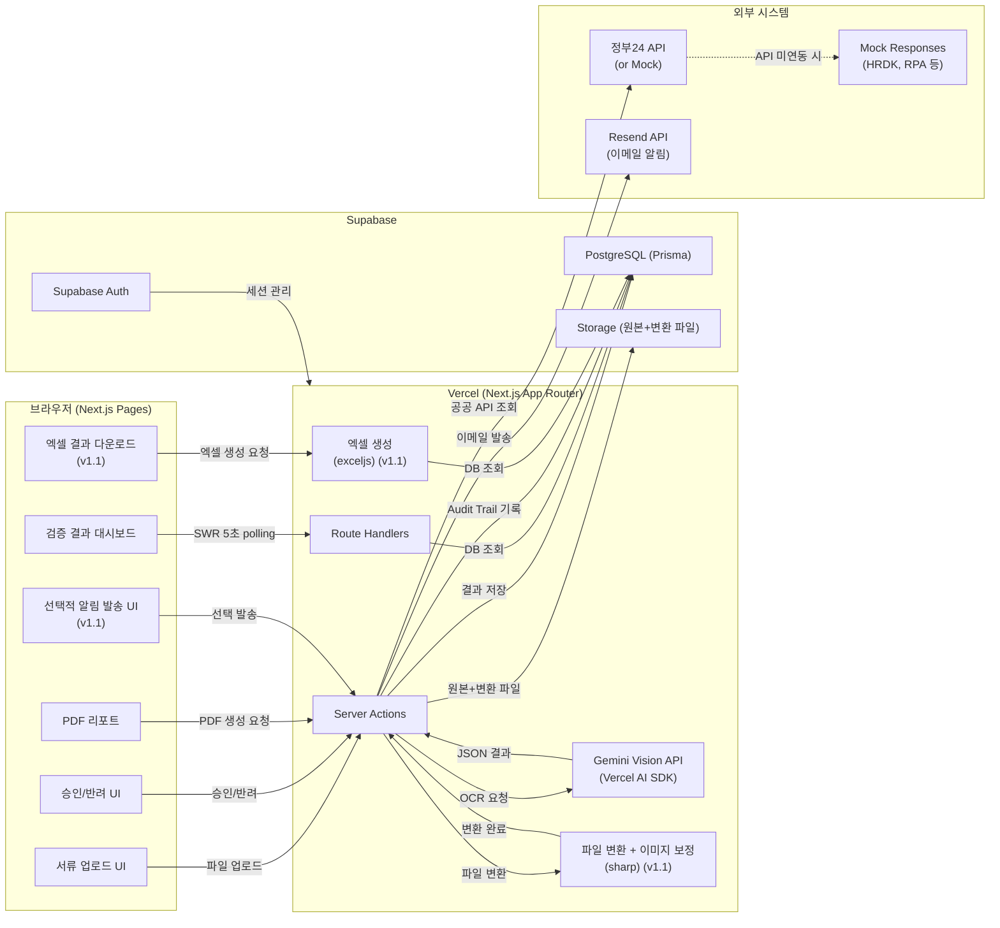
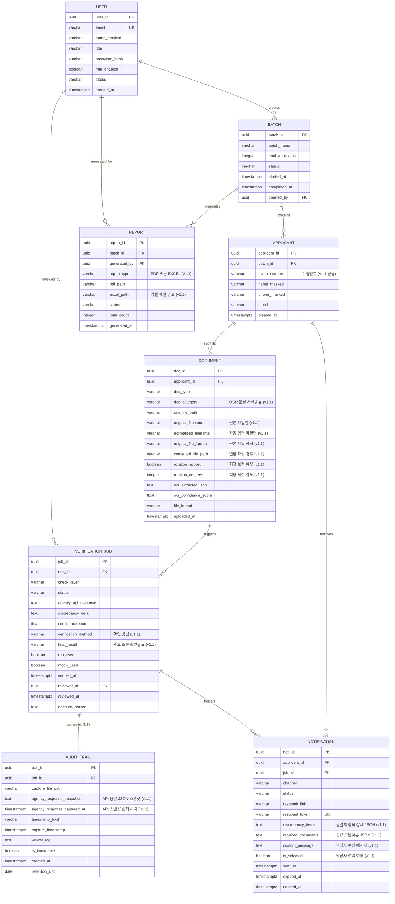
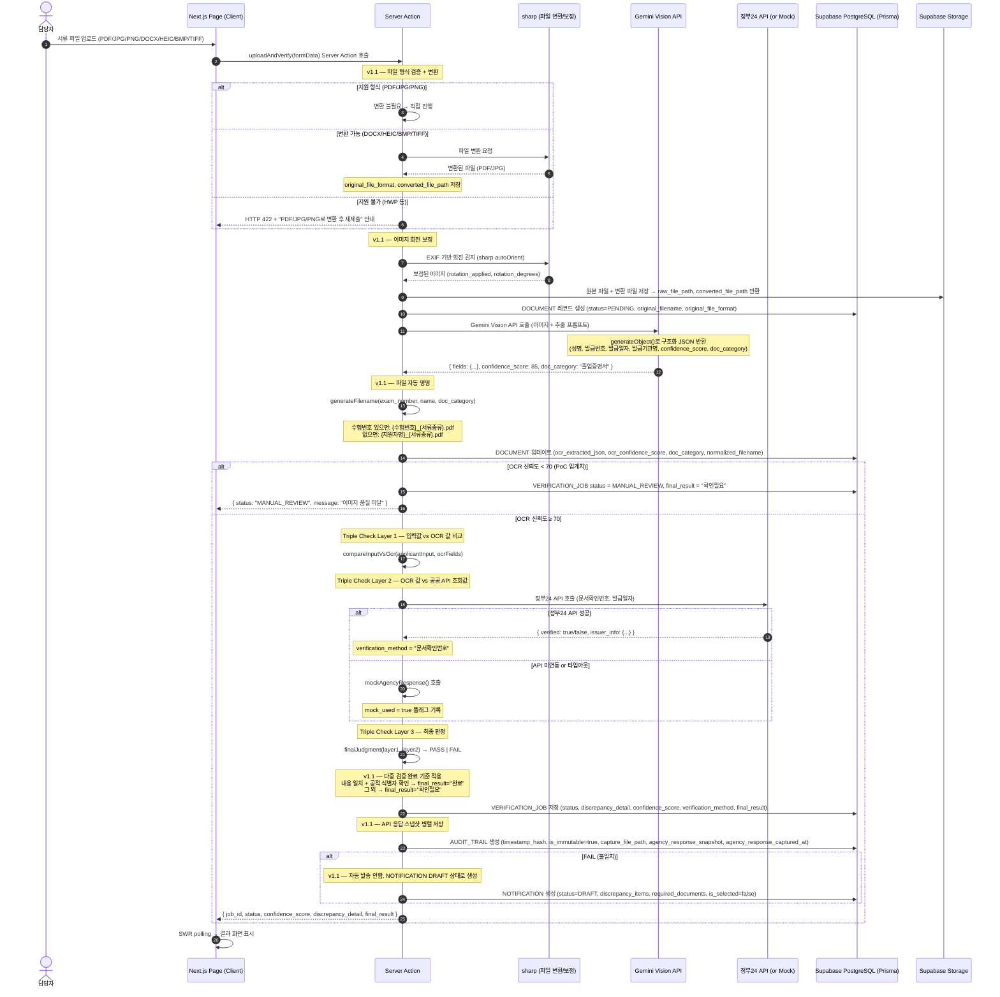
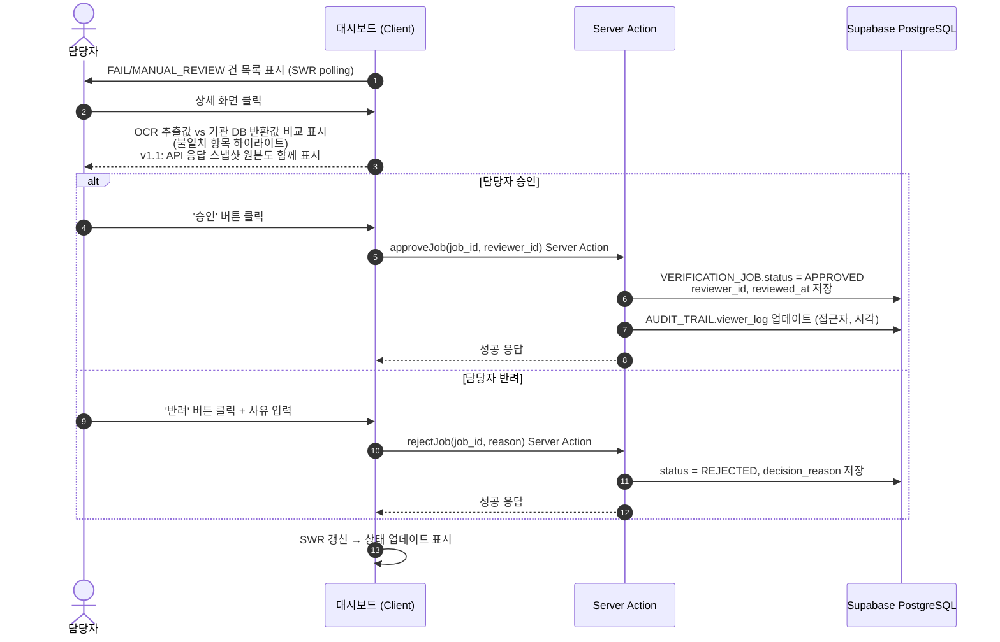
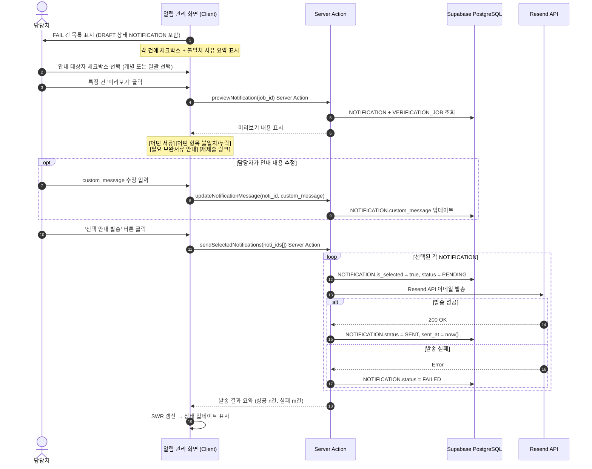
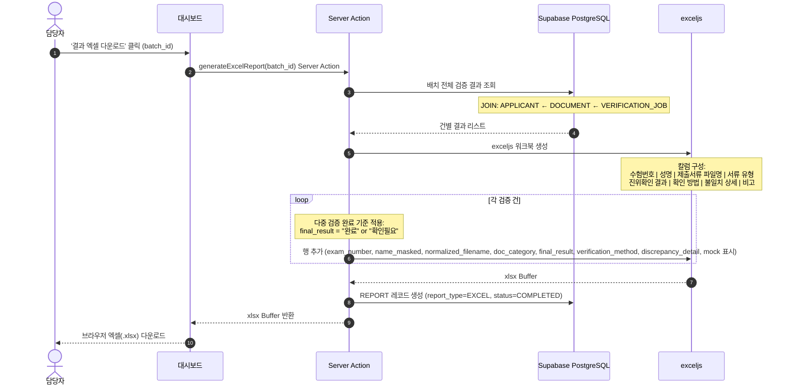
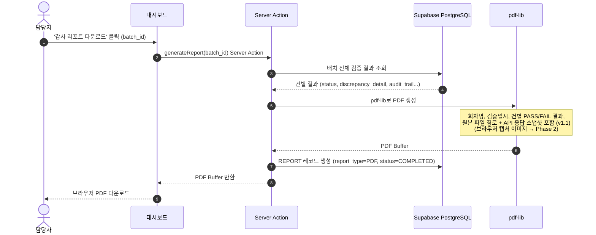
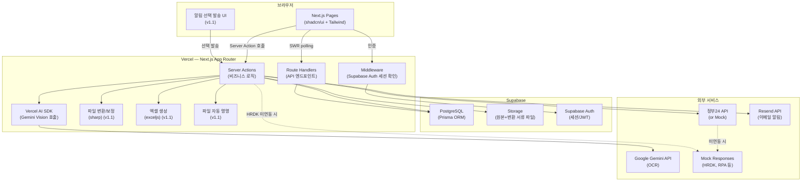
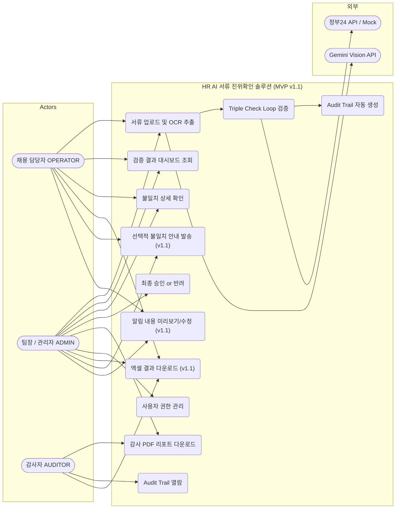
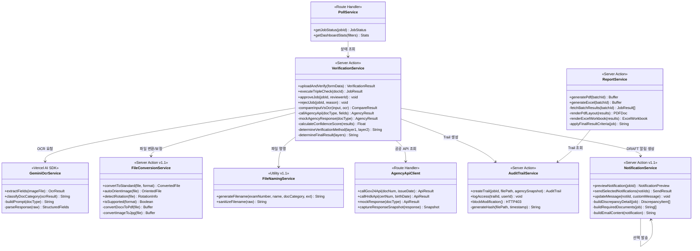

# HR AI 서류 진위확인 솔루션
# Software Requirements Specification (SRS) v1.1 — MVP / PoC 기준
**Document ID:** SRS-001  
**Revision:** 1.1  
**Date:** 2026-04-18  
**Standard:** ISO/IEC/IEEE 29148:2018  
**Status:** MVP PoC 기준 — 사용자 검토 의견 반영  
**Tech Stack:** Next.js (App Router) · Supabase (PostgreSQL) · Prisma · Gemini API (Vercel AI SDK) · Tailwind CSS · shadcn/ui · Vercel · exceljs · sharp  

---

## 변경 이력 (Revision History)

| 버전 | 날짜 | 작성자 | 변경 내용 |
|---|---|---|---|
| 0.2-Opus | 2026-04-15 | Opus | ERD·Use Case·Class·Component Diagram 추가; 기본 SRS 구조 |
| 0.2-Sonnet | 2026-04-15 | Sonnet | USER·ORGANIZATION 엔터티; RTM 양방향; 시스템 모드 추가 |
| 0.3 | 2026-04-16 | MVP Review | **PoC 범위 재조정**: Inngest/QStash/Browserless.io 제거; 바이브코딩 입문자 기준 단순화; C-TEC 스택 정의; Mock/Dummy 대체 목록 명시; 기술 스택 SQLite(로컬)→Supabase(배포) 전략 추가 |
| **1.1** | **2026-04-18** | **User Review** | **사용자 검토 의견 5건 반영**: ① 병렬 캡처 MVP 대안(API 응답 스냅샷) 명시 ② 엑셀(.xlsx) 결과 내보내기 + 다중 검증 완료 기준 ③ 선택적 불일치 안내 + 구체적 사유/보완 안내 ④ 파일 형식 변환 + 이미지 보정 ⑤ 파일 자동 명명 규칙. ERD/Prisma 반영, Sequence Diagram 추가, RTM 갱신 |

---

> ## ⚠️ v1.1 변경 핵심 원칙
>
> 본 문서는 v0.3의 "입문자 수준 바이브코딩 MVP" 원칙을 유지하면서, **실무 운영 관점의 5가지 사용자 피드백**을 반영합니다.
>
> **v0.3 대비 추가된 것 (v1.1):**
> - 병렬 캡처 MVP 대안: API 응답 JSON 스냅샷 + 원본 파일 병렬 저장
> - 엑셀(.xlsx) 검증 결과 내보내기 (exceljs 라이브러리)
> - 선택적 불일치 안내 발송 + 구체적 사유/보완 안내
> - 파일 형식 변환(DOCX→PDF, HEIC/BMP/TIFF→JPG) + 이미지 회전 보정 (sharp)
> - 파일 자동 명명 (`{수험번호}_{서류종류}` 또는 `{지원자명}_{서류종류}`)
> - 다중 검증 완료 기준 정의 (내용 일치 + 공적 식별자 확인 → "완료")
>
> **유지된 것:** C-TEC 스택, Mock/Dummy 전략, 입문자 난이도 기준, HWP 미지원

---

---

# 1. PoC 범위 및 MVP 설계 기준 (PoC Scope Definition)

## 1.1 이 PoC에서 증명해야 하는 핵심 요소

아래 항목은 **실제로 동작하는 코드로 구현**되어야 한다.

| 증명 항목 | 증명 방법 | 연계 기능 |
|---|---|---|
| Gemini Vision으로 서류 이미지에서 필드를 추출할 수 있다 | 실제 학위증명서 이미지 업로드 → JSON 반환 확인 | F1 (OCR) |
| 정부24 API를 호출하여 진위여부를 확인할 수 있다 | 실제 API 키로 호출 성공 or Mock 응답 분기 확인 | F2 (API 조회) |
| OCR값 vs 기관 DB값의 불일치를 자동으로 탐지할 수 있다 | 의도적 불일치 데이터로 FAIL 판정 확인 | F4 (Triple Check) |
| 검증 결과가 DB에 저장되고 Audit Trail이 자동 생성된다 | DB 레코드 + 스크린샷 파일 저장 확인 | F3 (Audit Trail) |
| **API 응답 스냅샷이 원본 서류와 함께 병렬 저장된다** *(v1.1)* | **AUDIT_TRAIL.agency_response_snapshot 필드 + capture_file_path 동시 저장 확인** | **F3 (병렬 캡처 MVP 대안)** |
| 담당자가 AI 결과를 보고 승인/반려할 수 있다 | 웹 UI 버튼 클릭 → DB 상태 변경 확인 | F5 (Human-in-the-loop) |
| 검증 완료 후 PDF 리포트를 다운로드할 수 있다 | PDF 파일 생성 + 브라우저 다운로드 확인 | F6 (PDF 리포트) |
| **검증 결과를 엑셀(.xlsx)로 내보낼 수 있다** *(v1.1)* | **exceljs로 xlsx 생성 + 브라우저 다운로드 확인** | **F7 (엑셀 내보내기)** |
| **비표준 파일 형식을 자동 변환할 수 있다** *(v1.1)* | **DOCX → PDF, HEIC → JPG 변환 후 OCR 실행 확인** | **F8 (파일 변환)** |
| **파일명이 자동으로 명명된다** *(v1.1)* | **수험번호/이름 + 서류종류 형태 파일명 DB 저장 확인** | **F9 (파일 자동 명명)** |

## 1.2 현 단계에서 Mock/Dummy로 대체하는 요소

아래 항목은 **실제 구현이 아닌 Mock 응답**으로 대체하며, 코드 내 주석으로 "향후 실제 연동 예정"을 명시한다.

| Mock 대체 항목 | 이유 | 대체 방식 |
|---|---|---|
| RPA 기반 기관 사이트 조회 | Puppeteer/Playwright가 Vercel 실행 불가; Browserless.io 유료·복잡 | `mockAgencyResponse()` 함수로 하드코딩 응답 반환 |
| HRDK API 실제 연동 | OAuth 2.0 계약 필요; PoC 시점 미체결 가능성 | Mock JSON 응답 반환 (자격증 유효 여부 고정값) |
| 카카오 알림톡 실발송 | 발신번호 사전 등록 + 템플릿 심사 2주 소요 | `console.log` + 대시보드 알림 텍스트 표시 |
| **병렬 캡처 이미지 (기관 조회 화면 브라우저 캡처)** *(v1.1 명확화)* | Vercel Serverless에서 Headless Browser 실행 불가 | **API 응답 JSON 원문을 AUDIT_TRAIL.agency_response_snapshot에 스냅샷으로 저장 + 타임스탬프 기록 (Phase 2에서 실제 브라우저 캡처 구현)** |
| 배치 처리 (4,000건/시간) | PoC 목적 = 단일 서류 흐름 검증 | 단일 건 처리만 구현; 배치는 루프로 순차 처리 |
| Supabase Realtime WebSocket | 입문자 구현 난이도 높음 | SWR 5초 polling으로 대체 |

## 1.3 현 단계에서 완전히 제외하는 요소 (Phase 2+)

| 제외 항목 | 재고 시점 |
|---|---|
| REST API 외부 연동 (ATS 플랫폼 SDK, 개발자 포털) | Phase 2 |
| ORGANIZATION 멀티테넌시 | Phase 2 |
| False Negative 분기별 샘플링 배치 | 운영 단계 |
| ISMS-P / CSAP 인증 | Phase 2~3 |
| 해외 학위 검증 | Phase 3 |
| 블록체인/DID 연동 | Phase 3 |
| **HWP 파일 변환** *(v1.1 명시적 제외)* | **제출 빈도 극저; 지원자에게 PDF 변환 후 재제출 안내** |

---

---

# 2. Tech Stack Constraints (기술 스택 정의)

> **C-TEC** 시리즈는 이 프로젝트의 기술 선택 기준을 고정한다. AI 코드 생성 시 이 스택 외 도구를 제안하면 거절한다.

## 2.1 시스템 내부 — 단일 통합 프레임워크

| ID | 제약사항 | 세부 내용 |
|---|---|---|
| **C-TEC-001** | 모든 서비스는 **Next.js (App Router)** 기반 단일 풀스택으로 구현 | 프론트엔드와 백엔드를 별도 분리하지 않는다. 별도 Express/FastAPI/NestJS 서버 금지 |
| **C-TEC-002** | 서버 로직은 **Next.js Server Actions** 또는 **Route Handlers** 만 사용 | 별도 백엔드 서버 없이 서버 로직 처리. `use server` 지시어 적극 활용 |
| **C-TEC-003** | DB는 **Prisma + 로컬 SQLite**(개발) → **Prisma + Supabase PostgreSQL**(배포) | 환경변수 `DATABASE_URL`만 바꿔 마이그레이션. JSON 타입 컬럼은 Text로 대체하여 SQLite 호환성 유지 |
| **C-TEC-004** | UI는 **Tailwind CSS + shadcn/ui** 만 사용 | CSS 파일 직접 작성 금지. shadcn 컴포넌트(`Button`, `Card`, `Table`, `Dialog` 등) 우선 활용 |

## 2.2 시스템 외부 — AI 및 인프라

| ID | 제약사항 | 세부 내용 |
|---|---|---|
| **C-TEC-005** | AI/LLM 호출은 **Vercel AI SDK** 사용 | 별도 Python 서버 금지. `ai` 패키지의 `generateObject()` 또는 `streamText()` 활용 |
| **C-TEC-006** | LLM은 **Google Gemini API** 기본 사용 | `GEMINI_API_KEY` 환경변수로 설정. 모델 교체 시 `google()` provider만 변경 |
| **C-TEC-007** | 배포 및 인프라는 **Vercel** 단일화 | CI/CD 설정 없이 `git push` 만으로 배포. Vercel 환경변수 패널로 시크릿 관리 |

## 2.3 v1.1 추가 라이브러리

| ID | 제약사항 | 세부 내용 |
|---|---|---|
| **C-TEC-008** | 엑셀 생성은 **exceljs** 사용 *(v1.1)* | `.xlsx` 통합문서 형식, 스타일링·다중 시트 지원. `xlsx` 패키지 대신 선택 — 통합문서 작업 실무 적합 |
| **C-TEC-009** | 이미지 변환·보정은 **sharp** 사용 *(v1.1)* | HEIC/BMP/TIFF→JPG 변환, 자동 회전 보정. Vercel Serverless 호환. 순수 JS (wasm 미필요) |
| **C-TEC-010** | DOCX→PDF 변환은 **libreoffice-convert** 또는 **@vercel/functions** 범위 내 처리 *(v1.1)* | Vercel 함수 제한 시 지원자에게 PDF 변환 후 재제출 안내로 대체 |

## 2.4 스택 선택 이유 및 제한사항 인지

| 항목 | 선택 이유 | 알려진 제한사항 |
|---|---|---|
| Next.js App Router | 풀스택 단일 파일; AI 코드 생성 친화적 | Vercel Serverless 실행 시간 60초 제한 (Pro 기준) |
| Gemini Vision API | OCR + 이미지 이해 통합; 무료 할당량 충분 | 응답 시간 편차 있음 (3~15초) |
| Supabase | 무료 플랜 충분; RLS로 RBAC 구현 용이 | 무료 플랜 DB 크기 500MB 제한 |
| Vercel AI SDK | Next.js와 완벽 통합; 타입 안전 | Gemini 스트리밍 일부 제한 |
| shadcn/ui | 복사 붙여넣기 방식; 커스텀 용이 | 초기 설치 설정 필요 |
| pdf-lib | 순수 JS; Vercel 호환 | 복잡한 레이아웃 제한적 |
| **exceljs** *(v1.1)* | **xlsx 통합문서 지원; 스타일링·다중 시트; Node.js 완전 호환** | **메모리 사용량: 대량(1만건+) 시 스트리밍 모드 필요** |
| **sharp** *(v1.1)* | **고성능 이미지 처리; HEIC/BMP/TIFF 지원; 자동 회전(EXIF)** | **Vercel Serverless에서 네이티브 바이너리 사용; 번들 크기 증가** |

---

---

# 3. Introduction

## 3.1 Purpose (목적)

본 SRS는 **HR AI 서류 진위확인 솔루션**의 MVP PoC 개발을 위한 요구사항 명세서이다. 대한민국 채용 시장에서 수기 기반 서류 검증의 구조적 한계를 해결하기 위해, **입문자 수준 개발자가 바이브코딩으로 실제 구현 가능한 범위**로 제한하여 핵심 가치를 증명하는 것이 목표이다.

| 문제 항목 | 실패 KPI |
|---|---|
| 수기 검증 비용 과다 | 4,000건 공채 기준 인건비 900~1,000만원 |
| 허위 기재 미검출 | 구직자 약 20%가 허위 사실 기재 |
| 감사 대응 증빙 부재 | 수기 확인 기반으로 객관적 로그 제출 불가 |
| 담당자 민원 전화 폭주 | 업무의 70~90% 점유 |
| **다양한 파일 형식 → OCR 불가** *(v1.1)* | **비표준 파일(DOCX, HEIC 등) 수동 변환 필요** |
| **결과 사후 확인 도구 부재** *(v1.1)* | **실시간 감시 불가 → 수기 엑셀 정리 시간 소요** |

## 3.2 Scope (범위)

### In-Scope (MVP PoC 포함 범위)

| # | 항목 | 구현 방식 |
|---|---|---|
| IS-01 | PDF/JPG/PNG 서류 OCR 추출 | Gemini Vision API (Vercel AI SDK) |
| IS-02 | 정부24 API 진위확인 연동 | Next.js Route Handler 직접 호출 |
| IS-03 | Triple Check Loop (3중 대조) | Server Action 순차 실행 |
| IS-04 | Audit Trail DB 기록 + 원본 파일 저장 + **API 응답 스냅샷** | Prisma + Supabase Storage |
| IS-05 | Human-in-the-loop 승인 UI | Server Actions + shadcn/ui |
| IS-06 | PDF 감사 리포트 자동 생성 | pdf-lib (동기, PoC 기준 100건 이하) |
| IS-07 | **선택적 불일치 안내 (구체적 사유 + 보완 안내)** *(v1.1 변경)* | **대시보드 선택 UI + 이메일 (Resend API)** |
| IS-08 | RBAC (담당자/관리자/감사자) | Supabase Auth + RLS |
| **IS-09** | **엑셀(.xlsx) 검증 결과 내보내기** *(v1.1 신규)* | **exceljs + Server Action** |
| **IS-10** | **파일 형식 변환 + 이미지 보정** *(v1.1 신규)* | **sharp (이미지) + DOCX→PDF 변환** |
| **IS-11** | **파일 자동 명명 규칙** *(v1.1 신규)* | **OCR 분류 기반 + 수험번호/이름 조합** |

### Out-of-Scope (MVP PoC 제외)

| # | 항목 | 이유 |
|---|---|---|
| OS-01 | Inngest / QStash 비동기 큐 | 입문자 진입장벽 높음; PoC 불필요 |
| OS-02 | Browserless.io / RPA 실제 자동화 | Vercel 실행 불가; 유료 복잡; Mock 대체 |
| OS-03 | Supabase Realtime WebSocket | SWR polling으로 충분 |
| OS-04 | ATS 외부 REST API / SDK / 개발자 포털 | Phase 2 |
| OS-05 | 배치 처리 스케줄러 (4,000건/시간) | Phase 2 |
| OS-06 | ORGANIZATION 멀티테넌시 | Phase 2 |
| OS-07 | ISMS-P / CSAP 인증 | Phase 2~3 |
| OS-08 | 카카오 알림톡 실발송 | 템플릿 심사 대기; 이메일으로 대체 |
| OS-09 | 해외 학위 검증 / 블록체인 DID | Phase 3 |
| **OS-10** | **HWP 파일 변환** *(v1.1 명시적 제외)* | **제출 빈도 극저; 재제출 안내로 대체** |

## 3.3 Definitions

| 용어 | 정의 |
|---|---|
| **OCR** | Gemini Vision API를 통한 서류 이미지 텍스트 추출 |
| **Triple Check Loop** | 지원자 입력값 → OCR 추출값 → 공공 API 조회값의 3단계 교차 검증 |
| **Audit Trail** | 검증 처리 이력의 불변 DB 레코드. `is_immutable=true` 플래그로 논리적 불변성 보장 |
| **Human-in-the-loop** | AI 검증 결과를 담당자가 최종 승인/반려하는 UI 설계 원칙 |
| **Mock Response** | 실제 외부 API 미연동 시 하드코딩 응답으로 대체하는 개발 패턴 |
| **바이브코딩** | AI(Claude, Cursor 등)가 생성한 코드를 검토·수정하며 개발하는 방식 |
| **Server Action** | Next.js App Router의 서버 측 함수. `"use server"` 지시어로 선언 |
| **Route Handler** | Next.js의 `app/api/` 경로에 위치하는 API 엔드포인트 |
| **SWR** | Stale-While-Revalidate. React 데이터 패칭 라이브러리 (polling 구현용) |
| **pdf-lib** | 순수 JavaScript PDF 생성 라이브러리. Vercel 호환 |
| **Resend** | 이메일 발송 SaaS API. Node.js 패키지로 간단 연동 가능 |
| **Prisma** | Type-safe ORM. SQLite(로컬)와 PostgreSQL(배포) 모두 지원 |
| **Supabase Auth** | JWT 기반 인증 서비스. Google OAuth, 이메일/패스워드 지원 |
| **RLS** | Row Level Security. Supabase에서 RBAC 구현에 사용 |
| **RBAC** | Role-Based Access Control — 역할 기반 접근 제어 |
| **HRDK** | 한국산업인력공단 |
| **p95** | 95번째 백분위수 응답 시간 |
| **exceljs** *(v1.1)* | Node.js xlsx 통합문서 생성 라이브러리. 스타일링·다중 시트 지원 |
| **sharp** *(v1.1)* | 고성능 Node.js 이미지 처리 라이브러리. 형식 변환, 회전 보정 지원 |
| **다중 검증 완료** *(v1.1)* | 내용 일치 + 문서확인번호/자격번호로 발급기관 API 확인까지 성공한 상태 |

## 3.4 References

| REF-ID | 문서명 | 비고 |
|---|---|---|
| REF-01 | PRD-HR-AI-Verification-v1.1 | 비즈니스/기능 요구 원천 (v1.1 피드백 반영) |
| REF-02 | ISO/IEC/IEEE 29148:2018 | SRS 작성 표준 |
| REF-03 | Next.js App Router 공식 문서 | Server Actions, Route Handlers |
| REF-04 | Vercel AI SDK 공식 문서 | Gemini Vision 연동 |
| REF-05 | Supabase 공식 문서 | Auth, Storage, RLS |
| REF-06 | Prisma 공식 문서 | SQLite↔PostgreSQL 마이그레이션 |
| REF-07 | 채용절차의 공정화에 관한 법률 | 감사 로그 5년 보존 근거 |
| **REF-08** | **exceljs 공식 문서** *(v1.1)* | **xlsx 생성 API** |
| **REF-09** | **sharp 공식 문서** *(v1.1)* | **이미지 변환·회전 보정 API** |

## 3.5 Constraints & Assumptions

### 아키텍처 제약 (ADR)

| ADR-ID | 결정 사항 | 근거 |
|---|---|---|
| ADR-001 | **단일 Next.js 풀스택** — 별도 백엔드 서버 금지 | 입문자 관리 복잡도 최소화 (C-TEC-001, 002) |
| ADR-002 | **Gemini Vision** — OCR 전용 모델 | 무료 할당량 충분; Vercel AI SDK 통합 용이 |
| ADR-003 | **API 우선 연동** — RPA는 Mock으로 대체 | Vercel에서 Headless Browser 실행 불가 (ADR-002) |
| ADR-004 | **Human-in-the-loop 의무화** — AI 결과는 참고, 최종 승인은 인간 | AI 오판 시 법적 책임 리스크 |
| ADR-005 | **OCR 신뢰도 임계치 70** (PoC 기준 80에서 완화) | PoC 단계에서 이미지 품질 편차 고려 |
| ADR-006 | **논리적 불변성** — `is_immutable=true` + 삭제 API 미노출 | WORM 물리적 구현 대신 논리적 보장 |
| ADR-007 | **SWR 5초 polling** — Supabase Realtime 대체 | 입문자 WebSocket 설정 복잡도 회피 |
| **ADR-008** | **병렬 캡처 MVP 대안** — API 응답 JSON 스냅샷 + 원본 파일 경로 *(v1.1)* | Browserless.io 미사용 환경에서 감사 증빙력 유지 |
| **ADR-009** | **선택 발송** — 불일치 알림은 담당자 선택 후 발송 *(v1.1)* | 실무상 일괄 자동 발송 부적절; 담당자 판단 후 발송이 현실적 |
| **ADR-010** | **파일 명명 규칙** — 수험번호 우선 *(v1.1)* | 공공기관 = 수험번호 위주, 사기업 = 이름 위주; 수험번호 있으면 우선 |

### 가정

| ID | 가정 내용 |
|---|---|
| ASM-01 | 정부24 API 키 발급이 개발 시작 전 완료된다 (미완료 시 Mock으로 진행) |
| ASM-02 | PoC 대상 서류는 100건 이하로 제한한다 |
| ASM-03 | 카카오 알림톡 대신 이메일(Resend API)로 알림을 대체한다 |
| ASM-04 | 단일 조직(채용 대행사 1곳) 기준으로 먼저 구현한다 |
| ASM-05 | 로컬 개발은 SQLite, Vercel 배포 시 Supabase PostgreSQL로 전환한다 |
| **ASM-06** | **지원자 제출 파일의 90% 이상이 PDF/JPG/PNG이며, 비표준 형식은 10% 미만이다** *(v1.1)* |
| **ASM-07** | **공공기관은 수험번호, 사기업은 지원자 이름을 주 식별자로 사용한다** *(v1.1)* |
| **ASM-08** | **HWP 파일은 거의 제출되지 않아 지원 대상에서 제외한다** *(v1.1)* |

---

## 3.6 Overall Description

### 시스템 전체 흐름 (MVP v1.1)



### Product Functions Summary (MVP PoC v1.1)

| 우선순위 | 기능 ID | 기능명 | 구현 방식 |
|---|---|---|---|
| Must | F1 | OCR 추출 엔진 | Gemini Vision + Vercel AI SDK |
| Must | F2 | 공공 API 진위확인 조회 | Route Handler → 정부24 API (Mock fallback) |
| Must | F3 | Audit Trail DB 기록 + **API 응답 스냅샷** | Prisma → Supabase PostgreSQL |
| Must | F4 | Triple Check Loop | Server Action 순차 실행 |
| Must | F5 | Human-in-the-loop 승인 UI | Server Actions + shadcn/ui |
| Must | F6 | PDF 리포트 자동 생성 | pdf-lib (동기 처리) |
| **Must** | **F7** | **엑셀(.xlsx) 결과 내보내기** *(v1.1)* | **exceljs + Server Action** |
| **Must** | **F8** | **파일 형식 변환 + 이미지 보정** *(v1.1)* | **sharp (이미지 변환·회전) + DOCX→PDF** |
| **Should** | **F9** | **파일 자동 명명** *(v1.1)* | **OCR 분류 + 수험번호/이름 조합** |
| **Should** | **F10** | **선택적 불일치 안내 (사유+보완 안내)** *(v1.1)* | **대시보드 선택 UI + Resend API** |
| Should | F11 | 이미지 전처리 (저화질 보정) | Gemini Vision 내장 처리 |
| Could | F12 | 대시보드 통계 | Prisma 집계 쿼리 |

### User Characteristics (사용자 특성)

| 사용자 유형 | 기술 수준 | 사용 빈도 | 접근 방식 |
|---|---|---|---|
| 채용 대행사 담당자 | 비개발자 (웹 사용 가능) | 채용 시즌 집중 | 직관적 Upload → 결과 확인 UI |
| 채용 대행사 팀장/관리자 | 비개발자 | 결과 검토 시 | 승인/반려 + PDF/엑셀 다운로드 |
| 감사자 | 비개발자 | 연 1~2회 | Audit Trail 읽기 전용 조회 |
| 개발자 (PoC 구현자) | 입문자 + 바이브코딩 | 구현·유지보수 | Next.js + Supabase + Gemini |

---

## 3.7 System Context and Interfaces

### API Overview (MVP 범위 v1.1)

#### Inbound API (브라우저 → Next.js)

| Method | 경로 | 설명 | 인증 | 주요 파라미터 |
|---|---|---|---|---|
| POST | `/api/verifications` | 서류 검증 요청 (동기 처리) | Supabase Session | `applicant_id`, `doc_type`, `file` (multipart) |
| GET | `/api/verifications/[job_id]` | 검증 결과 조회 | Supabase Session | — |
| POST | `/api/verifications/[job_id]/approve` | 담당자 승인 | Supabase Session (OPERATOR+) | `decision`, `reason` |
| GET | `/api/reports/[batch_id]/pdf` | PDF 리포트 다운로드 | Supabase Session | — |
| **GET** | **`/api/reports/[batch_id]/excel`** *(v1.1)* | **엑셀(.xlsx) 결과 다운로드** | **Supabase Session** | — |
| **POST** | **`/api/notifications/send`** *(v1.1)* | **선택적 불일치 안내 발송** | **Supabase Session (OPERATOR+)** | **`job_ids[]`, `custom_message?`** |
| **GET** | **`/api/notifications/preview/[job_id]`** *(v1.1)* | **알림 내용 미리보기** | **Supabase Session** | — |
| GET | `/api/dashboard/stats` | 통계 데이터 | Supabase Session | `date_from`, `date_to` |

> **Server Actions 사용 권장:** 위 API 대부분은 Route Handler 대신 Next.js Server Action으로 구현하여 별도 fetch 코드 최소화.

#### 오류 응답 표준

| HTTP | 의미 | 발생 조건 |
|---|---|---|
| 400 | Bad Request | 파라미터 누락 또는 파일 형식 오류 |
| 401 | Unauthorized | 미로그인 또는 세션 만료 |
| 403 | Forbidden | RBAC 권한 부족 |
| 404 | Not Found | 존재하지 않는 job_id |
| 422 | Unprocessable | 파일 크기 초과 (20MB) 또는 **변환 불가 형식 (HWP 등)** *(v1.1)* |
| 500 | Internal Error | 서버 내부 오류 |

---

## 3.8 ERD — Prisma + Supabase PostgreSQL (v1.1)

> **v1.1 변경사항:** APPLICANT에 exam_number, DOCUMENT에 변환·명명 관련 필드, AUDIT_TRAIL에 agency_response_snapshot, NOTIFICATION에 불일치 상세 + 선택 여부, REPORT에 report_type + excel_path 추가. 새 ENUM: ReportType, DocCategory.



### Prisma Schema (MVP v1.1)

```prisma
// prisma/schema.prisma

generator client {
  provider = "prisma-client-js"
}

datasource db {
  // 로컬 개발: SQLite
  // provider = "sqlite"
  // url      = "file:./dev.db"

  // Vercel 배포: Supabase PostgreSQL
  provider  = "postgresql"
  url       = env("DATABASE_URL")
  directUrl = env("DIRECT_URL")
}

model User {
  userId       String    @id @default(uuid()) @map("user_id")
  email        String    @unique
  nameMasked   String    @map("name_masked")
  role         UserRole
  passwordHash String    @map("password_hash")
  mfaEnabled   Boolean   @default(false) @map("mfa_enabled")
  status       UserStatus
  createdAt    DateTime  @default(now()) @map("created_at")

  createdBatches    Batch[]           @relation("creator")
  reviewedJobs      VerificationJob[] @relation("reviewer")
  generatedReports  Report[]          @relation("generator")

  @@map("users")
}

model Batch {
  batchId         String      @id @default(uuid()) @map("batch_id")
  batchName       String      @map("batch_name")
  totalApplicants Int?        @map("total_applicants")
  status          BatchStatus
  startedAt       DateTime?   @map("started_at")
  completedAt     DateTime?   @map("completed_at")
  createdById     String      @map("created_by")

  createdBy   User        @relation("creator", fields: [createdById], references: [userId])
  applicants  Applicant[]
  reports     Report[]

  @@map("batches")
}

model Applicant {
  applicantId  String    @id @default(uuid()) @map("applicant_id")
  batchId      String    @map("batch_id")
  examNumber   String?   @map("exam_number") // v1.1: 수험번호 (공공기관 필수, 사기업 선택)
  nameMasked   String    @map("name_masked")
  phoneMasked  String?   @map("phone_masked")
  email        String?
  createdAt    DateTime  @default(now()) @map("created_at")

  batch          Batch           @relation(fields: [batchId], references: [batchId])
  documents      Document[]
  notifications  Notification[]

  @@map("applicants")
}

model Document {
  docId              String    @id @default(uuid()) @map("doc_id")
  applicantId        String    @map("applicant_id")
  docType            DocType   @map("doc_type")
  docCategory        String?   @map("doc_category")           // v1.1: OCR 분류 서류종류 (졸업증명서, 자격증 등)
  rawFilePath        String    @map("raw_file_path")
  originalFilename   String?   @map("original_filename")      // v1.1: 원본 파일명 보존
  normalizedFilename String?   @map("normalized_filename")    // v1.1: 자동 명명 파일명
  originalFileFormat String?   @map("original_file_format")   // v1.1: 원본 파일 형식 (docx, heic 등)
  convertedFilePath  String?   @map("converted_file_path")    // v1.1: 변환 후 파일 경로 (null이면 변환 불필요)
  rotationApplied    Boolean   @default(false) @map("rotation_applied")  // v1.1: 회전 보정 적용 여부
  rotationDegrees    Int?      @map("rotation_degrees")       // v1.1: 적용된 회전 각도 (0, 90, 180, 270)
  // SQLite: Text / PostgreSQL: Json → Text로 통일 (호환성)
  ocrExtractedJson   String?   @map("ocr_extracted_json")
  ocrConfidenceScore Float?    @map("ocr_confidence_score")
  fileFormat         String    @map("file_format")
  uploadedAt         DateTime  @default(now()) @map("uploaded_at")

  applicant        Applicant         @relation(fields: [applicantId], references: [applicantId])
  verificationJobs VerificationJob[]

  @@map("documents")
}

model VerificationJob {
  jobId              String      @id @default(uuid()) @map("job_id")
  docId              String      @map("doc_id")
  checkLayer         CheckLayer  @map("check_layer")
  status             JobStatus
  agencyApiResponse  String?     @map("agency_api_response") // JSON as Text
  discrepancyDetail  String?     @map("discrepancy_detail")  // JSON as Text
  confidenceScore    Float?      @map("confidence_score")
  verificationMethod String?     @map("verification_method") // v1.1: 확인 방법 (문서확인번호/자격번호/내용일치)
  finalResult        String?     @map("final_result")        // v1.1: 완료 | 확인필요
  rpaUsed            Boolean     @default(false) @map("rpa_used")
  mockUsed           Boolean     @default(false) @map("mock_used") // PoC Mock 여부
  verifiedAt         DateTime?   @map("verified_at")
  reviewerId         String?     @map("reviewer_id")
  reviewedAt         DateTime?   @map("reviewed_at")
  decisionReason     String?     @map("decision_reason")

  document    Document   @relation(fields: [docId], references: [docId])
  reviewer    User?      @relation("reviewer", fields: [reviewerId], references: [userId])
  auditTrail  AuditTrail?
  notifications Notification[]

  @@map("verification_jobs")
}

model AuditTrail {
  trailId                  String    @id @default(uuid()) @map("trail_id")
  jobId                    String    @unique @map("job_id") // 1:1
  captureFilePath          String?   @map("capture_file_path") // 원본 파일 경로
  agencyResponseSnapshot   String?   @map("agency_response_snapshot")    // v1.1: API 응답 JSON 원문 스냅샷
  agencyResponseCapturedAt DateTime? @map("agency_response_captured_at") // v1.1: API 스냅샷 캡처 시각
  timestampHash            String    @map("timestamp_hash")
  captureTimestamp         DateTime  @map("capture_timestamp")
  viewerLog                String    @default("[]") @map("viewer_log") // JSON Array as Text
  isImmutable              Boolean   @default(true) @map("is_immutable")
  createdAt                DateTime  @default(now()) @map("created_at")
  retentionUntil           DateTime  @map("retention_until") // created_at + 5년

  verificationJob VerificationJob @relation(fields: [jobId], references: [jobId])

  @@map("audit_trails")
}

model Notification {
  notiId            String    @id @default(uuid()) @map("noti_id")
  applicantId       String    @map("applicant_id")
  jobId             String    @map("job_id")
  channel           String    // EMAIL | KAKAO_TALK | SMS | DASHBOARD
  status            String    // SENT | FAILED | PENDING | NO_CONTACT | SELECTED | DRAFT
  resubmitLink      String?   @map("resubmit_link")
  resubmitToken     String?   @unique @map("resubmit_token")
  discrepancyItems  String?   @map("discrepancy_items")   // v1.1: 불일치 항목 상세 JSON [{field, expected, actual}]
  requiredDocuments String?   @map("required_documents")  // v1.1: 필요 보완서류 JSON ["졸업증명서 원본 재발급"]
  customMessage     String?   @map("custom_message")      // v1.1: 담당자 수정 메시지
  isSelected        Boolean   @default(false) @map("is_selected") // v1.1: 담당자 발송 선택 여부
  sentAt            DateTime? @map("sent_at")
  expiredAt         DateTime  @map("expired_at")
  createdAt         DateTime  @default(now()) @map("created_at")

  applicant       Applicant       @relation(fields: [applicantId], references: [applicantId])
  verificationJob VerificationJob @relation(fields: [jobId], references: [jobId])

  @@map("notifications")
}

model Report {
  reportId     String    @id @default(uuid()) @map("report_id")
  batchId      String    @map("batch_id")
  generatedBy  String    @map("generated_by")
  reportType   ReportType @default(PDF) @map("report_type") // v1.1: PDF | EXCEL
  pdfPath      String?   @map("pdf_path")
  excelPath    String?   @map("excel_path")       // v1.1: 엑셀 파일 경로
  status       String    // GENERATING | COMPLETED | FAILED
  totalCount   Int?      @map("total_count")
  generatedAt  DateTime? @map("generated_at")

  batch     Batch  @relation(fields: [batchId], references: [batchId])
  generator User   @relation("generator", fields: [generatedBy], references: [userId])

  @@map("reports")
}

enum UserRole   { OPERATOR ADMIN AUDITOR }
enum UserStatus { ACTIVE LOCKED DEACTIVATED }
enum BatchStatus { OPEN IN_PROGRESS COMPLETED }
enum DocType    { DEGREE CERTIFICATE CAREER }
enum CheckLayer { INPUT OCR AGENCY }
enum ReportType { PDF EXCEL } // v1.1 신규
enum JobStatus  {
  PENDING
  IN_PROGRESS
  PASS
  FAIL
  MANUAL_REVIEW
  API_UNAVAILABLE
  APPROVED
  REJECTED
}
```

---

## 3.9 Sequence Diagrams (MVP v1.1)

### Seq-01 | 서류 업로드 → 파일 변환/보정 → Triple Check Loop → Audit Trail (v1.1 핵심 흐름)



### Seq-02 | Human-in-the-loop 승인/반려



### Seq-03 | 선택적 불일치 안내 발송 *(v1.1 신규)*



### Seq-04 | 엑셀(.xlsx) 결과 내보내기 *(v1.1 신규)*



### Seq-05 | PDF 리포트 생성 (동기, 100건 이하 PoC 기준)



---

## 3.10 Component Diagram (MVP v1.1)



### 컴포넌트 책임 정의

| 컴포넌트 | 역할 | 비고 |
|---|---|---|
| Next.js Pages | 서류 업로드 UI, 대시보드, 승인/반려 화면, **알림 선택 발송 UI** *(v1.1)* | shadcn/ui 컴포넌트 사용 |
| Server Actions | OCR 요청, Triple Check, Audit Trail 생성, 승인/반려, **알림 선택 발송**, **엑셀 생성**, **파일 변환**, **파일 명명** | `"use server"` 함수 |
| Route Handlers | SWR polling 응답, PDF 스트림 반환, **엑셀 스트림 반환** *(v1.1)* | `app/api/` 경로 |
| Middleware | Supabase Auth 세션 확인, RBAC 검사 | `middleware.ts` |
| Vercel AI SDK | Gemini Vision API 호출 래핑 | `generateObject()` 사용 |
| **sharp** *(v1.1)* | **이미지 형식 변환(HEIC/BMP/TIFF→JPG), 자동 회전 보정** | **EXIF autoOrient** |
| **exceljs** *(v1.1)* | **xlsx 통합문서 생성, 스타일링, 다중 시트** | **Server Action에서 Buffer 생성** |
| **파일 자동 명명** *(v1.1)* | **수험번호/이름 + OCR 분류 서류종류로 파일명 생성** | **유틸리티 함수** |
| Supabase PostgreSQL | 모든 비즈니스 데이터 저장 | Prisma ORM 경유 |
| Supabase Storage | 원본 서류 파일 + **변환된 파일** 저장 | AES-256 기본 암호화 |
| Supabase Auth | 로그인, 세션, JWT | Google OAuth or 이메일/패스워드 |
| pdf-lib | PDF 리포트 생성 | 동기 처리 (100건 이하) |
| Resend API | 이메일 알림 발송 (**선택 발송 방식**) | 카카오 알림톡 대체 |
| Mock Responses | HRDK, RPA 등 미연동 API 대체 | `mock_used=true` 플래그 기록 |

---

## 3.11 Use Case Diagram (MVP v1.1)



---

## 3.12 Class Diagram (MVP v1.1)



---

## 3.13 Specific Requirements — Functional Requirements (v1.1)

### F1 — OCR 추출 엔진 (Must)

| ID | 요구사항 | Priority | AC |
|---|---|---|---|
| REQ-FUNC-001 | 시스템은 PDF, JPG, PNG 형식(최대 20MB) 서류 파일을 Server Action으로 수신하여 Supabase Storage에 저장하고 Gemini Vision OCR을 실행해야 한다. | Must | **Given** 담당자가 15MB JPG 업로드 **When** Server Action 실행 **Then** 파일 저장 완료 + OCR 시작 |
| REQ-FUNC-002 | Gemini Vision API는 `generateObject()`를 사용해 핵심 필드(성명, 발급번호, 발급일자, 발급기관명)를 구조화 JSON으로 추출해야 한다. 처리 p95 ≤ 15초. | Must | **Given** 학위증명서 JPG **When** Gemini Vision 실행 **Then** 4개 필드 포함 JSON 반환; p95 ≤ 15초 |
| REQ-FUNC-003 | OCR 결과는 0~100 범위의 `ocr_confidence_score`를 포함하여 DOCUMENT 테이블에 저장해야 한다. | Must | **Given** OCR 완료 **When** 결과 저장 **Then** confidence_score 포함 DB 저장 확인 |
| REQ-FUNC-004 | OCR 신뢰도 < 70(PoC 임계치)인 건은 status=MANUAL_REVIEW로 저장하고 담당자 대시보드에 플래그 표시. | Must | **Given** 신뢰도 65 산출 **When** 임계치 비교 **Then** MANUAL_REVIEW 저장; 대시보드 표시 |
| REQ-FUNC-005 | 지원되지 않는 파일 형식(.hwp 등) 또는 20MB 초과 시 HTTP 422 + 오류 메시지를 반환해야 한다. | Must | **Given** .hwp 파일 업로드 **When** 형식 검증 **Then** HTTP 422 + "PDF/JPG/PNG로 변환 후 재제출" 오류 메시지 |
| **REQ-FUNC-006** | **Gemini Vision은 서류 이미지에서 `doc_category`(서류종류: 졸업증명서, 자격증, 경력증명서 등)를 자동 분류해야 한다.** *(v1.1)* | **Must** | **Given** 서류 이미지 **When** OCR 실행 **Then** doc_category 필드 포함 반환 |

### F2 — 공공 API/Mock 기관 조회 + Triple Check (Must)

| ID | 요구사항 | Priority | AC |
|---|---|---|---|
| REQ-FUNC-010 | Triple Check Loop는 Server Action에서 순차 실행한다: (1) 입력값 vs OCR값 비교, (2) OCR값 vs 공공 API 조회값 비교, (3) 최종 판정. 각 단계 결과는 VERIFICATION_JOB에 기록. | Must | **Given** OCR 신뢰도 ≥ 70 **When** Triple Check 실행 **Then** 3단계 순차 실행; 각 결과 DB 저장 |
| REQ-FUNC-011 | 정부24 API 연동 시 문서확인번호·발급일자로 진위여부를 조회. 응답 타임아웃(10초) 시 자동으로 Mock 응답으로 대체하고 `mock_used=true` 기록. | Must | **Given** API 호출 10초 초과 **When** 타임아웃 감지 **Then** Mock 응답 사용; mock_used=true 저장 |
| REQ-FUNC-012 | HRDK API 미연동 시 `mockAgencyResponse()` 함수가 자격증 유효 Mock 데이터를 반환하고 `mock_used=true` 기록. | Must | **Given** HRDK API 미연동 상태 **When** 자격증 검증 요청 **Then** Mock 응답; mock_used=true |
| REQ-FUNC-013 | 3단계 모두 일치 시 status=PASS; 1개 이상 불일치 시 status=FAIL + discrepancy_detail JSON 저장. | Must | **Given** Triple Check 완료 **When** 판정 실행 **Then** 모두 일치→PASS; 불일치→FAIL+상세 저장 |
| REQ-FUNC-014 | 불일치 건 상세 화면에서 OCR 추출값과 기관 DB 반환값의 차이를 항목별로 하이라이트 표시. 화면 로드 2초 이내. | Must | **Given** FAIL 건 존재 **When** 상세 화면 클릭 **Then** 항목별 하이라이트; 2초 이내 표시 |
| **REQ-FUNC-015** | **검증 완료 시 `verification_method`(확인 방법: 문서확인번호/자격번호/내용일치)와 `final_result`(완료/확인필요)를 VERIFICATION_JOB에 저장해야 한다. 다중 검증 완료 기준: 내용 일치 AND 문서확인번호 또는 자격번호로 API 확인 성공 → "완료", 그 외 → "확인필요"** *(v1.1)* | **Must** | **Given** Triple Check 완료 **When** 최종 판정 **Then** verification_method, final_result DB 저장; 3중 PASS→"완료", 미달→"확인필요" |

### F3 — Audit Trail DB 기록 + 병렬 캡처 MVP 대안 (Must)

| ID | 요구사항 | Priority | AC |
|---|---|---|---|
| REQ-FUNC-020 | 검증 완료 시 AUDIT_TRAIL 레코드가 자동 생성되어야 한다. `capture_file_path` (원본 파일 경로), `timestamp_hash` (SHA-256), `is_immutable=true`를 포함한다. | Must | **Given** Triple Check 완료 **When** Audit Trail 생성 **Then** 3개 필드 포함 레코드 DB 저장 확인 |
| REQ-FUNC-021 | `is_immutable=true`인 레코드는 삭제/수정 API 미노출로 논리적 불변성을 보장한다. 수정 시도 시 HTTP 403 반환. | Must | **Given** Audit Trail 저장 완료 **When** 삭제 요청 **Then** HTTP 403; 레코드 유지 확인 |
| REQ-FUNC-022 | Audit Trail 열람 시 접근자 ID·접근시각이 `viewer_log` JSON 배열에 자동 추가. | Must | **Given** 감사자 열람 **When** 조회 API 호출 **Then** viewer_log에 {userId, timestamp} 추가 |
| REQ-FUNC-023 | 감사 로그 보존 기간은 5년. `retention_until = created_at + 5년` 컬럼 자동 계산. | Must | **Given** Audit Trail 생성 **When** 레코드 저장 **Then** retention_until = created_at + 1825일 |
| **REQ-FUNC-024** | **검증 시 공공 API 응답 JSON 원문을 `agency_response_snapshot`에 타임스탬프(`agency_response_captured_at`)와 함께 스냅샷으로 저장해야 한다. 이는 병렬 캡처(원본 서류 + 기관 조회 결과)의 MVP 대안이다.** *(v1.1)* | **Must** | **Given** 공공 API 응답 수신 **When** Audit Trail 생성 **Then** agency_response_snapshot + agency_response_captured_at 저장 확인 |

### F4 — Human-in-the-loop 최종 승인 UI (Must)

| ID | 요구사항 | Priority | AC |
|---|---|---|---|
| REQ-FUNC-030 | 담당자 대시보드에 AI 검증 결과(status, confidence_score, discrepancy_detail)와 '승인'/'반려' 버튼이 표시되어야 한다. | Must | **Given** VERIFICATION_JOB 저장 **When** 대시보드 접속 **Then** 결과 + 버튼 표시 |
| REQ-FUNC-031 | '승인' 클릭 시 status=APPROVED, reviewer_id, reviewed_at이 DB에 저장되고 AUDIT_TRAIL.viewer_log에 승인 이력 기록. | Must | **Given** FAIL 건 상세 조회 **When** '승인' 클릭 **Then** APPROVED 저장; viewer_log 기록 |
| REQ-FUNC-032 | '반려' 클릭 시 사유 입력 필수(비어있으면 제출 불가). status=REJECTED + decision_reason DB 저장. | Must | **Given** 반려 결정 **When** 사유 빈 채 '반려' 클릭 **Then** 제출 버튼 비활성; 사유 입력 후 REJECTED 저장 |
| REQ-FUNC-033 | MANUAL_REVIEW 건은 별도 큐 화면에서 조회·수동 처리·완료 상태 변경이 가능해야 한다. | Must | **Given** MANUAL_REVIEW 건 존재 **When** 큐 화면 접속 **Then** 목록 표시; 처리 가능 |

### F5 — PDF 리포트 자동 생성 (Must)

| ID | 요구사항 | Priority | AC |
|---|---|---|---|
| REQ-FUNC-040 | '감사 리포트 다운로드' 클릭 시 회차명·검증일시·건별 결과(PASS/FAIL/MANUAL_REVIEW)를 포함한 PDF를 pdf-lib으로 동기 생성해야 한다. | Must | **Given** 채용 회차 검증 완료 **When** '다운로드' 클릭 **Then** PDF 생성 + 브라우저 다운로드 |
| REQ-FUNC-041 | PDF 생성 시간 p95 ≤ 10초 (PoC 기준 100건 이하). | Must | **Given** 50건 배치 **When** PDF 생성 **Then** 10초 이내 완료 |
| REQ-FUNC-042 | PDF에는 회차명, 검증일시, 건별 결과, `mock_used` 표시(Mock 데이터 사용 건 별도 표기), **API 응답 스냅샷 요약** *(v1.1)*이 포함되어야 한다. | Must | **Given** PDF 생성 완료 **When** 내용 확인 **Then** 5개 항목 포함; mock_used=true 건에 '(Mock)' 표기 |

### F6 — 엑셀(.xlsx) 검증 결과 내보내기 (Must) *(v1.1 신규)*

| ID | 요구사항 | Priority | AC |
|---|---|---|---|
| **REQ-FUNC-070** | **'결과 엑셀 다운로드' 클릭 시 exceljs로 .xlsx 통합문서를 생성하여 브라우저 다운로드해야 한다.** | **Must** | **Given** 배치 검증 진행/완료 **When** '결과 엑셀 다운로드' 클릭 **Then** xlsx 파일 생성 + 다운로드 |
| **REQ-FUNC-071** | **엑셀 칼럼은 [수험번호 · 성명 · 제출서류 파일명 · 서류 유형 · 진위확인 결과(완료/확인필요) · 확인 방법(문서확인번호/자격번호/내용일치) · 불일치 상세 · 비고(Mock 표시 등)]을 포함해야 한다.** | **Must** | **Given** 엑셀 생성 **When** 파일 열기 **Then** 8개 칼럼 + 데이터 행 확인 |
| **REQ-FUNC-072** | **진위확인 결과 판정은 다중 검증 완료 기준을 적용한다: 내용 일치 + 문서확인번호 또는 자격번호 API 확인 성공 → "완료", 그 외 → "확인필요". 이는 VERIFICATION_JOB.final_result 값을 그대로 반영한다.** | **Must** | **Given** PASS 건 + verification_method=문서확인번호 **When** 엑셀 생성 **Then** "완료" 표시 |
| **REQ-FUNC-073** | **엑셀 생성 시간은 p95 ≤ 5초 (100건 이하). 500건 초과 시 백그라운드 생성 + 다운로드 링크 이메일 발송.** | **Must** | **Given** 80건 배치 **When** 엑셀 생성 **Then** 5초 이내 완료 |

### F7 — 파일 형식 변환 + 이미지 보정 (Must) *(v1.1 신규)*

| ID | 요구사항 | Priority | AC |
|---|---|---|---|
| **REQ-FUNC-080** | **DOCX 파일 업로드 시 자동으로 PDF로 변환 후 OCR을 실행해야 한다. 변환 실패 시 HTTP 422 + 재제출 안내.** | **Must** | **Given** DOCX 파일 업로드 **When** Server Action 실행 **Then** PDF 변환 + OCR 실행; 변환 실패 → 422 |
| **REQ-FUNC-081** | **HEIC, BMP, TIFF 이미지 업로드 시 sharp로 JPG로 변환 후 OCR을 실행해야 한다. 원본 파일 형식은 `original_file_format`에 기록.** | **Must** | **Given** HEIC 파일 업로드 **When** 변환 실행 **Then** JPG 변환 + OCR; original_file_format="heic" 저장 |
| **REQ-FUNC-082** | **이미지 업로드 시 sharp의 autoOrient 기능으로 EXIF 기반 자동 회전 보정을 적용해야 한다. 보정 적용 시 `rotation_applied=true`, `rotation_degrees` 기록.** | **Must** | **Given** 90도 회전된 JPG **When** 보정 실행 **Then** 정방향 이미지; rotation_applied=true, rotation_degrees=90 |
| **REQ-FUNC-083** | **HWP 파일은 지원 불가 형식으로 HTTP 422 + "PDF/JPG/PNG로 변환하여 재제출해주세요" 안내를 반환해야 한다.** | **Must** | **Given** HWP 파일 업로드 **When** 형식 검증 **Then** HTTP 422 + 안내 메시지 |
| **REQ-FUNC-084** | **다중 페이지 서류의 경우 페이지 순서 확인·변경 UI를 제공해야 한다 (드래그앤드롭).** | **Should** | **Given** 3페이지 PDF 업로드 **When** 순서 변경 UI 접근 **Then** 드래그앤드롭으로 순서 변경 가능 |

### F8 — 파일 자동 명명 (Should) *(v1.1 신규)*

| ID | 요구사항 | Priority | AC |
|---|---|---|---|
| **REQ-FUNC-090** | **OCR 분류 완료 후 파일명을 자동 생성하여 `normalized_filename`에 저장해야 한다. 명명 규칙: 수험번호 있으면 `{수험번호}_{서류종류}.{확장자}`, 없으면 `{지원자명}_{서류종류}.{확장자}`.** | **Should** | **Given** OCR 분류 완료 (doc_category=졸업증명서) + exam_number=2026-0001 **When** 파일 명명 **Then** normalized_filename="2026-0001_졸업증명서.pdf" |
| **REQ-FUNC-091** | **원본 파일명은 `original_filename` 필드에 별도 보존해야 한다.** | **Should** | **Given** 원본 파일명 "IMG_20260415.jpg" **When** 업로드 **Then** original_filename="IMG_20260415.jpg" 저장 |
| **REQ-FUNC-092** | **동일 지원자가 같은 종류의 서류를 복수 제출할 경우, 파일명 끝에 순번을 붙여야 한다.** (예: `2026-0001_자격증_2.pdf`) | **Should** | **Given** 동일 지원자 자격증 2건 **When** 파일 명명 **Then** "_2" 접미사 |

### F9 — 선택적 불일치 알림 + 구체적 사유/보완 안내 (Should) *(v1.1 변경)*

| ID | 요구사항 | Priority | AC |
|---|---|---|---|
| **REQ-FUNC-100** | **FAIL 확정 시 NOTIFICATION 레코드를 status=DRAFT로 자동 생성한다. 자동 발송하지 않는다 (담당자 선택 발송 방식).** | **Should** | **Given** FAIL 확정 **When** Notification 생성 **Then** status=DRAFT, is_selected=false |
| **REQ-FUNC-101** | **NOTIFICATION에 불일치 항목 상세(`discrepancy_items`: 어떤 서류의 어떤 항목이 불일치/누락)를 JSON으로 자동 포함해야 한다.** | **Should** | **Given** 발급일자 불일치 **When** DRAFT 생성 **Then** discrepancy_items에 [{field:"발급일자", expected:"2025-03-01", actual:"2025-03-15"}] 저장 |
| **REQ-FUNC-102** | **NOTIFICATION에 필요 보완서류 안내(`required_documents`: 예: "졸업증명서 원본을 정부24에서 재발급하여 제출해주세요")를 자동 생성해야 한다.** | **Should** | **Given** 졸업증명서 FAIL **When** DRAFT 생성 **Then** required_documents에 보완 안내 문구 포함 |
| **REQ-FUNC-103** | **담당자는 DRAFT 상태 알림의 내용을 미리보기하고, `custom_message`를 수정한 후 발송할 수 있어야 한다.** | **Should** | **Given** DRAFT 알림 **When** 미리보기 클릭 **Then** 불일치 사유 + 보완 안내 표시; 수정 가능 |
| **REQ-FUNC-104** | **담당자는 체크박스로 안내 대상자를 개별 또는 일괄 선택 후 '선택 안내 발송' 버튼으로 발송해야 한다.** | **Should** | **Given** 5건 DRAFT 중 3건 체크 **When** '발송' 클릭 **Then** 3건만 발송; 2건 DRAFT 유지 |
| REQ-FUNC-105 | 이메일에는 지원자 이름(마스킹), 서류 유형, **구체적 불일치 항목**, **필요 보완서류 안내**, 재제출 링크, 대시보드 링크가 포함되어야 한다. *(v1.1 확장)* | Should | **Given** 발송 실행 **When** 이메일 수신 **Then** 6개 항목 포함 확인 |

### F10 — 대시보드 통계 (Could)

| ID | 요구사항 | Priority | AC |
|---|---|---|---|
| REQ-FUNC-060 | 대시보드에 총 검증 건수, PASS/FAIL/MANUAL_REVIEW 건수, Mock 사용 건수, **완료/확인필요 건수** *(v1.1)*가 표시되어야 한다. | Could | **Given** 검증 완료 건 존재 **When** 대시보드 접속 **Then** 7개 지표 표시 |
| REQ-FUNC-061 | 통계는 SWR 5초 polling으로 자동 갱신되어야 한다. | Could | **Given** 대시보드 열람 중 **When** 새 검증 완료 **Then** 5초 이내 통계 자동 갱신 |

---

## 3.14 Non-Functional Requirements (v1.1)

### 성능 (Performance) — PoC 기준 완화

| ID | 요구사항 | SLO (PoC 기준) | 측정 방법 |
|---|---|---|---|
| REQ-NF-001 | 서류 업로드 → OCR 완료 응답 시간 | p95 ≤ 20초 (Gemini Vision 포함) | Server Action 실행 시간 로그 |
| REQ-NF-002 | Triple Check Loop 전체 처리 시간 | p95 ≤ 30초 (Mock 포함) | 시작~완료 타임스탬프 차 |
| REQ-NF-003 | PDF 리포트 생성 (100건 이하) | p95 ≤ 10초 | 생성 시작~완료 타임스탬프 차 |
| REQ-NF-004 | 대시보드 페이지 로드 | p95 ≤ 3초 | Vercel Analytics |
| REQ-NF-005 | 승인/반려 Server Action 응답 | p95 ≤ 2초 | Server Action 실행 시간 |
| **REQ-NF-006** | **엑셀(.xlsx) 생성 (100건 이하)** *(v1.1)* | **p95 ≤ 5초** | **Server Action 실행 시간** |
| **REQ-NF-007** | **파일 형식 변환 (단일 파일)** *(v1.1)* | **p95 ≤ 10초** | **변환 함수 실행 시간** |
| **REQ-NF-008** | **파일 형식 변환 포함 전체 처리** *(v1.1)* | **p95 ≤ 40초 (변환 + OCR + Triple Check)** | **전체 파이프라인 시간** |

> **⚠️ PoC 주의:** Vercel Pro 기준 Serverless 함수 최대 실행 60초. 변환(10초) + OCR(15초) + API 조회(10초) + DB 저장(2초) = ~37초로 안전 마진 내에 있으나, DOCX 변환이 느릴 경우 타임아웃 리스크 존재.

### 신뢰성 / 가용성

| ID | 요구사항 | SLO | 비고 |
|---|---|---|---|
| REQ-NF-010 | 서비스 가용성 | ≥ 99% (Vercel + Supabase 무료 플랜 기준) | 무료 플랜 다운타임 허용 |
| REQ-NF-011 | 전체 오류율 (5xx) | ≤ 2% (PoC 완화) | Vercel 대시보드 모니터링 |
| REQ-NF-012 | Mock 응답 투명성 | mock_used=true 건 100% 표시 | PDF/엑셀 리포트 및 대시보드 |
| **REQ-NF-013** | **파일 변환 성공률** *(v1.1)* | **≥ 95% (변환 가능 형식 기준)** | **변환 실패 건수 / 전체 비표준 파일** |

### 보안 / 개인정보

| ID | 요구사항 | 기준 |
|---|---|---|
| REQ-NF-020 | 인증 체계 | Supabase Auth (이메일/패스워드 or Google OAuth) |
| REQ-NF-021 | 저장 데이터 암호화 | Supabase Storage 기본 **AES-256** 암호화 |
| REQ-NF-022 | 전송 암호화 | Vercel HTTPS (TLS 1.3 기본 적용) |
| REQ-NF-023 | 개인정보 마스킹 | 성명 = '홍○○', 전화번호 = '010-****-1234' UI 표시 |
| REQ-NF-024 | RBAC | Supabase RLS + Middleware 역할 검사 (OPERATOR / ADMIN / AUDITOR) |
| REQ-NF-025 | 감사 로그 보존 | ≥ 5년 (retention_until 컬럼) |
| REQ-NF-026 | Audit Trail 논리적 불변성 | is_immutable=true + 삭제 API 미노출 (물리적 WORM 대신) |

### 운영 / 모니터링 (PoC 최소화)

| ID | 요구사항 | 방법 |
|---|---|---|
| REQ-NF-030 | 오류 모니터링 | Vercel 대시보드 오류 로그 확인 |
| REQ-NF-031 | OCR 실패 알림 | Server Action 에러 → `console.error` + 대시보드 표시 |
| REQ-NF-032 | Mock 사용 현황 추적 | 대시보드 통계에 Mock 사용 건수 표시 |
| **REQ-NF-033** | **파일 변환 실패 추적** *(v1.1)* | **변환 실패 건 대시보드 표시 + original_file_format 기록** |

---

## 3.15 Traceability Matrix (RTM) — MVP v1.1

### 정방향 추적 (Story → REQ)

| Story / PRD 기능 | REQ-FUNC ID | REQ-NF ID | Test 확인 방법 |
|---|---|---|---|
| **Story-1** (Audit Trail 법적 면책권) | REQ-FUNC-020~024, 030~032, 040~042 | REQ-NF-021, 025, 026 | Audit Trail DB 레코드 + **API 스냅샷 저장 확인** + PDF 다운로드 |
| **Story-1 AC-4** (엑셀 내보내기) *(v1.1)* | **REQ-FUNC-070~073** | **REQ-NF-006** | **엑셀 다운로드 + 칼럼/결과 확인** |
| **Story-2** (Triple Check Loop) | REQ-FUNC-001~006, 010~015 | REQ-NF-001, 002, 011 | 의도적 불일치 데이터로 FAIL 판정 + **다중 검증 완료 기준 확인** |
| **Story-2 AC-4** (파일 변환) *(v1.1)* | **REQ-FUNC-080~084** | **REQ-NF-007, 008, 013** | **비표준 파일 업로드 → 변환 → OCR 실행 확인** |
| **Story-2 AC-5** (파일 명명) *(v1.1)* | **REQ-FUNC-090~092** | — | **DB normalized_filename 확인** |
| **Story-3** (Self-Service 선택 안내) *(v1.1 변경)* | **REQ-FUNC-100~105** | REQ-NF-004 | **선택 발송 UI → 이메일 수신 + 불일치 사유/보완 안내 확인** |
| **PRD F1** (OCR Must) | REQ-FUNC-001~006 | REQ-NF-001 | 실제 서류 이미지 OCR + **doc_category 분류 확인** |
| **PRD F2** (API 조회 Must) | REQ-FUNC-010~015 | REQ-NF-002 | Mock flag + 실제 API 응답 분기 + **final_result 확인** |
| **PRD F3** (Audit Trail Must) | REQ-FUNC-020~024 | REQ-NF-025, 026 | DB 레코드 직접 확인 + **API 스냅샷 확인** |
| **PRD F4** (Triple Check Must) | REQ-FUNC-010, 013, 014, 015 | REQ-NF-002 | PASS/FAIL 판정 + **다중 검증 완료 판정 로직 단위 테스트** |
| **PRD F5** (Human-in-the-loop Should) | REQ-FUNC-030~033 | REQ-NF-005 | 승인/반려 클릭 후 DB 상태 확인 |
| **PRD F6** (PDF 리포트 Must) | REQ-FUNC-040~042 | REQ-NF-003 | PDF 파일 내용 수동 확인 + **API 스냅샷 요약 포함 확인** |
| **PRD M7** (엑셀 Must) *(v1.1)* | **REQ-FUNC-070~073** | **REQ-NF-006** | **xlsx 다운로드 + 내용 확인** |
| **PRD M6** (파일 변환 Must) *(v1.1)* | **REQ-FUNC-080~084** | **REQ-NF-007, 008, 013** | **비표준 파일 변환 + 회전 보정 확인** |
| **PRD S4** (파일 명명 Should) *(v1.1)* | **REQ-FUNC-090~092** | — | **파일명 규칙 확인** |
| **PoC Mock 투명성** | REQ-FUNC-011, 012, 042, 071 | REQ-NF-012 | mock_used=true 건 PDF/엑셀에 표시 확인 |

### 역방향 추적

| REQ-FUNC ID | 연계 Story | 연계 PRD 기능 |
|---|---|---|
| REQ-FUNC-001~006 | Story-2 | F1 (OCR), **M6 (파일 변환)** |
| REQ-FUNC-010~015 | Story-2 | F2 (API), F4 (Triple Check) |
| REQ-FUNC-020~024 | Story-1 | F3 (Audit Trail), **M3 (병렬 캡처)** |
| REQ-FUNC-030~033 | Story-1, Story-2 | F5 (Human-in-the-loop) |
| REQ-FUNC-040~042 | Story-1 | F6 (PDF 리포트) |
| REQ-FUNC-060~061 | — | F12 (통계 대시보드) |
| **REQ-FUNC-070~073** | **Story-1 AC-4** | **F7 (엑셀 내보내기, M7)** |
| **REQ-FUNC-080~084** | **Story-2 AC-4** | **F8 (파일 변환, M6)** |
| **REQ-FUNC-090~092** | **Story-2 AC-5** | **F9 (파일 명명, S4)** |
| **REQ-FUNC-100~105** | **Story-3** | **F10 (선택적 알림, S1)** |

---

## 3.16 구현 난이도 및 바이브코딩 가이드 (v1.1)

> 이 섹션은 **입문자 + 바이브코딩** 개발자를 위한 실질적 구현 가이드입니다.

### 구현 순서 (권장)

| 단계 | 작업 | 예상 소요 | 난이도 |
|---|---|---|---|
| 1 | Next.js 프로젝트 생성 + shadcn/ui 설치 + Supabase 연결 | 1일 | ⭐ |
| 2 | Prisma 스키마 정의 + DB 마이그레이션 (SQLite) — **v1.1 필드 포함** | 0.5일 | ⭐⭐ |
| 3 | Supabase Auth + Middleware RBAC 설정 | 1일 | ⭐⭐ |
| 4 | 서류 업로드 UI + Supabase Storage 연동 | 1일 | ⭐⭐ |
| **4.5** | **파일 형식 변환 (sharp) + 이미지 회전 보정** *(v1.1)* | **1일** | **⭐⭐** |
| 5 | Gemini Vision OCR Server Action 구현 + **doc_category 분류** | 1~2일 | ⭐⭐⭐ |
| **5.5** | **파일 자동 명명 유틸리티 구현** *(v1.1)* | **0.5일** | **⭐** |
| 6 | Triple Check Loop 로직 + Mock 응답 구현 + **다중 검증 완료 기준** | 2일 | ⭐⭐⭐ |
| 7 | Audit Trail 자동 생성 + **API 응답 스냅샷 저장** | 1일 | ⭐⭐ |
| 8 | 대시보드 + SWR polling 구현 | 1일 | ⭐⭐ |
| 9 | Human-in-the-loop 승인/반려 UI | 1일 | ⭐⭐ |
| 10 | pdf-lib PDF 리포트 생성 | 1~2일 | ⭐⭐⭐ |
| **10.5** | **exceljs 엑셀 결과 내보내기** *(v1.1)* | **1일** | **⭐⭐** |
| **11** | **선택적 불일치 안내 발송 UI + Resend 이메일** *(v1.1)* | **1~2일** | **⭐⭐⭐** |
| 12 | Vercel 배포 + Supabase PostgreSQL 전환 | 0.5일 | ⭐⭐ |

**총 예상 소요: 3~4주 (바이브코딩 기준)** — v0.3 대비 +1주

### AI 프롬프트 작성 시 주의사항

```
✅ DO:
- "Next.js App Router의 Server Action으로 구현해줘"
- "Prisma + Supabase PostgreSQL 기준으로 스키마 작성해줘"
- "shadcn/ui의 Card, Button, Table 컴포넌트를 사용해줘"
- "Vercel AI SDK의 generateObject()로 Gemini Vision 호출해줘"
- "exceljs로 xlsx 통합문서를 생성해줘" (v1.1)
- "sharp의 autoOrient로 이미지 회전 보정해줘" (v1.1)
- "체크박스로 선택한 건만 이메일 발송해줘" (v1.1)

❌ DON'T:
- "Inngest로 비동기 처리해줘" (→ PoC 범위 초과)
- "Playwright로 기관 사이트 크롤링해줘" (→ Vercel 실행 불가)
- "WebSocket 실시간 업데이트 구현해줘" (→ SWR polling으로 충분)
- "Redis 큐로 배치 처리해줘" (→ Phase 2)
- "HWP 파일을 변환해줘" (→ 미지원; PDF 재제출 안내)
- "불일치 알림을 자동 발송해줘" (→ 선택 발송 방식)
```

### 예상 월 운영 비용 (PoC)

| 서비스 | 플랜 | 예상 비용 |
|---|---|---|
| Vercel | Hobby (무료) | $0 |
| Supabase | Free (500MB DB, 1GB Storage) | $0 |
| Google Gemini API | Free tier (분당 60 요청) | $0~$5 |
| Resend | Free (100 이메일/일) | $0 |
| **총계** | | **$0~$5/월** |

> **Phase 2 전환 시 예상 비용:** Vercel Pro($20) + Supabase Pro($25) + Gemini API(사용량 기반) = $50~$100/월

---

## 3.17 Validation Plan (PoC 검증 계획 v1.1)

| 실험 ID | 검증 항목 | 방법 | 성공 기준 |
|---|---|---|---|
| Exp-1 | Gemini Vision OCR 정확도 + **doc_category 분류** | 실제 학위증명서 10건 수동 입력값 vs OCR 비교 | 핵심 필드 정확도 ≥ 80%; **doc_category 정확도 ≥ 90%** |
| Exp-2 | Triple Check FAIL 감지 + **다중 검증 완료 판정** | 의도적 불일치 데이터 5건 투입 | 5건 모두 FAIL + **final_result="확인필요"** 정확 |
| Exp-3 | Audit Trail 불변성 + **API 스냅샷 저장** | 직접 DELETE API 호출 시도 + **스냅샷 필드 확인** | HTTP 403 + 레코드 유지; **스냅샷 JSON 존재** |
| Exp-4 | PDF 리포트 완성도 | 10건 배치 PDF 생성 후 내용 확인 | 필수 항목 누락 0건; **API 스냅샷 요약 포함** |
| Exp-5 | E2E 흐름 데모 | 서류 업로드 → 검증 → 승인 → PDF/엑셀 다운로드 | 전체 흐름 오류 없이 완료 |
| **Exp-6** | **엑셀 결과 내보내기** *(v1.1)* | **10건 배치 xlsx 생성 + 내용 확인** | **8개 칼럼 + 완료/확인필요 판정 정확** |
| **Exp-7** | **파일 변환 + 이미지 보정** *(v1.1)* | **DOCX 2건, HEIC 2건, BMP 1건 업로드 → 변환 → OCR** | **변환 성공 + OCR 실행 확인** |
| **Exp-8** | **파일 자동 명명** *(v1.1)* | **수험번호 유/무 각 3건 → 파일명 확인** | **명명 규칙 정확 적용** |
| **Exp-9** | **선택적 알림 발송** *(v1.1)* | **5건 FAIL 중 3건 선택 → 이메일 발송** | **3건만 발송; 불일치 사유 + 보완 안내 포함** |

---

*— End of SRS-001 v1.1 (MVP PoC 기준 — 사용자 검토 의견 반영) —*

**Document ID:** SRS-001 | **Revision:** 1.1 | **Date:** 2026-04-18 | **Standard:** ISO/IEC/IEEE 29148:2018  
**Tech Stack:** Next.js (App Router) · Supabase (PostgreSQL + Storage + Auth) · Prisma · Gemini API (Vercel AI SDK) · Tailwind CSS · shadcn/ui · pdf-lib · exceljs · sharp · Resend · Vercel  
**대상:** 입문자 수준 개발자 · 바이브코딩 기반 MVP · 채용 대행 도메인 전문가
